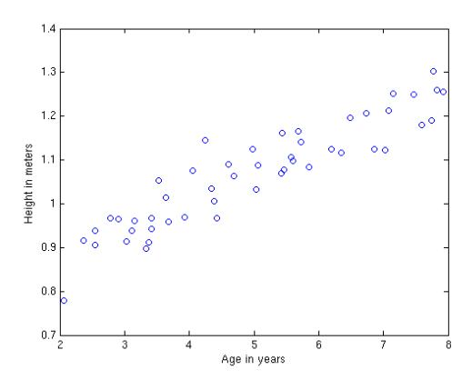
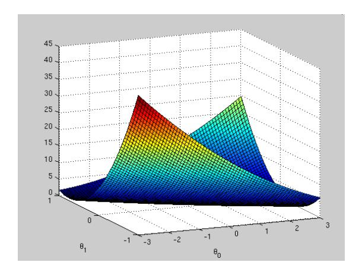

# Experiment 1: Linear Regression

September 28, 2018

### 1 Description

This first exercise will give you practice with linear regression. These exercises have been extensively tested with Matlab, but they should also work in Octave, which has been called a "free version of Matlab". If you are using Octave, be sure to install the Image package as well (available for Windows as an option in the installer, and available for Linux from Octave-Forge ).

### 2 Data

Download ex1Data.zip, and extract the files from the zip file. The files contain some example measurements of heights for various boys between the ages of two and eights. The y-values are the heights measured in meters, and the x-values are the ages of the boys corresponding to the heights.

Each height and age tuple constitutes one training example (x(i) , y(i) in our dataset. There are m = 50 training examples, and you will use them to develop a linear regression model.

# 3 Supervised Learning Problem

In this problem, you'll implement linear regression using gradient descent. In Matlab/Octave, you can load the training set using the commands

```
x = load ( ' ex1x . dat ' ) ;
y = load ( ' ex1y . dat ' ) ;
```

This will be our training set for a supervised learning problem with n = 1 features ( in addition to the usual x<sup>0</sup> = 1, so x ∈ R<sup>2</sup> ). If you're using Matlab/Octave, run the following commands to plot your training set (and label the axes):

```
figure % open a new fi g u r e window
plot (x , y , ' o ' ) ;
ylabel ( ' Height i n meters ' )
xlabel ( 'Age i n years ' )
```

You should see a series of data points similar to Fig. 1.

Before starting gradient descent, we need to add the x<sup>0</sup> = 1 intercept term to every example. To do this in Matlab/Octave, the command is



Figure 1: Plotting the data.

```
m = length ( y ) ; % s t o r e t h e number o f t r a i n i n g examples
x = [ ones (m, 1 ) , x ] ; % Add a column o f ones t o x
```

From this point on, you will need to remember that the age values from your training data are actually in the second column of x. This will be important when plotting your results later.

## 4 2D Linear Regression

Now, we will implement linear regression for this problem. Recall that the linear regression model is

$$h_{\theta}(x) = \theta^T x = \sum_{i=0}^{n} \theta_i x_i,$$

and the batch gradient descent update rule is

$$\theta_j := \theta_j - \alpha \frac{1}{m} \sum_{i=1}^m (h_{\theta}(x^{(i)}) - y^{(i)}) x_j^{(i)}$$

- (1) Implement gradient descent using a learning rate of α = 0.07. Since Matlab/Octave and Octave index vectors starting from 1 rather than 0, you'll probably use theta(1) and theta(2) in Matlab/Octave to represent θ<sup>0</sup> and θ1. Initialize the parameters to θ = ~0 (i.e., θ<sup>0</sup> = θ<sup>1</sup> = 0), and run one iteration of gradient descent from this initial starting point. Record the value of of θ<sup>0</sup> and θ<sup>1</sup> that you get after this first iteration.
- (2) Continue running gradient descent for more iterations until θ converges. (this will take a total of about 1500 iterations). After convergence, record the final values of θ<sup>0</sup> and θ<sup>1</sup> that you get, and plot the straight line fit from your algorithm on the same graph as your training data according to θ. The plotting commands will look something like this:

```
hold on % Pl o t new d a t a w i t h o u t c l e a r i n g ol d p l o t
p lot ( x ( : , 2 ) , x∗ the t a , '− ' ) % remember t h a t x i s now a m a tr ix
```

```
% w i t h 2 columnsand t h e second
                                      % column c o n t a i n s t h e t ime i n f o
legend( ' T r ai ni n g data ' , ' Li n e a r r e g r e s s i o n ' )
```

Note that for most machine learning problems, x is very high dimensional, so we don't be able to plot hθ(x). But since in this example we have only one feature, being able to plot this gives a nice sanity-check on our result.

(3) Finally, we'd like to make some predictions using the learned hypothesis. Use your model to predict the height for two boys of ages 3.5 and 7.

# 5 Understanding J(θ)

We'd like to understand better what gradient descent has done, and visualize the relationship between the parameters θ ∈ R <sup>2</sup> and J(θ). In this problem, we'll plot J(θ) as a 3D surface plot. (When applying learning algorithms, we don't usually try to plot J(θ) since usually θ ∈ R <sup>n</sup> is very high-dimensional so that we don't have any simple way to plot or visualize J(θ). But because the example here uses a very low dimensional θ ∈ R 2 , we'll plot J(θ) to gain more intuition about linear regression.)



Figure 2: The relationship between J and θ

To get the best viewing results on your surface plot, use the range of theta values that we suggest in the code skeleton below.

```
J v a l s = zeros ( 1 0 0 , 1 0 0 ); % i n i t i a l i z e J v a l s t o
                                      % 100∗100 ma tr ix o f 0 ' s
t h e t a 0 v a l s = l inspace ( −3, 3 , 1 0 0 ) ;
t h e t a 1 v a l s = l inspace ( −1, 1 , 1 0 0 ) ;
fo r i = 1 : length ( t h e t a 0 v a l s )
      fo r j = 1 : length ( t h e t a 1 v a l s )
      t = [ t h e t a 0 v a l s ( i ) ; t h e t a 1 v a l s ( j ) ] ;
      J v a l s ( i , j ) = %% YOUR CODE HERE %%
      end
end
% Pl o t t h e s u r f a c e p l o t
% Because o f t h e way me s hgr i d s work in t h e s u r f command , we
```

```
% need t o t r a n s p o s e J v a l s b e f o r e c a l l i n g s u r f , or e l s e t h e
% axe s w i l l be f l i p p e d
J v a l s = J v al s '
f igu re ;
sur f ( t h e t a 0 v al s , t h e t a 1 v al s , J v a l s )
x labe l ( ' \ t h e t a 0 ' ) ; y labe l ( ' \ t h e t a 1 ' )
```

You should get a figure similar to Fig. 2. If you are using Matlab/Octave, you can use the orbit tool to view this plot from different viewpoints.

What is the relationship between this 3D surface and the value of θ<sup>0</sup> and θ<sup>1</sup> that your implementation of gradient descent had found? Visualize the relationship by both surf and contour commands.

### 6 Tips for Programming

For the surf function surf(x, y, z), if x and y are vectors, x = 1 : columns(z) and y = 1 : rows(z). Therefore, z(i, j) is actually calculated based on x(j) and y(i). This rule is also applicable to the contour function.

We can specify the number and the distribution of contours in the contour function, by introduction different spaced vector, e.g., linearly spaced vector (linspace) and logarithmically spaced vector (logspace). Try both in this exercises and select the better one to improve the illustration.