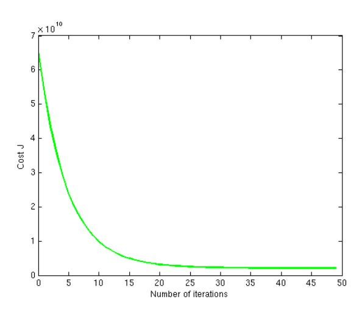

# Experiment 2: Multivariate Linear Regression

September 30, 2017

### 1 Description

In this exercise, you will investigate multivariate linear regression using gradient descent and the normal equations. You will also examine the relationship between the cost function J(θ), the convergence of gradient descent, and the learning rate α.

#### 2 Data

Download ex2Data.zip, and extract the files from the zip file. This is a training set of housing prices in Portland, Oregon, where the outputs y(i) are the prices and the inputs x(i) are the living area and the number of bedrooms. There are m = 47 training examples.

### 3 Preprocessing Your Data

Load the data for the training examples into your program and add the x<sup>0</sup> = 1 intercept term into your x matrix. Recall that the command in Matlab/Octave for adding a column of ones is

```
x = [ ones (m, 1 ) , x ] ;
```

Take a look at the values of the inputs x(i) and note that the living areas are about 1000 times the number of bedrooms. This difference means that preprocessing the inputs will significantly increase gradient descent's efficiency.

In your program, scale both types of inputs by their standard deviations and set their means to zero. In Matlab/Octave, this can be executed with

```
sigma = std ( x ) ;
mu = mean( x ) ;
x ( : , 2 ) = ( x ( : , 2 ) − mu ( 2 ) ) . / sigma ( 2 ) ;
x ( : , 3 ) = ( x ( : , 3 ) − mu ( 3 ) ) . / sigma ( 3 ) ;
```

#### 4 Gradient Descent

Previously, you implemented gradient descent on a univariate regression problem. The only difference now is that there is one more feature in the matrix x.

The hypothesis function is still

$$h_{\theta}(x) = \theta^T x = \sum_{i=0}^{n} \theta_i x_i,$$

and the batch gradient descent update rule is

$$\theta_j := \theta_j - \alpha \frac{1}{m} \sum_{i=1}^m (h_\theta(x^{(i)}) - y^{(i)}) x_j^{(i)}$$
 (for all  $j$ )

Once again, initialize your parameters to θ = ~0.

# 5 Selecting A Learning Rate Using J(θ)

Now it's time to select a learning rate α. The goal of this part is to pick a good learning rate in the range of

$$0.001 \leq \alpha \leq 10$$

You will do this by making an initial selection, running gradient descent and observing the cost function, and adjusting the learning rate accordingly. Recall that the cost function is defined as

$$J(\theta) = \frac{1}{2m} \sum_{i=1}^{m} \left( h_{\theta}(x^{(i)}) - y^{(i)} \right)^{2}.$$

The cost function can also be written in the following vectorized form,

$$J(\theta) = \frac{1}{2m} (X\theta - \vec{y})^T (X\theta - \vec{y})$$

where

$$\vec{y} = \left[ \begin{array}{c} y^{(1)} \ y^{(2)} \ \vdots \ y^{(m)} \end{array} \right] \quad X = \left[ \begin{array}{c} -(x^{(1)})^T - \ -(x^{(2)})^T - \ \vdots \ -(x^{(m)})^T - \end{array} \right]$$

The vectorized version is useful and efficient when you're working with numerical computing tools like Matlab/Octave. If you are familiar with matrices, you can prove to yourself that the two forms are equivalent.

While in the previous exercise you calculated J(θ) over a grid of θ<sup>0</sup> and θ<sup>1</sup> values, you will now calculate J(θ) using the θ of the current stage of gradient descent. After stepping through many stages, you will see how J(θ) changes as the iterations advance.

Now, run gradient descent for about 50 iterations at your initial learning rate. In each iteration, calculate J(θ) and store the result in a vector J. After the last iteration, plot the J values against the number of the iteration. In Matlab/Octave, the steps would look something like this:

```
t h e t a = zeros ( s i z e ( x ( 1 , : ) ) ) ' ; % i n i t i a l i z e f i t t i n g parame ters
alph a = %% Your i n i t i a l l e a r n i n g r a t e %%
J = zeros ( 5 0 , 1 ) ;
fo r n um i t e r a ti o n s = 1: 5 0
   J ( n um i t e r a ti o n s ) = %% C a l c u l a t e your c o s t f u n c t i o n here %%
   t h e t a = %% R e s ul t o f g r a d i e n t d e s c e n t upda te %%
end
% now p l o t J
% t e c h n i c a l l y , t h e f i r s t J s t a r t s a t t h e zero−e t h i t e r a t i o n
% b u t Ma tlab /Octave doesn ' t have a z e r o in dex
f igu re ;
p lot ( 0 : 4 9 , J ( 1 : 5 0 ) , '− ' )
x labe l ( 'Number o f i t e r a t i o n s ' )
y labe l ( ' Cost J ' )
```

If you picked a learning rate within a good range, your plot should appear like the figure below.



If your graph looks very different, especially if your value of J(θ) increases or even blows up, adjust your learning rate and try again. We recommend testing alphas at a rate of of 3 times the next smallest value (i.e. 0.01, 0.03, 0.1, 0.3 and so on). You may also want to adjust the number of iterations you are running if that will help you see the overall trend in the curve.

To compare how different learning learning rates affect convergence, it's helpful to plot J for several learning rates on the same graph. In Matlab/Octave, this can be done by performing gradient descent multiple times with a hold on command between plots. Concretely, if you've tried three different values of alpha (you should probably try more values than this) and stored the costs in J1, J2 and J3, you can use the following commands to plot them on the same figure:

```
p lot ( 0 : 4 9 , J1 ( 1 : 5 0 ) , ' b−' ) ;
hold on ;
p lot ( 0 : 4 9 , J2 ( 1 : 5 0 ) , ' r−' ) ;
p lot ( 0 : 4 9 , J3 ( 1 : 5 0 ) , ' k−' ) ;
```

The final arguments 'b-', 'r-', and 'k-' specify different plot styles for the plots. Type

help p lot

at the Matlab/Octave command line for more information on plot styles.

#### Answer the following questions:

- 1. Observe the changes in the cost function happens as the learning rate changes. What happens when the learning rate is too small? Too large?
- 2. Using the best learning rate that you found, run gradient descent until convergence to find
  - (a) The final values of θ
  - (b) The predicted price of a house with 1650 square feet and 3 bedrooms. Don't forget to scale your features when you make this prediction!

# 6 Normal Equation

In the Normal Equations video, you learned that the closed-form solution to a least squares fit is

$$\theta = \left( X^T X \right)^{-1} X^T \vec{y}.$$

Using this formula does not require any feature scaling, and you will get an exact solution in one calculation: there is no 'loop until convergence' like in gradient descent.

#### Answer the following questions:

- 1. In your program, use the formula above to calculate θ. Remember that while you don't need to scale your features, you still need to add an intercept term.
- 2. Once you have found θ from this method, use it to make a price prediction for a 1650-square-foot house with 3 bedrooms. Did you get the same price that you found through gradient descent?