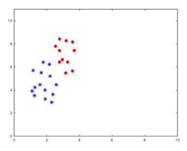
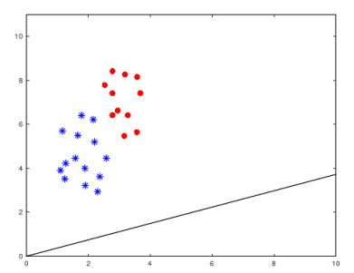
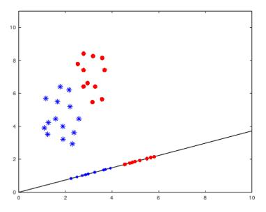
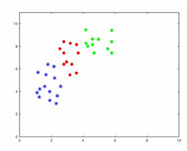

# Experiment 3: Linear Discriminant Analysis

October 15, 2018

## 1 Description

In this exercise, you need to implement Linear Discriminant Analysis(LDA).

## 2 Data

To begin, download ex3Data.zip and extract the files from the zip file. For this exercise, there are 14 rows of (x, y) red points in ex3red.dat, and also 14 rows of blue and green points in ex3blue.dat and ex3green.dat, respectively. You should use them to implement LDA.

## 3 LDA

#### 3.1 LDA for 2 Classes

You must implement LDA by yourself according to the principles tanght in the class. You are not allowed to directly use the available LDA codes provided by the Matlab, which can be used to check your results.

In this section, LDA for 2 classes needs to be realized. Here we choose to use red and blue points for the 2 classes. You should load the data into your matrices and plot them:

Figure 1: The plot on the red points and blue points.

Once you successfully finish your code, the LDA results should look like the following:

Figure 2: The line succeeded in separating the two classes.

#### 3.2 Projection Points

At the same time, you can project red points and blue points onto the line and see the projection points as follows:

Figure 3: The projection points on the line.

#### 3.3 LDA for N Classes

LDA can be implemented for N classes. In this section, you should realize LDA for N classes where N = 3. Load all the red, blue and green points into the matrices and plot them. Your plot should be like in the Figure 4.

Actually it's more difficult to realize LDA for N classes. Once you finish the codes, see how satisfying the results are.

Figure 4: The plot on all the red, blue and green points.