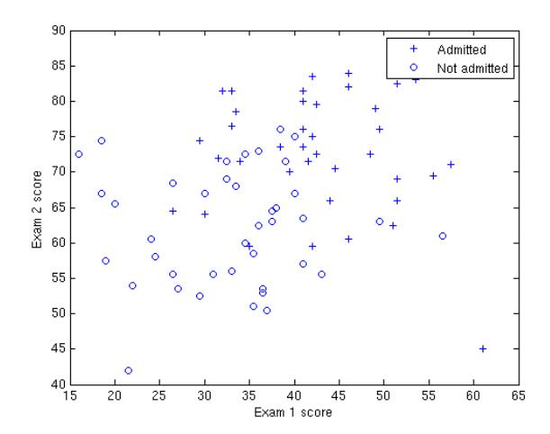
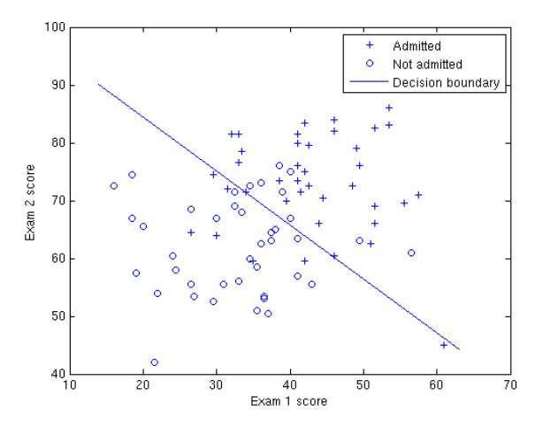

# Experiment 4: Logistic Regression and Newton's Method

October 22, 2018

## 1 Description

In this exercise, you will use Newton's Method to implement logistic regression on a classification problem.

## 2 Data

To begin, download ex4Data.zip and extract the files from the zip file.

For this exercise, suppose that a high school has a dataset representing 40 students who were admitted to college and 40 students who were not admitted. Each (x(i) , y(i) ) training example contains a student's score on two standardized exams and a label of whether the student was admitted.

Your task is to build a binary classification model that estimates college admission chances based on a student's scores on two exams. In your training data,

- a. The first column of your x array represents all Test 1 scores, and the second column represents all Test 2 scores.
- b. The y vector uses "1" to label a student who was admitted and "0" to label a student who was not admitted.

## 3 Plot the Data

Load the data for the training examples into your program and add the x<sup>0</sup> = 1 intercept term into your x matrix.

Before beginning Newton's Method, we will first plot the data using different symbols to represent the two classes. In Matlab/Octave, you can separate the positive class and the negative class using the find command:

```
% find r e turns the i n d i c e s o f the
% rows meeting the s p e c i f i e d c ond iti on
pos = find ( y == 1 ) ; neg = find ( y == 0 ) ;
% Assume the f e a t u r e s are in the 2nd and 3rd
% columns o f x
plot ( x ( pos , 2 ) , x ( pos , 3 ) , '+' ) ; hold on
plot ( x ( neg , 2 ) , x ( neg , 3 ) , ' o ' )
```

Your plot should look like the following:



## 4 Newton's Method

Recall that in logistic regression, the hypothesis function is

$$h_{\theta}(x) = g(\theta^T x) = \frac{1}{1 + e^{-\theta^T x}} = P(y = 1 \mid x; \theta)$$

In our example, the hypothesis is interpreted as the probability that a driver will be accident-free, given the values of the features in x.

Matlab/Octave does not have a library function for the sigmoid, so you will have to define it yourself. The easiest way to do this is through an inline expression:

```
g = i n l i n e ( ' 1. 0 . / ( 1 . 0 + exp(−z ) ) ' ) ;
% Usage : To f i n d t h e v al u e o f t h e s igm o i d
% e v a l u a t e d a t 2 , c a l l g ( 2 )
```

The cost function J(θ) is defined as

$$J(\theta) = \frac{1}{m} \sum_{i=1}^{m} [-y^{(i)} \log(h_{\theta}(x^{(i)})) - (1 - y^{(i)}) \log(1 - h_{\theta}(x^{(i)}))]$$

Our goal is to use Newton's method to minimize this function. Recall that the update rule for Newton's method is

$$\theta^{(t+1)} = \theta^{(t)} - H^{-1} \nabla_{\theta} J$$

In logistic regression, the gradient and the Hessian are

$$\nabla_{\theta} J = \frac{1}{m} \sum_{i=1}^{m} (h_{\theta}(x^{(i)}) - y^{(i)}) x^{(i)}$$

Note that the formulas presented above are the vectorized versions. Specifically, this means that x (i) ∈ R<sup>n</sup>+1 , x (i) x (i) T ∈ R(n+1)×(n+1), while hθ(x (i) ) and y (i) are scalars.

Now, implement Newton's Method in your program, starting with the initial value of θ = ~0. To determine how many iterations to use, calculate J(θ) for each iteration and plot your results. Newton's method often converges in 5-15 iterations. If you find yourself using far more iterations, you should check for errors in your implementation.

After convergence, use your values of theta to find the decision boundary in the classification problem. The decision boundary is defined as the line where

$$P(y = 1|x; \theta) = g(\theta^T x) = 0.5$$

which corresponds to

$$\theta^T x = 0$$

Plotting the decision boundary is equivalent to plotting the θ <sup>T</sup> x = 0 line. When you are finished, your plot should appear like the figure below.



Finally, record your answers to these questions.

- 1. What values of θ did you get? How many iterations were required for convergence?
- 2. What is the probability that a student with a score of 20 on Exam 1 and a score of 80 on Exam 2 will not be admitted?