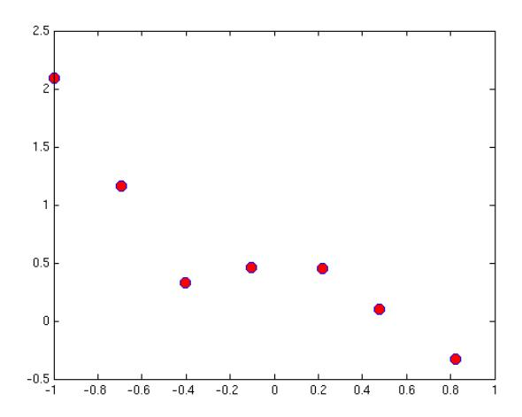
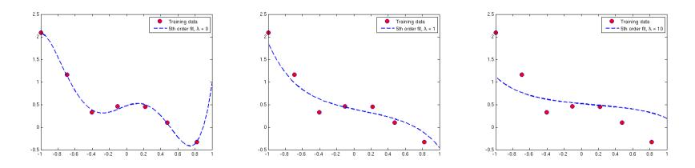
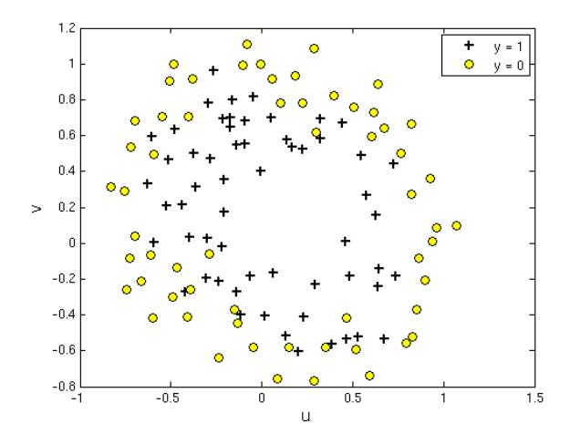
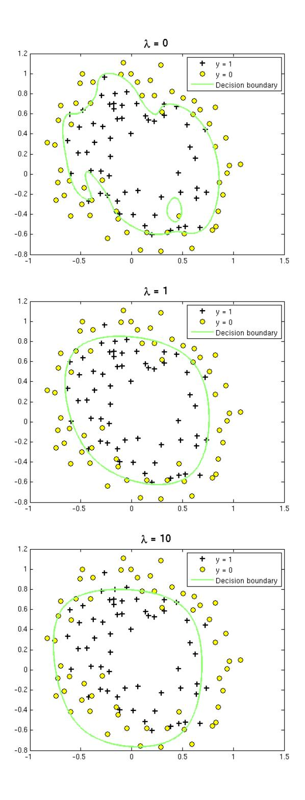

# Experiment 5: Regularization

November 9, 2018

### 1 Description

In this exercise, you will implement regularized linear regression and regularized logistic regression.

#### 2 Data

To begin, download ex5Data.zip and extract the files from the zip file. This data bundle contains two sets of data, one for linear regression and the other for logistic regression. It also includes a helper function named "map feature.m" which will be used for logistic regression. Make sure that this function's m-file is placed in the same working directory where you plan to write your code.

## 3 Regularized Linear Regression

The first part of this exercise focuses on regularized linear regression and the normal equations. Load the data files "ex5Linx.dat" and "ex5Liny.dat" into your program. These correspond to the "x" and "y" variables that you will start out with. Notice that in this data, the input "x" is a single feature, so you can plot y as a function of x on a 2-dimensional graph (try it yourself): From



looking at this plot, it seems that fitting a straight line might be too simple of an approximation. Instead, we will try fitting a higher-order polynomial to the data to capture more of the variations in the points.

Let's try a fifth-order polynomial. Our hypothesis will be

$$h_{\theta}(x) = \theta_0 + \theta_1 x + \theta_2 x^2 + \theta_3 x^3 + \theta_4 x^4 + \theta_5 x^5$$

This means that we have a hypothesis of six features, because  $x^0, x^1, \dots x^5$  are now all features of our regression. Notice that even though we are producing a polynomial fit, we still have a linear regression problem because the hypothesis is linear in each feature.

Since we are fitting a 5th-order polynomial to a data set of only 7 points, over-fitting is likely to occur. To guard against this, we will use regularization in our model. Recall that in regularization problems, the goal is to minimize the following cost function with respect to  $\theta$ :

$$J(\theta) = \frac{1}{2m} \left[ \sum_{i=1}^{m} (h_{\theta}(x^{(i)}) - y^{(i)})^2 + \lambda \sum_{j=1}^{n} \theta_j^2 \right]$$

where  $\lambda$  is the regularization parameter. The regularization parameter  $\lambda$  is a control on your fitting parameters. As the magnitues of the fitting parameters increase, there will be an increasing penalty on the cost function. This penalty is dependent on the squares of the parameters as well as the magnitude of  $\lambda$ . Also, notice that the summation after  $\lambda$  does not include  $\theta_0^2$ .

Now we will find the best parameters of our model using the normal equations. Recall that the normal equations solution to regularized linear regression is

$$\theta = (X^T X + \lambda \begin{bmatrix} 0 & & & \\ & 1 & & \\ & & \ddots & \\ & & & 1 \end{bmatrix})^{-1} X^T \vec{y}$$

The matrix following  $\lambda$  is an  $(n+1) \times (n+1)$  diagonal matrix with a zero in the upper left and ones down the other diagonal entries. (Remember that n is the number of features, not counting the intecept term). The vector  $\vec{y}$  and the matrix X have the same definition they had for unregularized regression.

Using this equation, find values for  $\theta$  using the three regularization parameters below:

a  $\lambda = 0$  (this is the same case as non-regularized linear regression)

b  $\lambda = 1$ 

 $\lambda = 10$ 

As you are implementing your program, keep in mind that X is an  $m \times (n+1)$  matrix, because there are m training examples and n features, plus an  $x_0 = 1$  intercept term. In the data provided for this exercise, you were only give the first power of x. You will need to include the other powers of x in your feature vector X, which means that the first column will contain all ones, the next column will contain the first powers, the next column will contain the second powers, and so on. You can do this in Matlab/Octave with the command

```
x = [ ones (m, 1 ) , x , x . 2 , x . 3 , x . 4 , x . 5 ] ;
```

In addition to listing the values for each element θ<sup>j</sup> of the θ vector, we will also provide the L2-norm of θ so you can quickly check if your answer is correct. In Matlab/Octave, you can calculate the L2-norm of a vector x using the command norm(x). Also, plot the polyomial fit for each value of λ. You will get plots similar to the following figures. From looking at these graphs, what



conclusions can you make about how the regularization parameter λ affects your model?

#### 4 Regularized Logistic Regression

In this 2nd part of the exercise, you will implement regularized logistic regression using Newton's Method. To begin, load the files "ex5Logx.dat" and "ex5Logy.dat" into your program. This dataset represents the training set of a logistic regression problem with two features. To avoid confusion later, we will refer to the two input features contained in "ex5Logx.dat" as u and v. So in the "ex5Logx.dat" file, the first column of numbers represents the feature u, which you will plot on the horizontal axis, and the second feature represents v, which you will plot on the vertical axis.

After loading the data, plot the points using different markers to distinguish between the two classifications. The commands in Matlab/Octave will be:

```
x = load ( ' ex5Logx . dat ' ) ;
y = load ( ' ex5Logy . dat ' ) ;
figure
% Find the i n d i c e s f o r the 2 c l a s s e s
pos = find ( y ) ; neg = find ( y == 0 ) ;
plot ( x ( pos , 1 ) , x ( pos , 2 ) , '+' )
hold on
plot ( x ( neg , 1 ) , x ( neg , 2 ) , ' o ' )
```

After plotting your image, it should look something like this:

We will now fit a regularized regression model to this data. Recall that in logistic regression, the hypothesis function is

$$h_{\theta}(x) = g(\theta^T x) = \frac{1}{1 + e^{-\theta^T x}} = P(y = 1 | x; \theta)$$

In this exercise, we will assign x to be all monomials (meaning polynomial



terms) of u and v up to the sixth power:

$$x = \begin{bmatrix} 1 \\ u \\ v \\ u^2 \\ uv \\ v^2 \\ u^3 \\ \vdots \\ uv^5 \\ v^6 \end{bmatrix}$$

To clarify this notation: we have made a 28-feature vector x where  $x_0 = 1$ ,  $x_1 = u$ ,  $x_2 = v$ , . . .  $x_{28} = v^6$ . Remember that u was the first column of numbers in your "ex5Logx.dat" file and v was the second column. From now on, we will just refer to the entries of x as  $x_0$ ,  $x_1$ , and so on instead of their values in terms of u and v.

To save you the trouble of enumerating all the terms of x, we've included a Matlab/Octave helper function named "map\_feature" that maps the original inputs to the feature vector. This function works for a single training example as well as for an entire training. To use this function, place "map\_feature.m" in your working directory and call

$$x = map_feature(u, v)$$

This assumes that the two original features were stored in column vectors named "u" and "v". If you had only one training example, each column vector would be a scalar. The function will output a new feature array stored in the variable "x". Of course, you can use any names you'd like for the arguments and the output. Just make sure your two arguments are column vectors of the same size.

Before building this model, recall that our objective is to minimize the cost

function in regularized logistic regression:

$$J(\theta) = -\frac{1}{m} \sum_{i=1}^{m} [y^{(i)} \log(h_{\theta}(x^{(i)})) + (1 - y^{(i)}) \log(1 - h_{\theta}(x^{(i)}))] + \frac{\lambda}{2m} \sum_{j=1}^{n} \theta_{j}^{2}$$

Notice that this looks like the cost function for unregularized logistic regression, except that there is a regularization term at the end. We will now minimize this function using Newton's method.

Recall that the Newton's Method update rule is

$$\theta^{(t+1)} = \theta^{(t)} - H^{-1} \nabla_{\theta} J$$

This is the same rule that you used for unregularized logistic regression in Exercise 4. But because you are now implementing regularization, the gradient  $\nabla$   $_{\theta}(J)$  and the Hessian H have different forms:

$$\nabla_{\theta} J = \begin{bmatrix} \frac{1}{m} \sum_{i=1}^{m} \left( h_{\theta}(x^{(i)}) - y^{(i)} \right) x_{0}^{(i)} \\ \frac{1}{m} \sum_{i=1}^{m} \left( h_{\theta}(x^{(i)}) - y^{(i)} \right) x_{1}^{(i)} + \frac{\lambda}{m} \theta_{1} \\ \frac{1}{m} \sum_{i=1}^{m} \left( h_{\theta}(x^{(i)}) - y^{(i)} \right) x_{2}^{(i)} + \frac{\lambda}{m} \theta_{2} \\ \vdots \\ \frac{1}{m} \sum_{i=1}^{m} \left( h_{\theta}(x^{(i)}) - y^{(i)} \right) x_{n}^{(i)} + \frac{\lambda}{m} \theta_{n} \end{bmatrix}$$

$$H = \frac{1}{m} \left[ \sum_{i=1}^m h_{\theta}(x^{(i)}) \left(1 - h_{\theta}(x^{(i)})\right) x^{(i)} \left(x^{(i)}\right)^T \right] + \frac{\lambda}{m} \left[ \begin{array}{ccc} 0 & & & & & & & & & & & & & & & & & &$$

Notice that if you substitute  $\lambda=0$  into these expressions, you will see the same formulas as unregularized logistic regression. Also, remember that in these formulas,

- 1.  $x^{(i)}$  is your feature vector, which is a 28x1 vector in this exercise.
- 2.  $\nabla_{\theta} J$  is a 28×1 vector.
- 3.  $x^{(i)}(x^{(i)})^T$  and H are 28x28 matrices.
- 4.  $y^{(i)}$  and  $h_{\theta}(x^{(i)})$  are scalars.
- 5. The matrix following  $\frac{\lambda}{m}$  in the Hessian formula is a 28x28 diagonal matrix with a zero in the upper left and ones on every other diagonal entry.

Now run Newton's Method on this dataset using the three values of lambda below:

a  $\lambda = 0$  (this is the same case as non-regularized linear regression)

b 
$$\lambda = 1$$

$$c \lambda = 10$$

To determine whether Newton's Method has converged, it may help to print out the value of J(θ) during each iteration. J(θ) should not be decreasing at any point during Newton's Method. If it is, check that you have defined J(θ) correctly. Also check your definitions of the gradient and Hessian to make sure there are no mistakes in the regularization parts.

After convergence, use your values of theta to find the decision boundary in the classification problem. The decision boundary is defined as the line where

$$P(y=1|x;\theta) = 0.5 \implies \theta^T x = 0$$

Plotting the decision boundary here will be trickier than plotting the best-fit curve in linear regression. You will need to plot the θ <sup>T</sup> x = 0 line implicity, by plotting a contour. This can be done by evaluating θ <sup>T</sup> x over a grid of points representing the original u and v inputs, and then plotting the line where θ <sup>T</sup> x evaluates to zero.

The plot implementation for Matlab/Octave is given below. To get the best viewing results, use the same plotting ranges that we use here.

```
% De f ine t h e r ange s o f t h e g r i d
u = l inspace ( −1, 1 . 5 , 2 0 0 ) ;
v = l inspace ( −1, 1 . 5 , 2 0 0 ) ;
% I n i t i a l i z e s p ace f o r t h e v a l u e s t o be p l o t t e d
z = zeros ( length ( u ) , length ( v ) ) ;
% Ev al u a te z = t h e t a ∗x over t h e g r i d
fo r i = 1 : length ( u )
      fo r j = 1 : length ( v )
           % N o t ice t h e o r de r o f j , i here !
            z ( j , i ) = m ap fe a tu r e ( u ( i ) , v ( j ) ) ∗ t h e t a ;
      end
end
% Because o f t h e way t h a t c on t our p l o t t i n g works
% in Matlab , we need t o t r a n s p o s e z , or
% e l s e t h e a x i s o r i e n t a t i o n w i l l be f l i p p e d !
z = z '
% Pl o t z = 0 by s p e c i f y i n g t h e range [ 0 , 0 ]
contour ( u , v , z , [ 0 , 0 ] , ' LineWidth ' , 2 )
```

When you are finished, your plots for the three values of λ should look similar to the ones below.

Finally, because there are 28 elements θ, we will not provide an element-byelement comparison in the solutions. Instead, use norm(theta) to calculate the L2-norm of θ, and check it against the norm in the solutions. How does λ affect the results?

