## 《机器学习》 - 数据预处理

## 目录

| 1 3  | 实验环境准备                 | 2    |
|------|------------------------|------|
|      | 华为云 ModelArts 开发平台环境准备 |      |
| 1 数  | 收据预处理实验                | .10  |
| 1.2  | 实验介绍                   | 10   |
| 1.3  | 实验目的                   | 10   |
|      | 实验步骤                   |      |
| 1.4. | 1 数据预处理                | 10   |
| 1.4. | 2 思考题                  | . 22 |
| 1.4. | 3 数据预处理 - 分类数据         | 23   |
| 1.5  | 实验小结                   | 30   |

# **1** 实验环境准备

#### <span id="page-2-0"></span>写在前面:

如果 pc 上有 jupyter 直接使用就好!直接跳到 2 数据预处理实验吧!

(强烈建议)如果 pc 上有 python 无 jupyter,可以安装 anaconda 获得~(建议安装到自己电 脑上,毕竟以后会经常用 python)然后跳过本 part

<https://www.jianshu.com/p/62f155eb6ac5>

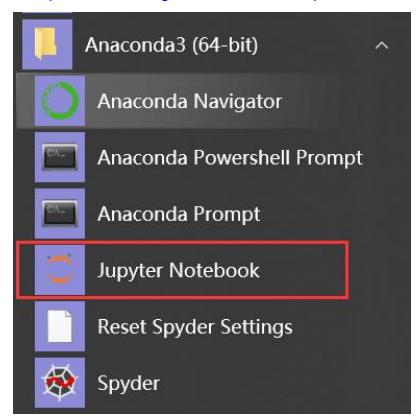

如果你不想安装,可以借助下面的华为云线上 ModelArts 自带的开发平台 ModelArts Notebook 或者使用线上 jupyter:[https://cocalc.com](https://cocalc.com/)

## <span id="page-2-1"></span>1.1 华为云 [ModelArts](https://www.huaweicloud.com/product/modelarts.html) 开发平台环境准备

ModelArts 是面向开发者的一站式 AI 开发平台,为机器学习与深度学习提供海量数据预处理 及半自动化标注、大规模分布式 Training、自动化模型生成,及端-边-云模型按需部署能力, 帮助用户快速创建和部署模型,管理全周期 AI 工作流。

步骤 1 登录华为云,进入 ModelArts 控制台

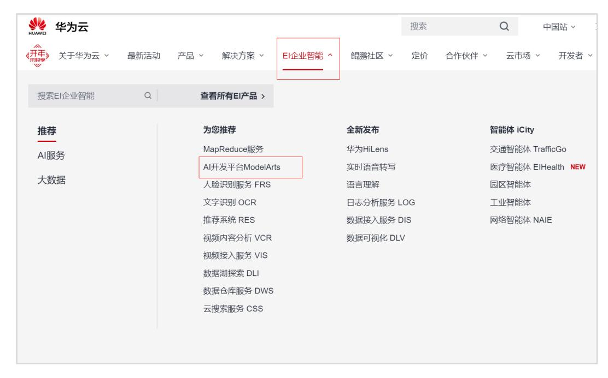

ModelArts 平台入口


点击进入控制台


#### **ModelArts** 主页面

#### 步骤 2 创建 ModelArts Notebook

ModelArts Notebook 提供网页版的 Python 开发环境,可以方便的编写、运行代码,并查看运 行结果。

(1)在 ModelArts 服务主界面依次点击"开发环境"、"创建"。首次使用时,可能需要验证 AK/SK,按照之前获取的秘钥进行认证即可。

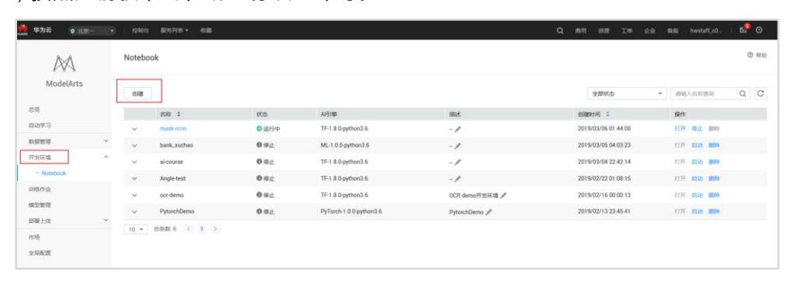

创建 **ModelArts Notebook**

(2)填写 Notebook 所需的参数,例如:


#### 填写 **Notebook** 参数

#### **Notebook** 参数说明

| 参数名称      | 说明                                                                                                                                                                                                                                                                                                                                                                                                                                                                                                                                                                                   |
|-----------|--------------------------------------------------------------------------------------------------------------------------------------------------------------------------------------------------------------------------------------------------------------------------------------------------------------------------------------------------------------------------------------------------------------------------------------------------------------------------------------------------------------------------------------------------------------------------------------|
| "计费方式"    | 按需计费。当前仅支持按需计费,无需修改。                                                                                                                                                                                                                                                                                                                                                                                                                                                                                                                                                                 |
| "名称"      | Notebook<br>的名称。只能包含数字、大小写字母、下划线和中划线,长度<br>64<br>不能超过<br>位且不能为空。                                                                                                                                                                                                                                                                                                                                                                                                                                                                                                                     |
| "描述"      | Notebook<br>对<br>的简要描述。                                                                                                                                                                                                                                                                                                                                                                                                                                                                                                                                                              |
|           | 默认开启,且默认值为"1<br>小时后",表示该<br>Notebook<br>实例将在运行<br>1<br>小<br>时之后自动停止,即<br>1<br>小时后停止计费。                                                                                                                                                                                                                                                                                                                                                                                                                                                                                               |
| "自动停止"    | 开启自动停止功能后,可选择"1<br>小时后"、"2<br>小时后"、"4<br>小时后"、"6<br>小<br>时后"或"自定义"几种模式。选择"自定义"模式时,可指定<br>1~24<br>小时范围<br>内任意整数。                                                                                                                                                                                                                                                                                                                                                                                                                                                                      |
| "工作环境"    | 当前支持<br>2<br>种工作环境,分别为"Python2"和<br>"MindSpore1.1.1+Python3.7",不同工作环境其对应可使用的<br>AI<br>引擎不<br>同,详细支持列表请参见支持的<br>AI<br>引擎。<br>如果需要使用<br>TensorFlow 2.X、PyTorch 1.4.0<br>或者<br>R<br>语言版本的<br>AI<br>框<br>架,则需要选择"TF-2.1.0&Pytorch-1.4.0-MindSpore1.1.1+Python3.7.6"<br>的工作环境。如果选择此类型的工作环境,暂时无法使用免费规格,建议<br>选择其他规格。<br>每个工作环境多种<br>AI<br>引擎,可以在同一个<br>Notebook<br>实例中使用所有支<br>持的<br>AI<br>引擎,不同的引擎之间可快速、方便的切换,并且有独立的运行<br>环境。您可以在<br>Notebook<br>实例创建完成后,进入<br>Jupyter<br>页面创建对应<br>AI<br>引擎的开发环境。<br>说明:<br>ModelArts<br>还支持<br>Keras<br>引擎,详细说明请参见<br>ModelArts<br>是否支持<br>Keras<br>引擎? |
| "资源池"     | 可选公共资源池和专属资源池,关于<br>ModelArts<br>专属资源池的介绍和购<br>买,请参见资源池。                                                                                                                                                                                                                                                                                                                                                                                                                                                                                                                             |
| "类型"      | 支持<br>CPU、GPU<br>和<br>Ascend<br>类型。GPU<br>性能更佳,但是相对<br>CPU<br>而<br>言,费用更高。Ascend<br>类型为公测资源,请提前完成<br>Ascend 910<br>公测<br>申请。                                                                                                                                                                                                                                                                                                                                                                                                                                                         |
| <br>"规格" | CPU<br>规格支持:"2<br>核<br>8GiB"、"8<br>核<br>32GiB";GPU<br>规格支持:"8<br>核<br>64GiB 1*p100";只有选择"公共资源池"时,需要选择规格。根据选择的                                                                                                                                                                                                                                                                                                                                                                                                                                                                        |

类型不同,可选规格也不同。Ascend 规格支持:"Ascend: 1\*Ascend 910 CPU: 24 核 96GiB" CPU 规格支持:"[限时免费]体验规格 CPU 版"、"2 核 8GiB"、"8 核 32GiB";GPU 规格支持:"[限时免费]体验规格 GPU 版"、"GPU: 1\*v100NV32 CPU: 8 核 64GiB"。 如果选择"限时免费"规格,请仔细阅 读界面提示,并勾选"我已阅读并同意以上内容"。 "存储配置" 存储配置可选"云硬盘"和"对象存储服务"。 选择"云硬盘"作为存储位置 根据实际使用量设置磁盘规格。磁盘规格默认 5GB。ModelArts 提供 5GB 容量供用户免费使用。超出 5GB 时,超出部分每 GB 按"超高 IO"类 型的收费标准进行按需收费。磁盘规格的取值范围为 5GB~4096GB。 选择此模式,用户在 Notebook 列表的所有文件读写操作都是针对容器中 的内容操作,与 OBS 无关;重启该实例,内容不丢失。 选择"对象存储服务"作为存储位置 在"存储位置"右侧单击"选择",设置用于存储 Notebook 数据的 OBS 路 径。如果想直接使用已有的文件或数据,可将数据提前上传至对应的 OBS 路径下。"存储位置"不能设置为 OBS 桶的根目录,需设置为对应 OBS 桶下的具体目录。 选择此模式,用户在 Notebook 列表的所有文件读写操作是基于所选择的 OBS 路径下的内容操作,与当前实例空间无关。如果您需要将内容同步 到实例空间,先选中该内容,单击"Sync OBS",即可将所选内容同步到 当前容器空间,详细操作可参见与 OBS [同步文件。](https://support.huaweicloud.com/engineers-modelarts/modelarts_23_0038.html)重启该实例时,内容 不丢失。 只有当"存储配置"选择"云硬盘"时,支持此参数。

#### "Git 存储库"

开启此功能后,可创建一个带有 Git 存储库的 Notebook 实例,系统将自 动从 Github 同步代码库。详细配置说明请参[见创建带有](https://support.huaweicloud.com/engineers-modelarts/modelarts_23_0279.html) Git 存储库的 [Notebook](https://support.huaweicloud.com/engineers-modelarts/modelarts_23_0279.html) 实例。

- (3)配置好 Notebook 参数后,点击下一步,进入 Notebook 信息预览。确认无误后,点击 "立即创建"。
- (4)创建完成后,返回开发环境主界面,等待 Notebook 创建完毕后,打开 Notebook,进行 下一步操作。

注意:开发框架使用 **MindSpore** 的实验,需要选择 **Notebook** 的配置为: **MindSpore1.1.1+Python3.7**、**Ascend**、存储位置默认为 **OBS**,如下图。

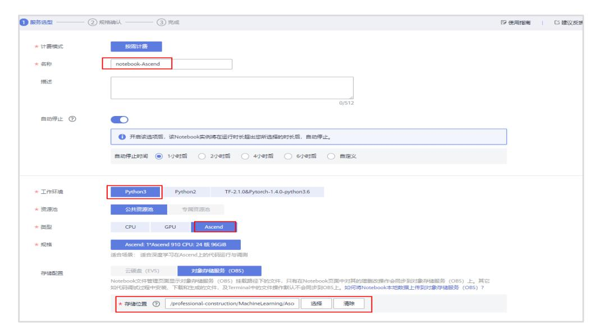

使用 **MindSpore** 时所需填写的 **Notebook** 参数

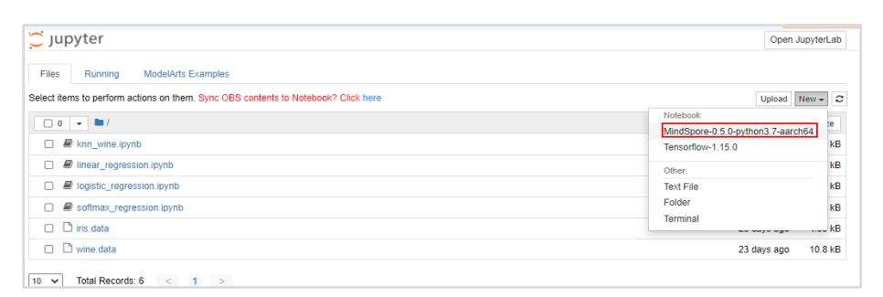

创建 **MindSpore** 的开发环境

#### 步骤 3 在 Notebook 中创建开发环境

(1)点击下图所示的"打开"按钮,进入刚刚创建的 Notebook。

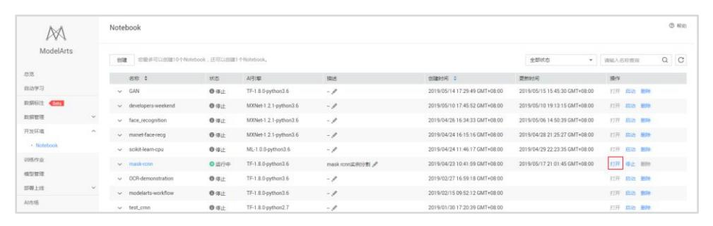

打开 **notebook**

(2)创建一个 MindSpore1.1.1+Python3.7、CPU 环境的 Notebook。点击右上角的"New",可以 选择所创建的开发环境。

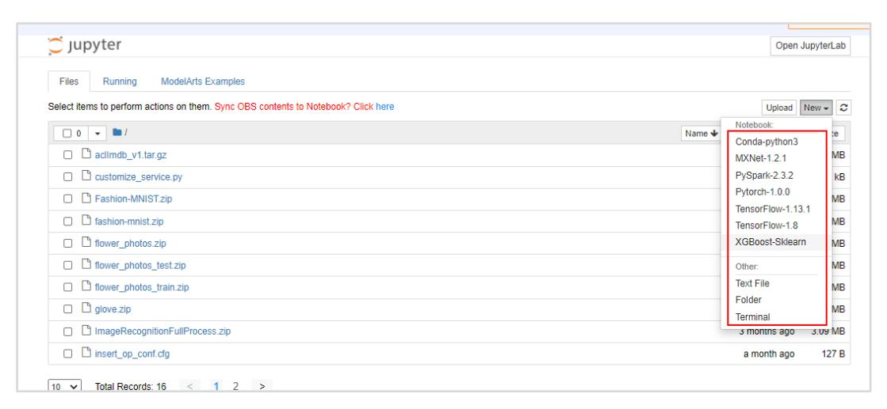

(3)点击左上方的文件名"Untitled",并输入一个与本实验相关的名称,如 "movie\_recommendation。

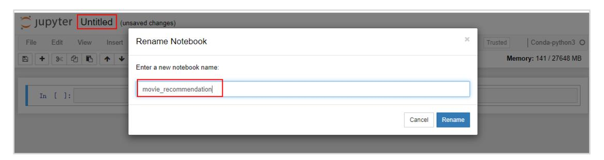

重命名 **notebook**

#### 步骤 4 在 Notebook 中编写并执行代码

在 Notebook 中,我们输入一个简单的打印语句,然后点击上方的运行按钮,可以查看语句执 行的结果:

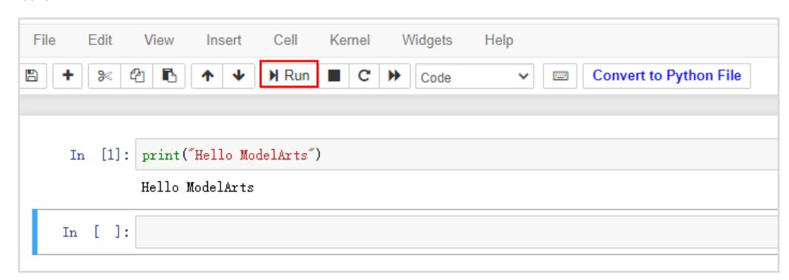

测试 **notebook**

#### 步骤 5 保存代码

代码编写完之后,我们点击下图所示的"保存"按钮,保存代码和代码执行结果。

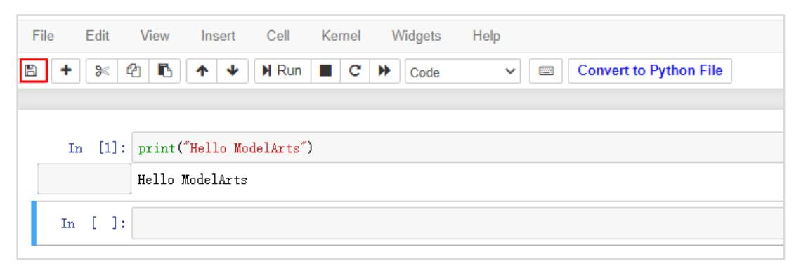

保存代码

#### 步骤 6 从 ModelArts 下载代码到本地

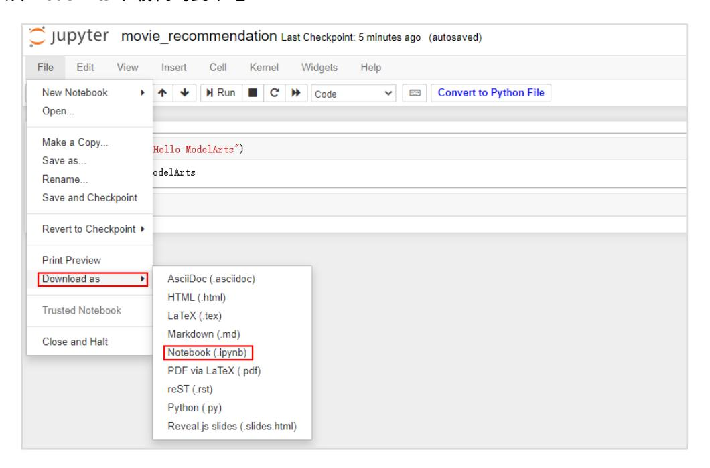

#### 步骤 7 从本地上传代码到 ModelArts

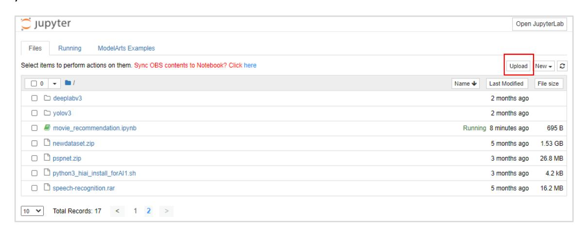

# **2** 数据预处理实验

## <span id="page-10-1"></span><span id="page-10-0"></span>2.1 实验介绍

本次实验我们将会对数据集进行相应的预处理工作,因为数据预处理的步骤相对灵活。我们会 针对不同特征运用不同的预处理方法。这一个小节的实验,我们将处理一个特征维度的数据, 以带领大家学习数据处理的基本语法。掌握了这些基本语法后,大家需要通过代码填空的方式 自己动手实践处理数据。

## <span id="page-10-2"></span>2.2 实验目的

掌握缺失值的处理方法

掌握异常值的方法

掌握分类数据的处理与特征编码的实现

## <span id="page-10-3"></span>2.3 实验步骤

本次实验使用的数据集是 google store 中,各个 app 下载的信息。共 10841 个样本,每个样本 13 个特征。

实验任务介绍:本次实验我们将利用 app 的类型(Category)、收费情况(Type)、大小 (Size)、评分(Rating)、评价数量(Reviews)和分级(Content Rating)等特征来预测 APP 的下载 量。

首先我们将对整理数据集进行缺失值处理,接下来我们将以 Rating、Size 和 Price 这两特征为 例,进行数据预处理的教学。

## <span id="page-10-4"></span>2.3.1 数据预处理

## 2.3.1.1 数据读取

代码:

#导入相关库

import pandas as pd import matplotlib.pyplot as plt import seaborn as sns import numpy as np

raw\_df = pd.read\_csv("googleappstorev1.csv",index\_col=0)#读取数据。index\_col=0:读取时不自动添加行号。 raw\_df.head()

#### 输出:

|   | Арр                                                   | Category       | Rating | Reviews | Size | Installs    | Туре | Price | Content Rating | Genres                    |
|---|-------------------------------------------------------|----------------|--------|---------|------|-------------|------|-------|----------------|---------------------------|
| 0 | Photo Editor & Candy Camera & Grid & ScrapBook        | ART_AND_DESIGN | 4.1    | 159     | 19M  | 10,000+     | Free | 0     | Everyone       | Art & Design              |
| 1 | Coloring book moana                                   | ART_AND_DESIGN | 3.9    | 967     | 14M  | 500,000+    | Free | 0     | Everyone       | Art & Design;Pretend Play |
| 2 | U Launcher Lite – FREE Live Cool Themes, Hide $\dots$ | ART_AND_DESIGN | 4.7    | 87510   | 8.7M | 5,000,000+  | Free | 0     | Everyone       | Art & Design              |
| 3 | Sketch - Draw & Paint                                 | ART_AND_DESIGN | 4.5    | 215644  | 25M  | 50,000,000+ | Free | 0     | Teen           | Art & Design              |
| 4 | Pixel Draw - Number Art Coloring Book                 | ART_AND_DESIGN | 4.3    | 967     | 2.8M | 100,000+    | Free | 0     | Everyone       | Art & Design;Creativity   |

#### 2.3.1.2 缺失值处理

#### 步骤 1 查看缺失值

pandas 中,isnull()是常用的缺失值查看方法:

df.isnull():查看所有数据是否为缺失值,返回 bool 值。True:缺失值;False:不是缺失值。 df.isnull().any():查看每个特征是否存在缺失值,返回 bool 值。

df.isnll().sum():返回每个特征中缺失值的具体数量。

#### 代码:

#### # 查看前 5 个样本中,数据是否为缺失值。 raw\_df.head().isnull()

#### 输出:

|   | App   | Category | Rating | Reviews | Size  | Installs | Туре  | Price | Content Rating | Genres |
|---|-------|----------|--------|---------|-------|----------|-------|-------|----------------|--------|
| 0 | False | False    | False  | False   | False | False    | False | False | False          | False  |
| 1 | False | False    | False  | False   | False | False    | False | False | False          | False  |
| 2 | False | False    | False  | False   | False | False    | False | False | False          | False  |
| 3 | False | False    | False  | False   | False | False    | False | False | False          | False  |
| 4 | False | False    | False  | False   | False | False    | False | False | False          | False  |

#### 代码:

#### # 查看每个特征是否存在缺失值

raw\_df.isnull().any()

| Rating         | True  |
|----------------|-------|
| Reviews        | False |
| Size           | False |
| Installs       | False |
| Type           | True  |
| Price          | False |
| Content Rating | True  |
| Genres         | False |
| dtype: bool    |       |

#### 代码:

| raw_df.isnull().sum() |  |
|-----------------------|--|
|                       |  |

#### 输出:

| App            | 0    |
|----------------|------|
| Category       | 0    |
| Rating         | 1474 |
| Reviews        | 0    |
| Size           | 0    |
| Installs       | 0    |
| Type           | 1    |
| Price          | 0    |
| Content Rating | 1    |
| Genres         | 0    |
| dtype: int64   |      |

在介绍完三种查看缺失值的方法后,对于本次任务来说,哪种方法更加合适呢?

思路:我们可以选用 isnull().any()或 isnull().sum()方法,查看哪些特征数据包含缺失值。

#### 2.3.1.3 缺失值处理

缺失值处理的常见方法有:

1 删除:dropna();

2.填充:填充包括统计量填充(众数、均值、中位数)、KNN 填充和回归预测填充等。常用方 法包括:fillna()与 Python 的 sklearn.preprocessing 库中的 Imputer 类可对缺失值进行众数、均 值、中位数填充。

#### 3.不处理

对于本次实验的数据集和任务,应该对于缺失值进行删除还是填充操作呢?

思路:包含缺失值的特征包括:Rating(1474)、Type(1)、Content Rating(1)、Current Ver(8)和 Android Ver(3)。除了 Rating,其他特征只对应少量缺失数据样本,因此对于这种数据我们可以 优先考虑删除缺失数据。而 Rating 特征对应的缺失数据样本较多,我们优先考虑缺失值填 充。

#### 步骤 1 缺失值填充

本次实验我们选择统计量填充方法。统计量填充的选择标准:

对于连续值,推荐使用中位数 ,可以排除一些特别大或者特别小的异常值造成的影响;

对于离散值,推荐使用众数,均值和中位数没有意义,不能使用。

对于评分,我们应该哪种统计量填充方法呢?[¶](http://localhost:8888/notebooks/%E5%BC%80%E5%8F%91%20-%20EBG%E5%9C%A8%E7%BA%BF%E6%9C%BA%E5%99%A8%E5%AD%A6%E4%B9%A0%E5%AE%9E%E8%B7%B5/1.%E6%95%B0%E6%8D%AE%E9%A2%84%E5%A4%84%E7%90%86.ipynb#问题3：对于评分，我们应该哪种统计量填充方法呢？)

思路:评分数据的连续的值,所以我们选择中位数填充。

使用 Python 中 pandas 库的 dropna ( ) 函数,其基本格式如下:

DataFrame.fillna(value=None, method=None, axis=None, inplace=False, limit=None)

#### 关键参数详解:

value: 特定填充值 method: 差值方式:

 pad/ffill:用前一个非缺失值去填充该缺失值 backfill/bfill:用下一个非缺失值填充该缺失值

None:指定一个值去替换缺失值(缺省默认这种方式)

axis: 默认为 0。axis=0 代表 d 对行数据进行操作,axis=1 代表列数据

inplace=True/False:Boolean 数据, 默认为 False。inplace=True 代表直接对原数据集 N 做出修改。

limit : 阈值。超过阈值才填充该行或该列。

#### 代码:

#将样本按照分类类别进行分组,求出每类中评分的中位数,再填充缺失值。

raw\_df["Rating"] = raw\_df["Rating"].fillna(raw\_df["Rating"].median())

raw\_df["Rating"]

#### 输出:

| 0  | 4.1 |
|----|-----|
| 1  | 3.9 |
| 2  | 4.7 |
|    |     |
| 3  | 4.5 |
| 4  | 4.3 |
| 5  | 4.4 |
| 6  | 3.8 |
| 7  | 4.1 |
|    |     |
| 8  | 4.4 |
| 9  | 4.7 |
| 10 | 4.4 |
| 11 | 4.4 |
|    |     |
| 12 | 4.2 |
| …  |     |

#### 代码:

#### #查看

raw\_df.head()

#### 输出:

|            | Арр                                            | Category       | Rating | Reviews | Size | Installs    | Туре | Price | Content Rating | Genres                    |
|------------|------------------------------------------------|----------------|--------|---------|------|-------------|------|-------|----------------|---------------------------|
| 0          | Photo Editor & Candy Camera & Grid & ScrapBook | ART_AND_DESIGN | 4.1    | 159     | 19M  | 10,000+     | Free | 0     | Everyone       | Art & Design              |
| 1          | Coloring book moana                            | ART_AND_DESIGN | 3.9    | 967     | 14M  | 500,000+    | Free | 0     | Everyone       | Art & Design;Pretend Play |
| <b>2</b> l | J Launcher Lite – FREE Live Cool Themes, Hide  | ART_AND_DESIGN | 4.7    | 87510   | 8.7M | 5,000,000+  | Free | 0     | Everyone       | Art & Design              |
| 3          | Sketch - Draw & Paint                          | ART_AND_DESIGN | 4.5    | 215644  | 25M  | 50,000,000+ | Free | 0     | Teen           | Art & Design              |
| 4          | Pixel Draw - Number Art Coloring Book          | ART_AND_DESIGN | 4.3    | 967     | 2.8M | 100,000+    | Free | 0     | Everyone       | Art & Design;Creativity   |

#### 步骤 2 缺失值删除

#### 使用 Python 中 pandas 库的 dropna ( ) 函数,其基本格式如下:

DataFrame.dropna(axis=0, how='any', thresh=None, subset=None, inplace=False)

#### 关键参数详解:

axis=0/1,默认为 0。axis=0 代表 d 对行数据进行操作,axis=1 代表列数据。

how=any/all,默认为 any。how=any 代表若某行或某列中存在缺失值,则删除该行或该列。

how=all:若某行或某列中数值全部为空,则删除该行或该列。

thresh=N,可选参数,代表若某行或某列中至少含有 N 个缺失值,则删除该行或该列。

subset=列名,可选参数,代表若指定列中有缺失值,则删除该行。

inplace=True/False,Boolean 数据, 默认为 False。inplace=True 代表直接对原数据集 N 做出修改。

inplace=False 代表修改后生成新数据集 M,原数据集 N 保持不变。

#### 代码:

#### #删除新数据集的所有缺失值

non\_na\_df = raw\_df.dropna()

non\_na\_df

#### 输出:

|   | Арр                                               | Category       | Rating | Reviews | Size | Installs    | Туре | Price | Content<br>Rating | Genres                     |
|---|---------------------------------------------------|----------------|--------|---------|------|-------------|------|-------|-------------------|----------------------------|
| 0 | Photo Editor & Candy Camera &<br>Grid & ScrapBook | ART_AND_DESIGN | 4.1    | 159     | 19M  | 10,000+     | Free | 0     | Everyone          | Art & Desig                |
| 1 | Coloring book moana                               | ART_AND_DESIGN | 3.9    | 967     | 14M  | 500,000+    | Free | 0     | Everyone          | Art & Design;Preten<br>Pla |
| 2 | U Launcher Lite – FREE Live Cool<br>Themes, Hide  | ART_AND_DESIGN | 4.7    | 87510   | 8.7M | 5,000,000+  | Free | 0     | Everyone          | Art & Desig                |
| 3 | Sketch - Draw & Paint                             | ART_AND_DESIGN | 4.5    | 215644  | 25M  | 50,000,000+ | Free | 0     | Teen              | Art & Desig                |
| 4 | Pixel Draw - Number Art Coloring<br>Book          | ART_AND_DESIGN | 4.3    | 967     | 2.8M | 100,000+    | Free | 0     | Everyone          | Art & Design;Creativi      |
| 5 | Paper flowers instructions                        | ART_AND_DESIGN | 4.4    | 167     | 5.6M | 50,000+     | Free | 0     | Everyone          | Art & Desig                |
| 6 | Smoke Effect Photo Maker - Smoke Editor           | ART_AND_DESIGN | 3.8    | 178     | 19M  | 50,000+     | Free | 0     | Everyone          | Art & Desig                |

#### 代码:

#### #当删除掉不需要的行时,行索引会变的不连续,这时候可以重新设计新的索引

non\_na\_df.reset\_index(drop=True,inplace=True)#drop=True:删除原行索引;inplace=True:在数据上进行更新

#### #检查数据集中是否含有缺失值

non\_na\_df.isnull().any()

#### 输出:

| App            | False |
|----------------|-------|
| Category       | False |
| Rating         | False |
| Reviews        | False |
| Size           | False |
| Installs       | False |
| Type           | False |
| Price          | False |
| Content Rating | False |
| Genres         | False |
| dtype: bool    |       |

#### 2.3.1.4 重复值处理

pandas 中,除去重复值的常用方法为 drop\_duplicate,其基本格式如下:

DataFrame.drop\_duplicates(subset=None, keep='first', inplace=False):

#### 关键参数详解:

subset:用来指定特定的列,默认所有列;

keep: {'first', 'last', False}。默认值为'first',用于删除重复项并保留第一次出现的项;

inplace:是直接在原来数据上修改还是保留一个副本

#### 代码:

```
non_na_df.drop_duplicates(inplace=True)
non_na_df
```

#### 输出:

| 10832   | FR Calculator                                    | FAMILY              | 4.0 | 7      | 2.6M               | 500+        | Free | 0 | Everyone   | Education         |
|---------|--------------------------------------------------|---------------------|-----|--------|--------------------|-------------|------|---|------------|-------------------|
| 10833   | FR Forms                                         | BUSINESS            | 4.3 | 0      | 9.6M               | 10+         | Free | 0 | Everyone   | Business          |
| 10834   | Sya9a Maroc - FR                                 | FAMILY              | 4.5 | 38     | 53M                | 5,000+      | Free | 0 | Everyone   | Education         |
| 10835   | Fr. Mike Schmitz Audio Teachings                 | FAMILY              | 5.0 | 4      | 3.6M               | 100+        | Free | 0 | Everyone   | Education         |
| 10836   | Parkinson Exercices FR                           | MEDICAL             | 4.3 | 3      | 9.5M               | 1,000+      | Free | 0 | Everyone   | Medical           |
| 10837   | The SCP Foundation DB fr nn5n                    | BOOKS_AND_REFERENCE | 4.5 | 114    | Varies with device | 1,000+      | Free | 0 | Mature 17+ | Books & Reference |
| 10838   | iHoroscope - 2018 Daily Horoscope<br>& Astrology | LIFESTYLE           | 4.5 | 398307 | 19M                | 10,000,000+ | Free | 0 | Everyone   | Lifestyle         |
| 10354 r | ows × 10 columns                                 |                     |     |        |                    |             |      |   |            |                   |

#### 标签重置

```
non_na_df.reset_index(drop= True,inplace = True)
```

#### 步骤 1 异常值处理

- 异常值检测和处理异常值。 异常值检测的方法主要有:
- 1. 简单统计分析;

- 2. 散点图;
- 3. 箱型图;
- 4. 3-sigma;
- 5. 基于模型的异常值检测等。
- 异常值处理的方法主要包括:
- 1. 删除;
- 2. 视为缺失值,进行处理;
- 3. 不处理:可以直接在具有异常值的数据集上进行数据建模。
- 下面我们将根据每一特征数据,来处理特征的异常值。处理的常用步骤为:
- 1.查看特征的值;
- 2.特征处理;
- 3.异常值检测及处理。
- 下面我们一一对各个特征数据进行处理。

#### 2.3.1.5 Rating

步骤 1 查看数据基本信息。主要查看数值的动态范围和数据类型。

#### 代码:

```
rating_copy = non_na_df.copy()
print(rating_copy["Rating"].to_frame().describe())
rating_copy["Rating"]
```

#### 输出:

|       | Rating       |
|-------|--------------|
| count | 10354.000000 |
| mean  | 4.203738     |
| std   | 0.485663     |
| min   | 1.000000     |
| 25%   | 4.100000     |
| 50%   | 4.300000     |
| 75%   | 4.500000     |
| max   | 5.000000     |

评分数据是 float32 的,数值变化范围为 1 到 5。数据的标准差为 0.486,说明数据的扰动不 大。

#### 步骤 2 可视化

代码:

#### rating\_copy["Rating"].hist();

```
plt.xlabel('Rating')
plt.ylabel('Frequency')
```

#### 输出:

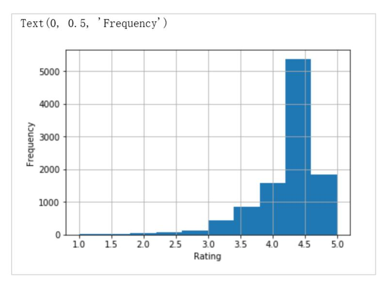

评分与下载频数直方图

通过观察数据的统计数据和可视化,我们没有在评分数据中发现异常值。

#### 2.3.1.6 Size

步骤 1 查看特征信息

代码:

```
Size_copy = non_na_df.copy()
Size_copy["Size"].value_counts()
```

| Varies with device | 1525 |
|--------------------|------|
| 11M                | 188  |
| 12M                | 186  |
| 13M                | 186  |
| 14M                | 182  |
| 15M                | 174  |
| 17M                | 155  |
| 26M                | 145  |
| 16M                | 143  |
| 19M                | 135  |
| 10M                | 133  |
| 25M                | 131  |

步骤 2 特征处理

size 这个特征中,APP 大小的单位不一致,且不是数值型的。因此我们首先需要统一单位,并 将特征数据转换成数值型。

#### 代码:

#### #定位单位为 MB 的数据

k\_indices = Size\_copy['Size'].loc[Size\_copy['Size'].str.contains('k')].index.tolist()

converter = pd.DataFrame(Size\_copy.loc[k\_indices, 'Size'].apply(lambda x: x.strip('k')).astype(float).apply(lambda x: x / 1024).apply(lambda x: round(x, 3)).astype(str))

Size\_copy.loc[k\_indices,'Size'] = converter

Size\_copy['Size'] = Size\_copy['Size'].str.replace('M','')

Size\_copy['Size'].head()

#### 输出

```
0 19
1 14
2 8.7
3 25
4 2.8
Name: Size, dtype: object
```

Size 特征中,出现最多的是"Varies with device",我们需要对这种非数值型的字符串进行处 理。这里我们将"Varies with device"当做缺失值处理。

#### 代码:

#### #将 Varies with device 转化为缺失值

Size\_copy['Size'].replace("Varies with device", np.nan, inplace = True)

Size\_copy['Size']=Size\_copy['Size'].astype("float").apply(lambda x: round(x, 3))

Size\_copy['Size'].head()

#### 输出:

```
0 19.0
1 14.0
2 8.7
3 25.0
4 2.8
Name: Size, dtype: float64
```

对于 Varies with device,我们应该哪种方式处理缺失值?

思路:缺失值处理的常见方法有:删除:dropna();填充:填充包括统计量填充(众数、均值、 中位数);不处理。根据 Varies with device 的特点和对应样本的数量,在此我们用均值填充这 个缺失值。

#### 代码:

#### #根据各类别的均值填充数据

Size\_copy['Size'].fillna(Size\_copy.groupby('Category')['Size'].transform('mean'),inplace = True)

#### #查找检查非数值数据

Size\_copy.applymap(lambda x: isinstance(x,float))['Size'].value\_counts()

#### 输出:

```
True 10354
Name: Size, dtype: int64
```

数据全为数值型数据。接下来可以对数据进行异常值检测了。

#### 步骤 3 异常值检测

首先我们可以查看该特征的数值信息并绘制一下散点图,观察特征的数值。

#### 代码:

#### Size\_copy['Size'].describe()

#### 输出:

```
count 10354.000000
mean 21.000700
std 21.112004
min 0.008000
25% 5.700000
50% 14.000000
75% 27.930205
max 100.000000
Name: Size, dtype: float64
```

#### 代码:

```
plt.figure(figsize = (10,10))
g = sns.jointplot(x="Size", y="Rating",color = 'orangered', data=Size_copy, size = 8)
Size_copy.to_csv('appstorev1.2.csv')
```

#### 输出

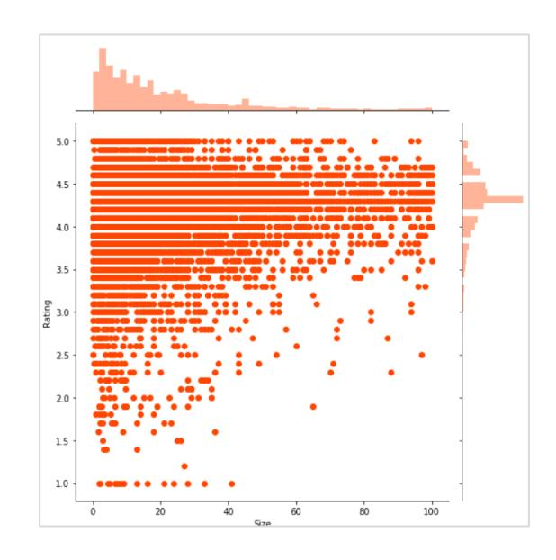

#### 评分数据散点图

通过观察统计数据,发现数据的标准差很大。但是 Size 这个属性中,有很多 APP 的大小最大 为 1e9B,最小为 1e6B。数值都在正常范围以内,且我们从散点图中,并未发现明显的异常 值。因此这一特征我们认为是没有异常值。

#### 2.3.1.7 Price

#### 步骤 1 查看特征信息

#### 代码:

```
price_copy = Size_copy.copy()
price_copy["Price"].value_counts()
```

#### 输出:

| 0        | 9589 |
|----------|------|
|          |      |
| \$0.99   | 146  |
| \$2.99   | 125  |
| \$1.99   | 73   |
| \$4.99   | 70   |
| \$3.99   | 60   |
| \$1.49   | 46   |
| \$5.99   | 27   |
| \$2.49   | 25   |
| \$9.99   | 19   |
| \$6.99   | 12   |
| \$399.99 | 12   |
| \$4.49   | 9    |
| \$14.99  | 9    |
| \$3.49   | 7    |
| \$7.99   | 7    |

数据中,包含非数值符号,需要删除。数据中,有 92 个不同的价格。

#### 步骤 2 特征处理

删除非数值符号\$。

#### 代码:

```
#用 replace 删除数值当中符号,并把特征中的数据类型转化为数值型。
price_copy["Price"]=price_copy["Price"].str.replace('$','').astype("float")
#price_copy["Price"].describe()
price_copy["Price"].value_counts().head(10)
```

| 0.00 | 9589 |  |  |
|------|------|--|--|
| 0.99 | 146  |  |  |
| 2.99 | 125  |  |  |

```
1.99 73
4.99 70
3.99 60
1.49 46
5.99 27
2.49 25
9.99 19
Name: Price, dtype: int64
```

#### 步骤 3 异常值检测

查看统计数据。

代码:

#### price\_copy["Price"].describe()

#### 输出:

```
count 10354.000000
mean 1.031099
std 16.280974
min 0.000000
25% 0.000000
50% 0.000000
75% 0.000000
max 400.000000
Name: Price, dtype: float64
```

从统计数据中我们发现,APP 价格的动态范围在[0,400]之间,标准差为 16.295。这里我们可以 选择查看一下价格比较大 APP,通过观察这些样本判断是否为异常值。

#### 代码:

#### #查看价格大于 350 美金的样本 price\_copy[price\_copy["Price"]>300]

#### 输出:

|      | Арр                      | Category  | Rating | Reviews | Size   | Installs | Туре | Price  | Content Rating | Genres        |
|------|--------------------------|-----------|--------|---------|--------|----------|------|--------|----------------|---------------|
| 3744 | most expensive app (H)   | FAMILY    | 4.3    | 6       | 1.500  | 100+     | Paid | 399.99 | Everyone       | Entertainment |
| 3907 | ♥ I'm rich               | LIFESTYLE | 3.8    | 718     | 26.000 | 10,000+  | Paid | 399.99 | Everyone       | Lifestyle     |
| 3912 | I'm Rich - Trump Edition | LIFESTYLE | 3.6    | 275     | 7.300  | 10,000+  | Paid | 400.00 | Everyone       | Lifestyle     |
| 4894 | I am rich                | LIFESTYLE | 3.8    | 3547    | 1.800  | 100,000+ | Paid | 399.99 | Everyone       | Lifestyle     |
| 4897 | I am Rich Plus           | FAMILY    | 4.0    | 856     | 8.700  | 10,000+  | Paid | 399.99 | Everyone       | Entertainment |
| 4899 | I Am Rich Premium        | FINANCE   | 4.1    | 1867    | 4.700  | 50,000+  | Paid | 399.99 | Everyone       | Finance       |
| 4900 | I am extremely Rich      | LIFESTYLE | 2.9    | 41      | 2.900  | 1,000+   | Paid | 379.99 | Everyone       | Lifestyle     |
| 4901 | I am Rich!               | FINANCE   | 3.8    | 93      | 22.000 | 1,000+   | Paid | 399.99 | Everyone       | Finance       |
| 4902 | I am rich(premium)       | FINANCE   | 3.5    | 472     | 0.942  | 5,000+   | Paid | 399.99 | Everyone       | Finance       |
| 4905 | I Am Rich Pro            | FAMILY    | 4.4    | 201     | 2.700  | 5,000+   | Paid | 399.99 | Everyone       | Entertainment |

这些数据并没有明显异常。

数据可视化,绘制一下散点图,观察数据变换趋势。

#### 代码:

```
plt.figure(figsize = (10,10))
sns.regplot(x="Price", y="Rating", color = 'darkorange',data= price_copy)
#保存文件
price_copy.to_csv('appstorev1.3.csv')
```

#### 输出:

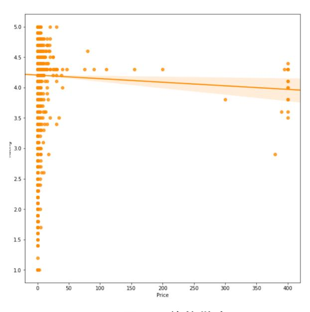

价格散点图

从散点图我们可以看出,价格对评分的影响不大,但是如果 APP 价格设置的过高,会影响评 分。

### <span id="page-22-0"></span>2.3.2 思考题

接下来,请大家根据第一节学习内容。对 Installs 和 Reviews 进行特征处理、无量纲化和异常 值处理。 基本步骤如下:

步骤 1 查看特征的值

步骤 2 特征处理

步骤 3 异常值检测及处理

```
#导入相关库
import pandas as pd
import matplotlib.pyplot as plt
import seaborn as sns
import numpy as np
……
…….
```

## <span id="page-23-0"></span>2.3.3 数据预处理 - 分类数据

上一部分实验,我们完成了缺失值处理和包括 Rating、Size、Price、Installs 和 Reviews 在内的 5 个特征的异常值处理工作。这些都是数值属性的数据。接下来我们对分类属性的特征的处理 工作,包括 App、Category、Type、Content Rating 和 Genres。

本次实验中,我们首先 Content Rating 为例,一起学习处理分类数据的过程。掌握了这些基本 语法后,大家需要通过代码填空的方式自己动手实践处理数据。

数据挖掘中,一些算法可以直接计算分类变量,比如决策树模型。但许多机器学习算法不能直 接处理分类变量,它们的输入和输出都是数值型数据。因此,把分类变量转换成数值型数据是 必要的,可以用独热编码 (One-Hot Encoding) 、哑编码 (Dummy Encoding)和 label encoding 实现。

- 无序分类变量的离散化方法较为常用方法:独热编码 (One-Hot Encoding)。
- 有序分类变量{低年级,中年级,高年级},可以使用 Label-Encoding 直接离散化为{0,1,2}。

#### 代码:

#### #导入相关库

import pandas as pd

import matplotlib.pyplot as plt

import seaborn as sns

import numpy as np

#### #数据读取

raw\_df = pd.read\_csv('appstorev1.4.csv',index\_col=0)

raw\_df.head()

#### 输出:

|   | Арр                                            | Category       | Rating | Reviews | Size | Installs   | Туре | Price | Content Rating | Genres                    |
|---|------------------------------------------------|----------------|--------|---------|------|------------|------|-------|----------------|---------------------------|
| 0 | Photo Editor & Candy Camera & Grid & ScrapBook | ART_AND_DESIGN | 4.1    | 159     | 19.0 | 10000.0    | Free | 0.0   | Everyone       | Art & Design              |
| 1 | Coloring book moana                            | ART_AND_DESIGN | 3.9    | 967     | 14.0 | 500000.0   | Free | 0.0   | Everyone       | Art & Design;Pretend Play |
| 2 | U Launcher Lite – FREE Live Cool Themes, Hide  | ART_AND_DESIGN | 4.7    | 87510   | 8.7  | 5000000.0  | Free | 0.0   | Everyone       | Art & Design              |
| 3 | Sketch - Draw & Paint                          | ART_AND_DESIGN | 4.5    | 215644  | 25.0 | 50000000.0 | Free | 0.0   | Teen           | Art & Design              |
| 4 | Pixel Draw - Number Art Coloring Book          | ART_AND_DESIGN | 4.3    | 967     | 2.8  | 100000.0   | Free | 0.0   | Everyone       | Art & Design; Creativity  |

#### 2.3.3.1 Type

#### 步骤 1 查看特征信息及可视化

#### 代码:

#### #查看特征的数值

raw\_df['Type'].value\_counts().plot(kind='bar')

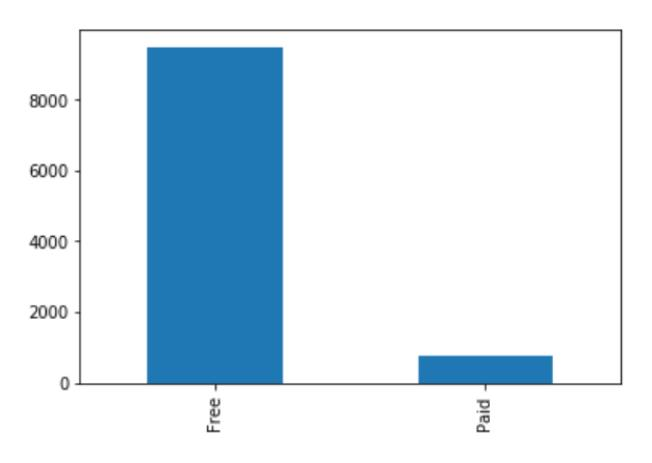

可视化特征信息

#### 步骤 2 分类变量数值化

Type 数据只有两种可能数值,包括 free 和 paid。因此我们可以用 Label-Encoding 将这一特征 数据离散化。

#### 代码:

```
#我们可以直接通过 map 实现分类变量的离散化
raw_df['Type'] = raw_df['Type'].map({'Free':1,"Paid":2})
raw_df.head()
```

#### 输出:

|   | Арр                                                   | Category       | Rating | Reviews | Size | Installs   | Туре | Price | Content Rating | Genres                    |
|---|-------------------------------------------------------|----------------|--------|---------|------|------------|------|-------|----------------|---------------------------|
| 0 | Photo Editor & Candy Camera & Grid & ScrapBook        | ART_AND_DESIGN | 4.1    | 159     | 19.0 | 10000.0    | 1    | 0.0   | Everyone       | Art & Design              |
| 1 | Coloring book moana                                   | ART_AND_DESIGN | 3.9    | 967     | 14.0 | 500000.0   | 1    | 0.0   | Everyone       | Art & Design;Pretend Play |
| 2 | U Launcher Lite – FREE Live Cool Themes, Hide $\dots$ | ART_AND_DESIGN | 4.7    | 87510   | 8.7  | 5000000.0  | 1    | 0.0   | Everyone       | Art & Design              |
| 3 | Sketch - Draw & Paint                                 | ART_AND_DESIGN | 4.5    | 215644  | 25.0 | 50000000.0 | 1    | 0.0   | Teen           | Art & Design              |
| 4 | Pixel Draw - Number Art Coloring Book                 | ART_AND_DESIGN | 4.3    | 967     | 2.8  | 100000.0   | 1    | 0.0   | Everyone       | Art & Design; Creativity  |

#### 2.3.3.2 Content Rating

#### 步骤 1 查看特征信息及可视化。

#### 代码:

```
#查看特征的数值
raw_df['Content Rating'].value_counts()
```

| Everyone        | 8305                               |  |  |  |  |  |  |
|-----------------|------------------------------------|--|--|--|--|--|--|
| Teen            | 1128                               |  |  |  |  |  |  |
| Mature 17+      | 445                                |  |  |  |  |  |  |
| Everyone 10+    | 359                                |  |  |  |  |  |  |
| Adults only 18+ | 3                                  |  |  |  |  |  |  |
| Unrated         | 2                                  |  |  |  |  |  |  |
|                 | Name: Content Rating, dtype: int64 |  |  |  |  |  |  |

内容分级数据中,有 2 个样本没有分级。我们可以单独查看一下这两个样本,观察是否为缺失 值。

代码:

raw\_df[raw\_df['Content Rating']=='Unrated']

#### 输出:

|      | Арр                    | Category | Rating | Reviews | Size | Installs | Туре | Price | Content Rating | Genres        |
|------|------------------------|----------|--------|---------|------|----------|------|-------|----------------|---------------|
| 6743 | Best CG Photography    | FAMILY   | 4.3    | 1       | 2.5  | 500.0    | 1    | 0.0   | Unrated        | Entertainment |
| 7691 | DC Universe Online Map | TOOLS    | 4.1    | 1186    | 6.4  | 50000.0  | 1    | 0.0   | Unrated        | Tools         |

可以看出数据的第一条数据只有一条评论和一次下载,第二条数据只有 9 次下载却有 1186 条 评论。因此我们可以将这两个没有分级的样本给删除。

#### 代码:

```
raw_df = raw_df[raw_df['Content Rating'] !='Unrated']
#更新重置样本标签
raw_df.reset_index(drop= True,inplace = True)
sns.catplot(x="Content Rating",y="Rating",data=raw_df, kind="box")
plt.xticks(rotation=80)
```

#### 输出:

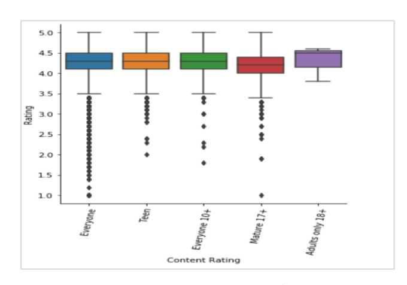

内容分级箱型图

从箱型图中,每个内容分级的均值来看 Adults only 18+的平均评分最高。Mature 17+的的平均 评分最低。

#### 步骤 2 分类变量数值化

内容分级这一特征三种取值不是完全独立的,根据限制的程度我们可以排序为 Everyone, Everyone 10+,Teen,Mature 17+和 Adults only 18。因此分级有高低是有序变量,这里用 LabelEncoder。

#### 代码:

```
from sklearn.preprocessing import LabelEncoder
le = LabelEncoder()
raw_df['Content Rating'] = le.fit_transform(raw_df['Content Rating'])
raw_df.head()
```

#### 输出:

|   | Арр                                                   | Category       | Rating | Reviews | Size | Installs   | Туре | Price | Content Rating | Genres                    |
|---|-------------------------------------------------------|----------------|--------|---------|------|------------|------|-------|----------------|---------------------------|
| 0 | Photo Editor & Candy Camera & Grid & ScrapBook        | ART_AND_DESIGN | 4.1    | 159     | 19.0 | 10000.0    | 1    | 0.0   | 1              | Art & Design              |
| 1 | Coloring book moana                                   | ART_AND_DESIGN | 3.9    | 967     | 14.0 | 500000.0   | 1    | 0.0   | 1              | Art & Design;Pretend Play |
| 2 | U Launcher Lite – FREE Live Cool Themes, Hide $\dots$ | ART_AND_DESIGN | 4.7    | 87510   | 8.7  | 5000000.0  | 1    | 0.0   | 1              | Art & Design              |
| 3 | Sketch - Draw & Paint                                 | ART_AND_DESIGN | 4.5    | 215644  | 25.0 | 50000000.0 | 1    | 0.0   | 4              | Art & Design              |
| 4 | Pixel Draw - Number Art Coloring Book                 | ART_AND_DESIGN | 4.3    | 967     | 2.8  | 100000.0   | 1    | 0.0   | 1              | Art & Design; Creativity  |
|   |                                                       |                |        |         |      |            |      |       |                |                           |

#### 2.3.3.3 Category

#### 步骤 1 查看特征信息及可视化。

#### 代码:

| raw_df["Category"].value_counts() |  |
|-----------------------------------|--|
|                                   |  |

| FAMILY              | 1930 |
|---------------------|------|
| GAME                | 1081 |
| TOOLS               | 835  |
| BUSINESS            | 426  |
| MEDICAL             | 407  |
| PRODUCTIVITY        | 406  |
| PERSONALIZATION     | 387  |
| LIFESTYLE           | 372  |
| FINANCE             | 358  |
| SPORTS              | 349  |
| COMMUNICATION       | 348  |
| PHOTOGRAPHY         | 318  |
| HEALTH_AND_FITNESS  | 306  |
| SOCIAL              | 267  |
| NEWS_AND_MAGAZINES  | 261  |
| TRAVEL_AND_LOCAL    | 233  |
| BOOKS_AND_REFERENCE | 230  |
| SHOPPING            | 223  |
| DATING              | 196  |
| VIDEO_PLAYERS       | 172  |
| MAPS_AND_NAVIGATION | 137  |
| EDUCATION           | 130  |
| FOOD_AND_DRINK      | 124  |
| ENTERTAINMENT       | 111  |
| AUTO_AND_VEHICLES   | 85   |
| LIBRARIES_AND_DEMO  | 85   |

| WEATHER                      | 82 |
|------------------------------|----|
| HOUSE_AND_HOME               | 80 |
| EVENTS                       | 64 |
| ART_AND_DESIGN               | 64 |
| COMICS                       | 60 |
| PARENTING                    | 60 |
| BEAUTY                       | 53 |
| Name: Category, dtype: int64 |    |

#### 代码:

```
plt.figure(figsize=(20, 10))
sns.barplot(x="Category", y="Rating",hue="Type", data=raw_df)
plt.xticks(rotation=80)
```

#### 输出:

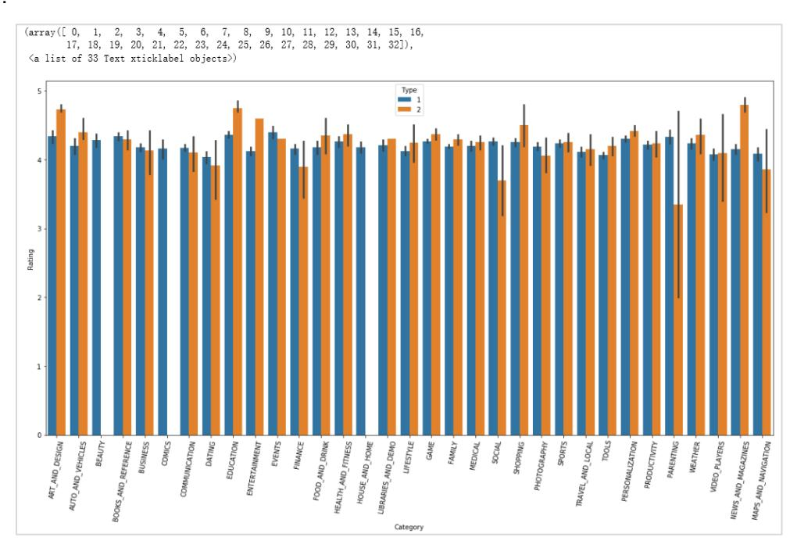

**APP** 类别评分图

对于 art\_and\_design、education、entertainment 和 news\_and\_magnizeszz 这几类来说,收费 的 APP 的均分比较高。对于 social 和 parenting 来说,APP 费用很可能会带来不好的评分。 beauty、comics 和 house\_and\_home 这三个类别的所有 APP 都是免费的。

#### 步骤 2 分类变量数值化

经过上面的学习,对类别进行数值离散化,使用哪个方法更合理呢?[¶](http://localhost:8888/notebooks/%E5%BC%80%E5%8F%91%20-%20EBG%E5%9C%A8%E7%BA%BF%E6%9C%BA%E5%99%A8%E5%AD%A6%E4%B9%A0%E5%AE%9E%E8%B7%B5/3.%E6%95%B0%E6%8D%AE%E9%A2%84%E5%A4%84%E7%90%86%20-%202.ipynb#问题1：经过上面的学习，对类别进行数值离散化，使用哪个方法更合理呢？)

思路:类别数据是无序的。我们可以采用 one-hot 编码。one-hot 编码的实现方式重要有两 种。第一种是利用 pandas 中的 get\_dummy()实现;第二种是利用授课 learn 中的 from sklearn.preprocessing import OneHotEncoder 实现。由于 pandas 机制问题,它需要在内存中把 数据集都读入进来,要是数据量大的话,太消耗资源,one-hot 可以读数组,因此大规模数据 集很方便。如果我们选用 label-encoding,这样类别数据可能会出现顺序关系,可能会降低模 型的精确度。我们选用独热码。

#### 代码:

```
#用 get_dummies()将 Category 转换为数值数据。
raw_df = pd.get_dummies(raw_df, columns= ["Category"])
raw_df.head()
```

#### 输出:

|     | Арр                                                             | Rating | Reviews | Size | Installs   | Туре | Price | Content<br>Rating | Genres | Category_ART_AND_DESIGN Category_PERSONALI | ZATION |
|-----|-----------------------------------------------------------------|--------|---------|------|------------|------|-------|-------------------|--------|--------------------------------------------|--------|
| 0   | Photo<br>Editor &<br>Candy<br>Camera &<br>Grid &<br>ScrapBook   | 4.1    | 159     | 19.0 | 10000.0    | 1    | 0.0   | 1                 | 3      | 1                                          | 0      |
| 1   | Coloring<br>book<br>moana                                       | 3.9    | 967     | 14.0 | 500000.0   | 1    | 0.0   | 1                 | 3      | 1                                          | 0      |
| 2   | U<br>Launcher<br>Lite –<br>FREE Live<br>Cool<br>Themes,<br>Hide | 4.7    | 87510   | 8.7  | 5000000.0  | 1    | 0.0   | 1                 | 3      | 1                                          | 0      |
| 3   | Sketch -<br>Draw &<br>Paint                                     | 4.5    | 215644  | 25.0 | 50000000.0 | 1    | 0.0   | 4                 | 3      | 1                                          | 0      |
| 4   | Pixel Draw - Number Art Coloring Book                           | 4.3    | 967     | 2.8  | 100000.0   | 1    | 0.0   | 1                 | 3      | 1                                          | 0      |
| 5 r | ows × 42 co                                                     | olumns |         |      |            |      |       |                   |        |                                            |        |

#### 2.3.3.4 Genres

#### 步骤 1 查看处理特征数据

#### 代码:

### raw\_df["Genres"].value\_counts()

| Tools            | 834 |  |
|------------------|-----|--|
| Entertainment    | 587 |  |
| Education        | 525 |  |
| Business         | 426 |  |
| Medical          | 407 |  |
| Productivity     | 406 |  |
| Personalization  | 387 |  |
| Lifestyle        | 371 |  |
| Finance          | 358 |  |
| Sports           | 354 |  |
| Action           | 354 |  |
| Communication    | 348 |  |
| Photography      | 318 |  |
| Health & Fitness | 306 |  |

| Social                             | 267 |
|------------------------------------|-----|
| News & Magazines                   | 261 |
| Travel & Local                     | 232 |
| Books & Reference                  | 230 |
| Shopping                           | 223 |
| Arcade                             | 213 |
| Simulation                         | 199 |
| Dating                             | 196 |
| Casual                             | 173 |
| Video Players & Editors            | 170 |
| Maps & Navigation                  | 137 |
| Puzzle                             | 136 |
| Food & Drink                       | 124 |
| Role Playing                       | 109 |
| Strategy                           | 97  |
| Racing                             | 94  |
|                                    |     |
| Art & Design;Action & Adventure    | 2   |
| Entertainment;Pretend Play         | 2   |
| Video Players & Editors;Creativity | 2   |
| Books & Reference;Education        | 2   |
| Art & Design;Pretend Play          | 2   |
| Adventure;Education                | 2   |
| Card;Brain Games                   | 1   |
| Travel & Local;Action & Adventure  | 1   |
| Adventure;Brain Games              | 1   |
| Strategy;Education                 | 1   |
| Health & Fitness;Education         | 1   |
| Racing;Pretend Play                | 1   |
| Entertainment;Education            | 1   |
| Music & Audio;Music & Video        | 1   |

从输出的类型数据我们可以看出,某些样本的类型数据,其实包含两个类型,比如 Video Players & Editors;Creativity,Card;Action & Adventure 和 Books & Reference;Creativity 。分号前 为主要的类型,分号后为次要的类型。有因 Genres 和 Category 这个特征表示的意思有重复的 地方。这里我们只保留分号前的主要类型。

#### 代码:

```
sep = ';'
raw_df['Genres']= raw_df['Genres'].apply(lambda x: x.split(sep)[0])
raw_df["Genres"].value_counts()
```

| Tools         | 835 |  |
|---------------|-----|--|
| Entertainment | 627 |  |
| Education     | 608 |  |
| Business      | 426 |  |

| Medical          | 407 |
|------------------|-----|
| Productivity     | 406 |
| Personalization  | 387 |
| Lifestyle        | 373 |
| Action           | 369 |
| Finance          | 358 |
| Sports           | 358 |
| Communication    | 349 |
| Photography      | 318 |
| Health & Fitness | 308 |
| Social           | 267 |
| News & Magazines | 261 |
| Casual           | 242 |
| …                |     |

#### 步骤 2 分类变量数值化

#### 代码:

```
raw_df['Genres'] = le.fit_transform(raw_df['Genres'])
raw_df.head()
```

#### 输出:

|   | Арр                                                             | Rating | Reviews | Size | Installs   | Туре | Price | Content<br>Rating | Genres | Category_ART_AND_DESIGN |     | Category_PERSONALIZATION |
|---|-----------------------------------------------------------------|--------|---------|------|------------|------|-------|-------------------|--------|-------------------------|-----|--------------------------|
| 0 | Photo<br>Editor &<br>Candy<br>Camera &<br>Grid &<br>ScrapBook   | 4.1    | 159     | 19.0 | 10000.0    | 1    | 0.0   | 1                 | 3      | 1                       | *** | (                        |
| 1 | Coloring<br>book<br>moana                                       | 3.9    | 967     | 14.0 | 500000.0   | 1    | 0.0   | 1                 | 3      | 1                       |     | (                        |
| 2 | U<br>Launcher<br>Lite –<br>FREE Live<br>Cool<br>Themes,<br>Hide | 4.7    | 87510   | 8.7  | 5000000.0  | 1    | 0.0   | 1                 | 3      | 1                       |     | (                        |
| 3 | Sketch -<br>Draw &<br>Paint                                     | 4.5    | 215644  | 25.0 | 50000000.0 | 1    | 0.0   | 4                 | 3      | 1                       |     | (                        |

这里 APP 的名字我们不做处理,直接删除。

#### 代码:

```
raw_df = raw_df.drop(["App"],axis='columns')
#保存文件
raw_df.to_csv("AppDataV2.csv")
```

## <span id="page-30-0"></span>2.4 实验小结

本实验我们对评分数据进行了数据预处理工作,主要的操作包括了缺失值查看和处理方式、异 常值查看、异常值处理、特征数据的处理、数值数据处理与分类数据的处理。