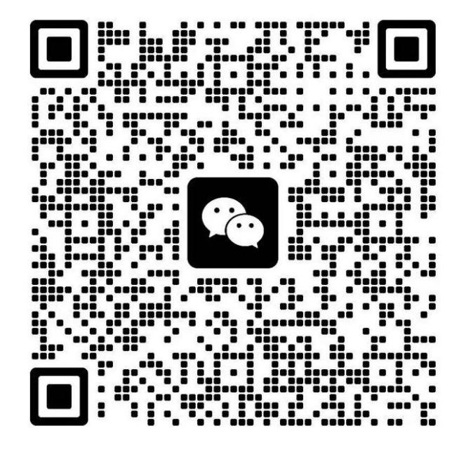
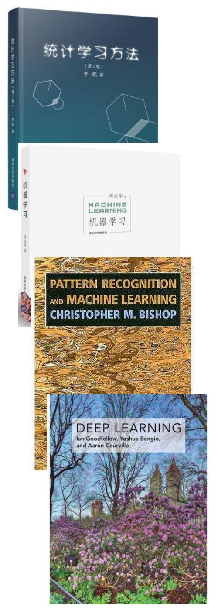

# **Machine Learning & Pattern Recognition**

**Yifei Zou (邹逸飞)**

**yfzou@sdu.edu.cn**

#### **课程群**

# **Objectives**

• To equip students with knowledge of common *statistical machine learning* and *pattern recognition* algorithms and techniques.

# **Prerequisites**

- Familiar with *probability*, and *linear algebra* (vector spaces and matrix theory) as thought in typical undergraduate courses.
  - [•](https://www.bilibili.com/video/av6731067) <https://www.bilibili.com/video/av6731067>
- Familiar with programming environments such as *MATLAB, Python* or be able to program in standard languages such as C, C++, etc.

# **Text Book and References**

- 统计学习方法 第二版(李航)
- 机器学习 (周志华)
- Pattern Recognition and Machine Learning (*Christopher Bishop*) (E-edition)
- Deep Learning (*Ian Goodfellow, Yoshua Bengio, Aaron Courville*) (E-edition)
- Lectures are important, but not enough.
- You are strongly suggested to explore more (via the *Internet* or even just the *wikipedia*).

# **Assessments**

- Lecture slides in PDF format
  - ➢ Via the WeChat group
- Experiments (25%)
  - ➢ Will be released soon.
- Final Project (25%)
  - ➢ Will be released soon.
- Final Exam (50%)
  - ➢ Closed-book, 2 hrs.

# **Schedule**

Experiments:

Weeks 2-17, Friday, 3-4

# **Syllabus**

#### **I** *plan* **to introduce the following topics…**

- 1. Introduction to Machine Learning
- 2. Review of linear algebra & probability
- 3. Linear Algorithms
- 4. Optimization methods (GD, Newton, Momentum, SGD…)
- 5. Unsupervised Feature Extraction (PCA)
- 6. Supervised Feature Extraction (LDA)
- 7. Bayesian Decision Theory

- 8. Support Vector Machine
- 9. Decision Tree
- 10. Feature Selection
- 11. Ensemble Methods (Bagging and Boosting)
- 12. Model Evaluation

# **Hope you would enjoy it.**

