# **Machine Learning & Pattern Recognition**

**Yifei Zou (邹逸飞)**

# **Outline**

- **What is Machine Learning?**
- **Applications of Machine Learning.**
- **Components of Machine Learning.**
- **Types of Machine Learning.**

# **Outline**

- **What is Machine Learning?**
- **Applications of Machine Learning.**
- **Components of Machine Learning.**
- **Types of Machine Learning.**

# **Definition of Machine Learning**

学习,是指通过阅读、听讲、思考、研究、实践等途径获得知识和技能的过程。

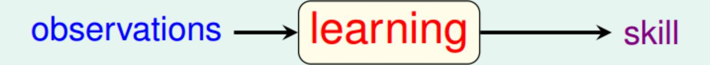

$$\frac{\text{data}}{\text{ML}} \longrightarrow \text{skill}$$

# **Definition of Machine Learning**

e.g., prediction accuracy

# **Why Do We Use Machine Learning?**

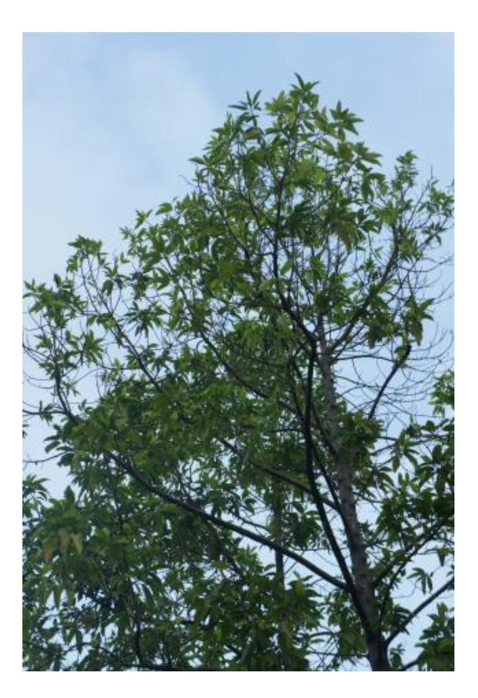

- **"Define" trees and hand-program: difficult;**
- **Learn from data (observations) and recognize;**
- **"ML-based tree recognition system" can be easier to build than hand-programmed system.**

• **Human cannot define the solution easily.**

### **Key Essence of Machine Learning**

machine learning: improving some performance measure with experience computed from data

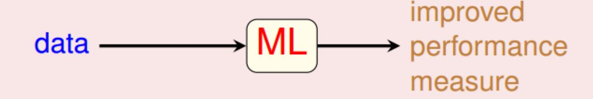

- exists some 'underlying pattern' to be learned
  so 'performance measure' can be improved
- but no programmable (easy) definition
  —so 'ML' is needed
- somehow there is data about the pattern
  so ML has some 'inputs' to learn from

key essence: help decide whether to use ML

# **Outline**

- **What is Machine Learning?**
- **Applications of Machine Learning.**
- **Components of Machine Learning.**
- **Types of Machine Learning.**

# **Outline**

- **What is Machine Learning?**
- **Applications of Machine Learning.**
- **Components of Machine Learning.**
- **Types of Machine Learning.**

# **Applications of Machine Learning**

### ◼ **Daily Needs**

- ✓ **Food**
- ✓ **Clothing**
- ✓ **Housing**
- ✓ **Transportation**
- ✓ **Entertainment**
- ✓ **Law**
- ✓ **Medical**
- ✓ **Education**

# **Food**

- ◼ **Ingredient Recognition (Chen et al. 2017)**
- ◼ **Data:**
  - ➢ **The food categories: xiachufang and meishijie.**
  - ➢ **All the images : Baidu and Google image search.**

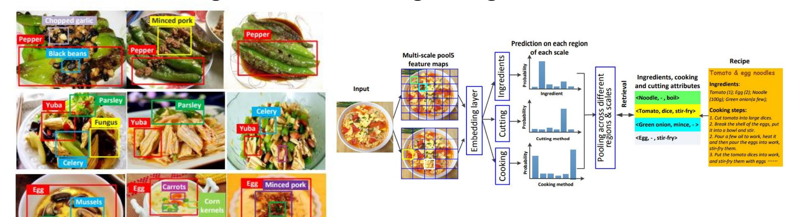

- ◼ **Clothing matching (Song et al. 2018)**
- ◼ **Data: Outfit compositions collected from the Polyvore (website).**

- ◼ **Clothing matching (Song et al. 2018)**
- ◼ **Data: Outfit compositions collected from the Polyvore (website).**

- Virtual Try-on with Arbitrary Poses (Zheng et al. 2019)
- **Data:** Fashion-oriented ecommerce website---Zalando.

- ◼ **Interactive Fashion Search(Wu et al. 2017)**
  - ◼ **Data: Public dataset (DARN and DeepFashion). Images with attribute annotations.**

# **Housing**

- ◼ **Gesture Recognition Using Wireless Signals (Pu et al. 2013, 2015)**
  - ◼ **Data: 5 users perform gestures in an office and a two-bedroom.**

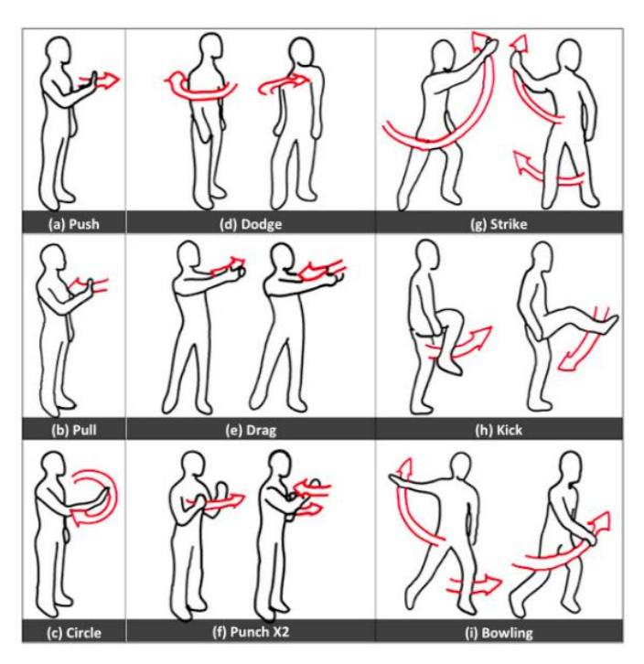

**Gesture sketches**

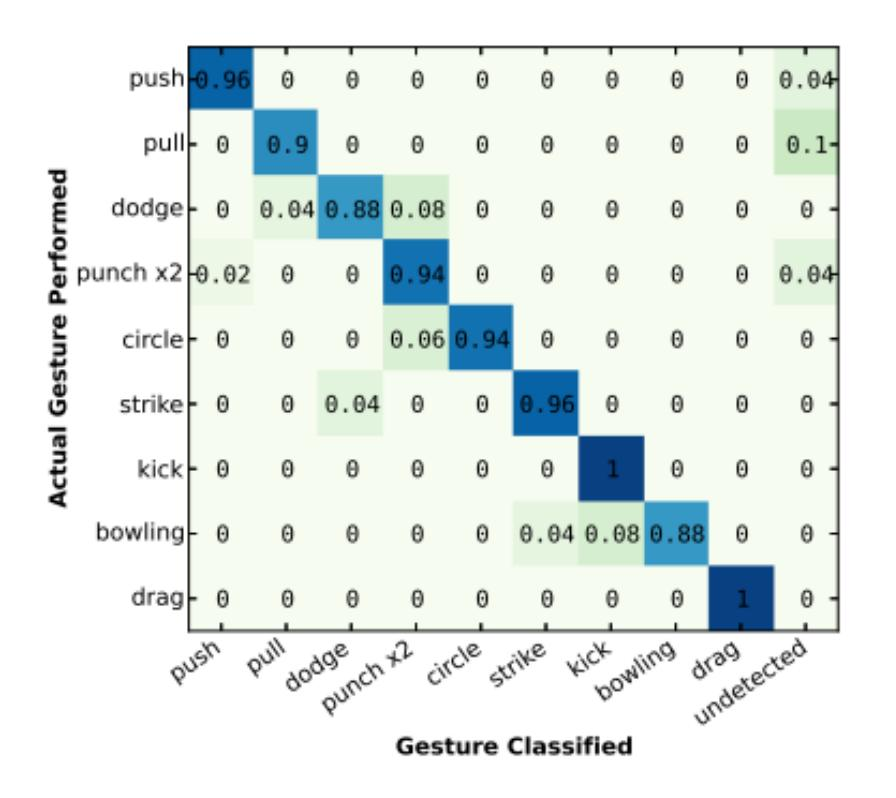

# **Transportation**

- ◼ **Traffic-Sign Detection (Zhu et al. 2016)**
  - ◼ **Data: Tencent street views with manual annotation.**

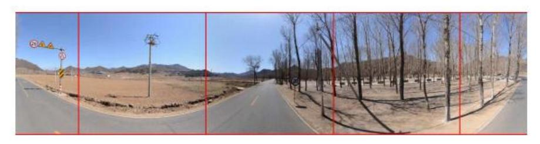

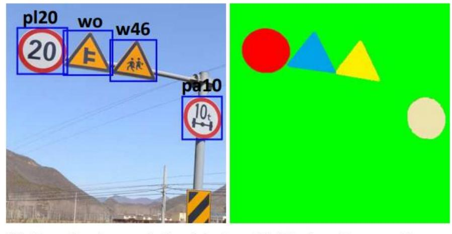

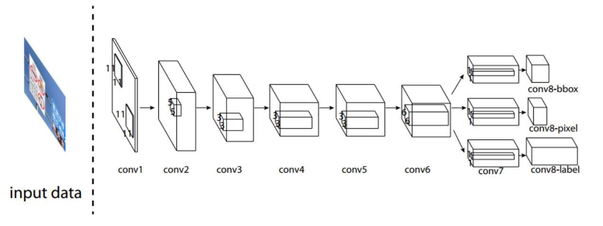

### **Benchmark**

# **Transportation**

- ◼ **Personalized Tour Recommendation (Zhao et al. 2017)**
  - ◼ **Data: Public dataset (Flicker).**

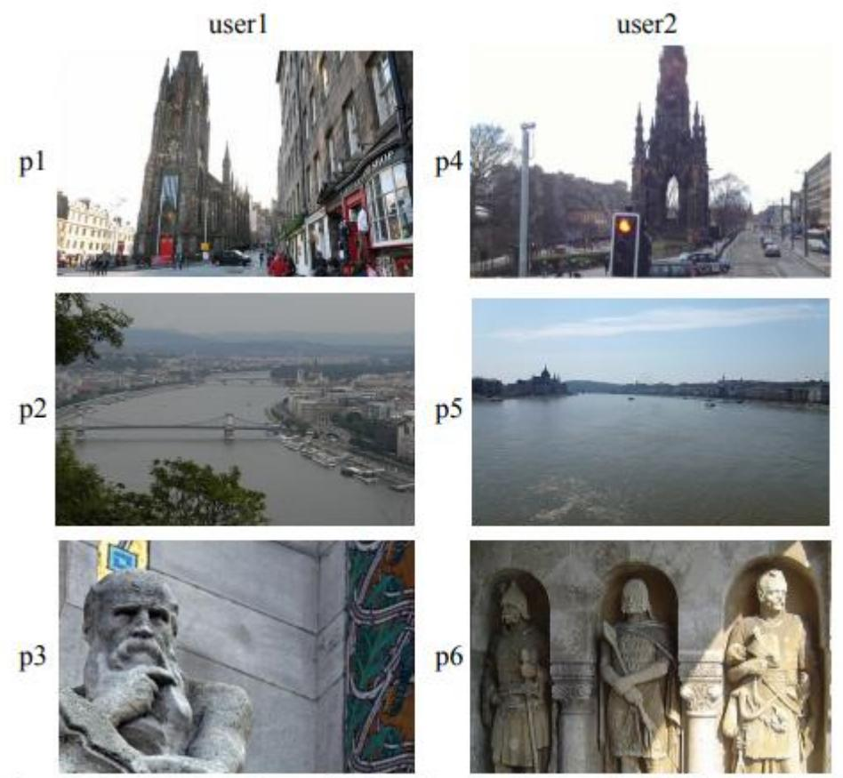

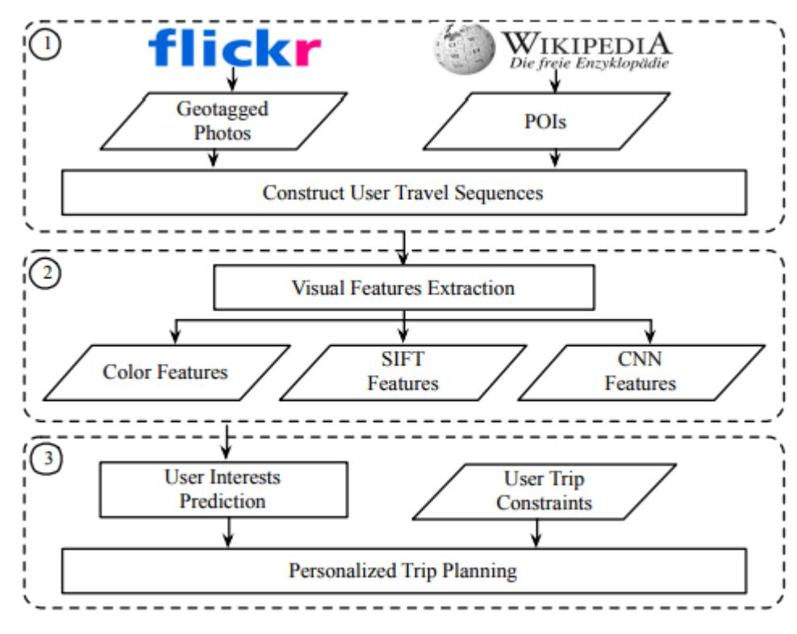

# **Entertainment**

◼ **Chatting Bot (Microsoft 2014, Zhang et al. 2017, Want et al. 2018)**

# **Law**

- ◼ **Crime Classification (Wang et al. 2018)**
  - ◼ **Data: Collected from the China Judgments Online.**
  - ◼ **Task: Determine the specific articles (as labels) that the evidence (document) violated (multi-label classification).**

**An example of the judgement case, including an evidence and two articles violated.**

**http://wenshu.court.gov.cn/Index**

# **Law**

- ◼ **Crime Classification (Wang et al. 2018)**
  - ◼ **Data: Collected from the China Judgments Online.**
  - ◼ **Task: Determine the specific articles (as labels) that the evidence (document) violated (multi-label classification).**

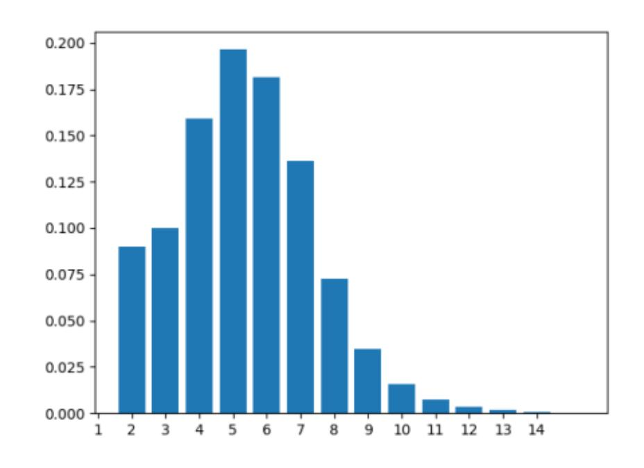

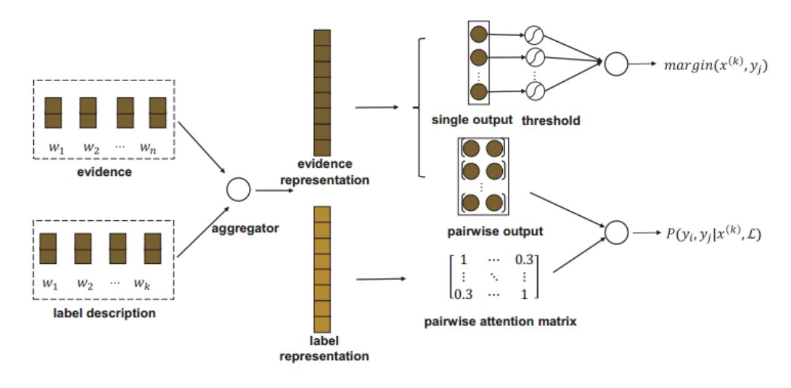

**Distribution of article set size over evidences. The overall architecture of the proposed model.** 

# **Medical**

- ◼ **Predicting depression via social media. (Choudhury et al. 2013)**
  - ◼ **Data: Social Media Data (Tweets).**
  - ◼ **Task: Predict a binary response variable (depressed/not depressed).**

| precision | recall                                             | acc. (+ve)                                                                                                   | acc. (mean)                                                                                                                                                                                                         |
|-----------|----------------------------------------------------|--------------------------------------------------------------------------------------------------------------|---------------------------------------------------------------------------------------------------------------------------------------------------------------------------------------------------------------------|
| 0.542     | 0.439                                              | 53.212%                                                                                                      | 55.328%                                                                                                                                                                                                             |
| 0.627     | 0.495                                              | 58.375%                                                                                                      | 61.246%                                                                                                                                                                                                             |
| 0.642     | 0.523                                              | 61.249%                                                                                                      | 64.325%                                                                                                                                                                                                             |
| 0.683     | 0.576                                              | 65.124%                                                                                                      | 68.415%                                                                                                                                                                                                             |
| 0.655     | 0.592                                              | 66.256%                                                                                                      | 69.244%                                                                                                                                                                                                             |
| 0.452     | 0.406                                              | 47.914%                                                                                                      | 51.323%                                                                                                                                                                                                             |
| 0.705     | 0.614                                              | 68.247%                                                                                                      | 71.209%                                                                                                                                                                                                             |
| 0.742     | 0.629                                              | 70.351%                                                                                                      | 72.384%                                                                                                                                                                                                             |
|           | 0.542 0.627 0.642 0.683 0.655 0.452 | 0.542  0.439    0.627  0.495    0.642  0.523    0.683  0.576    0.655  0.592    0.452  0.406    0.705  0.614 | 0.542    0.439    53.212%      0.627    0.495    58.375%      0.642    0.523    61.249%      0.683    0.576    65.124%      0.655    0.592    66.256%      0.452    0.406    47.914%      0.705    0.614    68.247% |

**Example posts from users in the depression class. Performance metrics in depression prediction in** 

**posts using various models.**

# **Medical**

- ◼ **Classification of skin cancer. (Esteva et al. 2017)**
  - ◼ **Data: The ISIC Dermoscopic Archive, the Edinburgh Dermofit Library and data from the Stanford Hospital (129,450 clinical images).**

# **Medical**

- ◼ **Classification of skin cancer. (Esteva et al. 2017)**
  - ◼ **Task: Two binary classification use cases:**
    - ◼ **Keratinocyte carcinomas vs benign seborrheic keratoses;**
    - ◼ **Malignant melanomas(**恶性黑色素瘤**) vs benign nevi(**良性痣**).**

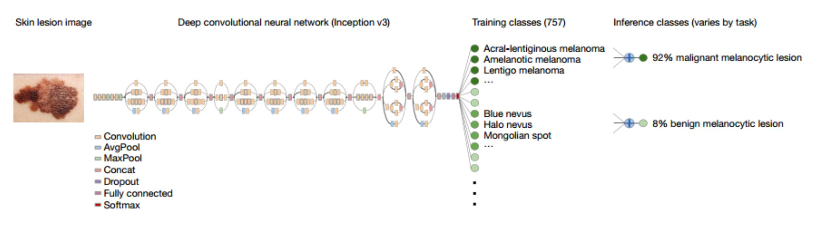

**Proposed framework.**

# **Education**

- ◼ **Automated Essay Scoring. (Taghipour et al. 2016)**
  - ◼ **Data: Public dataset provide by the following competition (2012).**

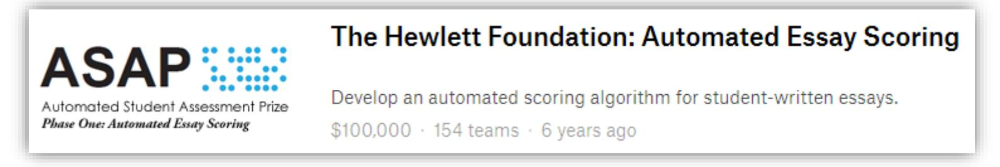

| Prompt | #Essays | Avg length | Scores |
|--------|---------|------------|--------|
| 1      | 1,783   | 350        | 2-12   |
| 2      | 1,800   | 350        | 1–6    |
| 3      | 1,726   | 150        | 0–3    |
| 4      | 1,772   | 150        | 0-3    |
| 5      | 1,805   | 150        | 0–4    |
| 6      | 1,800   | 150        | 0–4    |
| 7      | 1,569   | 250        | 0-30   |
| 8      | 723     | 650        | 0–60   |

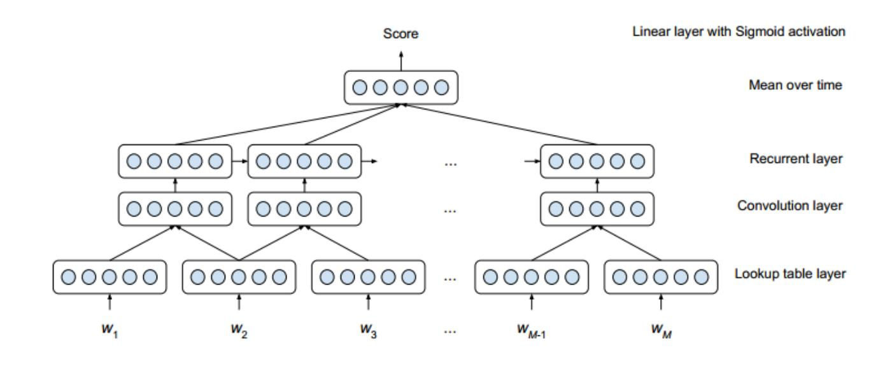

# **Education**

- ◼ **Automated Essay Scoring. (Hao et al. 2014)**
  - ◼ **Data: Essays from the MHK (the minorities-oriented Chinese level test).**

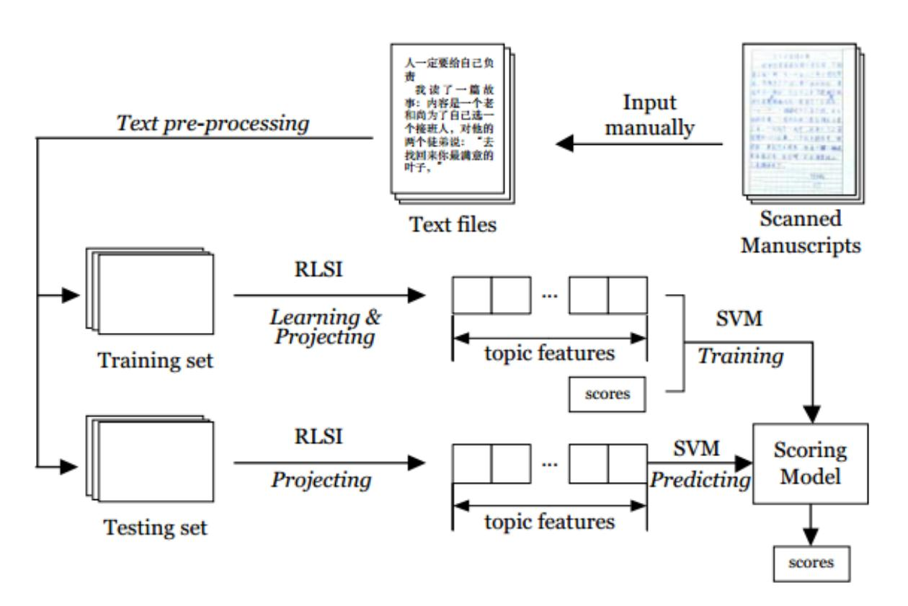

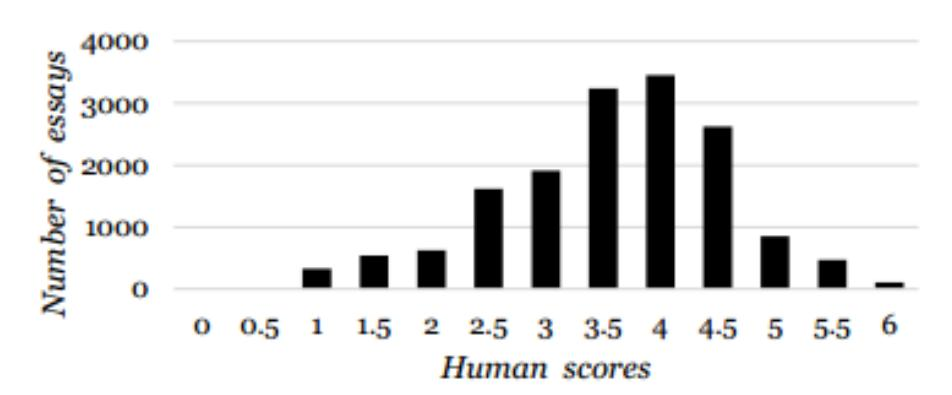

**Training set (total 15,776 essays)**

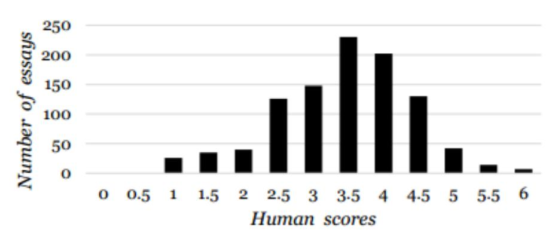

**The flowchart of the proposed method. Testing set (total 1,000 essays)**

# **Outline**

- **What is Machine Learning?**
- **Applications of Machine Learning.**
- **Components of Machine Learning.**
- **Types of Machine Learning.**

# **Outline**

- **What is Machine Learning?**
- **Applications of Machine Learning.**
- **Components of Machine Learning.**
- **Types of Machine Learning.**

# **Basic Notations**

- ◼ **Bold capital letters (e.g., )** → **Matrices;**
- ◼ **Bold lowercase letters (e.g., )** → **Vectors;**
- ◼ **Non-bold letters (e.g., )** → **Scalars;**
- ◼ **Greek letters (e.g.,** β**)** → **The parameters.**

# **Basic Notations**

- ◼ **Input:** ∈ **(**: input/sample space**)**
- ◼ **Output:** ∈ **(:** output/label space**)**
- ◼ **Data** ⇔ Training examples (sample/instance).
  - ◼ = (, 1), (, 2), … , (, ) , where = (1, 2, … , ) ∈ ℝ , ∈ ; is the value of the -th attribute/feature of **.**
  - ◼ **: dimensionality** of the feature space.
- ◼ **Unknown pattern** to be learned, i.e., target function:

$$f: \boldsymbol{\mathcal{X}} \to \boldsymbol{\mathcal{Y}}$$

◼ **Hypothesis:** skill with hopefully good performance: : → ('learned' formula to be used)

$$\{(\mathbf{x}_n, y_n)\} \text{ from } f \longrightarrow \boxed{\mathsf{ML}} \longrightarrow g$$

# **Watermelon Classification**

| 编号 | 色泽 | 根蒂 | 敲声 | 好瓜 |
|----|----|----|----|----|
| 1  | 青绿 | 蜷缩 | 浊响 | 是  |
| 2  | 乌黑 | 蜷缩 | 浊响 | 是  |
| 3  | 青绿 | 硬挺 | 清脆 | 否  |
| 4  | 乌黑 | 稍蜷 | 沉闷 | 否  |

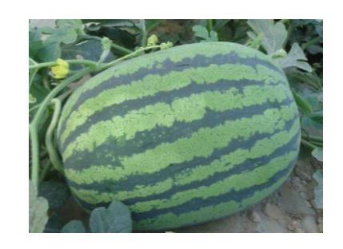

**Is the given watermelon good?**

# **Learning Flow**

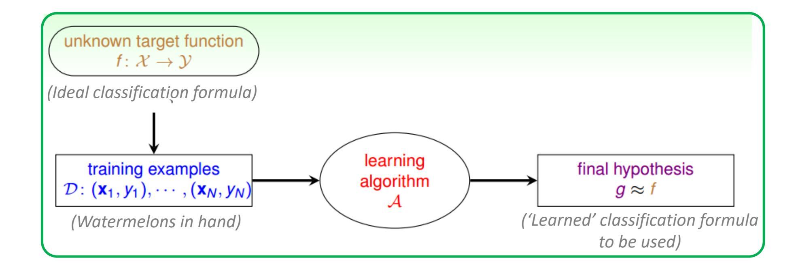

**What does** *g* **look like?**

### **Learning Model**

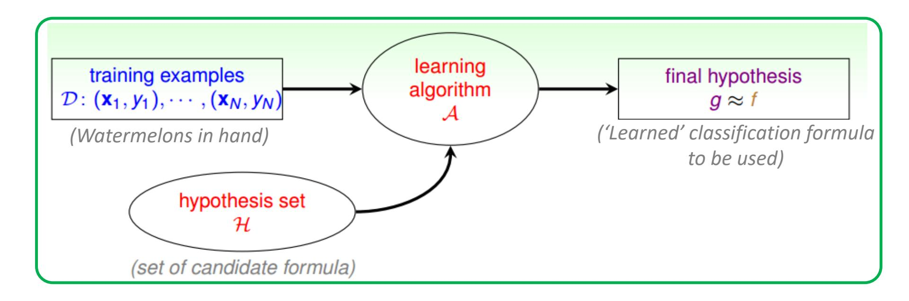

- Assume  $g \in \mathcal{H} = \{h_k\}$ , i.e., classify a given watermelon is good if
  - h₁: (色泽="青绿")∧(根蒂="蜷缩")∧(敲声="浊响")
  - h₂: (色泽=\*)∧(根蒂="蜷缩")∧(敲声="浊响")
  - *h*3: (色泽=\*)∧(根蒂="蜷缩")∧(敲声=\*)
  - •
- Hypothesis set  $\mathcal{H}$ :
  - Can contain good or bad hypotheses
  - Up to the learning algorithm  $\mathcal{A}$  to pick the 'best' one as g

# **Practical Definition of Machine Learning**

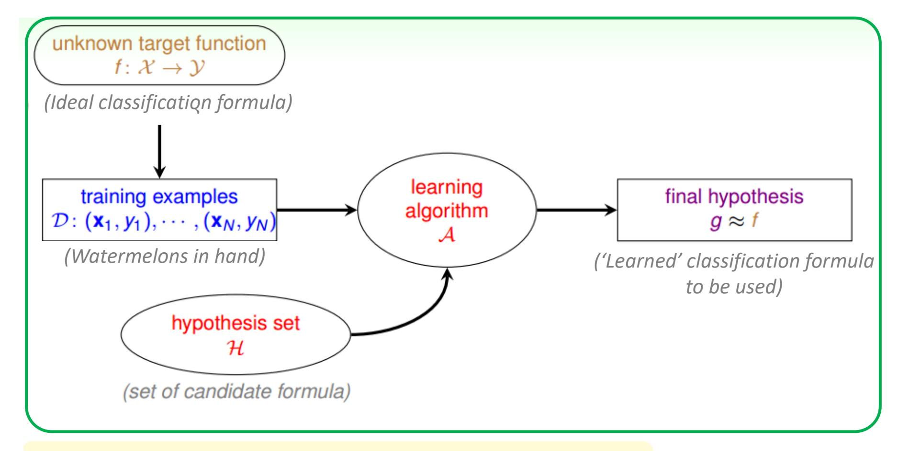

# **Outline**

- **What is Machine Learning?**
- **Applications of Machine Learning.**
- **Components of Machine Learning.**
- **Types of Machine Learning.**

# **Outline**

- **What is Machine Learning?**
- **Applications of Machine Learning.**
- **Components of Machine Learning.**
- **Types of Machine Learning.**

# **Categories of Machine Learning**

- **Learning with different output space**
- **Learning with different data label**
- **Learning with different protocol** (**,** )
- **Learning with different input space**

# **Categories of Machine Learning**

- **Learning with different output space**
- **Learning with different data label**
- **Learning with different protocol** (**,** )
- **Learning with different input space**

# **Binary Classification**

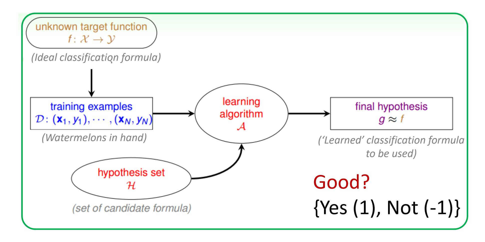

= −1,1 or 0,1 : binary classification.

# **Binary Classification** = −1,1 or 0,1

$$y = \{-1,1\} \text{ or } \{0,1\}$$

### Finding decision boundaries

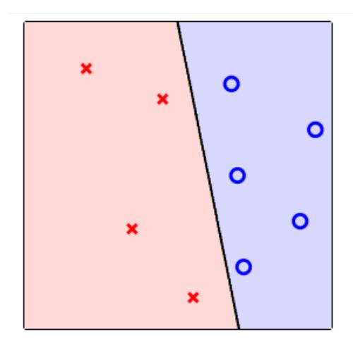

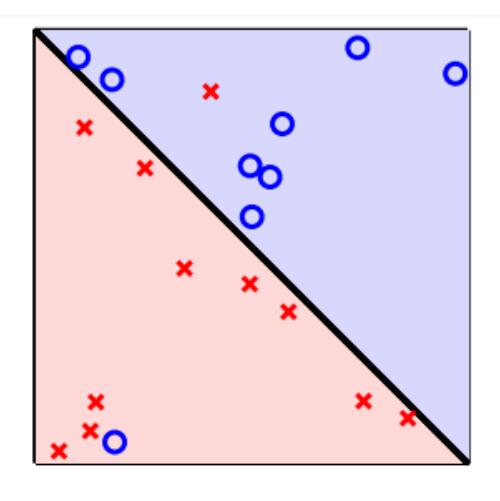

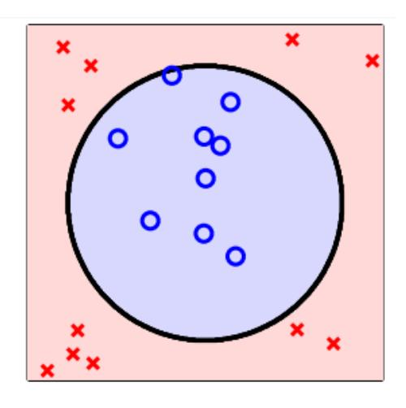

### Other Binary Classification Problems

- Credit approve/disapprove
- Email spam/non-spam
- Patient sick/not sick
- Ad profitable/not profitable

### **Multiclass Classification**

 $|\mathcal{Y}| > 2$ .

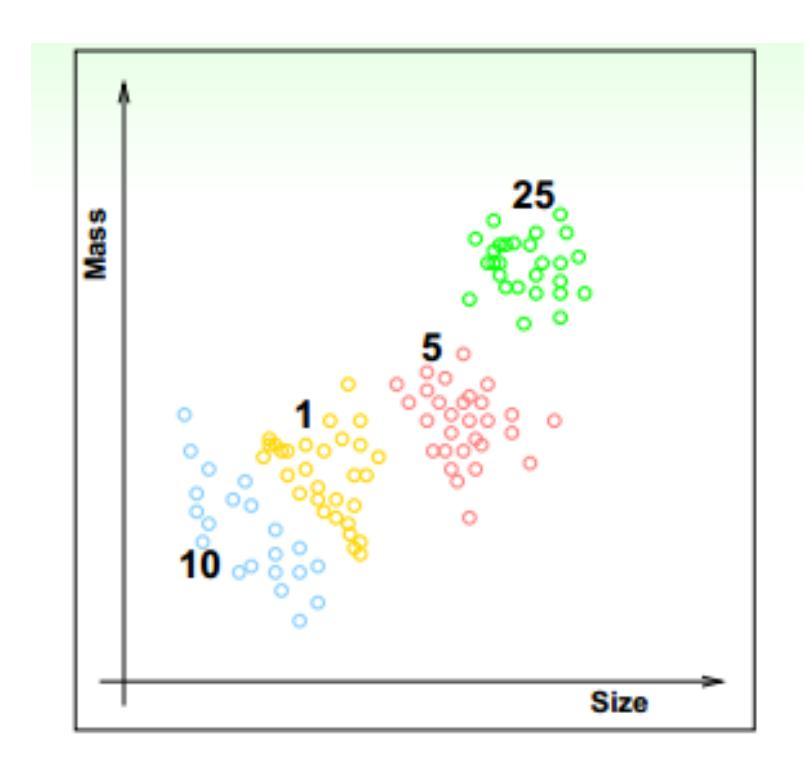

- classify US coins (1c, 5c, 10c, 25c)
  by (size, mass)
- $\mathcal{Y} = \{1c, 5c, 10c, 25c\}$ , or  $\mathcal{Y} = \{1, 2, \dots, K\}$  (abstractly)
- binary classification: special case with K = 2

### Other Multiclass Classification Problems

- written digits  $\Rightarrow 0, 1, \dots, 9$
- pictures ⇒ apple, orange, strawberry
- emails ⇒ spam, primary, social, promotion, update (Google)

### **What color is the cat in this photo?**

**Cailco** (三色)

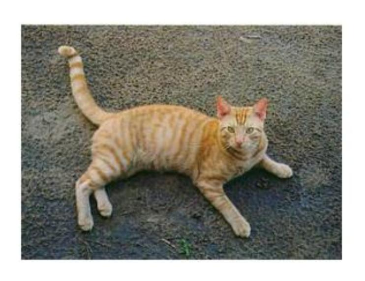

**Orange Tabby (**虎斑**)**

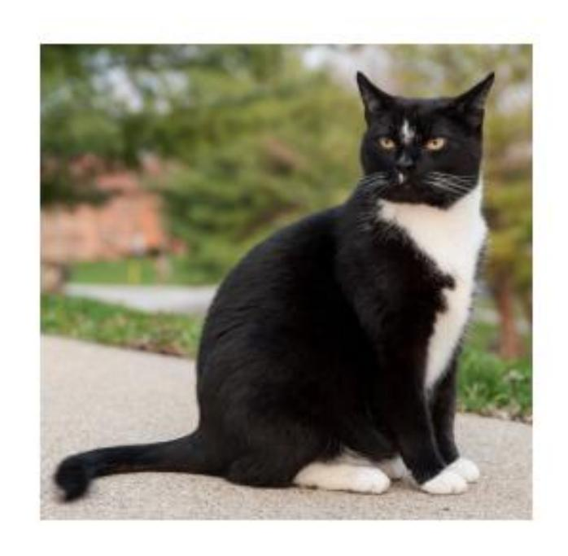

**Tuxedo (**燕尾服**)**

**Multiclass** classification refers to the setting when there are > 2 possible class labels (e.g., calico, orange tabby, tuxedo).

| <b>x</b> 1 | X 2 | <b>x</b> 3 | <b>X</b> 4 | У            |
|-----------------------|----------------|-----------------------|-----------------------|--------------|
| 1.01                  | -4.26          | 7.99                  | -0.03                 | Calico       |
| 2.50                  | 1.00           | 4.87                  | 5.95                  | Orange Tabby |
| -2.34                 | -1.24          | -0.88                 | -1.31                 | Tuxedo       |
| 0.55                  | 0.59           | -3.08                 | 1.27                  | Orange Tabby |
| 2.08                  | -3.46          | 4.62                  | -1.13                 | Gray Tabby   |
|                       |                |                       |                       |              |

### **What color and sex is the cat in this photo?**

**Cailco Female**

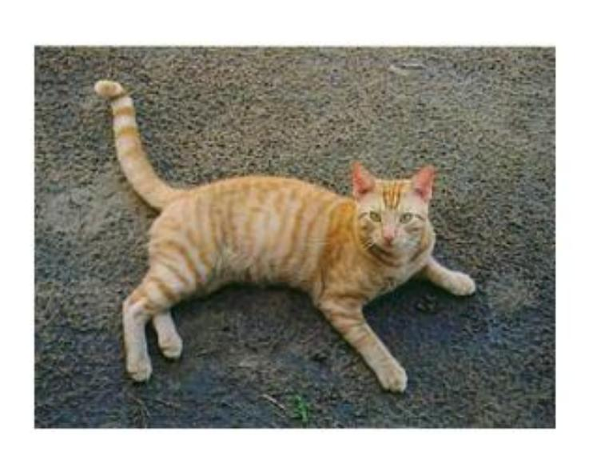

**Orange Tabby Male** 

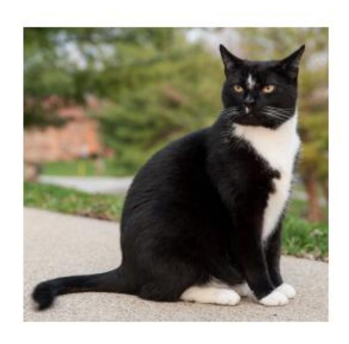

**Tuxedo Male** 

**Multi-label** classification refers to the setting when there

> 1 label you want to predict.

| X 1 | X 2 | <b>x</b> 3 | <b>x</b> 4 | <b>y</b> 1 | <b>y</b> 2 |
|----------------|----------------|-----------------------|-----------------------|-----------------------|-----------------------|
| 1.01           | -4.26          | 7.99                  | -0.03                 | Calico                | Female                |
| 2.50           | 1.00           | 4.87                  | 5.95                  | Orange Tabby          | Male                  |
| -2.34          | -1.24          | -0.88                 | -1.31                 | Tuxedo                | Male                  |
| 0.55           | 0.59           | -3.08                 | 1.27                  | Orange Tabby          | Male                  |
| 2.08           | -3.46          | 4.62                  | -1.13                 | Gray Tabby            | Female                |
|                |                |                       |                       |                       |                       |

### Multiclass classification

- It's possible to create multiclass classifiers out of binary classifiers.
  - One vs Rest (One vs All)
    - Each classifier predicts whether the instance belongs to the target class.
  - All pairs
    - Trains a binary classifier for every pair of classes. Whichever class "wins" more pairwise classifications will be the final prediction.

### Multiclass classification

- It's possible to create multiclass classifiers out of binary classifiers.
  - One vs Rest (One vs All)
    - Each classifier predicts whether the instance belongs to the target class.
  - All pairs
    - Trains a binary classifier for every pair of classes. Whichever class "wins" more pairwise classifications will be the final prediction.

### Multi-label classification

- Train separate classifier for each label.
- But there might be correlations between the classes.
  - Calico cats are almost always female.
  - Orange cats are more often male.

# **Regression: Patient Recovery Prediction Problem**

Regression: fitting a curve/plane to data

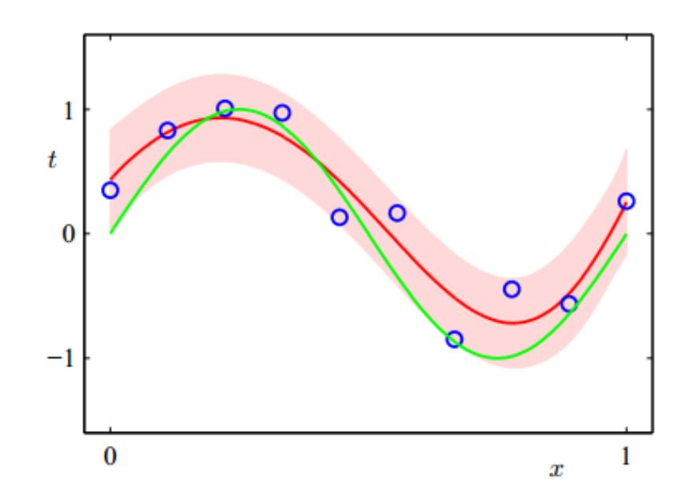

# **Regression: Patient Recovery Prediction Problem**

- Images (Instagram) ⇒ Popularity prediction
- E-commerce product ⇒ Sale prediction

# **Mini Summary**

### Learning with different output space

- Binary classification: = −1, +1
- Multiclass classification: = 1,2, … ,
- Regression: = ℝ

# **Exercise**

- multilabel classification

# **Categories of Machine Learning**

- **Learning with different output space**
- **Learning with different data label**
- **Learning with different protocol** (**,** )
- **Learning with different input space**

# **Supervised Learning**

Every comes with corresponding . = (, 1), (, 2), … , (, )

| 编号 | 色泽 | 根蒂 | 敲声 | 好瓜 |
|----|----|----|----|----|
| 1  | 青绿 | 蜷缩 | 浊响 | 是  |
| 2  | 乌黑 | 蜷缩 | 浊响 | 是  |
| 3  | 青绿 | 硬挺 | 清脆 | 否  |
| 4  | 乌黑 | 稍蜷 | 沉闷 | 否  |

# **Supervised Learning**

### Characteristics of the Supervised Learning

- We are primarily interested in prediction.
- The possible values of what we want to predict are specified, and we have some training cases for which its value is known.
- = (, 1), (, 2), … , (, )

# **Supervised Learning**

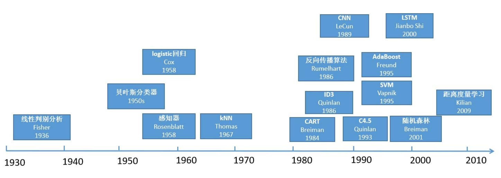

# **Supervised Learning vs Unsupervised Learning**

Every comes with corresponding . = (, 1), (, 2), … , (, )

Assume that we do not have the for every . = , , … ,

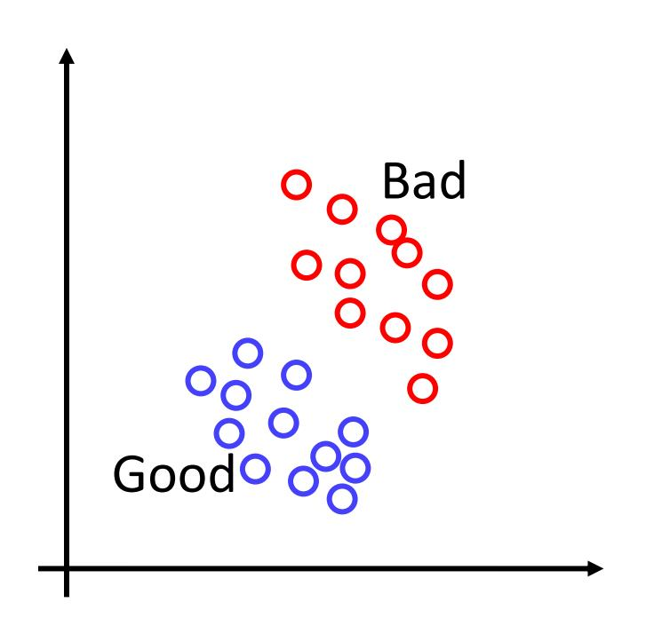

Supervised classification Unsupervised clustering

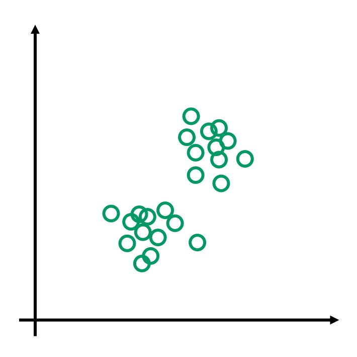

(Ground Truth) Labels: Good; Bad. (Learned) Latent concepts: Art; Sports.

# **Unsupervised Learning**

For an unsupervised learning problem, we do not focus on prediction of any particular thing, but rather try to find interesting aspects of the data = , , … , **.**

### Examples

- We may find clusters of *patients* with similar *symptoms* (diseases).
- We may find clusters of *images* with the similar *visual characteristics*.
- We may find clusters of *people* with the similar *interests*.
- We may find clusters of *articles* with the similar *topics*.

# **Unsupervised Learning**

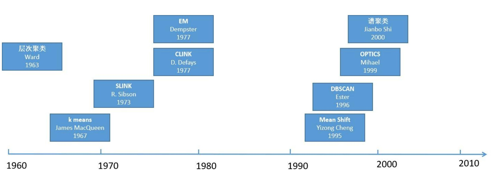

# **Semi-supervised Learning (with some )**

$$\mathcal{D} = \{(x_1, y_1), (x_2, y_2), \dots, (x_k, y_k), x_{k+1}, x_{k+2}, \dots, x_m\}.$$

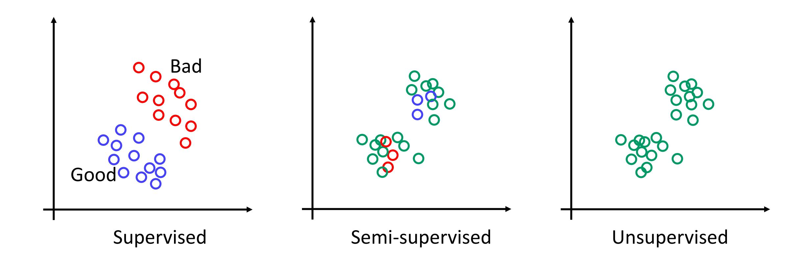

# **Semi-supervised Learning (with some )**

$$\mathcal{D} = \{(x_1, y_1), (x_2, y_2), \dots, (x_k, y_k), x_{k+1}, x_{k+2}, \dots, x_m\}.$$

Semi-supervised learning: leverage unlabeled data to avoid "expensive" labeling.

### Examples

# **Mini Summary**

- ➢ **Supervised learning:**
  - using *X\_train* and *Y\_train*, learn a general classifier to label any point.
- ➢ **Semi-supervised learning:**
  - using *X\_train* and *Y\_train*, and *X\_unlabeled* learn a general classifier to label any point.

- Thus far: Learning from examples
- Missing: actions (Learn from implicit data, often sequentially)

Teach Your Dog How to Sit: We say 'Sit Down'

- Thus far: Learning from examples
- Missing: actions (Learn from implicit data, often sequentially)

### Teach Your Dog How to Sit: We say 'Sit Down'

- Action1: The dog pees on the ground.
  - We cannot easily show the dog that =sit when = 'sit down', but we can punish this action.

- Thus far: Learning from examples
- Missing: actions (Learn from implicit data, often sequentially)

### Teach Your Dog How to Sit: We say 'Sit Down'

- Action1: The dog pees on the ground.
  - We cannot easily show the dog that =sit when = 'sit down', but we can punish this action.
- Action2: The dog sits down.
  - Cannot easily show the dog that =sit when ='sit down', but we can reward this action.

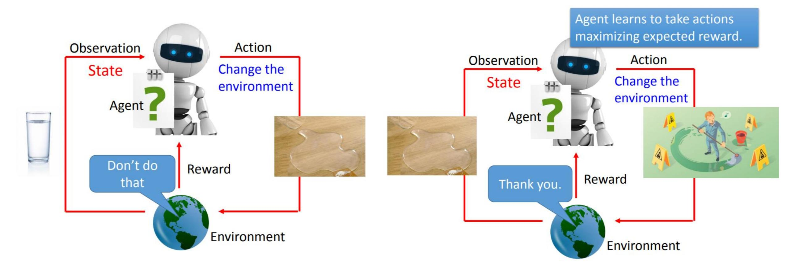

Scenario 1 (Punish)

Scenario 2 (Reward)

# **What Makes Reinforcement Learning Different?**

- There is no supervisor, only a reward signal.
- Time really matters (sequential).
- Agent's actions affect the subsequent data it receives.
- Reinforcement learning is based on the reward hypothesis.
- All goals can be described by the maximization of expected cumulative reward.
- Agent goal: maximize cumulative reward.
  - Select actions to maximize the expected cumulative reward.

- ➢ Fly stunt manoeuvre in a helicopter (直升机特技飞行)
  - + reward for following desired trajectory
  - - reward for crashing
- ➢ Make a humanoid robot walk
  - + reward for forward motion
  - - reward for falling over
- ➢ Recycling robot
  - + reward for finding cans
  - - reward for running out of battery
- ➢ Ad system
  - + user click
  - - no click

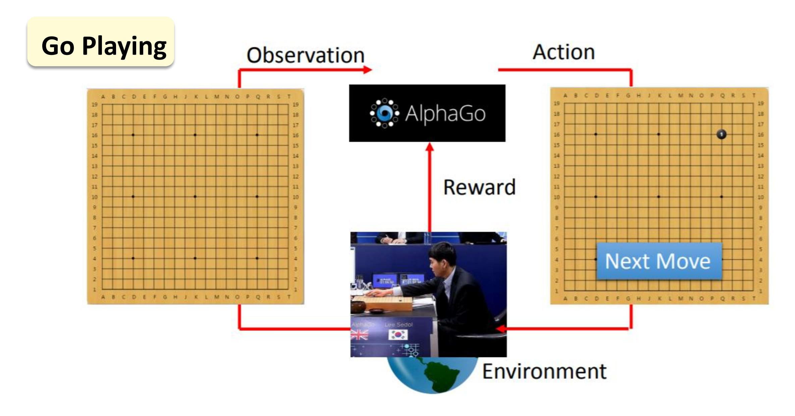

**Chat-bot**

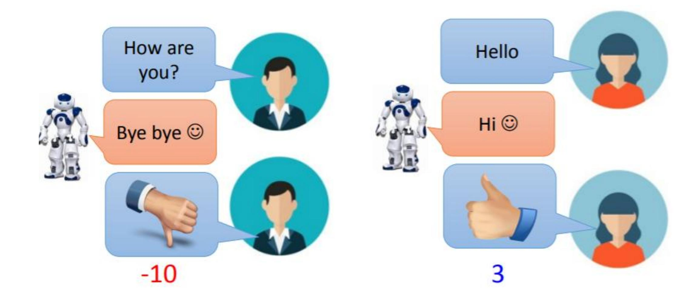

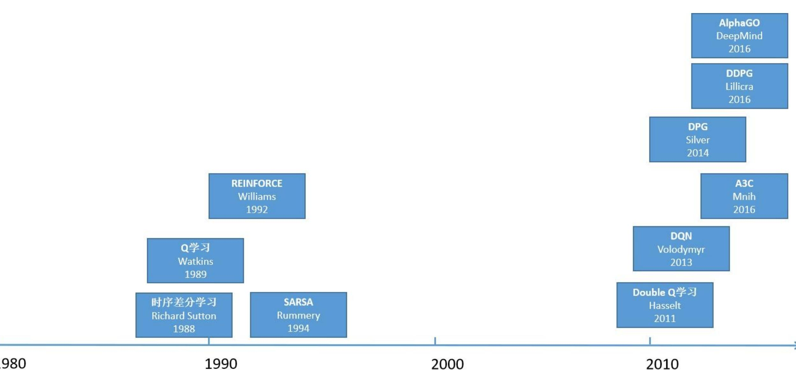

### **Exercise**

### What is this learning problem?

To build a tree recognition system, a company decides to gather one million of pictures on the Internet. Then, it asks each of the 10 company members to view 100 pictures and record whether each picture contains a tree. The pictures and records are then fed to a learning algorithm to build the system. What type of learning problem does the algorithm need to solve?

- supervised
- unsupervised
- 3 semi-supervised
- reinforcement

# **Categories of Machine Learning**

- **Learning with different output space**
- **Learning with different data label**
- **Learning with different protocol** (**,** )
- **Learning with different input space**

# **Batch Learning**

Batch (offline) learning: learn from *all known* data (a very common protocol).

### Examples

- Batch of (email, spam yes/no) ⇒ spam filter
- Batch of (patient info, cancer yes/no) ⇒ cancer prediction
- Batch of (video, location label) ⇒ video location prediction
- Batch of customer data ⇒ group of customers (interest)
- Batch of documents ⇒ group of documents (topic)

# **Batch Learning**

Batch (offline) learning: learn from *all known* data (a very common protocol).

### We typically assume that:

- The learning algorithm is deterministic,
- does not depend on the ordering of the points in the training set.

# **Online Learning**

Online learning: learn from the *sequential* data.

### Examples

- Online Spam filter ( is the learning algorithm)
  - Observe an email ;
  - Predict spam label with current = ()
  - Receive 'ground truth' from the user, and then update with ( , ), i.e., +1 = ( , ( , ))

# **Online Learning**

Online learning: learn from the *sequential* data.

### Other Examples

- A recommendation system (e.g., IMDB) that is constantly learning from the ratings given by users and making appropriate recommendations to users.
- The Facebook production ranking systems used in ads ranking and newsfeed ranking use a combination of online learning and offline learning to provide the best results.

• Active learning is well-motivated in modern machine learning problems where data may be abundant but labels are scarce or expensive to obtain.

Speech Recognition. (Phonemes Annotation).

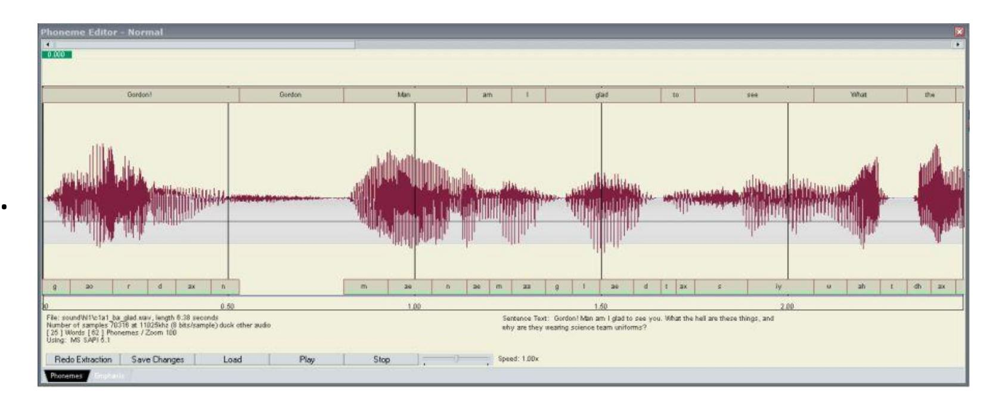

- Active learning is well-motivated in modern machine learning problems where data may be abundant but labels are scarce or expensive to obtain.
- Active learning (sequentially) queries the of the *strategically chosen* , which is to be labeled by an *oracle* (e.g., a human annotator).
- *Key hypothesis:* if the learning algorithm is allowed to choose the data from which it learns, it will perform better with less training.

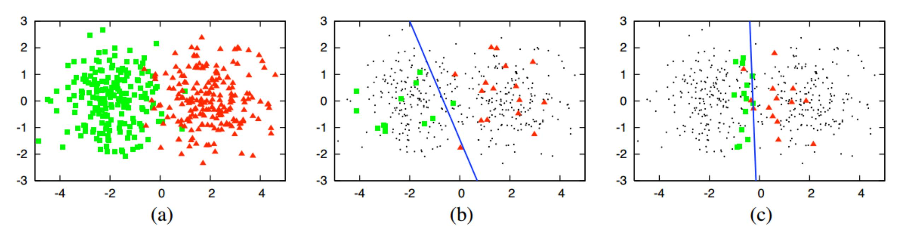

An illustrative example of pool-based active learning. (a) A toy data set of 400 instances. (b) A logistic regression model trained with 30 labeled instances using *random sampling*. (c) A logistic regression model trained with 30 *actively* queried instances using *uncertainty sampling*.

*Uncertainty sampling*: label those points for which the current model is least certain as to what the correct output should be.

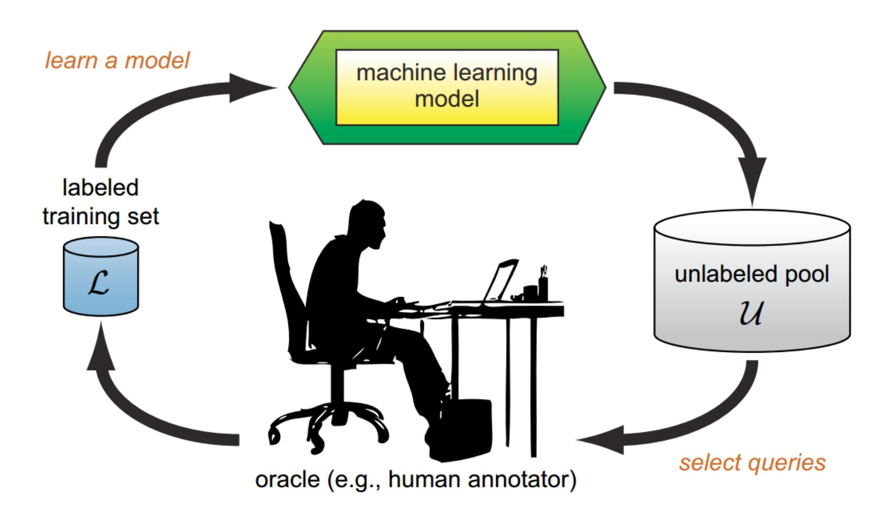

**The pool-based active learning cycle .**

# **Categories of Machine Learning**

- **Learning with different output space**
- **Learning with different data label**
- **Learning with different protocol** (**,** )
- **Learning with different input space**

# **Concrete Features**

- **(size, mass) for coin classification**
- **(MFCC, Zero Crossing Rate, etc.) for speech recognition**
- **Customer info (gender, occupation, etc.) for credit approval**
- **Patient info (height, weight, etc. ) for cancer diagnosis**

# **Concrete Features**

- **(size, mass) for coin classification**
- **(MFCC, Zero Crossing Rate, etc.) for speech recognition**
- **Customer info (gender, occupation, etc.) for credit approval**
- **Patient info (height, weight, etc. ) for cancer diagnosis**
- **Often including "human intelligence" on the learning task**

# **Concrete Features**

- **(size, mass) for coin classification**
- **(MFCC, Zero Crossing Rate, etc.) for speech recognition**
- **Customer info (gender, occupation, etc.) for credit approval**
- **Patient info (height, weight, etc. ) for cancer diagnosis**
- **Often including "human intelligence" on the learning task**

Concrete features: the "easy" ones for ML.

# **Raw Features**

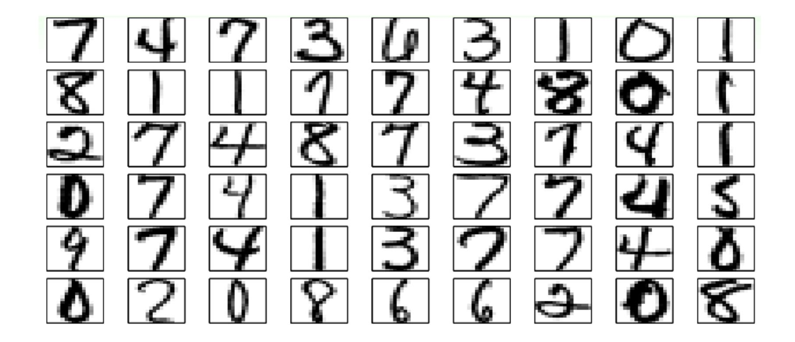

• Digit recognition problem: features ⇒ {0,1,2,…,9}.

# **Raw Features**

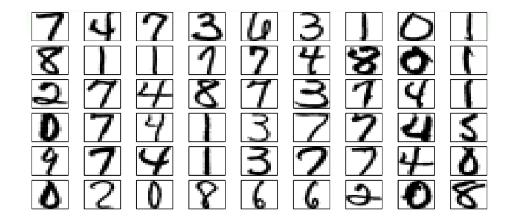

- Digit recognition problem: features ⇒ {0,1,2,…,9}.
- (Supervised multiclass classification problem).

# **Raw Features**

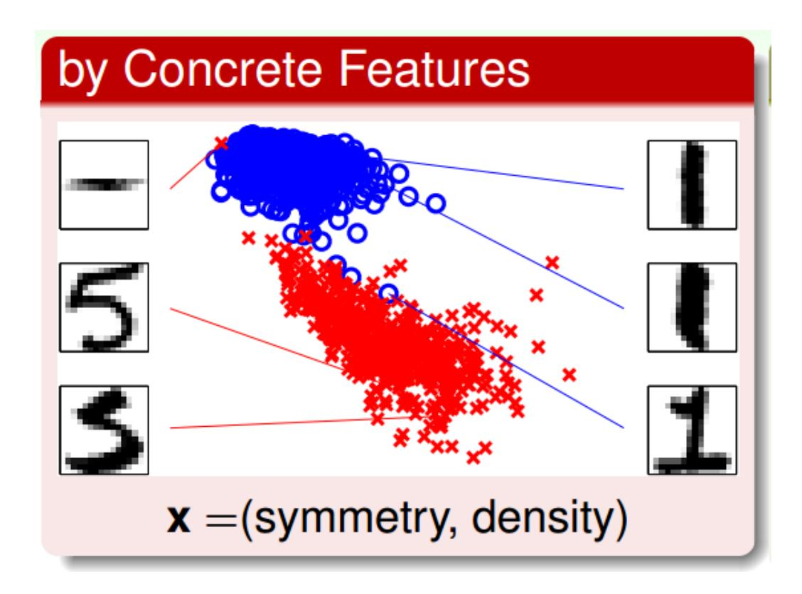

• Raw features (image pixels, speech signal, etc.): often need human or machines (e.g., neural networks) to convert to concrete ones.

### **Abstract Features**

### Rating Prediction Problem (KDDCup 2011)

- given previous (userid, itemid, rating) tuples, predict the rating that some userid would give to itemid?
- a regression problem with  $\mathcal{Y} \subseteq \mathbb{R}$  as rating and  $\mathcal{X} \subseteq \mathbb{N} \times \mathbb{N}$  as (userid, itemid)
- 'no physical meaning'; thus even more difficult for ML

# **Abstract Features**

• Abstract Features also need 'feature conversion/construction' by human or machines.

### **Types of Machine Learning**

- ➢ **Learning with different output space** 
  - **[classification], [regression]**
- ➢ **Learning with different data label** 
  - **[supervised], un/semi-supervised, reinforcement**
- ➢ **Learning with different protocol** (**,** )
  - **[batch], online, active**
- ➢ **Learning with different input space** 
  - **[concrete, raw], abstract**

# **Remarks**

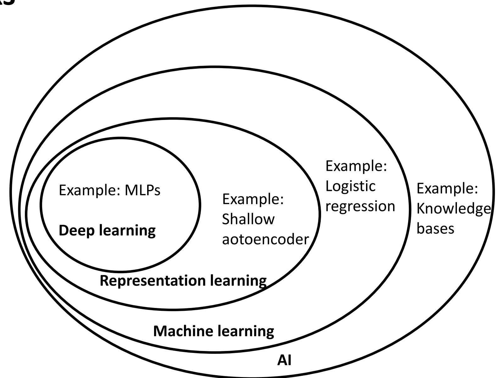