# **Machine Learning & Pattern Recognition**

| age           | 23 years      |
|---------------|---------------|
| annual salary | NTD 1,000,000 |
| year in job   | 0.5 year      |
| current debt  | 200,000       |

Training dataset:  $\mathcal{D} = \{(x_1, y_1), (x_2, y_2), ..., (x_m, y_m)\};$ 

**Features** of the *i*-th customer:  $x_i = (x_{i1} x_{i2} \dots x_{id})^T$ ; (Column vector)

The **ground truth** of the credit limit for the i-th customer:  $y_i \in \mathbb{R}$  .

**Linear regression:**  $h(x_i) = w^T x_i + b = \sum_{j=1}^d w_j x_{ij} + b$ , where  $w = (w_1 \ w_2 \ ... \ w_d)^T \in \mathbb{R}^d$ 

For simplicity, the bias b can be merged into the weight w:

$$h(\boldsymbol{x_i}) = \widehat{\boldsymbol{w}}^T \widehat{\boldsymbol{x_i}} \qquad \widehat{\boldsymbol{w}} = (b; \boldsymbol{w}) = (b \ w_1 \ w_2 \ \dots \ w_d) \in \mathbb{R}^{d+1}$$
$$\widehat{\boldsymbol{x_i}} = (1; \ x_{i1}; x_{i2}; \dots; x_{id}) \in \mathbb{R}^{d+1}$$

**To-be-learned parameter**

**Linear regression hypothesis:** ℎ = = σ=0 , 0 = 1

Linear regression: find lines/hyperplanes with small residuals.

Popular/historical squared error measure:

$$L(h(\mathbf{x}), y) = (\hat{y} - y)^2$$

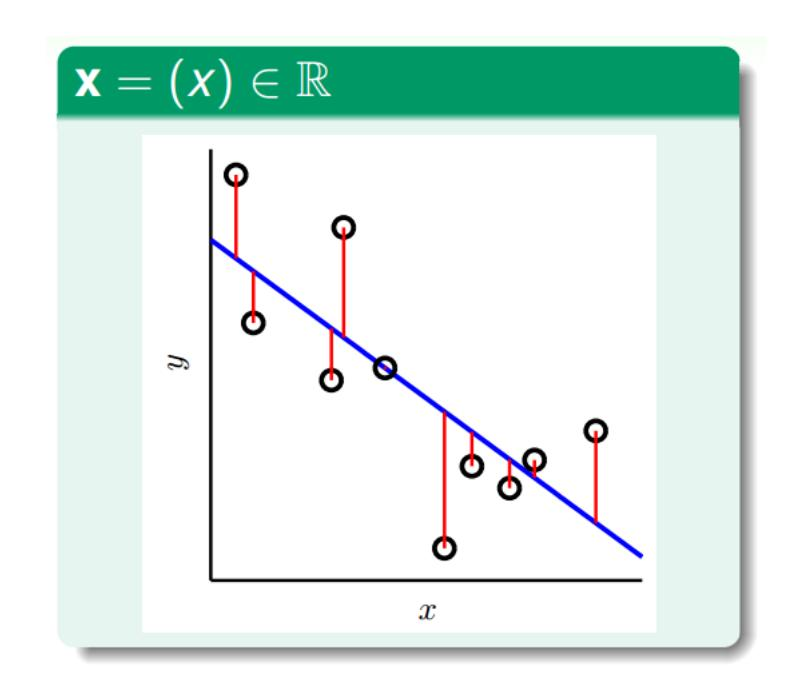

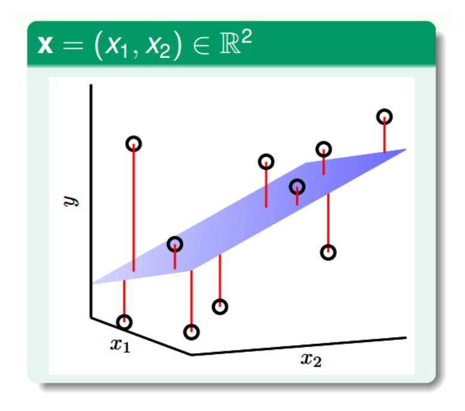

## **Empirical Error**

We prefer to minimize the objective function where the expectation is taken across the data generating distribution rather than just over the finite training set:

$$J^*(\boldsymbol{\theta}) = \mathbb{E}_{(\boldsymbol{x}, \boldsymbol{y}) \sim p_{data}} L(h(\boldsymbol{x}, \boldsymbol{\theta}), \boldsymbol{y})$$

However, in most cases, we do not know but only have a training set of samples. One simplest way to convert the machine learning problem back into an optimization problem is to minimize the expected loss on the training set.

$$J(\boldsymbol{\theta}) = \mathbb{E}_{(\boldsymbol{x}, \boldsymbol{y}) \sim \hat{P}_{data}} L(h(\boldsymbol{x}, \boldsymbol{\theta}), \boldsymbol{y})$$

Replacing the true distribution (, ) with the empirical distribution (, ) defined by the training set.

Popular/historical error measure:

squared error 
$$L(h(x), y) = (\hat{y} - y)^2$$

$$E(\mathbf{w}) = \sum_{i=1}^{m} \frac{(h(\mathbf{x_i}) - y_i)^2}{\mathbf{w^T x_i}}$$

Next: How to minimize ?

## **Matrix Form of**

$$loss = \sum_{i=1}^{m} (\mathbf{w}^{T} \mathbf{x}_{i} - y_{i})^{2} + \lambda ||\mathbf{w}||^{2}, \quad \mathbf{w} = (w_{0}, w_{1}, ..., w_{d})^{T}$$

$$E(\mathbf{w}) = \sum_{i=1}^{m} (h(\mathbf{x}_{i}) - y_{i})^{2} = \sum_{i=1}^{m} (\mathbf{w}^{T} \mathbf{x}_{i} - y_{i})^{2} = \sum_{i=1}^{m} (\mathbf{x}_{i}^{T} \mathbf{w} - y_{i})^{2}$$

$$= \left\| \begin{vmatrix} \mathbf{x}_{1}^{T} \mathbf{w} - y_{1} \\ \mathbf{x}_{2}^{T} \mathbf{w} - y_{2} \\ \vdots \\ \mathbf{x}_{m}^{T} \mathbf{w} - y_{m} \end{vmatrix}^{2} = \left\| \begin{bmatrix} --\mathbf{x}_{1}^{T} - - \\ --\mathbf{x}_{2}^{T} - - \\ \vdots \\ --\mathbf{x}_{m}^{T} - - \end{bmatrix} \mathbf{w} - \begin{bmatrix} y_{1} \\ y_{2} \\ \vdots \\ y_{m} \end{bmatrix} \right\|^{2}$$

$$= \| \mathbf{X} \mathbf{w} - \mathbf{y} \|^{2} \quad l_{2} - norm \| \mathbf{x} \|_{2} = \sqrt{x_{1}^{2} + x_{2}^{2} + \dots + x_{d}^{2}}$$
The subscript '2' is usually omitted.

$$\mathbf{X} = \begin{pmatrix} 1 & x_{11} & x_{12} & \cdots & x_{1d} \\ 1 & x_{21} & x_{22} & \cdots & x_{2d} \\ \vdots & \vdots & \vdots & \vdots & \vdots \\ 1 & x_{m1} & x_{m2} & \cdots & x_{md} \end{pmatrix} \in \mathbb{R}^{m \times (d+1)} , \mathbf{w} = \begin{pmatrix} w_0 \\ w_1 \\ \vdots \\ w_d \end{pmatrix} \in \mathbb{R}^{d+1} , \mathbf{y} = \begin{pmatrix} y_1 \\ y_2 \\ \vdots \\ y_m \end{pmatrix} \in \mathbb{R}^m$$

## **Matrix Form of**

A continuous, twice differentiable function of several variables is convex on a convex set if and only if its Hessian matrix is positive semidefinite on the interior of the convex set.

$$\min E(\mathbf{w}) = \min \|\mathbf{X}\mathbf{w} - \mathbf{y}\|^2$$

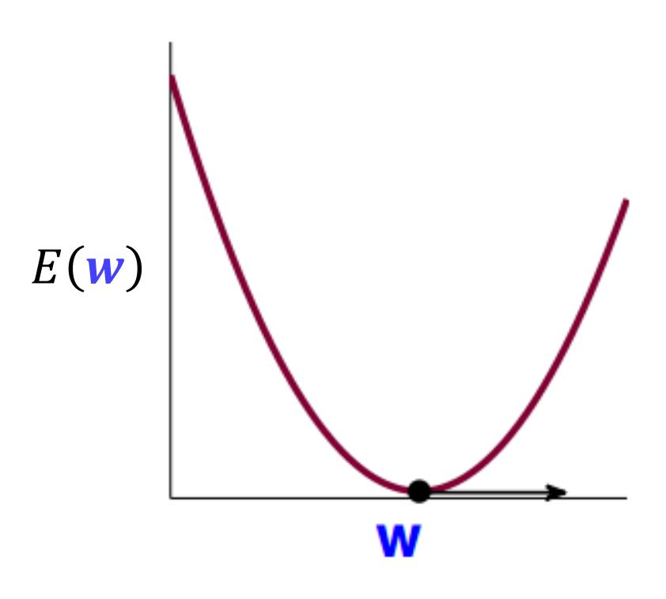

- **:** continuous, differentiable, convex
- Necessary condition of 'best' .

$$\nabla E(\mathbf{w}) = \begin{bmatrix} \frac{\partial E}{\partial w_0}(\mathbf{w}) \\ \frac{\partial E}{\partial w_1}(\mathbf{w}) \\ \vdots \\ \frac{\partial E}{\partial w_d}(\mathbf{w}) \end{bmatrix} = \begin{bmatrix} 0 \\ 0 \\ \vdots \\ 0 \end{bmatrix}$$
 Not possible to 'roll down'

Task: find the ∗ such that ∗ = 0

### The Gradient $\nabla E(\mathbf{w})$

$$\min_{\mathbf{w}} E(\mathbf{w}) = \|\mathbf{X}\mathbf{w} - \mathbf{y}\|^2 = (\mathbf{X}\mathbf{w} - \mathbf{y})^T (\mathbf{X}\mathbf{w} - \mathbf{y}) = \mathbf{w}^T \mathbf{X}^T \mathbf{X}\mathbf{w} - 2\mathbf{w}^T \mathbf{X}^T \mathbf{y} + \mathbf{y}^T \mathbf{y}$$

$$A \qquad b \qquad c$$

#### One w only

$$E(\mathbf{w}) = (a\mathbf{w}^2 - 2b\mathbf{w} + c)$$

$$\nabla E(\mathbf{w}) = 2a\mathbf{w} - 2b$$

#### Vector w

$$E(\mathbf{w}) = (\mathbf{w}^T A \mathbf{w} - 2 \mathbf{w}^T \mathbf{b} + c)$$

$$\nabla E(\mathbf{w}) = ?$$

### **Derivatives**

Differentiate
| scalar | vector | matrix
| scalar | scalar | vector | matrix
| vector | vector | matrix |
| matrix | matrix |

w.r.t

|  | scalar –scalar: e | e.g., $\frac{d}{dx}x^2 = 2x$ |
|--|-------------------|------------------------------|
|--|-------------------|------------------------------|

**scalar-vector:** e.g., f(x) is a scalar function of vector x

$$\mathbf{x} = \begin{bmatrix} x_1 \\ x_2 \\ \vdots \\ x_d \end{bmatrix} \qquad \frac{df}{d\mathbf{x}} = \begin{bmatrix} \frac{\sigma f}{\sigma x_1} \\ \vdots \\ \frac{\sigma f}{\sigma x_d} \end{bmatrix}$$

**scalar-matrix:** f(A) is a scalar function and  $m \times n$  matrix A

$$\frac{df}{d\mathbf{A}} = \begin{bmatrix} \frac{\sigma f}{\sigma a_{11}} & \dots & \frac{\sigma f}{\sigma a_{1d}} \\ \vdots & \ddots & \vdots \\ \frac{\sigma f}{\sigma a_{m1}} & \dots & \frac{\sigma f}{\sigma a_{mn}} \end{bmatrix}$$

https://en.wikipedia.org/wiki/Matrix\_calculus

### **Matrix Calculus**

- Numerator layout: lay out according to y and  $x^T$ . (Jacobian formulation)
- Denominator layout: lay out according to  $y^T$  and x. (Hessian formulation)

#### **Numerator layout:**

分子布局

$$\frac{\partial y}{\partial x} = \left[ \frac{\partial y}{\partial x_1} \frac{\partial y}{\partial x_2} \cdots \frac{\partial y}{\partial x_n} \right]$$

$$\frac{\partial \mathbf{y}}{\partial x} = \begin{bmatrix} \frac{\partial y_1}{\partial x} \\ \frac{\partial y_2}{\partial x} \\ \vdots \\ \frac{\partial y_n}{\partial x} \end{bmatrix}$$

#### **Denominator layout:**

分母布局

$$\frac{\partial y}{\partial x} = \begin{bmatrix} \frac{\partial y}{\partial x_1} \\ \frac{\partial y}{\partial x_2} \\ \vdots \\ \frac{\partial y}{\partial x_n} \end{bmatrix}$$

$$\frac{\partial \mathbf{y}}{\partial x} = \left[ \frac{\partial y_1}{\partial x} \frac{\partial y_2}{\partial x} \cdots \frac{\partial y_n}{\partial x} \right]$$

## **Commonly Used Derivatives**

$$\blacksquare \quad \frac{d}{dx}(Ax) = A^T$$

$$\blacksquare \quad \frac{dx}{dx} = I$$

◼ = =

◼ ( ) = ቊ + If **A** square If **A** symmetric

### The Gradient $\nabla E(\mathbf{w})$

$$\min_{\mathbf{w}} E(\mathbf{w}) = \|\mathbf{X}\mathbf{w} - \mathbf{y}\|^2 = (\mathbf{X}\mathbf{w} - \mathbf{y})^T (\mathbf{X}\mathbf{w} - \mathbf{y}) = \mathbf{w}^T \mathbf{X}^T \mathbf{X} \mathbf{w} - 2\mathbf{w}^T \mathbf{X}^T \mathbf{y} + \mathbf{y}^T \mathbf{y}$$

$$\mathbf{A} \qquad \mathbf{b} \qquad c$$

#### One w only

$$E(\mathbf{w}) = (a\mathbf{w}^2 - 2b\mathbf{w} + c)$$

$$\nabla E(\mathbf{w}) = 2a\mathbf{w} - 2b$$

#### Vector w

$$E(\mathbf{w}) = (\mathbf{w}^T A \mathbf{w} - 2 \mathbf{w}^T \mathbf{b} + c)$$

$$\nabla E(\mathbf{w}) = 2\mathbf{A}\mathbf{w} - 2\mathbf{b}$$

$$\nabla E(\mathbf{w}) = 2(\mathbf{X}^T \mathbf{X} \mathbf{w} - \mathbf{X}^T \mathbf{y})$$

### **Optimal Linear Regression Weights**

Task: find 
$$\mathbf{w}^*$$
 such that  $\nabla E(\mathbf{w}^*) = 2(\mathbf{X}^T \mathbf{X} \mathbf{w} - \mathbf{X}^T \mathbf{y}) = \mathbf{0}$ 

#### Invertible/positive definite $X^TX$

Unique solution

$$w^* = (X^T X)^{-1} X^T y$$

pseudo-inverse X†

Note: 
$$X^{\dagger}X = I$$
, but  $XX^{\dagger} \neq I$ 

If X is square and invertible,  $X^{\dagger} = X^{-1}$ .

#### Singular $X^T X$

- Define  $X^{\dagger}$  in other ways (e.g., SVD).
- Add regularization

• E.g., 
$$l_2$$
 norm  $\lambda > 0$ 

$$\min E(w) = \min ||Xw - y||^2 + \lambda ||w||^2$$

$$\nabla E(w^*) = 2(X^TXw + \lambda w - X^Ty) = 0$$

$$(X^TX + \lambda I)w = X^Ty$$
Invertible?

## **Linear Regression Algorithm**

**1. From , construct input matrix and output vector by**

$$\mathbf{X} = \begin{pmatrix} 1 & x_{11} & x_{12} & \cdots & x_{1d} \\ 1 & x_{21} & x_{22} & \cdots & x_{2d} \\ \vdots & \vdots & \vdots & \vdots & \vdots \\ 1 & x_{m1} & x_{m2} & \cdots & x_{md} \end{pmatrix} \in \mathbb{R}^{m \times (d+1)}, \ \mathbf{y} = \begin{pmatrix} y_1 \\ y_2 \\ \vdots \\ y_m \end{pmatrix} \in \mathbb{R}^m$$

**2. Calculate pseudo-inverse** 

$$\mathbf{X}^{\dagger} \in \mathbb{R}^{(d+1) \times m}$$

3. Return 
$$\mathbf{w}^* = \mathbf{X}^{\dagger} \mathbf{y} \in \mathbb{R}^{(d+1)}$$

Simple and efficient(?) with **good**  †

## **Logistic Regression**

## **Heart Attack Prediction Problem**

| age               | 40 years |
|-------------------|----------|
| gender            | male     |
| blood pressure    | 130/85   |
| cholesterol level | 240      |
| weight            | 70       |

Binary classification:

Ideal = +1 − 0.5 ∈ −1, +1

## **Heart Attack Prediction Problem**

| age               | 40 years |
|-------------------|----------|
| gender            | male     |
| blood pressure    | 130/85   |
| cholesterol level | 240      |
| weight            | 70       |

'Soft' Binary classification:

$$f(x) = p(+1|x) \in [0,1]$$

## Soft Binary classification:

Target function 
$$f(x) = p(+1|x) \in [0,1]$$

$$\begin{pmatrix} \mathbf{x}_1, y_1' &= 0.9 &= P(+1|\mathbf{x}_1) \\ \mathbf{x}_2, y_2' &= 0.2 &= P(+1|\mathbf{x}_2) \end{pmatrix}$$
  
 $\vdots$   
 $\begin{pmatrix} \mathbf{x}_N, y_N' &= 0.6 &= P(+1|\mathbf{x}_N) \end{pmatrix}$ 

#### Ideal data Actual data

$$\begin{pmatrix} \mathbf{x}_{1}, y_{1} &= \circ & \sim P(y|\mathbf{x}_{1}) \\ (\mathbf{x}_{2}, y_{2} &= \times & \sim P(y|\mathbf{x}_{2}) \end{pmatrix}$$

$$\vdots$$

$$\begin{pmatrix} \mathbf{x}_{N}, y_{N} &= \times & \sim P(y|\mathbf{x}_{N}) \end{pmatrix}$$

Same data as hard binary classification, different **target function**

## **Logistic Hypothesis**

| age               | 40 years |  |
|-------------------|----------|--|
| gender            | male     |  |
| blood pressure    | 130/85   |  |
| cholesterol level | 240      |  |

Let = (0, 1, 2,…, ) be the features of the patient, calculate a weighted 'risk score':

$$s = \sum_{j=0}^{d} w_j x_{ij} = \boldsymbol{w}^T \boldsymbol{x_i},$$

Convert the score to estimated probability by logistic function .

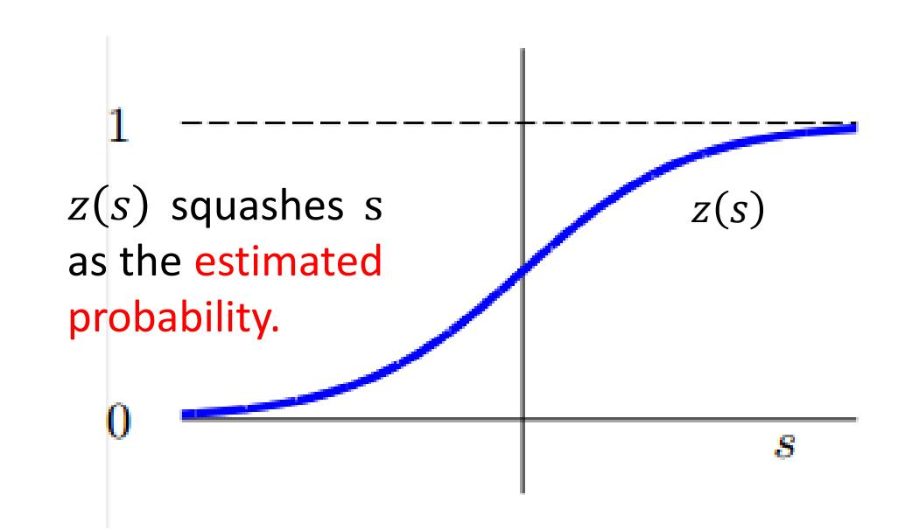

Logistic hypothesis: ℎ() = ()

## **Logistic Function**

$$z(s) = \frac{e^s}{1 + e^s} = \frac{1}{1 + e^{-s}}$$

smooth, monotonic, sigmoid function of

Bound 
$$z(s) \in [0,1]$$
  $z(-\infty) = 0$   $z(0) = 0.5$   $z(\infty) = 1$  Symmetric  $1-z(s)=z(-s)$  Gradient  $z'(s)=z(s)(1-z(s))$ 

Logistic regression use ℎ() = () to approximate the target = +1

#### **Exercise**

#### Logistic Regression and Binary Classification

Consider any logistic hypothesis  $h(\mathbf{x}) = \frac{1}{1 + \exp(-\mathbf{w}^T \mathbf{x})}$  that approximates  $P(y|\mathbf{x})$ . 'Convert'  $h(\mathbf{x})$  to a binary classification prediction by taking sign  $\left(h(\mathbf{x}) - \frac{1}{2}\right)$ . What is the equivalent formula for the binary classification prediction?

- $\mathbf{1}$  sign  $(\mathbf{w}^T\mathbf{x} \frac{1}{2})$
- 2 sign  $(\mathbf{w}^T \mathbf{x})$
- 3 sign  $\left(\mathbf{w}^T\mathbf{x} + \frac{1}{2}\right)$
- 4 none of the above

#### **Exercise**

#### Logistic Regression and Binary Classification

Consider any logistic hypothesis  $h(\mathbf{x}) = \frac{1}{1 + \exp(-\mathbf{w}^T \mathbf{x})}$  that approximates  $P(y|\mathbf{x})$ . 'Convert'  $h(\mathbf{x})$  to a binary classification prediction by taking sign  $\left(h(\mathbf{x}) - \frac{1}{2}\right)$ . What is the equivalent formula for the binary classification prediction?

- $\bigcirc$  sign  $(\mathbf{w}^T\mathbf{x} \frac{1}{2})$
- 3 sign  $\left(\mathbf{w}^T\mathbf{x} + \frac{1}{2}\right)$
- 4 none of the above

#### Reference Answer: (2)

When  $\mathbf{w}^T \mathbf{x} = 0$ ,  $h(\mathbf{x})$  is exactly  $\frac{1}{2}$ . So thresholding  $h(\mathbf{x})$  at  $\frac{1}{2}$  is the same as thresholding  $(\mathbf{w}^T \mathbf{x})$  at 0.

## **Linear Models**

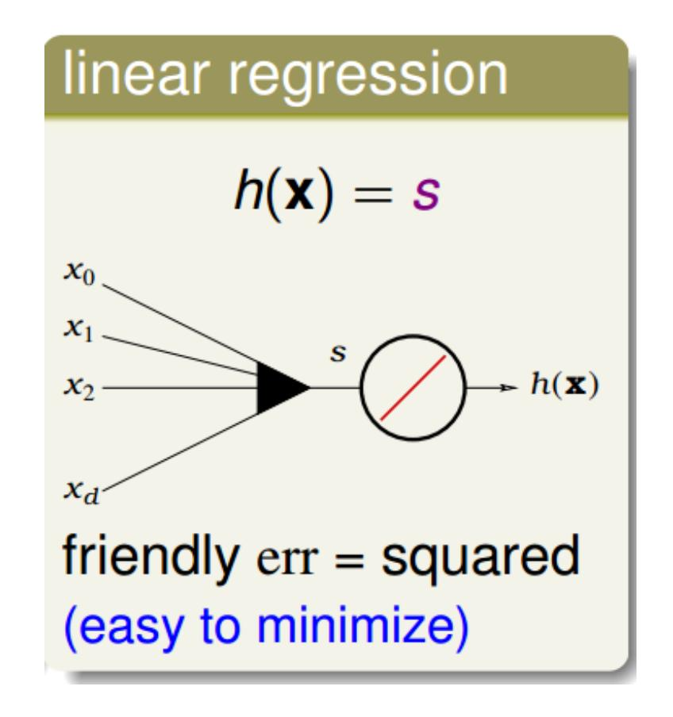

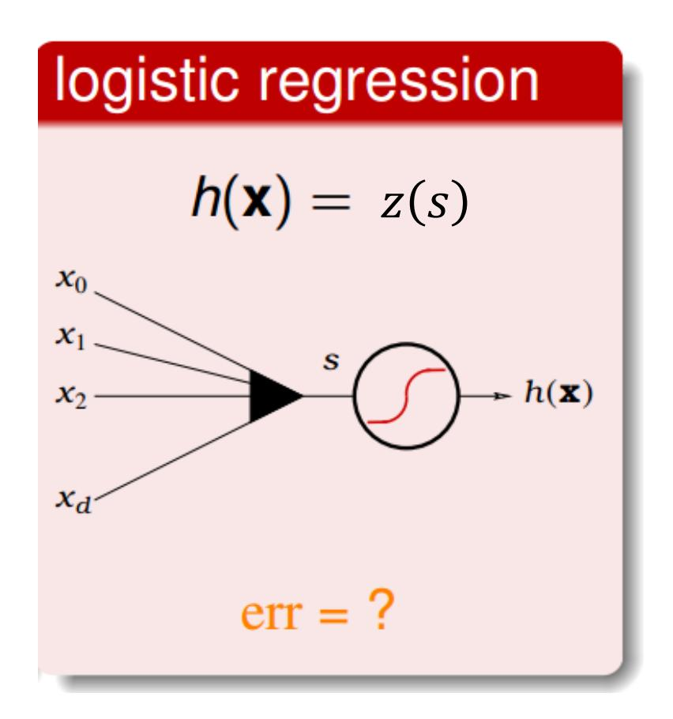

How to define the cost (error) function for logistic regression?

## **Maximum-Likelihood Estimation**

Given a dataset = {1, 2, … , }, where the samples are drawn independently from identical distribution (|), estimate parameters .

ML estimate parameters maximizes (|)

is an i.i.d set

$$\widehat{\boldsymbol{\theta}} = \arg \max_{\boldsymbol{\theta}} p(\mathcal{D}|\boldsymbol{\theta})$$

$$p(\mathcal{D}|\boldsymbol{\theta})$$
  $p(\mathcal{D}|\boldsymbol{\theta}) = \prod_{k=1}^{n} p(x_k|\boldsymbol{\theta})$ 

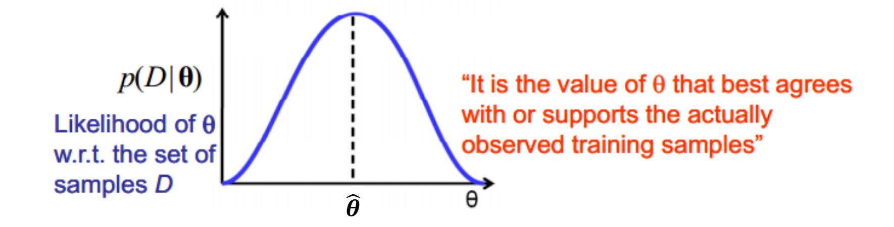

## **Logistic Regression--** ∈ {0,1}

Consider 
$$\mathcal{D} = \{(x_1, +), (x_2, -), ..., (x_m, -)\}$$

#### Likelihood that ℎ generates

$$p(\mathbf{x}_1)h(\mathbf{x}_1)$$

$$p(\mathbf{x}_2)(1 - h(\mathbf{x}_2))$$

$$\vdots$$

$$p(\mathbf{x}_m)(1 - h(\mathbf{x}_m))$$

• Target function:

$$f(x) = p(+1|x)$$

• If ℎ ≈ , then likelihood (ℎ) ≈ that using ()

## **Likelihood of Logistic Regression**

Goal: max ℎ ℎ(ℎ) ℎ ℎ = ෑ =1 ()(|)

Consider 
$$\mathcal{D} = \{(x_1, +), (x_2, -), ..., (x_m, -)\}$$

$$likelihood(h) = \prod_{i=1}^{m} p(\mathbf{x}_i) p(\mathbf{y}_i | \mathbf{x}_i)$$
$$= p(\mathbf{x}_1) h(\mathbf{x}_1) p(\mathbf{x}_2) (1 - h(\mathbf{x}_2)) \cdots p(\mathbf{x}_m) (1 - h(\mathbf{x}_m))$$

## **Likelihood of Logistic Regression**

Goal: 
$$arg \max_{h} likelihood(h)$$
  $likelihood(h) = \prod_{i=1}^{m} p(x_i)p(y|x_i)$ 

Consider 
$$\mathcal{D} = \{(x_1, +), (x_2, -), ..., (x_m, -)\}$$

$$\begin{aligned} likelihood(h) &= \prod_{i=1}^{m} p(\mathbf{x}_i) p(y_i | \mathbf{x}_i) \\ &= p(\mathbf{x}_1) h(\mathbf{x}_1) p(\mathbf{x}_2) (1 - h(\mathbf{x}_2)) \cdots p(\mathbf{x}_m) (1 - h(\mathbf{x}_m)) \end{aligned}$$

We remove all the which remains the same for all the hypothesis ℎ .

## **Likelihood of Logistic Regression**

$$likelihood(\mathbf{h}) = \prod_{i=1}^{m} p(\mathbf{x_i}) p(y_i | \mathbf{x_i}) \propto \prod_{i=1}^{m} p(y_i | \mathbf{x_i})$$

$$p(y_i|x_i) = \begin{cases} h(x_i) & \text{for } y_i = 1\\ 1 - h(x_i) & \text{for } y_i = 0 \end{cases} \iff p(y_i|x_i) = h(x_i)^{y_i} (1 - h(x_i))^{(1 - y_i)}$$
Bernoulli distribution

$$likelihood(h) \propto \prod_{i=1}^{m} p(y_i|x_i) = \prod_{i=1}^{m} h(x_i)^{y_i} (1 - h(x_i))^{(1-y_i)}$$

### Log-Likelihood of Logistic Regression

**Negative Log-likelihood** 

$$\min_{h} E(h) = \sum_{i=1}^{m} -(y_i \ln h(x_i) + (1 - y_i) \ln(1 - h(x_i)))$$
Cross-entropy loss

**Cross-entropy** 

$$H(p,q) = -\sum_{x} p(x) \log(q(x)) \qquad \begin{array}{l} p \in \{y, 1-y\} \\ q \in \{h(x), 1-h(x)\} \end{array}$$

Negative Log-likelihood 
$$\min_{\mathbf{w}} \sum_{i=1}^{m} \left[ -y_i ln \left( \frac{1}{1 + e^{-\mathbf{w}^T x_i}} \right) - (1 - y_i) ln \left( \frac{1}{1 + e^{\mathbf{w}^T x_i}} \right) \right]$$

$$\min_{\mathbf{w}} \sum_{i=1}^{m} \left[ -y_i \mathbf{w}^T \mathbf{x}_i + \ln(1 + e^{\mathbf{w}^T \mathbf{x}_i}) \right]$$

## **Minimize**

$$\min_{\mathbf{w}} E(\mathbf{w}) = \sum_{i=1}^{m} \left[ -y_i \mathbf{w}^T \mathbf{x}_i + ln(1 + e^{\mathbf{w}^T \mathbf{x}_i}) \right]$$

Cross-entropy loss

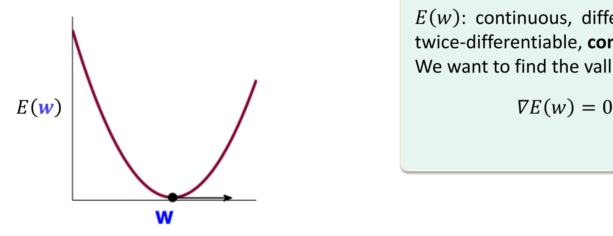

 : continuous, differentiable, twice-differentiable, **convex** We want to find the valley

$$\nabla E(w) = 0$$

#### **Matrix Calculus**

$$\min_{\mathbf{w}} E(\mathbf{w}) = \sum_{i=1}^{m} \left[ -y_i \mathbf{w}^T \mathbf{x}_i + \ln(1 + e^{\mathbf{w}^T \mathbf{x}_i}) \right]$$

Identities: scalar-by-vector  $\frac{\partial y}{\partial \mathbf{x}} = \nabla_{\mathbf{x}} y$ 

| OX.                                                              |                                                                                                                                          |                                                                                                                                                                                                                                                                             |                                                                                                                                                                                                                                                              |  |
|------------------------------------------------------------------|------------------------------------------------------------------------------------------------------------------------------------------|-----------------------------------------------------------------------------------------------------------------------------------------------------------------------------------------------------------------------------------------------------------------------------|--------------------------------------------------------------------------------------------------------------------------------------------------------------------------------------------------------------------------------------------------------------|--|
| Condition                                                        | Expression                                                                                                                               | Numerator layout, i.e. by x T ; result is row vector                                                                                                                                                                                                          | Denominator layout, i.e. by x; result is column vector                                                                                                                                                                                                       |  |
| <i>a</i> is not a function of <b>x</b>                           | $\frac{\partial a}{\partial \mathbf{x}} =$                                                                                               | <b>0</b> ™ [4]                                                                                                                                                                                                                                                   |                                                                                                                                                                                                                                                              |  |
| <i>a</i> is not a function of $\mathbf{x}$ , $u = u(\mathbf{x})$ | $\frac{\partial au}{\partial \mathbf{x}} =$                                                                                              | $a\frac{\partial u}{\partial \mathbf{x}}$                                                                                                                                                                                                                                   |                                                                                                                                                                                                                                                              |  |
| $u = u(\mathbf{x}), \ v = v(\mathbf{x})$                         | $\frac{\partial (u+v)}{\partial \mathbf{x}}=$                                                                                            | $\frac{\partial u}{\partial \mathbf{x}} + \frac{\partial v}{\partial \mathbf{x}}$                                                                                                                                                                                           |                                                                                                                                                                                                                                                              |  |
| $u = u(\mathbf{x}), \ v = v(\mathbf{x})$                         | $\frac{\partial uv}{\partial \mathbf{x}} =$                                                                                              | $u\frac{\partial v}{\partial \mathbf{x}} + v\frac{\partial u}{\partial \mathbf{x}}$                                                                                                                                                                                         |                                                                                                                                                                                                                                                              |  |
| $u = u(\mathbf{x})$                                              | $\frac{\partial g(u)}{\partial \mathbf{x}} =$                                                                                            | $\frac{\partial g(u)}{\partial u} \frac{\partial u}{\partial \mathbf{x}}$                                                                                                                                                                                                   |                                                                                                                                                                                                                                                              |  |
| $u = u(\mathbf{x})$                                              | $\frac{\partial f(g(u))}{\partial \mathbf{x}} =$                                                                                         | $\frac{\partial f(g)}{\partial g} \frac{\partial g(u)}{\partial u} \frac{\partial u}{\partial \mathbf{x}}$                                                                                                                                                                  |                                                                                                                                                                                                                                                              |  |
| u = u(x), v = v(x)                                               | $\frac{\partial (\mathbf{u} \cdot \mathbf{v})}{\partial \mathbf{x}} = \frac{\partial \mathbf{u}^\top \mathbf{v}}{\partial \mathbf{x}} =$ | $\mathbf{u}^{\top} \frac{\partial \mathbf{v}}{\partial \mathbf{x}} + \mathbf{v}^{\top} \frac{\partial \mathbf{u}}{\partial \mathbf{x}}$ • assumes numerator layout of $\frac{\partial \mathbf{u}}{\partial \mathbf{x}}$ , $\frac{\partial \mathbf{v}}{\partial \mathbf{x}}$ | $\frac{\partial \mathbf{u}}{\partial \mathbf{x}} \mathbf{v} + \frac{\partial \mathbf{v}}{\partial \mathbf{x}} \mathbf{u}$ • assumes denominator layout of $\frac{\partial \mathbf{u}}{\partial \mathbf{x}}, \frac{\partial \mathbf{v}}{\partial \mathbf{x}}$ |  |

$$\nabla E(\mathbf{w}) = \sum_{i=1}^{m} \left[ -y_i \mathbf{x}_i + \frac{e^{\mathbf{w}^T \mathbf{x}_i}}{1 + e^{\mathbf{w}^T \mathbf{x}_i}} \mathbf{x}_i \right] = \sum_{i=1}^{m} \left[ z(\mathbf{w}^T \mathbf{x}_i) - y_i \right] \mathbf{x}_i = 0$$

- $\nabla E(w)$  is a non-linear equation of w
  - > It is hard to derive the closed form solution. :-(

## **Gradient**

$$\nabla E(\mathbf{w}) = \sum_{i=1}^{m} \left[ -y_i \mathbf{x}_i + \frac{e^{\mathbf{w}^T \mathbf{x}_i}}{1 + e^{\mathbf{w}^T \mathbf{x}_i}} \mathbf{x}_i \right] = \sum_{i=1}^{m} \left[ z(\mathbf{w}^T \mathbf{x}_i) - y_i \right] \mathbf{x}_i = 0$$

• Apply the iterative optimization to the logistic regression.

## **Iterative Optimization**

## **Optimization Methods**

- Optimization: either minimize or maximize some function () by altering .
- In most cases, optimization refers to the minimization of .

**Maximization Minimization** −

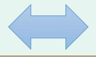

- : objective function, cost function, loss function, error function.
- The value that minimize : ∗ = arg min .

## **Optimization Methods**

### • **Deterministic Optimization**

• The data for the given problem are known accurately.

### • **Stochastic Optimization**

• Refers to a collection of methods for minimizing or maximizing an objective function when randomness is present.

### **Deterministic Optimization**

- First-order methods: methods that use only the gradient.
- Second-order methods: methods that also use the Hessian matrix.

$$\boldsymbol{H}(f)_{i,j} = \frac{\partial^2}{\partial x_i \partial x_j} f(\boldsymbol{x})$$

: multiple input dimensions.

## **Taylor Approximation**

#### **Expansion at**

$$f(x) = \frac{f(x_0)}{0!} + \frac{f'(x_0)}{1!}(x - x_0) + \frac{f''(x_0)}{2!}(x - x_0)^2 + \dots + \frac{f^{(n)}(x_0)}{n!}(x - x_0)^n + R_n(x)^n$$

#### **Examples**

$$e^{x} = 1 + \frac{1}{1!}x + \frac{1}{2!}x^{2} + \frac{1}{3!}x^{3} + o(x^{3})$$

$$\ln(1+x) = x - \frac{1}{2}x^{2} + \frac{1}{3}x^{3} + o(x^{3})$$

$$\sin x = x - \frac{1}{3!}x^{3} + \frac{1}{5!}x^{5} + o(x^{5})$$

## **Gradient Descent [Cauchy 1847]**

• Motivation: to minimize the local first-order Taylor approximation of

$$\min_{x} f(x) \approx \min_{x} f(x_t) + \nabla f(x_t)^T (x - x_t)$$

• Update rule:

$$x_{t+1} = x_t - \eta_t \nabla f(x_t)$$

Where > 0 is the step-size (learning rate).

## **Interpretation**

• Reduce () by moving in small steps with opposite sign of the derivative.

• Update rule:

$$x_{t+1} = x_t - \eta_t \nabla f(x_t)$$

• Critical/stationary points: Points where ′ = 0 驻点

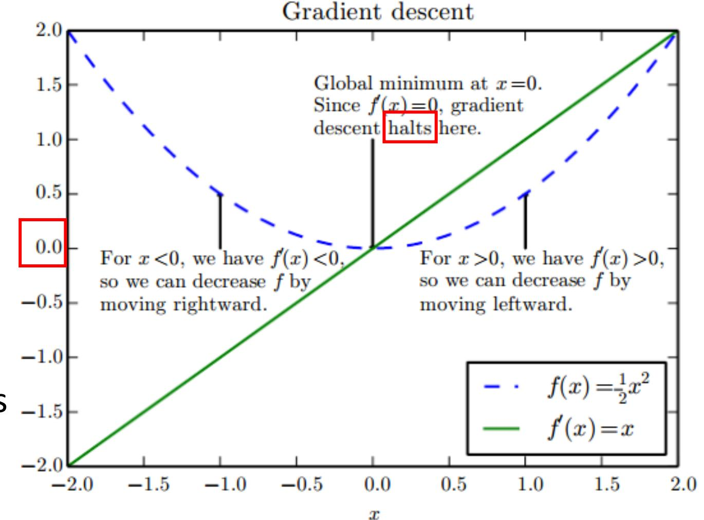

An illustration of gradient descent.

## **Interpretation**

• At each iteration, consider the expansion

$$f(x) \approx \left| f(x_t) + \nabla f(x_t)^T (x - x_t) \right| + \frac{1}{2\eta_t} \|x - x_t\|^2$$
 Linear approximation of  $f$  Proximity term with weight  $\frac{1}{2\eta_t}$ 

• Quadratic approximation, replacing usual 2 by 1 :

$$x_{t+1} = x_t - \eta_t \nabla f(x_t)$$

## **Interpretation**

$$f(x) \approx f(x_t) + \nabla f(x_t)^T (x - x_t) + \frac{1}{2\eta_t} ||x - x_t||^2$$

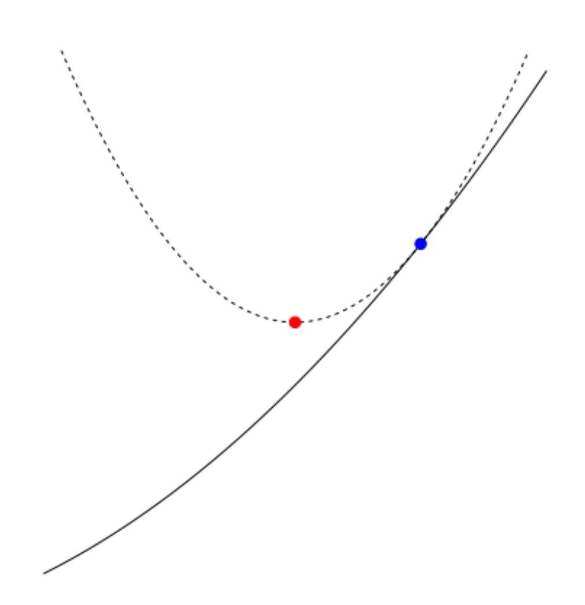

Blue point is , red point is +1.

## **Global VS Local Minimum**

- Global minimum: a point that obtains the absolute lowest value of ().
- Local minimum: a point where () is lower than at all neighboring points.
- Saddle points: some critical points are neither maxima or minima. 鞍点

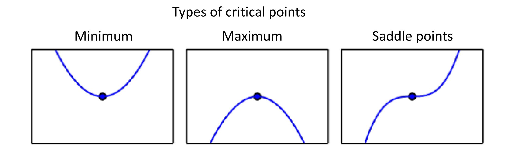

## **Global VS Local Minimum**

- Global minimum: a point that obtains the absolute lowest value of ().
- Local minimum: a point where () is higher than at all neighboring points.
- Saddle points: some critical points are neither maxima or minima. 鞍点

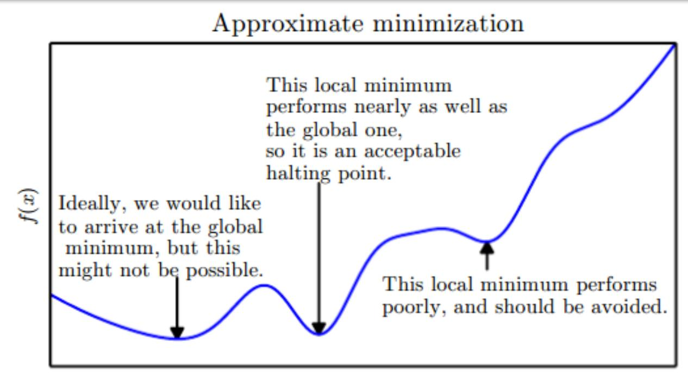

## **Different Starting Points**

• Gradient Descent with different starting points are illustrated in different colors.

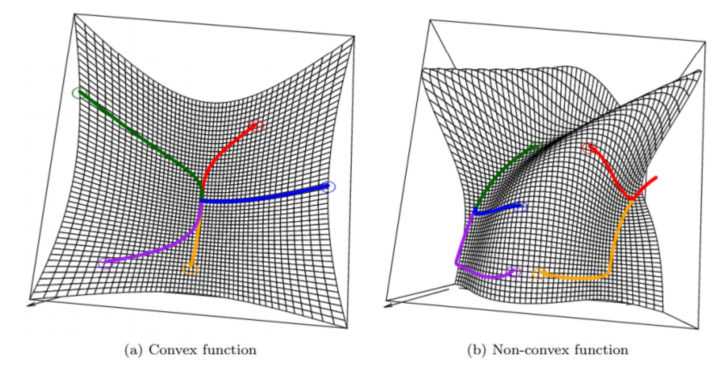

- (a): Strictly convex function: Converge to the global optimum.
- (b): Non-convex function: Different paths may end up at different local optima.

## **Gradient Descent [Cauchy 1847]**

$$x_{t+1} = x_t - \eta_t \nabla f(x_t)$$

- Gradient Descent requires a step size controlling the amount of gradient updated to the current point at each iteration.
- It is naïve to set = for all iterations.

How to choose step sizes?

Considering 
$$f(x) = (10x_1^2 + x_2^2)/2$$

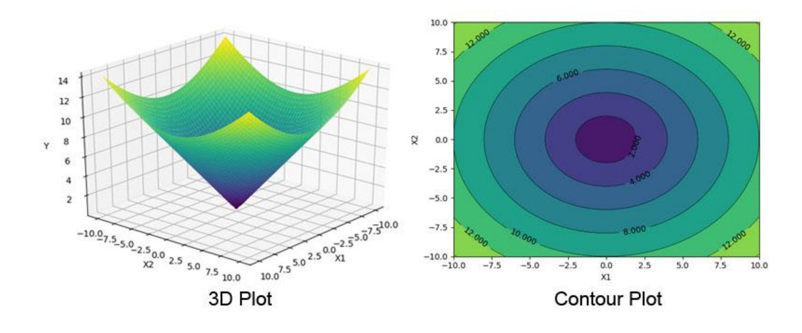

Considering 
$$f(x) = (10x_1^2 + x_2^2)/2$$

If  $\eta$  is too big, can lead to divergence.

- The learning function oscillates away from the optimal point.
- As shown, it oscillates after 8 steps.

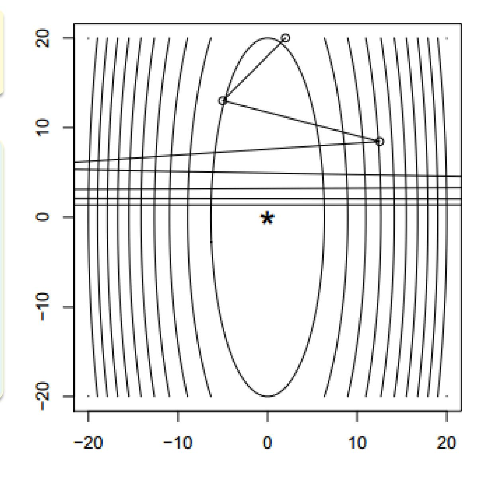

Considering 
$$f(x) = (10x_1^2 + x_2^2)/2$$

If  $\eta$  is too small, takes longer time for the function to converge.

As shown, GD after 100 steps.

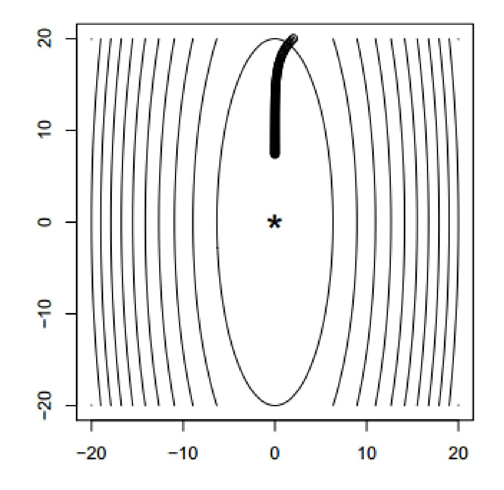

Considering 
$$f(x) = (10x_1^2 + x_2^2)/2$$

Same example, gradient descent after 40 appropriately sized steps.

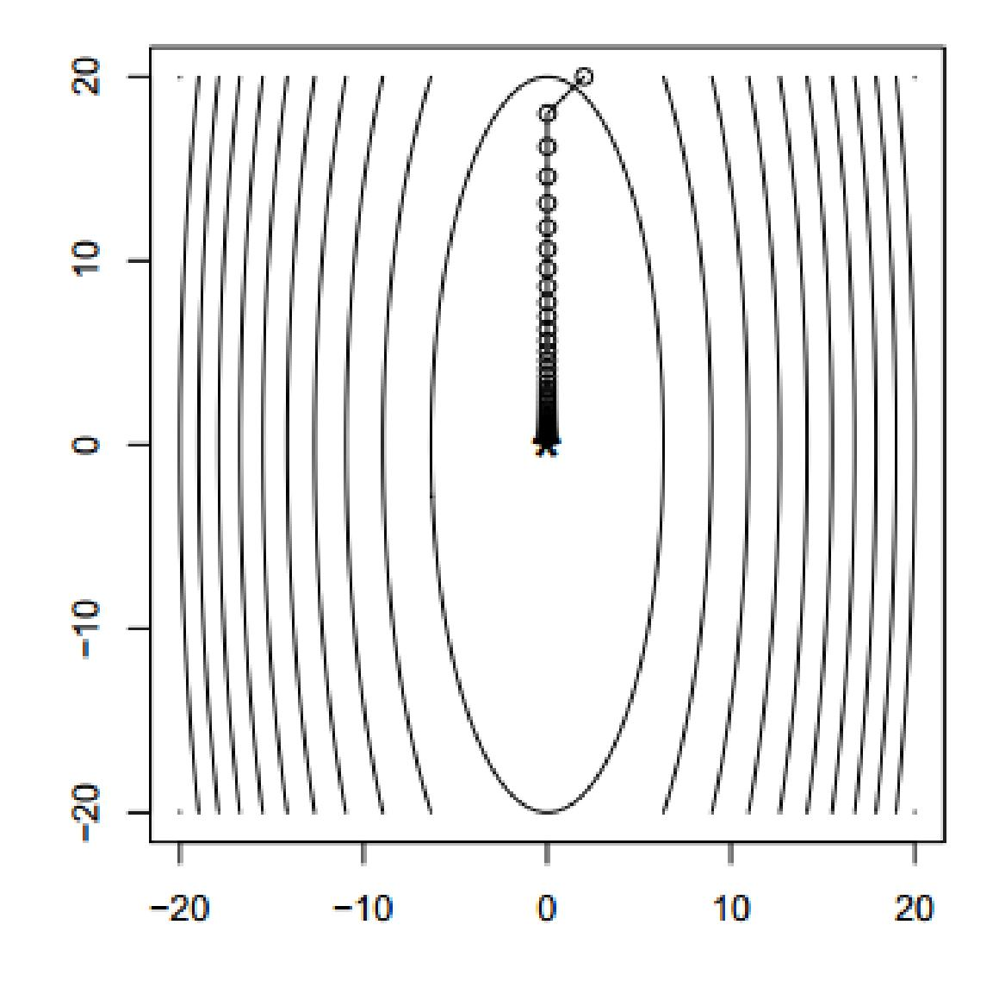

Considering 
$$f(x) = x^2/2$$

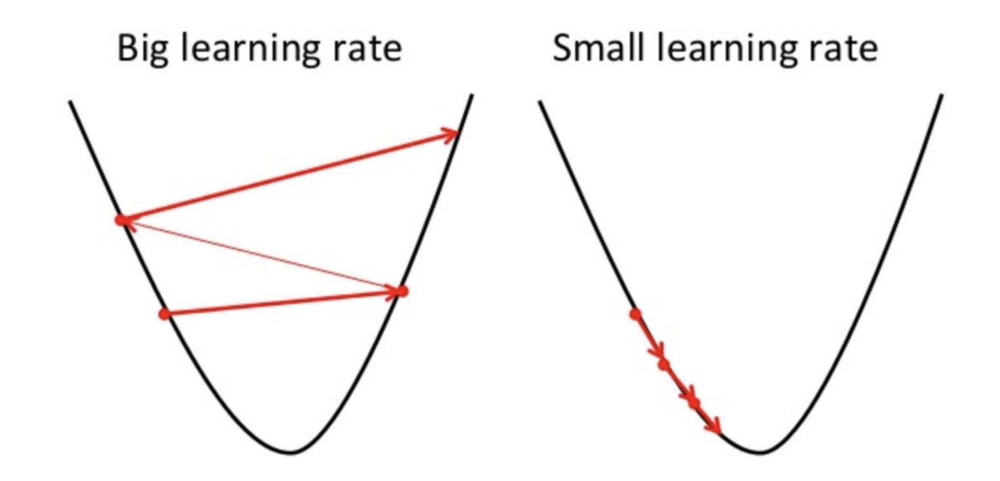

### **Deterministic Optimization**

- First-order methods: methods that use only the gradient.
- Second-order methods: methods that also use the Hessian matrix.

Suppose  $f: \mathbb{R}^n \to \mathbb{R}$  is a function taking as input a vector  $x \in \mathbb{R}^n$  and outputting a scalar  $f(x) \in \mathbb{R}$ ; if all second partial derivatives of f exist and are continuous over the domain of the function, then the Hessian matrix H of f is a square  $n \times n$  matrix, usually defined as follows.

$$H = \nabla^2 f = \begin{bmatrix} \frac{\partial^2 f}{\partial x_1^2} & \frac{\partial^2 f}{\partial x_1 x_2} & \cdots & \frac{\partial^2 f}{\partial x_1 x_n} \\ \frac{\partial^2 f}{\partial x_2 x_1} & \frac{\partial^2 f}{\partial x_2^2} & \cdots & \frac{\partial^2 f}{\partial x_2 x_n} \\ \vdots & \vdots & \ddots & \vdots \\ \frac{\partial^2 f}{\partial x_n x_1} & \frac{\partial^2 f}{\partial x_n x_2} & \cdots & \frac{\partial^2 f}{\partial x_n^2} \end{bmatrix} \quad \text{, or} \quad H_{ij} = \frac{\partial^2 f}{\partial x_i x_j}$$

• Motivation: to minimize the local second-order Taylor approximation of .

$$\min_{\mathbf{x}} f(\mathbf{x}) \approx \min_{\mathbf{x}} f(\mathbf{x}_t) + \nabla f(\mathbf{x}_t)^T (\mathbf{x} - \mathbf{x}_t) + \frac{1}{2} (\mathbf{x} - \mathbf{x}_t)^T \nabla^2 f(\mathbf{x}_t) (\mathbf{x} - \mathbf{x}_t)^T \nabla^2 f(\mathbf{x}_t) (\mathbf{x} - \mathbf{x}_t)^T \nabla^2 f(\mathbf{x}_t) (\mathbf{x} - \mathbf{x}_t)^T \nabla^2 f(\mathbf{x}_t) (\mathbf{x} - \mathbf{x}_t)^T \nabla^2 f(\mathbf{x}_t) (\mathbf{x} - \mathbf{x}_t)^T \nabla^2 f(\mathbf{x}_t) (\mathbf{x} - \mathbf{x}_t)^T \nabla^2 f(\mathbf{x}_t) (\mathbf{x} - \mathbf{x}_t)^T \nabla^2 f(\mathbf{x}_t) (\mathbf{x} - \mathbf{x}_t)^T \nabla^2 f(\mathbf{x}_t) (\mathbf{x} - \mathbf{x}_t)^T \nabla^2 f(\mathbf{x}_t) (\mathbf{x} - \mathbf{x}_t)^T \nabla^2 f(\mathbf{x}_t) (\mathbf{x} - \mathbf{x}_t)^T \nabla^2 f(\mathbf{x}_t) (\mathbf{x} - \mathbf{x}_t)^T \nabla^2 f(\mathbf{x}_t) (\mathbf{x} - \mathbf{x}_t)^T \nabla^2 f(\mathbf{x}_t) (\mathbf{x} - \mathbf{x}_t)^T \nabla^2 f(\mathbf{x}_t) (\mathbf{x} - \mathbf{x}_t)^T \nabla^2 f(\mathbf{x}_t) (\mathbf{x} - \mathbf{x}_t)^T \nabla^2 f(\mathbf{x}_t) (\mathbf{x} - \mathbf{x}_t)^T \nabla^2 f(\mathbf{x}_t) (\mathbf{x} - \mathbf{x}_t)^T \nabla^2 f(\mathbf{x}_t) (\mathbf{x} - \mathbf{x}_t)^T \nabla^2 f(\mathbf{x}_t) (\mathbf{x} - \mathbf{x}_t)^T \nabla^2 f(\mathbf{x}_t) (\mathbf{x} - \mathbf{x}_t)^T \nabla^2 f(\mathbf{x}_t) (\mathbf{x} - \mathbf{x}_t)^T \nabla^2 f(\mathbf{x}_t) (\mathbf{x} - \mathbf{x}_t)^T \nabla^2 f(\mathbf{x}_t) (\mathbf{x} - \mathbf{x}_t)^T \nabla^2 f(\mathbf{x}_t) (\mathbf{x} - \mathbf{x}_t)^T \nabla^2 f(\mathbf{x}_t) (\mathbf{x} - \mathbf{x}_t)^T \nabla^2 f(\mathbf{x}_t) (\mathbf{x} - \mathbf{x}_t)^T \nabla^2 f(\mathbf{x}_t) (\mathbf{x} - \mathbf{x}_t)^T \nabla^2 f(\mathbf{x}_t) (\mathbf{x} - \mathbf{x}_t)^T \nabla^2 f(\mathbf{x}_t) (\mathbf{x} - \mathbf{x}_t)^T \nabla^2 f(\mathbf{x}_t) (\mathbf{x} - \mathbf{x}_t)^T \nabla^2 f(\mathbf{x}_t) (\mathbf{x} - \mathbf{x}_t)^T \nabla^2 f(\mathbf{x}_t) (\mathbf{x} - \mathbf{x}_t)^T \nabla^2 f(\mathbf{x}_t) (\mathbf{x} - \mathbf{x}_t)^T \nabla^2 f(\mathbf{x}_t) (\mathbf{x} - \mathbf{x}_t)^T \nabla^2 f(\mathbf{x}_t) (\mathbf{x} - \mathbf{x}_t)^T \nabla^2 f(\mathbf{x}_t) (\mathbf{x} - \mathbf{x}_t)^T \nabla^2 f(\mathbf{x}_t) (\mathbf{x} - \mathbf{x}_t)^T \nabla^2 f(\mathbf{x} - \mathbf{x}_t)^T \nabla^2 f(\mathbf{x} - \mathbf{x}_t)^T \nabla^2 f(\mathbf{x} - \mathbf{x}_t)^T \nabla^2 f(\mathbf{x} - \mathbf{x}_t)^T \nabla^2 f(\mathbf{x} - \mathbf{x}_t)^T \nabla^2 f(\mathbf{x} - \mathbf{x}_t)^T \nabla^2 f(\mathbf{x} - \mathbf{x}_t)^T \nabla^2 f(\mathbf{x} - \mathbf{x}_t)^T \nabla^2 f(\mathbf{x} - \mathbf{x}_t)^T \nabla^2 f(\mathbf{x} - \mathbf{x}_t)^T \nabla^2 f(\mathbf{x} - \mathbf{x}_t)^T \nabla^2 f(\mathbf{x} - \mathbf{x}_t)^T \nabla^2 f(\mathbf{x} - \mathbf{x}_t)^T \nabla^2 f(\mathbf{x} - \mathbf{x}_t)^T \nabla^2 f(\mathbf{x} - \mathbf{x}_t)^T \nabla^2 f(\mathbf{x} - \mathbf{x}_t)^T \nabla^2 f(\mathbf{x} - \mathbf{x}_t)^T \nabla^2 f(\mathbf{x} - \mathbf{x}_t)^T \nabla^2 f(\mathbf{x} - \mathbf{x}_t)^T \nabla^2 f(\mathbf{x} - \mathbf{x}_t)^T \nabla^2 f(\mathbf{x} - \mathbf{x}_t)^T \nabla^2 f(\mathbf{x} - \mathbf{x}_t)^T \nabla^2 f(\mathbf{x} - \mathbf{x}_t)^T \nabla^2 f(\mathbf{x} - \mathbf{x}_t)^T \nabla^2 f(\mathbf{x} - \mathbf{x}_t)^T \nabla^2 f(\mathbf{x} - \mathbf{x}_t)^T \nabla^2 f(\mathbf{x} - \mathbf{x}_t)^T \nabla^2 f(\mathbf{x} - \mathbf{x}_t)^T \nabla^2 f(\mathbf{x} - \mathbf{x}_t)^T \nabla^2 f(\mathbf{x} - \mathbf{x}_t)^T \nabla^2 f(\mathbf{x} - \mathbf{x}_t)^T \nabla^2 f(\mathbf{x} - \mathbf{x}$$

• Take the derivative of on both side, we have,

$$\frac{df(\mathbf{x})}{d\mathbf{x}} = \nabla f(\mathbf{x}_t) + \nabla^2 f(\mathbf{x}_t)(\mathbf{x} - \mathbf{x}_t) = \mathbf{0}$$

• Update rule: suppose 2 is positive definite,

$$\boldsymbol{x} = \boldsymbol{x}_t - [\nabla^2 f(\boldsymbol{x}_t)]^{-1} \nabla f(\boldsymbol{x}_t)$$

• Motivation: to minimize the local second-order Taylor approximation of .

$$\min_{x} f(x) \approx \min_{x} f(x_t) + f'(x_t)(x - x_t) + \frac{1}{2} f''(x_t)(x - x_t)^2$$

• Take the derivative of on both side, we have,

$$f'(x) = f'(x_t) + f''(x_t)(x - x_t) = 0$$

• Update rule: suppose ′′ ≠ 0,

$$x = x_t - \frac{f'(x_t)}{f''(x_t)}$$

• In numerical analysis, Newton's Methods is to find successively better approximations to the roots of a real-valued function, (i. e, () = 0).

$$z = z_t - \frac{f(z_t)}{f'(z_t)}$$

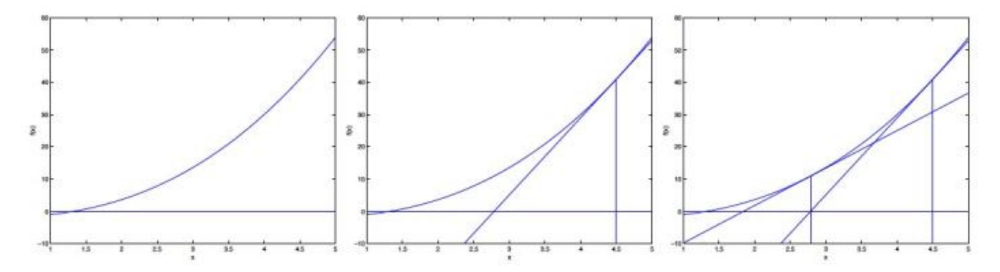

• In optimization, we want to find the stationary point ′ = 0, i.e.,

$$x = x_t - \frac{f'(x_t)}{f''(x_t)}$$

#### • **Advantage:**

- ➢ More accurate local approximation of the objective,
- ➢ The convergence is much faster.

#### • **Disadvantage:**

- ➢ Need to compute the second derivatives
- ➢ Need to compute the inverse of Hessian (time/storage consuming)

## **Go back to logistic regression**

$$\nabla E(\mathbf{w}) = \sum_{i=1}^{m} \left[ -y_{i} \mathbf{x}_{i} + \frac{e^{\mathbf{w}^{T} \mathbf{x}_{i}}}{1 + e^{\mathbf{w}^{T} \mathbf{x}_{i}}} \mathbf{x}_{i} \right] = \sum_{i=1}^{m} \left[ z(\mathbf{w}^{T} \mathbf{x}_{i}) - y_{i} \right] \mathbf{x}_{i} = \mathbf{X}^{T} (\widehat{\mathbf{y}} - \mathbf{y})$$

$$\mathbf{X} = \begin{pmatrix} 1 & x_{11} & x_{12} & \cdots & x_{1d} \\ 1 & x_{21} & x_{22} & \cdots & x_{2d} \\ \vdots & \vdots & \vdots & \vdots & \vdots \\ 1 & x_{m1} & x_{m2} & \cdots & x_{md} \end{pmatrix} = \begin{pmatrix} \mathbf{x}_{1}^{T} \\ \mathbf{x}_{2}^{T} \\ \vdots \\ \mathbf{x}_{m}^{T} \end{pmatrix} \in \mathbb{R}^{m \times (d+1)}, \, \widehat{\mathbf{y}} = \begin{pmatrix} z(\mathbf{w}^{T} \mathbf{x}_{1}) \\ z(\mathbf{w}^{T} \mathbf{x}_{2}) \\ \vdots \\ z(\mathbf{w}^{T} \mathbf{x}_{m}) \end{pmatrix} \in \mathbb{R}^{m}, \, \mathbf{y} = \begin{pmatrix} y_{1} \\ y_{2} \\ \vdots \\ y_{m} \end{pmatrix} \in \mathbb{R}^{m}$$

Apply the Newton's method to the logistic regression,

$$\boldsymbol{x} = \boldsymbol{x}_t - [\nabla^2 f(\boldsymbol{x}_t)]^{-1} \nabla f(\boldsymbol{x}_t) \quad \Longrightarrow \quad \boldsymbol{w} = \boldsymbol{w}_t - \boldsymbol{H}(\boldsymbol{w}_t)^{-1} \nabla E(\boldsymbol{w}_t)$$

• Need to solve,  $H = \nabla^2 E(\mathbf{w}) = \frac{\nabla E(\mathbf{w})}{\nabla \mathbf{w}} = ?$ 

$$\nabla E(\mathbf{w}) = \sum_{i=1}^{m} [z(\mathbf{w}^T \mathbf{x}_i) - y_i] \mathbf{x}_i$$

$$H = \nabla^2 E(\mathbf{w}) = \frac{\nabla E(\mathbf{w})}{\nabla \mathbf{w}}$$

$$\boldsymbol{H} = \sum_{i=1}^{m} \frac{\nabla \{z(\boldsymbol{w}^T \boldsymbol{x}_i) \boldsymbol{x}_i\}}{\nabla \boldsymbol{w}}$$

Identities: vector-by-vector  $\frac{\partial \mathbf{y}}{\partial \mathbf{x}}$ 

| Condition                                                                     | Expression                                                            | Numerator layout, i.e. by y and x T                                                                                                                            | Denominator layout, i.e. by y T and x                                                                                                                    |
|-------------------------------------------------------------------------------|-----------------------------------------------------------------------|---------------------------------------------------------------------------------------------------------------------------------------------------------------------------|---------------------------------------------------------------------------------------------------------------------------------------------------------------------------|
| <b>a</b> is not a function of <b>x</b>                                        | $\frac{\partial \mathbf{a}}{\partial \mathbf{x}} =$                   | 0                                                                                                                                                                         |                                                                                                                                                                           |
|                                                                               | $\frac{\partial \mathbf{x}}{\partial \mathbf{x}} =$                   | 1                                                                                                                                                                         | I                                                                                                                                                                         |
| <b>A</b> is not a function of <b>x</b>                                        | $\frac{\partial \mathbf{A} \mathbf{x}}{\partial \mathbf{x}} =$        | A                                                                                                                                                                         | $\mathbf{A}^{\top}$                                                                                                                                                       |
| A is not a function of x                                                      | $\frac{\partial \mathbf{x}^{\top} \mathbf{A}}{\partial \mathbf{x}} =$ | $\mathbf{A}^{\top}$                                                                                                                                                       | A                                                                                                                                                                         |
| $a$ is not a function of $\mathbf{x}$ , $\mathbf{u} = \mathbf{u}(\mathbf{x})$ | $\frac{\partial a {\bf u}}{\partial  {\bf x}} =$                      | $a\frac{\partial \mathbf{u}}{\partial \mathbf{x}}$                                                                                                                        |                                                                                                                                                                           |
| $\partial = \partial(\mathbf{x}), \mathbf{u} = \mathbf{u}(\mathbf{x})$        | $\frac{\partial a {\bf u}}{\partial {\bf x}} =$                       | $a\frac{\partial \mathbf{u}}{\partial \mathbf{x}} + \mathbf{u}\frac{\partial a}{\partial \mathbf{x}}$                                                                     | $a\frac{\partial \mathbf{u}}{\partial \mathbf{x}} + \frac{\partial a}{\partial \mathbf{x}} \mathbf{u}^\top$                                                               |
| A is not a function of $\mathbf{x}$ , $\mathbf{u} = \mathbf{u}(\mathbf{x})$   | $\frac{\partial \mathbf{A}\mathbf{u}}{\partial \mathbf{x}} =$         | $\mathbf{A}\frac{\partial \mathbf{u}}{\partial \mathbf{x}}$                                                                                                               | $\frac{\partial \mathbf{u}}{\partial \mathbf{x}} \mathbf{A}^\top$                                                                                                         |
| u = u(x), v = v(x)                                                            | $\frac{\partial (\mathbf{u} + \mathbf{v})}{\partial \mathbf{x}} =$    | $\frac{\partial \mathbf{u}}{\partial \mathbf{x}} + \frac{\partial \mathbf{v}}{\partial \mathbf{x}}$                                                                       |                                                                                                                                                                           |
| u = u(x)                                                                      | $\frac{\partial \mathbf{g}(\mathbf{u})}{\partial \mathbf{x}} =$       | $\frac{\partial \mathbf{g}(\mathbf{u})}{\partial \mathbf{u}} \frac{\partial \mathbf{u}}{\partial \mathbf{x}}$                                                             | $\frac{\partial \mathbf{u}}{\partial \mathbf{x}} \frac{\partial \mathbf{g}(\mathbf{u})}{\partial \mathbf{u}}$                                                             |
| u = u(x)                                                                      | $\frac{\partial f(g(u))}{\partial x} =$                               | $\frac{\partial \mathbf{f}(\mathbf{g})}{\partial \mathbf{g}} \frac{\partial \mathbf{g}(\mathbf{u})}{\partial \mathbf{u}} \frac{\partial \mathbf{u}}{\partial \mathbf{x}}$ | $\frac{\partial \mathbf{u}}{\partial \mathbf{x}} \frac{\partial \mathbf{g}(\mathbf{u})}{\partial \mathbf{u}} \frac{\partial \mathbf{f}(\mathbf{g})}{\partial \mathbf{g}}$ |

## **Gradient**

$$\nabla E(\mathbf{w}) = \sum_{i=1}^{m} [z(\mathbf{w}^T \mathbf{x}_i) - y_i] \mathbf{x}_i$$

$$H = \nabla^2 E(\mathbf{w}) = \frac{\nabla E(\mathbf{w})}{\nabla \mathbf{w}}$$

$$H = \sum_{i=1}^{m} \frac{\nabla \{z(\mathbf{w}^T x_i) x_i\}}{\nabla \mathbf{w}} \qquad a: z(\mathbf{w}^T x_i) \\ u(\mathbf{w}): x_i$$

 is a scalar –by-vector problem.

| Condition                                                                     | Expression                                                            | Numerator layout, i.e. by y and x T                                                                                                                            | Denominator layout, i.e. by y T and x                                                                                                                    |
|-------------------------------------------------------------------------------|-----------------------------------------------------------------------|---------------------------------------------------------------------------------------------------------------------------------------------------------------------------|---------------------------------------------------------------------------------------------------------------------------------------------------------------------------|
| <b>a</b> is not a function of <b>x</b>                                        | $\frac{\partial \mathbf{a}}{\partial \mathbf{x}} =$                   | 0                                                                                                                                                                         |                                                                                                                                                                           |
|                                                                               | $\frac{\partial \mathbf{x}}{\partial \mathbf{x}} =$                   | 1                                                                                                                                                                         | I                                                                                                                                                                         |
| <b>A</b> is not a function of <b>x</b>                                        | $\frac{\partial \mathbf{A} \mathbf{x}}{\partial \mathbf{x}} =$        | A                                                                                                                                                                         | $\mathbf{A}^{\top}$                                                                                                                                                       |
| A is not a function of x                                                      | $\frac{\partial \mathbf{x}^{\top} \mathbf{A}}{\partial \mathbf{x}} =$ | $\mathbf{A}^{\top}$                                                                                                                                                       | A                                                                                                                                                                         |
| $a$ is not a function of $\mathbf{x}$ , $\mathbf{u} = \mathbf{u}(\mathbf{x})$ | $\frac{\partial a {\bf u}}{\partial  {\bf x}} =$                      | $a \frac{\partial \mathbf{u}}{\partial \mathbf{x}}$                                                                                                                       |                                                                                                                                                                           |
| a = a(x), u = u(x)                                                            | $\frac{\partial a\mathbf{u}}{\partial \mathbf{x}} =$                  | $a\frac{\partial \mathbf{u}}{\partial \mathbf{x}} + \mathbf{u}\frac{\partial a}{\partial \mathbf{x}}$                                                                     | $a\frac{\partial \mathbf{u}}{\partial \mathbf{x}} + \frac{\partial a}{\partial \mathbf{x}} \mathbf{u}^\top$                                                               |
| A is not a function of x, u = u(x)                                      | $\frac{\partial \mathbf{A}\mathbf{u}}{\partial \mathbf{x}} =$         | $\mathbf{A} \frac{\partial \mathbf{u}}{\partial \mathbf{x}}$                                                                                                              | $\frac{\partial \mathbf{u}}{\partial \mathbf{x}} \mathbf{A}^{\top}$                                                                                                       |
| u = u(x), v = v(x)                                                            | $\frac{\partial (\mathbf{u} + \mathbf{v})}{\partial \mathbf{x}} =$    | $\frac{\partial \mathbf{u}}{\partial \mathbf{x}}$ -                                                                                                                       | $+\frac{\partial \mathbf{v}}{\partial \mathbf{x}}$                                                                                                                        |
| $\mathbf{u} = \mathbf{u}(\mathbf{x})$                                         | $\frac{\partial \mathbf{g}(\mathbf{u})}{\partial \mathbf{x}} =$       | $\frac{\partial \mathbf{g}(\mathbf{u})}{\partial \mathbf{u}} \frac{\partial \mathbf{u}}{\partial \mathbf{x}}$                                                             | $\frac{\partial \mathbf{u}}{\partial \mathbf{x}} \frac{\partial \mathbf{g}(\mathbf{u})}{\partial \mathbf{u}}$                                                             |
| $\mathbf{u} = \mathbf{u}(\mathbf{x})$                                         | $\frac{\partial f(g(u))}{\partial x} =$                               | $\frac{\partial \mathbf{f}(\mathbf{g})}{\partial \mathbf{g}} \frac{\partial \mathbf{g}(\mathbf{u})}{\partial \mathbf{u}} \frac{\partial \mathbf{u}}{\partial \mathbf{x}}$ | $\frac{\partial \mathbf{u}}{\partial \mathbf{x}} \frac{\partial \mathbf{g}(\mathbf{u})}{\partial \mathbf{u}} \frac{\partial \mathbf{f}(\mathbf{g})}{\partial \mathbf{g}}$ |

## **Gradient**

$$\frac{\nabla z(\mathbf{w^T}x_i)}{\nabla \mathbf{w}}$$
 is a scalar –by-vector problem

| Condition                                                   | Expression                                                                                                                               | Numerator layout, i.e. by x T ; result is row vector                                                                                                                                                                                                          | Denominator layout, i.e. by x; result is column vector                                                                                                                                                                                                       |
|-------------------------------------------------------------|------------------------------------------------------------------------------------------------------------------------------------------|-----------------------------------------------------------------------------------------------------------------------------------------------------------------------------------------------------------------------------------------------------------------------------|--------------------------------------------------------------------------------------------------------------------------------------------------------------------------------------------------------------------------------------------------------------|
| a is not a function of <b>x</b>                             | $\frac{\partial a}{\partial \mathbf{x}} =$                                                                                               | <b>0</b> ⊤ [4]                                                                                                                                                                                                                                                   | <b>o</b> [4]                                                                                                                                                                                                                                                 |
| $a$ is not a function of $\mathbf{x}$ , $u = u(\mathbf{x})$ | $\frac{\partial au}{\partial \mathbf{x}} =$                                                                                              | $a\cdot$                                                                                                                                                                                                                                                                    | $\frac{\partial u}{\partial \mathbf{x}}$                                                                                                                                                                                                                     |
| $u = u(\mathbf{x}), \ v = v(\mathbf{x})$                    | $\frac{\partial (u+v)}{\partial \mathbf{x}}=$                                                                                            | $\frac{\partial u}{\partial \mathbf{x}} + \frac{\partial v}{\partial \mathbf{x}}$                                                                                                                                                                                           |                                                                                                                                                                                                                                                              |
| $u = u(\mathbf{x}), \ v = v(\mathbf{x})$                    | $\frac{\partial uv}{\partial \mathbf{x}} =$                                                                                              | $u\frac{\partial v}{\partial \mathbf{x}} + v\frac{\partial u}{\partial \mathbf{x}}$                                                                                                                                                                                         |                                                                                                                                                                                                                                                              |
| $u = u(\mathbf{x})$                                         | $\frac{\partial g(u)}{\partial \mathbf{x}} =$                                                                                            | $\frac{\partial g(u)}{\partial u} \frac{\partial u}{\partial \mathbf{x}}$                                                                                                                                                                                                   |                                                                                                                                                                                                                                                              |
| $u = u(\mathbf{x})$                                         | $\frac{\partial f(g(u))}{\partial \mathbf{x}} =$                                                                                         | $\frac{\partial f(g)}{\partial g} \frac{\partial g(u)}{\partial u} \frac{\partial u}{\partial \mathbf{x}}$                                                                                                                                                                  |                                                                                                                                                                                                                                                              |
| u = u(x), v = v(x)                                          | $\frac{\partial (\mathbf{u} \cdot \mathbf{v})}{\partial \mathbf{x}} = \frac{\partial \mathbf{u}^\top \mathbf{v}}{\partial \mathbf{x}} =$ | $\mathbf{u}^{\top} \frac{\partial \mathbf{v}}{\partial \mathbf{x}} + \mathbf{v}^{\top} \frac{\partial \mathbf{u}}{\partial \mathbf{x}}$ • assumes numerator layout of $\frac{\partial \mathbf{u}}{\partial \mathbf{x}}$ , $\frac{\partial \mathbf{v}}{\partial \mathbf{x}}$ | $\frac{\partial \mathbf{u}}{\partial \mathbf{x}} \mathbf{v} + \frac{\partial \mathbf{v}}{\partial \mathbf{x}} \mathbf{u}$ • assumes denominator layout of $\frac{\partial \mathbf{u}}{\partial \mathbf{x}}, \frac{\partial \mathbf{v}}{\partial \mathbf{x}}$ |

$$\frac{\nabla z(\mathbf{w}^T x_i)}{\nabla \mathbf{w}} \text{ is a scalar -by-vector problem } u: \mathbf{w}^T x_i \quad z: g \\ \frac{\nabla z(\mathbf{w}^T x_i)}{\nabla \mathbf{w}} = z(\mathbf{w}^T x_i)z(-\mathbf{w}^T x_i)x_i$$

$$\mathbf{u}: \mathbf{w}^T x_i \quad z: g \\ \frac{\partial y}{\partial \mathbf{x}} = \nabla_{\mathbf{x}} y$$

| Condition                                                   | Expression                                                                                                                               | Numerator layout, i.e. by x T ; result is row vector                                                                                                                                                                                                       | Denominator layout, i.e. by x; result is column vector                                                                                                                                                                                                                                                 |  |
|-------------------------------------------------------------|------------------------------------------------------------------------------------------------------------------------------------------|--------------------------------------------------------------------------------------------------------------------------------------------------------------------------------------------------------------------------------------------------------------------------|--------------------------------------------------------------------------------------------------------------------------------------------------------------------------------------------------------------------------------------------------------------------------------------------------------|--|
| a is not a function of <b>x</b>                             | $\frac{\partial a}{\partial \mathbf{x}} =$                                                                                               | <b>0</b> ⊤ [4]                                                                                                                                                                                                                                                | <b>0</b> [4]                                                                                                                                                                                                                                                                                           |  |
| $a$ is not a function of $\mathbf{x}$ , $u = u(\mathbf{x})$ | $\frac{\partial au}{\partial \mathbf{x}} =$                                                                                              | a - c                                                                                                                                                                                                                                                                    | $a\frac{\partial u}{\partial \mathbf{x}}$                                                                                                                                                                                                                                                              |  |
| $u = u(\mathbf{x}), \ v = v(\mathbf{x})$                    | $\frac{\partial (u+v)}{\partial \mathbf{x}} =$                                                                                           | $\frac{\partial u}{\partial \mathbf{x}} + \frac{\partial v}{\partial \mathbf{x}}$                                                                                                                                                                                        |                                                                                                                                                                                                                                                                                                        |  |
| $u = u(\mathbf{x}), \ v = v(\mathbf{x})$                    | $\frac{\partial uv}{\partial \mathbf{x}} =$                                                                                              | $u\frac{\partial v}{\partial \mathbf{x}} + v\frac{\partial u}{\partial \mathbf{x}}$                                                                                                                                                                                      |                                                                                                                                                                                                                                                                                                        |  |
| $u = u(\mathbf{x})$                                         | $\frac{\partial g(u)}{\partial \mathbf{x}} =$                                                                                            | $\frac{\partial g(u)}{\partial u} \frac{\partial u}{\partial \mathbf{x}}$                                                                                                                                                                                                |                                                                                                                                                                                                                                                                                                        |  |
| $u = u(\mathbf{x})$                                         | $\frac{\partial f(g(u))}{\partial \mathbf{x}} =$                                                                                         | $\frac{\partial f(g)}{\partial g} \frac{\partial g(u)}{\partial u} \frac{\partial u}{\partial \mathbf{x}}$                                                                                                                                                               |                                                                                                                                                                                                                                                                                                        |  |
| u = u(x), v = v(x)                                          | $\frac{\partial (\mathbf{u} \cdot \mathbf{v})}{\partial \mathbf{x}} = \frac{\partial \mathbf{u}^\top \mathbf{v}}{\partial \mathbf{x}} =$ | $\mathbf{u}^{\top} \frac{\partial \mathbf{v}}{\partial \mathbf{x}} + \mathbf{v}^{\top} \frac{\partial \mathbf{u}}{\partial \mathbf{x}}$ • assumes numerator layout of $\frac{\partial \mathbf{u}}{\partial \mathbf{x}}, \frac{\partial \mathbf{v}}{\partial \mathbf{x}}$ | $\begin{split} &\frac{\partial \mathbf{u}}{\partial \mathbf{x}}\mathbf{v} + \frac{\partial \mathbf{v}}{\partial \mathbf{x}}\mathbf{u} \\ \bullet \text{ assumes denominator layout of } &\frac{\partial \mathbf{u}}{\partial \mathbf{x}}, \frac{\partial \mathbf{v}}{\partial \mathbf{x}} \end{split}$ |  |

$$\nabla E(\mathbf{w}) = \sum_{i=1}^{m} [z(\mathbf{w}^{T} \mathbf{x}_{i}) - y_{i}] \mathbf{x}_{i}$$

$$H = \nabla^2 E(\mathbf{w}) = \frac{\nabla E(\mathbf{w})}{\nabla \mathbf{w}}$$

$$H = \sum_{i=1}^{m} \frac{\nabla \{z(\mathbf{w}^T x_i) x_i\}}{\nabla \mathbf{w}}$$

$$a: z(\mathbf{w}^T \mathbf{x}_i)$$

$$u(\mathbf{w}): x_i$$

$$\frac{\nabla z(\mathbf{w}^T \mathbf{x}_i)}{\nabla \mathbf{w}} = z(\mathbf{w}^T \mathbf{x}_i) z(-\mathbf{w}^T \mathbf{x}_i) \mathbf{x}_i$$

$$H = \sum_{i=1}^{m} x_i z(\mathbf{w}^T x_i) z(-\mathbf{w}^T x_i) x_i^T$$

Identities: vector-by-vector  $\frac{\partial \mathbf{y}}{\partial \mathbf{x}}$ 

|                                                                               | σx                                                                    |                                                                                                                                                                           |                                                                                                                                                                           |  |
|-------------------------------------------------------------------------------|-----------------------------------------------------------------------|---------------------------------------------------------------------------------------------------------------------------------------------------------------------------|---------------------------------------------------------------------------------------------------------------------------------------------------------------------------|--|
| Condition                                                                     | Expression                                                            | Numerator layout, i.e. by y and x T                                                                                                                            | Denominator layout, i.e. by y T and x                                                                                                                    |  |
| <b>a</b> is not a function of <b>x</b>                                        | $\frac{\partial \mathbf{a}}{\partial \mathbf{x}} =$                   | 0                                                                                                                                                                         |                                                                                                                                                                           |  |
|                                                                               | $\frac{\partial \mathbf{x}}{\partial \mathbf{x}} =$                   | 1                                                                                                                                                                         | I                                                                                                                                                                         |  |
| A is not a function of x                                                      | $\frac{\partial \mathbf{A} \mathbf{x}}{\partial \mathbf{x}} =$        | A                                                                                                                                                                         | $\mathbf{A}^{\top}$                                                                                                                                                       |  |
| A is not a function of x                                                      | $\frac{\partial \mathbf{x}^{\top} \mathbf{A}}{\partial \mathbf{x}} =$ | $\mathbf{A}^{\top}$                                                                                                                                                       | A                                                                                                                                                                         |  |
| $a$ is not a function of $\mathbf{x}$ , $\mathbf{u} = \mathbf{u}(\mathbf{x})$ | $\frac{\partial a {\bf u}}{\partial  {\bf x}} =$                      | $a \frac{\partial \mathbf{u}}{\partial \mathbf{x}}$                                                                                                                       |                                                                                                                                                                           |  |
| $a = a(\mathbf{x}), \mathbf{u} = \mathbf{u}(\mathbf{x})$                      | $\frac{\partial a\mathbf{u}}{\partial \mathbf{x}} =$                  | $a \frac{\partial \mathbf{u}}{\partial \mathbf{x}} + \mathbf{u} \frac{\partial a}{\partial \mathbf{x}}$                                                                   | $a\frac{\partial \mathbf{u}}{\partial \mathbf{x}} + \frac{\partial a}{\partial \mathbf{x}} \mathbf{u}^\top$                                                               |  |
| <b>A</b> is not a function of <b>x</b> , <b>u</b> = <b>u</b> ( <b>x</b> )     | $\frac{\partial \mathbf{A}\mathbf{u}}{\partial \mathbf{x}} =$         | $\mathbf{A} \frac{\partial \mathbf{u}}{\partial \mathbf{x}}$                                                                                                              | $\frac{\partial \mathbf{u}}{\partial \mathbf{x}} \mathbf{A}^\top$                                                                                                         |  |
| u = u(x), v = v(x)                                                            | $\frac{\partial (\mathbf{u} + \mathbf{v})}{\partial \mathbf{x}} =$    | $\frac{\partial \mathbf{u}}{\partial \mathbf{x}} + \frac{\partial \mathbf{v}}{\partial \mathbf{x}}$                                                                       |                                                                                                                                                                           |  |
| u = u(x)                                                                      | $\frac{\partial \mathbf{g}(\mathbf{u})}{\partial \mathbf{x}} =$       | $\frac{\partial \mathbf{g}(\mathbf{u})}{\partial \mathbf{u}} \frac{\partial \mathbf{u}}{\partial \mathbf{x}}$                                                             | $\frac{\partial \mathbf{u}}{\partial \mathbf{x}} \frac{\partial \mathbf{g}(\mathbf{u})}{\partial \mathbf{u}}$                                                             |  |
| u = u(x)                                                                      | $\frac{\partial f(\mathbf{g}(\mathbf{u}))}{\partial \mathbf{x}} =$    | $\frac{\partial \mathbf{f}(\mathbf{g})}{\partial \mathbf{g}} \frac{\partial \mathbf{g}(\mathbf{u})}{\partial \mathbf{u}} \frac{\partial \mathbf{u}}{\partial \mathbf{x}}$ | $\frac{\partial \mathbf{u}}{\partial \mathbf{x}} \frac{\partial \mathbf{g}(\mathbf{u})}{\partial \mathbf{u}} \frac{\partial \mathbf{f}(\mathbf{g})}{\partial \mathbf{g}}$ |  |

$$\nabla E(\mathbf{w}) = \sum_{i=1}^{m} \left[ -y_{i} \mathbf{x}_{i} + \frac{e^{\mathbf{w}^{T} x_{i}}}{1 + e^{\mathbf{w}^{T} x_{i}}} \mathbf{x}_{i} \right] = \sum_{i=1}^{m} \left[ z(\mathbf{w}^{T} \mathbf{x}_{i}) - y_{i} \right] \mathbf{x}_{i} = \mathbf{X}^{T} (\widehat{\mathbf{y}} - \mathbf{y})$$

$$\mathbf{X} = \begin{pmatrix} 1 & x_{11} & x_{12} & \cdots & x_{1d} \\ 1 & x_{21} & x_{22} & \cdots & x_{2d} \\ \vdots & \vdots & \vdots & \vdots & \vdots \\ 1 & x_{m1} & x_{m2} & \cdots & x_{md} \end{pmatrix} = \begin{pmatrix} \mathbf{x}_{1}^{T} \\ \mathbf{x}_{2}^{T} \\ \vdots \\ \mathbf{x}_{m}^{T} \end{pmatrix} \in \mathbb{R}^{m \times (d+1)}, \, \hat{\mathbf{y}} = \begin{pmatrix} z(\mathbf{w}^{T} \mathbf{x}_{1}) \\ z(\mathbf{w}^{T} \mathbf{x}_{2}) \\ \vdots \\ z(\mathbf{w}^{T} \mathbf{x}_{m}) \end{pmatrix} \in \mathbb{R}^{m}, \, \mathbf{y} = \begin{pmatrix} y_{1} \\ y_{2} \\ \vdots \\ y_{m} \end{pmatrix} \in \mathbb{R}^{m}$$

$$H = \nabla^2 E(\mathbf{w}) = \frac{\nabla E(\mathbf{w})}{\nabla \mathbf{w}} = \sum_{i=1}^m x_i z(\mathbf{w}^T x_i) z(-\mathbf{w}^T x_i) x_i^T = \mathbf{X}^T R \mathbf{X}$$

 $\mathbf{R} \in \mathbb{R}^{m \times m}$  is a diagonal matrix with elements  $\mathbf{R}_{ii} = z(\mathbf{w}^T \mathbf{x}_i)z(-\mathbf{w}^T \mathbf{x}_i)$ 

Apply the Newton's method to the logistic regression,

$$\mathbf{w} = \mathbf{w}_t - \mathbf{H}(\mathbf{w}_t)^{-1} \nabla E(\mathbf{w}_t)$$

### **Compare with Linear Regression**

For the linear regression with the sum-of-squares error function, we have,

$$E(\mathbf{w}) = \|\mathbf{X}\mathbf{w} - \mathbf{y}\|^2 = (\mathbf{X}\mathbf{w} - \mathbf{y})^T (\mathbf{X}\mathbf{w} - \mathbf{y})$$

$$\nabla E(\mathbf{w}) = \mathbf{X}^T \mathbf{X} \mathbf{w} - \mathbf{X}^T \mathbf{y}$$

$$H = \nabla^2 E(\mathbf{w}) = \frac{\nabla E(\mathbf{w})}{\nabla \mathbf{w}} = \mathbf{X}^T \mathbf{X}$$

**H** is a constant: the error function is quadratic.

Apply the Newton's method to the linear regression,

$$\boldsymbol{w} = \boldsymbol{w}_t - \boldsymbol{H}(\boldsymbol{w}_t)^{-1} \nabla E(\boldsymbol{w}_t)$$

$$\mathbf{w} = \mathbf{w}_t - (\mathbf{X}^T \mathbf{X})^{-1} (\mathbf{X}^T \mathbf{X} \mathbf{w}_t - \mathbf{X}^T \mathbf{y}) = (\mathbf{X}^T \mathbf{X})^{-1} \mathbf{X}^T \mathbf{y}$$
 Closed-form

The Newton method gives the exact solution in one step.

## **Summary**

### **Linear Regression**

- ➢ **Problem**
  - Use hyperplanes to approximate real values
- ➢ **Error (Cost) function**
  - Least square
  - : continuous, differentiable, **convex**
- ➢ **Algorithm**
  - ➢ Analytic solution with pseudo-inverse

## **Summary**

### **Logistic Regression**

- ➢ **Problem**
  - (+1|) as target and as hypotheses
- ➢ **Error (Cost) Function**
  - Negative log-likelihood (cross-entropy)
  - : continuous, differentiable, twice-differentiable, **convex**
- ➢ **Optimization**
  - Iterative methods, e.g., Gradient descent, Newton's method

#### **Exercise**

$$y \in \{0,1\}$$

$$f(x) = p(+1|x)$$

$$p(y|x) = \begin{cases} h(x) & \text{for } y = 1\\ 1 - h(x) & \text{for } y = 0 \end{cases}$$

$$y \in \{-1,1\}$$

Target function:

$$f(x) = p(+1|x)$$

$$\Leftarrow$$

$$p(y|x) = \begin{cases} h(x) & \text{for } y = 1\\ 1 - h(x) & \text{for } y = -1 \end{cases}$$

Can you derive the objective function?

## Logistic Regression-- $y \in \{-1,1\}$

Consider 
$$\mathcal{D} = \{(x_1, +), (x_2, -), ..., (x_m, -)\}$$

$$h(x_i) = P(+1|x_i) \qquad \Leftrightarrow \qquad p(y|x_i) = \begin{cases} h(x_i) & \text{for } y = +1 \\ 1 - h(x_i) & \text{for } y = -1 \end{cases}$$

$$\Leftrightarrow p(y|\mathbf{x_i}) = \begin{cases} h(\mathbf{x_i}) & \text{for } y = +1 \\ h(-\mathbf{x_i}) & \text{for } y = -1 \end{cases} \Leftrightarrow p(y|\mathbf{x_i}) = h(y\mathbf{x_i})$$

$$1 - z(s) = z(-s)$$

$$z(s) = \frac{e^s}{1 + e^s} = \frac{1}{1 + e^{-s}}$$

## Logistic Regression-- $y \in \{-1,1\}$

Consider 
$$\mathcal{D} = \{(x_1, +), (x_2, -), ..., (x_m, -)\}$$

$$likelihood(h) = \prod_{i=1}^{m} p(x_i)p(y_i|x_i) = p(x_1)h(x_1)p(x_2)h(-x_2) \dots p(x_m)h(-x_m)$$

$$\max_{h} likelihood(h) \propto \prod_{i=1}^{m} p(y_i | \mathbf{x_i}) = \prod_{i=1}^{m} h(y_i \mathbf{x_i}) = \prod_{i=1}^{m} \theta(y_i \mathbf{w^T x_i})$$

$$\min_{\mathbf{w}} - \sum_{i=1}^{m} \ln \theta \left( y_i \mathbf{w}^T \mathbf{x}_i \right) \qquad \Longleftrightarrow \qquad \min_{\mathbf{w}} - \sum_{i=1}^{m} \ln 1 / (1 + e^{-y_i \mathbf{w}^T \mathbf{x}_i})$$

Cross-entropy loss for 
$$y \in \{-1,1\}$$
 
$$\min_{\mathbf{w}} -\frac{1+y_i}{2} \sum_{i=1}^m \ln \frac{1}{1+e^{-\mathbf{w}^T x_i}} - \frac{1-y_i}{2} \sum_{i=1}^m \ln \frac{1}{1+e^{\mathbf{w}^T x_i}}$$

## Logistic Regression-- $y \in \{-1,1\}$

$$H(p,q) = -\sum_{x} p(x) \log(q(x)) \qquad p \in \left\{\frac{1+y_i}{2}, \frac{1-y_i}{2}\right\}$$
$$q \in \{h(x), 1-h(x)\}$$

$$\min_{\mathbf{w}} - \frac{1 + y_i}{2} \sum_{i=1}^{m} \ln \frac{1}{1 + e^{-\mathbf{w}^T x_i}} - \frac{1 - y_i}{2} \sum_{i=1}^{m} \ln \frac{1}{1 + e^{\mathbf{w}^T x_i}}$$

$$\min_{\mathbf{w}} - \sum_{i=1}^{m} \ln 1/(1 + e^{-y_i \mathbf{w}^T x_i})$$