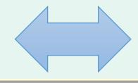
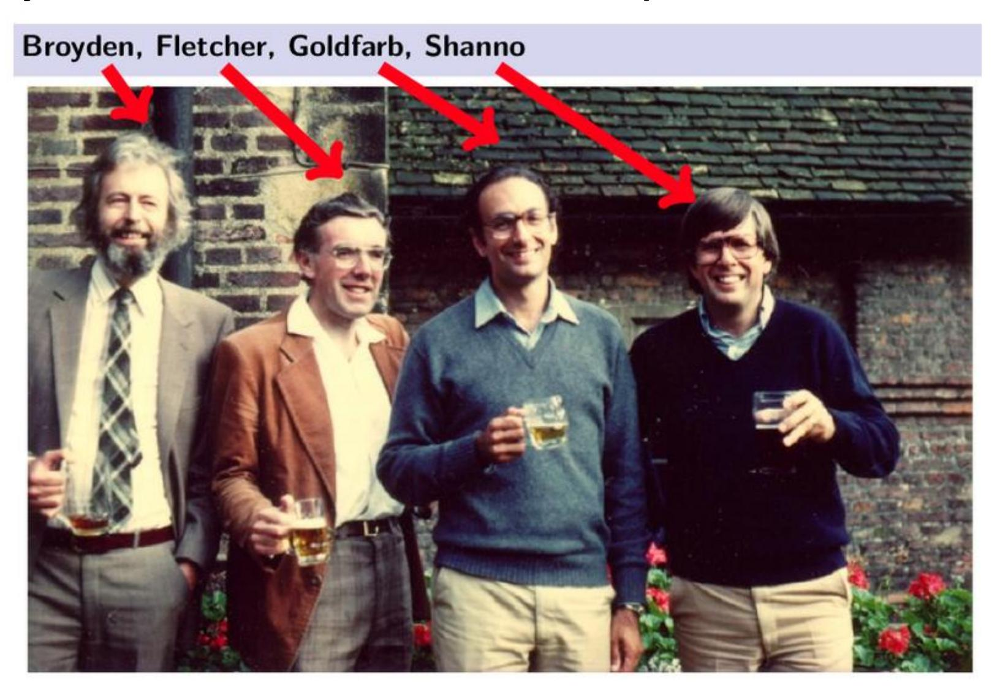
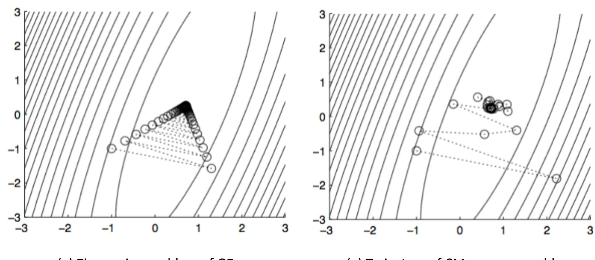
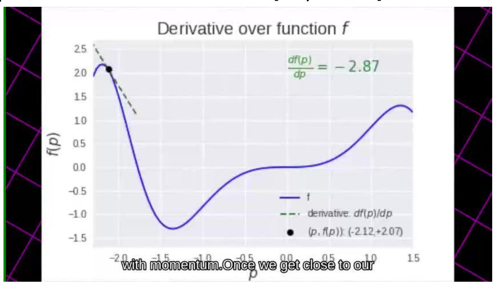
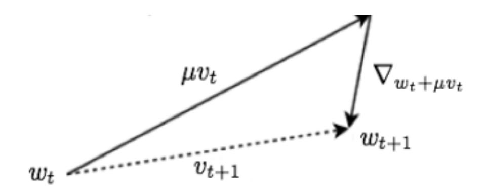
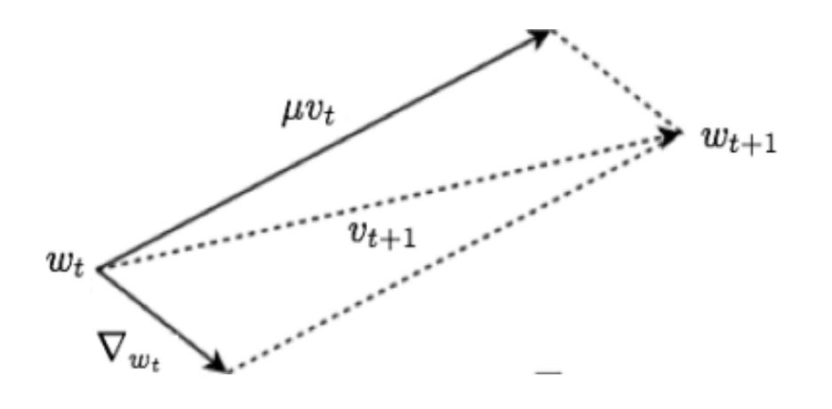

# **Machine Learning & Pattern Recognition**

## **Iterative Optimization Technique**

## **Optimization Methods**

- Optimization: either minimize or maximize some function () by altering .
- In most cases, optimizition refers to the minimization of .

**Maximization Minimization** −



- : objective function, cost function, loss function, error function.
- The value that minimize : ∗ = arg min .

## **Optimization Methods**

#### • **Deterministic Optimization**

• The data for the given problem are known accurately.

#### • **Stochastic Optimization**

• Refers to a collection of methods for minimizing or maximizing an objective function when randomness is present.

## **Deterministic Optimization**

- First-order methods: methods that use only the gradient.
- Second-order methods: methods that also use the Hessian matrix.

$$\boldsymbol{H}(f)_{i,j} = \frac{\partial^2}{\partial x_i \partial x_j} f(\boldsymbol{x})$$

: multiple input dimensions.

## **Newton's Methods**

• Motivation: to minimize the local second-order Taylor approximation of .

$$\min_{\mathbf{x}} f(\mathbf{x}) \approx \min_{\mathbf{x}} f(\mathbf{x}_t) + \nabla f(\mathbf{x}_t)^T (\mathbf{x} - \mathbf{x}_t) + \frac{1}{2} (\mathbf{x} - \mathbf{x}_t)^T \nabla^2 f(\mathbf{x}_t) (\mathbf{x} - \mathbf{x}_t)^T \nabla^2 f(\mathbf{x}_t) (\mathbf{x} - \mathbf{x}_t)^T \nabla^2 f(\mathbf{x}_t) (\mathbf{x} - \mathbf{x}_t)^T \nabla^2 f(\mathbf{x}_t) (\mathbf{x} - \mathbf{x}_t)^T \nabla^2 f(\mathbf{x}_t) (\mathbf{x} - \mathbf{x}_t)^T \nabla^2 f(\mathbf{x}_t) (\mathbf{x} - \mathbf{x}_t)^T \nabla^2 f(\mathbf{x}_t) (\mathbf{x} - \mathbf{x}_t)^T \nabla^2 f(\mathbf{x}_t) (\mathbf{x} - \mathbf{x}_t)^T \nabla^2 f(\mathbf{x}_t) (\mathbf{x} - \mathbf{x}_t)^T \nabla^2 f(\mathbf{x}_t) (\mathbf{x} - \mathbf{x}_t)^T \nabla^2 f(\mathbf{x}_t) (\mathbf{x} - \mathbf{x}_t)^T \nabla^2 f(\mathbf{x}_t) (\mathbf{x} - \mathbf{x}_t)^T \nabla^2 f(\mathbf{x}_t) (\mathbf{x} - \mathbf{x}_t)^T \nabla^2 f(\mathbf{x}_t) (\mathbf{x} - \mathbf{x}_t)^T \nabla^2 f(\mathbf{x}_t) (\mathbf{x} - \mathbf{x}_t)^T \nabla^2 f(\mathbf{x}_t) (\mathbf{x} - \mathbf{x}_t)^T \nabla^2 f(\mathbf{x}_t) (\mathbf{x} - \mathbf{x}_t)^T \nabla^2 f(\mathbf{x}_t) (\mathbf{x} - \mathbf{x}_t)^T \nabla^2 f(\mathbf{x}_t) (\mathbf{x} - \mathbf{x}_t)^T \nabla^2 f(\mathbf{x}_t) (\mathbf{x} - \mathbf{x}_t)^T \nabla^2 f(\mathbf{x}_t) (\mathbf{x} - \mathbf{x}_t)^T \nabla^2 f(\mathbf{x}_t) (\mathbf{x} - \mathbf{x}_t)^T \nabla^2 f(\mathbf{x}_t) (\mathbf{x} - \mathbf{x}_t)^T \nabla^2 f(\mathbf{x}_t) (\mathbf{x} - \mathbf{x}_t)^T \nabla^2 f(\mathbf{x}_t) (\mathbf{x} - \mathbf{x}_t)^T \nabla^2 f(\mathbf{x}_t) (\mathbf{x} - \mathbf{x}_t)^T \nabla^2 f(\mathbf{x}_t) (\mathbf{x} - \mathbf{x}_t)^T \nabla^2 f(\mathbf{x}_t) (\mathbf{x} - \mathbf{x}_t)^T \nabla^2 f(\mathbf{x}_t) (\mathbf{x} - \mathbf{x}_t)^T \nabla^2 f(\mathbf{x}_t) (\mathbf{x} - \mathbf{x}_t)^T \nabla^2 f(\mathbf{x}_t) (\mathbf{x} - \mathbf{x}_t)^T \nabla^2 f(\mathbf{x}_t) (\mathbf{x} - \mathbf{x}_t)^T \nabla^2 f(\mathbf{x}_t) (\mathbf{x} - \mathbf{x}_t)^T \nabla^2 f(\mathbf{x}_t) (\mathbf{x} - \mathbf{x}_t)^T \nabla^2 f(\mathbf{x}_t) (\mathbf{x} - \mathbf{x}_t)^T \nabla^2 f(\mathbf{x}_t) (\mathbf{x} - \mathbf{x}_t)^T \nabla^2 f(\mathbf{x}_t) (\mathbf{x} - \mathbf{x}_t)^T \nabla^2 f(\mathbf{x}_t) (\mathbf{x} - \mathbf{x}_t)^T \nabla^2 f(\mathbf{x} - \mathbf{x}_t)^T \nabla^2 f(\mathbf{x} - \mathbf{x}_t)^T \nabla^2 f(\mathbf{x} - \mathbf{x}_t)^T \nabla^2 f(\mathbf{x} - \mathbf{x}_t)^T \nabla^2 f(\mathbf{x} - \mathbf{x}_t)^T \nabla^2 f(\mathbf{x} - \mathbf{x}_t)^T \nabla^2 f(\mathbf{x} - \mathbf{x}_t)^T \nabla^2 f(\mathbf{x} - \mathbf{x}_t)^T \nabla^2 f(\mathbf{x} - \mathbf{x}_t)^T \nabla^2 f(\mathbf{x} - \mathbf{x}_t)^T \nabla^2 f(\mathbf{x} - \mathbf{x}_t)^T \nabla^2 f(\mathbf{x} - \mathbf{x}_t)^T \nabla^2 f(\mathbf{x} - \mathbf{x}_t)^T \nabla^2 f(\mathbf{x} - \mathbf{x}_t)^T \nabla^2 f(\mathbf{x} - \mathbf{x}_t)^T \nabla^2 f(\mathbf{x} - \mathbf{x}_t)^T \nabla^2 f(\mathbf{x} - \mathbf{x}_t)^T \nabla^2 f(\mathbf{x} - \mathbf{x}_t)^T \nabla^2 f(\mathbf{x} - \mathbf{x}_t)^T \nabla^2 f(\mathbf{x} - \mathbf{x}_t)^T \nabla^2 f(\mathbf{x} - \mathbf{x}_t)^T \nabla^2 f(\mathbf{x} - \mathbf{x}_t)^T \nabla^2 f(\mathbf{x} - \mathbf{x}_t)^T \nabla^2 f(\mathbf{x} - \mathbf{x}_t)^T \nabla^2 f(\mathbf{x} - \mathbf{x}_t)^T \nabla^2 f(\mathbf{x} - \mathbf{x}_t)^T \nabla^2 f(\mathbf{x} - \mathbf{x}_t)^T \nabla^2 f(\mathbf{x} - \mathbf{x}_t)^T \nabla^2 f(\mathbf{x} - \mathbf{x}_t)^T \nabla^2 f(\mathbf{x} - \mathbf{x}_t)^T \nabla^2 f(\mathbf{x} - \mathbf{x}_t)^T \nabla^2 f(\mathbf{x} - \mathbf{x}$$

• Take the derivative of on both side, we have,

$$\frac{df(\mathbf{x})}{d\mathbf{x}} = \nabla f(\mathbf{x}_t) + \nabla^2 f(\mathbf{x}_t)(\mathbf{x} - \mathbf{x}_t) = \mathbf{0}$$

• Update rule: suppose <sup>2</sup> is positive definite,

$$\boldsymbol{x} = \boldsymbol{x}_t - [\nabla^2 f(\boldsymbol{x}_t)]^{-1} \nabla f(\boldsymbol{x}_t)$$

## **Newton's Methods**

#### • **Advantage:**

- ➢ More accurate local approximation of the objective,
- ➢ The convergence is much faster.

#### • **Disadvantage:**

- ➢ Need to compute the second derivatives
- ➢ Need to compute the inverse of Hessian (time/storage consuming)

## **Quasi Newton's Methods**

• **Main Idea:** To approximate the inverse with a matrix that is iteratively refined by low rank updates to become a better approximation of [ <sup>2</sup> ] −1 .

#### **Quasi Newton's Methods**

• BFGS (Broyden-Fletcher-Goldfarb-Shanno):



## **Optimization Methods**

- **Deterministic Optimization**
  - The data for the given problem are known accurately.
- **Stochastic Optimization**
  - Refers to a collection of methods for minimizing or maximizing an objective function when randomness is present.

## **Stochastic Gradient Descent**

We now minimize the *empirical risk*,

is the number of training examples.

$$J(\boldsymbol{\theta}) = \mathbb{E}_{(\boldsymbol{x}, \boldsymbol{y}) \sim \hat{P}_{data}} L(f(\boldsymbol{x}, \boldsymbol{\theta}), \boldsymbol{y}) = \frac{1}{m} \sum_{i=1}^{m} L(f(\boldsymbol{x}^{(i)}, \boldsymbol{\theta}), \boldsymbol{y}^{(i)})$$

• Optimization algorithms that use the entire training set simultaneously are called *deterministic or batch* gradient methods.

- This terminology "batch" can be somewhat confusing.
  - We use the term "batch size" to describe the size of a minibatch in the stochastic gradient descent.
  - We use the term "batch gradient descent" to imply the use of the full training set.

## **Stochastic Gradient Descent**

- Optimization algorithms that use only a single example at a time are sometimes called *stochastic* or sometimes *online* methods.
- E.g., consider the cost function of linear regression as

$$J(\theta) = \frac{1}{2} \sum_{i=1}^{m} (h_{\theta}(x^{(i)}) - y^{(i)})^2$$

• Now, we ignore the superscript , then for each we have ,

$$\frac{\partial}{\partial \theta_{j}} J(\theta) = \frac{\partial}{\partial \theta_{j}} \frac{1}{2} (h_{\theta}(x) - y)^{2}$$

$$= 2 \cdot \frac{1}{2} (h_{\theta}(x) - y) \cdot \frac{\partial}{\partial \theta_{j}} (h_{\theta}(x) - y)$$

$$= (h_{\theta}(x) - y) \cdot \frac{\partial}{\partial \theta_{j}} \left( \sum_{i=0}^{n} \theta_{i} x_{i} - y \right) \qquad \mathbf{x} \in \mathbb{R}^{n}$$

$$= (h_{\theta}(x) - y) x_{j}$$

## **Batch vs Stochastic Gradient Descent**

• Batch gradient descent has to scan through the entire training set before taking a single step—a costly operation if is large.

**Batch GD**

- SGD can start making progress right away, and continues to make progress with each example it looks at.
- Often, SGD gets "close" to the minimum much faster than batch gradient descent.

**SGD**

## **Batch vs Stochastic Gradient Descent**

- SGD may never "converge" to the minimum, and the parameters will keep oscillating around the minimum of ();
- But in practice most of the values near the minimum will be reasonably good approximations to the true minimum.
- Therefore, when the training set is large, SGD is often preferred over batch gradient descent.

```
Batch GD
```

**SGD**

## **Stochastic Gradient Descent**

- Most algorithms (called *minibatch* or *minibatch stochastic* methods) fall somewhere in between, using more than one but less than all of the training examples.
- **Note**: Confusing again…… It is now common to simply call them *stochastic* methods.

## **Accelerated SGD for Deep Learning**

- **Polyak's Classical Momentum** [Polyak 1964]
- **Nesterov's Momentum** [Nesterov 1983]

• **Motivation**: Key problem of Gradient Descent is "zig-zagging".



(a) Zig-zagging problem of GD. (a) Trajectory of CM on same problem.

- The classical momentum (CM) accumulates an exponentially decaying moving average of past gradients and continues to move in their direction.
- Letting be the learning rate.

$$\boldsymbol{w}_{t+1} = \boldsymbol{w}_t + \boldsymbol{v}_{t+1}$$

$$\boldsymbol{v}_{t+1} = \mu \boldsymbol{v}_t - \eta \nabla_{\boldsymbol{w}_t} f$$

- Velocity vector : a memory that accumulates the directions of reduction that were chosen in the previous steps.
- The influence of is controlled by the *momentum coefficient* ∈ 0,1 . is usually slightly less than 1. When = 0:

- The classical momentum (CM) accumulates an exponentially decaying moving average of past gradients and continues to move in their direction.
- Letting be the learning rate.

$$\boldsymbol{w}_{t+1} = \boldsymbol{w}_t + \boldsymbol{v}_{t+1}$$

$$\boldsymbol{v}_{t+1} = \mu \boldsymbol{v}_t - \eta \nabla_{\boldsymbol{w}_t} f$$

- Velocity vector : a memory that accumulates the directions of reduction that were chosen in the previous steps.
- The influence of is controlled by the *momentum coefficient* ∈ 0,1 . is usually slightly less than 1. When = 0: it is just the Gradient Descent.

#### Exponential decay

$$\begin{split} \boldsymbol{v}_{t+1} &= \mu \boldsymbol{v}_t - \eta \nabla_{\!\!\boldsymbol{w}_t} f = \mu (\mu \boldsymbol{v}_{t-1} - \eta \nabla_{\!\!\boldsymbol{w}_{t-1}} f) - \eta \nabla_{\!\!\boldsymbol{w}_t} f \\ &= \mu^{t+1} \boldsymbol{v}_0 - (\mu^t \eta \nabla_{\!\!\boldsymbol{w}_0} f + \dots + \mu^1 \eta \nabla_{\!\!\boldsymbol{w}_{t-1}} f + \eta \nabla_{\!\!\boldsymbol{w}_t} f) \end{split}$$
 We know that 
$$\lim_{n \to \infty} (1 + \frac{1}{n})^n = e \qquad \lim_{n \to \infty} (1 - \frac{1}{n})^n = \frac{1}{e}$$

Let 
$$x = \frac{1}{n} \to 0$$
, we have  $(1-x)^{\frac{1}{x}} = \frac{1}{e}$ 

We 'ignore' the terms whose weights decay to less than  $\frac{1}{e}$ .

For example, if  $\mu = 0.9$  (x = 0.1), to calculate  $v_{100}$ , we only consider the last 10 steps (i.e.,  $v_{99}$  ...  $v_{90}$ ) as the valid memory.

• The SGD algorithm with momentum is given as follows.

$$\boldsymbol{w}_{t+1} = \boldsymbol{w}_t + \boldsymbol{v}_{t+1} \qquad \boldsymbol{v}_{t+1} = \mu \boldsymbol{v}_t - \eta \nabla_{\boldsymbol{w}_t} f$$

← −



• The update equations of NAG are:

$$\boldsymbol{w}_{t+1} = \boldsymbol{w}_t + \boldsymbol{v}_{t+1}$$

$$\boldsymbol{v}_{t+1} = \mu \boldsymbol{v}_t - \eta \nabla_{\boldsymbol{w}_t + \mu \boldsymbol{v}_t} f$$

**CM**

$$\boldsymbol{w}_{t+1} = \boldsymbol{w}_t + \boldsymbol{v}_{t+1}$$

$$\boldsymbol{v}_{t+1} = \mu \boldsymbol{v}_t - \eta \boldsymbol{v}_{\boldsymbol{w}_t} f$$





**NAG CM**

**Illustration of the comparison between CM and NAG.**

- First make a big jump in the direction of the previous accumulated gradient.
- Then measure the gradient where you end up and make a correction.

$$w_{t+1} = w_t + v_{t+1}$$
 
$$w_{t+1} = w_t + v_{t+1}$$
 
$$v_{t+1} = \mu v_t - \eta \nabla_{w_t} f$$
 
$$v_{t+1} = \mu v_t - \eta \nabla_{w_t} f$$
 
$$v_{t+1} = \mu v_t - \eta \nabla_{w_t} f$$

• The update equations of NAG are:

$$w_{t+1} = w_t + v_{t+1}$$

$$v_{t+1} = \mu v_t - \eta \nabla_{w_t + \mu v_t} f$$

**CM**

$$\boldsymbol{w}_{t+1} = \boldsymbol{w}_t + \boldsymbol{v}_{t+1}$$

$$\boldsymbol{v}_{t+1} = \mu \boldsymbol{v}_t - \eta \boldsymbol{v}_{\boldsymbol{w}_t} f$$

- CM → inspecting the gradient at the current iterate of ;
  - Faithfully trusts the current iterate;
- NAG → inspecting the gradient at + .
  - Puts less faith into the current iterate and looks ahead in the direction suggested by the velocity vector.
- The small difference allows NAG to adapt faster and in a more stable way.

• The complete Nesterov momentum algorithm is presented as follows.

$$\boldsymbol{w}_{t+1} = \boldsymbol{w}_t + \boldsymbol{v}_{t+1} \qquad \boldsymbol{v}_{t+1} = \mu \boldsymbol{v}_t - \eta \nabla_{\boldsymbol{w}_t + \mu \boldsymbol{v}_t} f$$

← −

#### **Algorithms with Adaptive Learning Rates**

• Researchers have long realized that the learning rate is the most difficult hyperparameter to set because it has a significant impact on model performance.

- Recently, a number of methods have been introduced that adapt the learning rates of model parameters.
  - Adagrad
  - RMSProp
  - Adam

## **Adagrad**

**Adagrad** (Duchi et al, COLT 2010) uses a different learning rate for every parameter at every time step . It individually adapts the learning rates of all model parameters by scaling them inversely proportional to the square root of the sum of all of their historical squared values

The SGD update <sup>∈</sup> <sup>ℝ</sup>×

$$g_{t,i} = \nabla_{\theta_t} J(\theta_{t,i})$$

$$\theta_{t+1,i} = \theta_{t,i} - \eta \cdot g_{t,i}$$

$$\theta_{t+1,i} = \theta_{t,i} - \frac{\eta}{\sqrt{G_{t,ii} + \epsilon}} \cdot g_{t,i}$$

is a diagonal matrix where each diagonal element , is the sum of the squares of the gradients w.r.t. up to time step *.*

**Weakness**: Since every added term is positive, the accumulated sum keeps growing which in turn causes the learning rate to shrink and eventually become infinitely small.

## **Adadelta & RMSprop**

**Adadelta** is an extension of Adagrad that seeks to reduce its aggressive, monotonically decreasing learning rate. Instead of accumulating all past squared gradients, Adadelta restricts the window of accumulated past gradients to some fixed size *w*.

Via a decaying mechanism,

**RMSprop** is an unpublished, adaptive learning rate method proposed by Geoff Hinton in his Coursera Class. RMSprop and Adadelta have both been developed independently around the same time to resolve Adagrad's radically diminishing learning rates.

采用指数衰减平均,以 丢弃遥远过去的历史。 衰减速率:可调超参

## **Adam**

- Adaptive Moment Estimation (Adam) is another method that computes adaptive learning rates for each parameter.
- Adam was presented by Diederik Kingma from OpenAI and Jimmy Ba from the University of Toronto in their 2015 ICLR paper (poster) titled "Adam: A Method for Stochastic Optimization".
  - 1. Adam stores an exponentially decaying average of past squared gradients (variance) like Adadelta and RMSprop.
  - 2. Adam also keeps an exponentially decaying average of past gradients (mean), similar to momentum.

## **Adam**

As , are initialized as 0, they are biased towards 0, especially when <sup>1</sup> → 1, <sup>2</sup> → 1.

#### 8.5.4 Choosing the Right Optimization Algorithm

In this section, we discussed a series of related algorithms that each seek to address the challenge of optimizing deep models by adapting the learning rate for each model parameter. At this point, a natural question is: which algorithm should one choose?

Unfortunately, there is currently no consensus on this point. Schaul et al. (2014) presented a valuable comparison of a large number of optimization algorithms across a wide range of learning tasks. While the results suggest that the family of algorithms with adaptive learning rates (represented by RMSProp and AdaDelta) performed fairly robustly, no single best algorithm has emerged.

Currently, the most popular optimization algorithms actively in use include SGD, SGD with momentum, RMSProp, RMSProp with momentum, AdaDelta and Adam. The choice of which algorithm to use, at this point, seems to depend largely on the user's familiarity with the algorithm (for ease of hyperparameter tuning).

## **Summary**

- **Deterministic Optimization**
  - The data for the given problem are known accurately.
  - First order method: e.g., Gradient Descent.
  - Second order method: e.g., Newton's method, Quasi Newton's Methods (BFGS).
- **Stochastic Optimization**
  - Using several samples of the training examples (minibatch).
  - SGD
  - SGD+Accelaration
    - Polyak's Classical Momentum
    - Nesterov's Momentum
    - Agrad/Adadelta/RMSprop/Adam