# **Machine Learning & Pattern Recognition**

## **Unsupervised Feature Extraction**

Ø **Principal Component Analysis (PCA)**

# **What is feature extraction?**

- Feature extraction (dimensionality reduction/feature reduction) refers to the mapping of the original **high‐dimensional** data into a **low‐dimensional** space.
- Criterion for feature reduction can be different based on different problem setting.
  - ü Unsupervised setting: minimize the information loss
  - ü Supervisedsetting: maximize the class discrimination

# **Feature Extraction VS. Feature Selection**

- Feature extraction
  - All original features are used.
  - Transformed features are linear combinations of the original features

- Feature selection
  - Only a subset of the original features are used.

# **Why Feature Extraction?**

• **Visualization**: projection of high‐dimensional data onto 2D or 3D

• **Data compression**: efficient storage and retrieval

• **Noise removal**: positive effect on accuracy

# **Feature Extraction Algorithms**

#### • **Unsupervised**

- Principal Component Analysis (PCA)
- Nonnegative Matrix Factorization (NMF)
- Independent Component Analysis (ICA) [Reading]

#### • **Supervised**

- Linear Discriminant Analysis (LDA)
- General Graph Embedding (GE) [Reading]
- Canonical Correlation Analysis (CCA) [Reading, encouraged]

#### • **Semi‐supervised**

• Research topic [Further study, encouraged]

# **Principal Component Analysis (PCA)**

PCA is a technique that is widely used for applications such as dimensionality reduction, lossy data compression, feature extraction, and data visualization (Jolliffe, 2002).

Map the original high‐dimensional data into a low‐dimensional space.

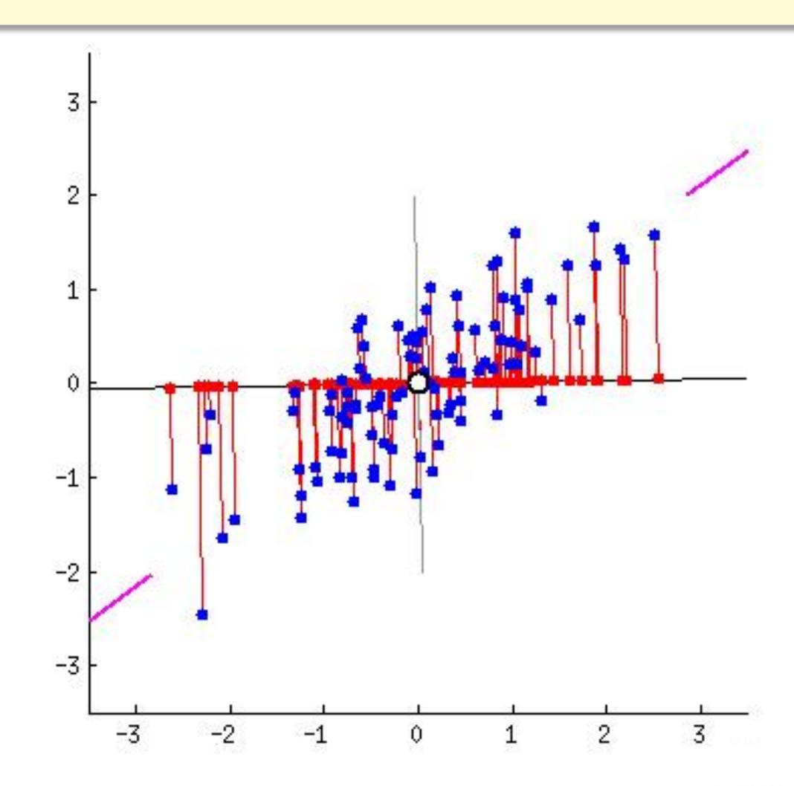

# **Principal Component Analysis (PCA)**

Principal component analysis, or PCA, is a technique that is widely used for applications such as dimensionality reduction, lossy data compression, feature extraction, and data visualization (Jolliffe, 2002).

- Two commonly used definitions of PCA
  - Maximum variance formulation
    - The variance of the projected data is maximized.
  - Minimum‐error formulation
    - Minimizes the average projection cost

#### **Maximum Variance Formulation**

 The central idea of PCA is to reduce the dimensionality of a data set consisting of a large number of interrelated variables, while retaining as much as possible of the variation present in the data set.

 This is achieved by transforming to a new set of variables, the principal components (PCs), which are uncorrelated, and are ordered by the fraction of the total information each retains, so that the first few retain most of the variation present in all of the original variables.

Given a sample set of m observations on a vector of d variables

$$\{x_1, x_2, ..., x_m\} \in \mathbb{R}^d$$

Define the first PC of the samples by the linear projection  $w_1 \in \mathbb{R}^d$ 

$$z_{1i} = \mathbf{w_1^T} \mathbf{x}_i = \sum_{k=1}^d w_{1k} x_{ik}, i = 1, ..., m$$

where 
$$\mathbf{w}_1 = (w_{11}, w_{12}, ..., w_{1d})^T$$
  $\mathbf{x}_i = (x_{i1}, x_{i2}, ..., x_{id})^T$   $z_1 = \{z_{11}, z_{12}, ..., z_{1m}\}$ 

 $w_1$  is chosen such that  $var[z_1]$  is maximum.

To find  $w_1$ , first note that

$$var[z_1] = E[(z_1 - \overline{z}_1)^2] = \frac{1}{m} \sum_{i=1}^m (\boldsymbol{w}_1^T \boldsymbol{x}_i - \boldsymbol{w}_1^T \overline{\boldsymbol{x}})^2$$

$$= \frac{1}{m} \sum_{i=1}^m \boldsymbol{w}_1^T (\boldsymbol{x}_i - \overline{\boldsymbol{x}}) (\boldsymbol{x}_i - \overline{\boldsymbol{x}})^T \boldsymbol{w}_1 = \boldsymbol{w}_1^T \boldsymbol{S} \boldsymbol{w}_1$$
where  $\boldsymbol{S} = \frac{1}{m} \sum_{i=1}^m (\boldsymbol{x}_i - \overline{\boldsymbol{x}}) (\boldsymbol{x}_i - \overline{\boldsymbol{x}})^T$  is the covariance matrix.
$$\overline{\boldsymbol{x}} = \frac{1}{m} \sum_{i=1}^m \boldsymbol{x}_i \text{ is the mean.}$$

#### **Covariance and Correlation Coefficient**

 $\blacksquare$  For two random variables X and Y,

**Covariance** 
$$COV[X, Y] = E[\{X - E[X]\}\{Y - E[Y]\}] = E[XY] - E[X]E[Y]$$

The extent to which *X* and *Y* vary together.

$$|COV[X,Y]| \le \sqrt{VAR[X]VAR[Y]}$$

Cauchy–Schwarz inequality.

柯西-施瓦茨不等式

 $\blacksquare$  Correlation coefficient  $\rho$  (normalized covariance)

$$\rho(X,Y) = \frac{COV[X,Y]}{\sqrt{VAR[X]VAR[Y]}}$$

#### Interpretation of The Correlation Coefficient $\rho$

 $\blacksquare$  Correlation coefficient  $\rho$  (normalized covariance)

$$\rho(X,Y) = \frac{COV[X,Y]}{\sqrt{VAR[X]VAR[Y]}}$$

- $\rho(X,Y)$  measures the strength and direction of the linear relationship between X and Y.
- If X and Y have non-zero variance, then  $\rho(X,Y) \in [-1,1]$ .
- Y is a linearly increasing function of X if and only if  $\rho(X,Y)=1$
- Y is a linearly decreasing function of X if and only if  $\rho(X,Y) = -1$
- X and Y are uncorrelated, if and only if  $\rho(X,Y) = 0$

# **Interpretation of The Correlation Coefficient**

- n Y is a linearly increasing function of X if and only if ρ(, ) = 1
- n Y is a linearly decreasing function of X if and only if ρ(, ) =− 1
- n and are uncorrelated, if and only if ρ(, ) = 0

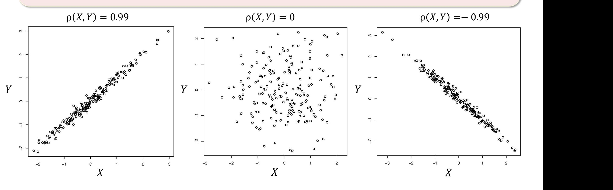

#### **Covariance Matrix**

Given random vector,  $\overrightarrow{\mathbf{X}} = [x_1, x_2, ..., x_N]^T$ , we define,

Mean vector 
$$E[X] = [E[X_1], E[X_2], ..., E[X_N]]^T = [\mu_1 \mu_2 ... \mu_N] = \mu$$

Covariance matrix 
$$COV[X] = \Sigma = E[(X - \mu)(X - \mu)^T]$$

$$= \begin{bmatrix} E[(X_1 - \mu_1)(X_1 - \mu_1)] ... E[(X_1 - \mu_1)(X_N - \mu_N)] \\ \vdots \\ E[(X_N - \mu_N)(X_1 - \mu_1)] ... E[(X_N - \mu_N)(X_N - \mu_N)] \end{bmatrix} = \begin{bmatrix} \sigma_1^2 ... \sigma_{1N} \\ ... \\ \sigma_{N1} ... \sigma_{N^2} \end{bmatrix}$$

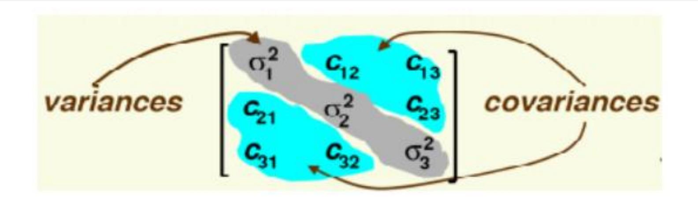

## **Covariance Matrix**

n The covariance matrix indicates the tendency of each pair of dimensions (features) in a random vector to vary together, i.e., to co‐vary.

#### n **Important Properties**

- n If xi and xk tend to increase together, then cik > 0
- n If xi tends to decrease when xk increases, then cik < 0
- n If xi and xk are uncorrelated, then cik = 0
- n cik ≤ σiσk, where σi is the standard deviation of xi
- n cii = σi2 = VAR(xi)
- n Symmetric: cji = cij
- n Positive semi‐definite:
  - n Eigenvalues are nonnegative
  - n Determinant is nonnegative, ≥ 0

## **Covariance Matrix**

n You are given the heights and weights of a certain set of individuals in unknown units. Which one of the following four matrices is the most likely to be the sampled covariance matrix?

(a) 
$$\begin{bmatrix} 1.232 & 0.867 \\ -0.867 & 2.791 \end{bmatrix}$$
 (b)  $\begin{bmatrix} 1.232 & -0.867 \\ -0.867 & 2.791 \end{bmatrix}$  (c)  $\begin{bmatrix} 1.232 & 0.867 \\ 0.867 & 2.791 \end{bmatrix}$  (d)  $\begin{bmatrix} 1.232 & 3.307 \\ 3.307 & 2.791 \end{bmatrix}$ 

To find  $w_1$ , first note that

$$var[z_1] = E[(z_1 - \overline{z}_1)^2] = \frac{1}{m} \sum_{i=1}^m (\boldsymbol{w}_1^T \boldsymbol{x}_i - \boldsymbol{w}_1^T \overline{\boldsymbol{x}})^2$$

$$= \frac{1}{m} \sum_{i=1}^m \boldsymbol{w}_1^T (\boldsymbol{x}_i - \overline{\boldsymbol{x}}) (\boldsymbol{x}_i - \overline{\boldsymbol{x}})^T \boldsymbol{w}_1 = \boldsymbol{w}_1^T \boldsymbol{S} \boldsymbol{w}_1$$
where  $\boldsymbol{S} = \frac{1}{m} \sum_{i=1}^m (\boldsymbol{x}_i - \overline{\boldsymbol{x}}) (\boldsymbol{x}_i - \overline{\boldsymbol{x}})^T$  is the covariance matrix.
$$\overline{\boldsymbol{x}} = \frac{1}{m} \sum_{i=1}^m \boldsymbol{x}_i \text{ is the mean.}$$

The covariance matrix S is symmetric.

- The eigenvectors must be orthogonal (正文) to one another.
- The eigenvalues of S must all be  $\geq 0$

To find  $w_1$  that maximizes  $var[z_1]$  subject to  $w_1^T w_1 = 1$ 

We use the Lagrange multiplier, we maximize the following function:

$$L = \boldsymbol{w}_1^T \boldsymbol{S} \boldsymbol{w}_1 + \lambda (1 - \boldsymbol{w}_1^T \boldsymbol{w}_1)$$

$$\Rightarrow \frac{\partial L}{\partial \mathbf{w}_1} = \mathbf{S}\mathbf{w}_1 - \lambda \mathbf{w}_1 = 0 \Rightarrow (\mathbf{S} - \lambda \mathbf{I}_d)\mathbf{w}_1 = 0$$

## **Eigenvectors and Eigenvalues**

■ **Definition:** v is an eigenvector of matrix  $A \in \mathbb{R}^{m*m}$  if there exists a scalar  $\lambda$ , such that:

$$Av = \lambda v$$
  $\begin{cases} v: \text{ an eigenvector (nonzero vector)} \\ \lambda: \text{ the corresponding eigenvalue} \end{cases}$ 

Computation

$$Av = \lambda v$$
  $(A - \lambda I)v = 0$ 

$$\boldsymbol{v} \neq \boldsymbol{0} \Rightarrow |\boldsymbol{A} - \lambda \boldsymbol{I}| = 0$$

## **Eigenvectors and Eigenvalues**

■ **Definition:** v is an eigenvector of matrix  $A \in \mathbb{R}^{m*m}$  if there exists a scalar  $\lambda$ , such that:

$$Av = \lambda v$$
  $\begin{cases} v: \text{ an eigenvector} \\ \lambda: \text{ the corresponding eigenvalue} \end{cases}$ 

#### Note

- $\succ tr(A) = \sum_{i} \lambda_{i}$
- $\triangleright |A| = \prod_i \lambda_i$
- If  $\lambda$  is an eigenvalue of the matrix A, then  $\lambda^2$  is an eigenvalue of  $A^2$ .  $(A^2 = AA)$
- $\triangleright$  If  $\lambda$  is an eigenvalue of the matrix A, then  $\lambda$  is an eigenvalue of  $A^T$ .

# **Eigenvectors and Eigenvalues**

- n Intepretation: an eigenvector represents an invariant direction in the vector space.
  - n Any point lying on the direction defined by remains on that direction.
  - n Its magnitude is multiplies by the corresponding eigenvalue

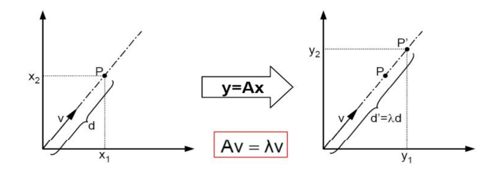

To find  $w_1$  that maximizes  $var[z_1]$  subject to  $w_1^T w_1 = 1$ 

We use the Lagrange multiplier, we maximize the following function:

$$L = \boldsymbol{w}_1^T \boldsymbol{S} \boldsymbol{w}_1 + \lambda (1 - \boldsymbol{w}_1^T \boldsymbol{w}_1)$$

$$\Rightarrow \frac{\partial L}{\partial \mathbf{w}_1} = \mathbf{S}\mathbf{w}_1 - \lambda \mathbf{w}_1 = 0 \Rightarrow (\mathbf{S} - \lambda \mathbf{I}_d)\mathbf{w}_1 = 0$$

Therefore  $w_1$  is an eigenvector of S,  $\lambda$  is the associated eigenvalue.

Which eigenvector should we choose?

If we recognize that the quantity to be maximized

$$L = \mathbf{w}_1^T \mathbf{S} \mathbf{w}_1 = \lambda$$

then we should choose  $\lambda$  to be as big as possible.

So  $\lambda = \lambda_1$  is the largest eigenvalue,  $\mathbf{w}_1$  is the corresponding eigenvector.

We have got the 1st PC. Now, let's go to the 2nd PC.

The 2nd PC,  $w_2^T x$  maximize  $w_2^T S w_2$  subject to being uncorrelated with  $w_1^T x$ 

The uncorrelation constraint can be expressed as

$$COV(\mathbf{w}_{1}^{T}\mathbf{x}, \mathbf{w}_{2}^{T}\mathbf{x}) = \mathbf{w}_{1}^{T}S\mathbf{w}_{2} = \mathbf{w}_{1}^{T}\lambda_{1}\mathbf{w}_{2} = \lambda_{1}\mathbf{w}_{1}^{T}\mathbf{w}_{2} = 0$$

Using Lagrange multiplier, we will maximize

$$w_2^T S w_2 + \lambda_2 (1 - w_2^T w_2) - \varphi w_1^T w_2$$

Differentiation w.r.t. w2 yields,

$$\frac{d(\mathbf{w}_2^T \mathbf{S} \mathbf{w}_2 + \lambda_2 (1 - \mathbf{w}_2^T \mathbf{w}_2) - \varphi \mathbf{w}_1^T \mathbf{w}_2)}{d\mathbf{w}_2} = \mathbf{0}$$
$$2\mathbf{S} \mathbf{w}_2 - 2\lambda_2 \mathbf{w}_2 - \varphi \mathbf{w}_1 = \mathbf{0}$$

If we left multiply  $w_1$ ,

$$\boldsymbol{w}_1^T \boldsymbol{S} \boldsymbol{w}_2 - \lambda_2 \boldsymbol{w}_1^T \boldsymbol{w}_2 - \frac{\varphi}{2} \boldsymbol{w}_1^T \boldsymbol{w}_1 = 0$$

what does it imply?

$$\mathbf{w}_{1}^{T} \mathbf{S} \mathbf{w}_{2} - \lambda_{2} \mathbf{w}_{1}^{T} \mathbf{w}_{2} - \frac{\varphi}{2} \mathbf{w}_{1}^{T} \mathbf{w}_{1} = 0$$

$$0 - 0 - \frac{\varphi}{2} \quad 1 = 0$$

 $\varphi$  must be zero and then we re-check the derivative,

$$Sw_2 - \lambda_2 w_2 - \varphi w_1 = 0 \Rightarrow Sw_2 - \lambda_2 w_2 = 0$$

The same strategy of choosing  $w_2$  to be the eigenvector associated with the second largest eigenvalue  $\lambda_2$  yields the second PC.

This process can be repeated for k=1,...,p yielding up to p different eigenvectors of S along with the corresponding eigenvalues  $\lambda_1,...\lambda_p$ 

The variance of each of the PCs are given by

$$var[z_k] = var[\mathbf{w}_k^T \mathbf{x}] = \lambda_k, k = 1, ..., p$$

- Main steps for computing PCs:
  - Form the covariance matrix S.
  - Compute its eigenvectors:  $\{w_i\}_{i=1}^d$
  - The first p eigenvectors  $\{w_i\}_{i=1}^p$  form the p PCs
  - The transformation  $\boldsymbol{G}$  consists of the p PCs

$$\boldsymbol{G} \leftarrow \left[\boldsymbol{w}_1, \boldsymbol{w}_2, ..., \boldsymbol{w}_p\right] \in \mathbb{R}^{d \times p}$$

$$\mathbf{v} = \mathbf{G}^T \mathbf{x} \in \mathbb{R}^p$$

# **Principal Component Analysis (PCA)**

Principal component analysis, or PCA, is a technique that is widely used for applications such as dimensionality reduction, lossy data compression, feature extraction, and data visualization (Jolliffe, 2002).

- Two commonly used definitions of PCA
  - Maximum variance formulation
    - The variance of the projected data is maximized.
  - Minimum‐error formulation
    - Minimizes the average projection cost

#### Basis

A set of vectors  $\{u_1, u_2, ..., u_n\}$  are called a *basis* for a vector space  $\mathbb{R}^n$  if any vector  $x \in \mathbb{R}^n$  can be written as a linear combination of  $\{u_i\}$ 

$$\mathbf{x} = a_1 \mathbf{u}_1 + a_2 \mathbf{u}_2 + \dots + a_n \mathbf{u}_n$$

 $\mathbf{u}_1, \mathbf{u}_2, ..., \mathbf{u}_n$  are linearly **independent** implies they form a basis and vice versa.

$$a_1 \mathbf{u}_1 + a_2 \mathbf{u}_2 + \dots + a_n \mathbf{u}_n = \mathbf{0} \Rightarrow a_k = 0$$

- $\blacksquare$  A basis  $\{\boldsymbol{u}_i\}$  is orthonormal if
  - Basis vectors are pairwise orthogonal
  - Have unit length, i.e.,  $|u_i| = 1$ .

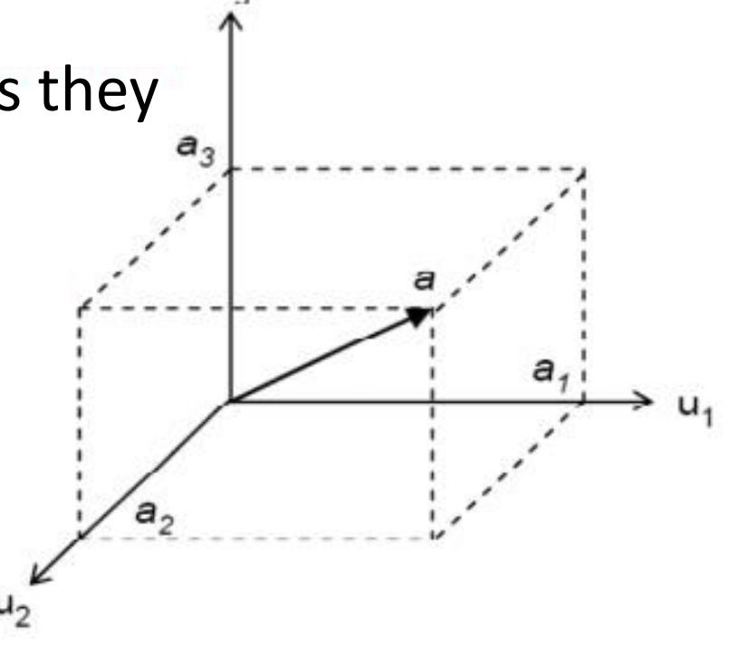

Here, we first introduce a complete orthonormal set of basis vectors  $\{u_1, u_2, ..., u_d\} \in \mathbb{R}^d$ , where

$$\mathbf{u}_i^T \mathbf{u}_j = \delta_{ij} \ (0 \ or \ 1)$$

Each data point can be represented by a linear combination of the basis vectors:

$$\mathbf{x}_n = \sum_{i=1}^d \alpha_{ni} \, \mathbf{u}_i$$

$$\alpha_{ni} = \mathbf{x}_n^T \mathbf{u}_i$$
  $\mathbf{x}_n = \sum_{i=1}^d (\mathbf{x}_n^T \mathbf{u}_i) \mathbf{u}_i$ 

- Our goal is to approximate  $x_n \in \mathbb{R}^d$  with  $\widetilde{x}_n \in \mathbb{R}^p$ , p < d (projection onto a lower-dimensional subspace).
- The p-D subspace can be represented, without loss of generality, by the first p of the basis vectors, and we approximate each sample  $x_n$  by

$$\widetilde{\boldsymbol{x}}_n = \sum_{i=1}^p z_{ni} \, \boldsymbol{u}_i + \sum_{i=p+1}^d b_i \, \boldsymbol{u}_i$$
 •  $\{z_{ni}\}$  depend on the particular data point.  
•  $\{b_i\}$  are constants that are the same for all data points.

- data points.

We aim to minimize the loss introduced by the dimensionality reduction, i.e., the squared distance between the original  $x_n$  and approximation  $\tilde{x}_n$ 

$$J = \frac{1}{m} \sum_{n=1}^{m} \|\mathbf{x}_n - \widetilde{\mathbf{x}}_n\|^2$$

To minimize

$$J = \frac{1}{m} \sum_{n=1}^{m} \|\mathbf{x}_n - \widetilde{\mathbf{x}}_n\|^2 \qquad \widetilde{\mathbf{x}}_n = \sum_{i=1}^{p} z_{ni} \, \mathbf{u}_i + \sum_{i=p+1}^{d} b_i \, \mathbf{u}_i$$

• Taking the derivative w.r.t.  $z_{nj}$  and setting to zero, we have

$$z_{nj} = x_n^T u_j, \ j = 1, ..., p$$

• Taking the derivative w.r.t.  $b_i$  and setting to zero, we have

$$b_j = \overline{\mathbf{x}}^T \mathbf{u}_j, \ j = p + 1, ..., d$$

Leaving for Your homework.

• Substituting  $z_{nj}$  and  $b_j$ , and make use of  $\bm{x}_n = \sum_{i=1}^d \left( \bm{x}_n^T \bm{u}_i \right) \bm{u}_i$ , we have

$$\mathbf{x}_n - \widetilde{\mathbf{x}}_n = \sum_{i=p+1}^n \{(\mathbf{x}_n - \overline{\mathbf{x}})^T \mathbf{u}_i\} \mathbf{u}_i$$

7n-7n= Xn-EZnilli-Ebille. = Yn- E Yn lli lli - E XT Un lli = d xn Tul Ui - Exnuille - Ex Tuille = E YnTUHUI + E YnTUHU- E Yn UhUI - E TUUU. = d (xn-x7) welli = Et (xwx) Turli.

## Minimum-error Formulation $\widetilde{x}_n = \sum_{i=1}^p z_{ni} u_i + \sum_{i=p+1}^d b_i u_i$

$$\widetilde{\boldsymbol{x}}_n = \sum_{i=1}^p z_{ni} \, \boldsymbol{u}_i + \sum_{i=p+1}^d b_i \, \boldsymbol{u}_i$$

$$\boldsymbol{x}_n - \widetilde{\boldsymbol{x}}_n = \sum_{i=p+1}^d \{(\boldsymbol{x}_n - \overline{\boldsymbol{x}})^T \boldsymbol{u}_i\} \, \boldsymbol{u}_i$$

- $x_n \tilde{x}_n$  lies in the space orthogonal to the principal subspace, why?
- Then

$$\min J = \frac{1}{m} \sum_{n=1}^{m} \|\boldsymbol{x}_n - \widetilde{\boldsymbol{x}}_n\|^2 = \frac{1}{m} \sum_{n=1}^{m} \sum_{i=p+1}^{d} (\boldsymbol{x}_n^T \boldsymbol{u}_i - \overline{\boldsymbol{x}}^T \boldsymbol{u}_i)^2 = \sum_{i=p+1}^{d} \boldsymbol{u}_i^T \boldsymbol{S} \boldsymbol{u}_i$$

Let us try to obtain some intuition about the result by considering the case of d=2 and p=1.

$$J = \sum_{i=p+1}^{d} u_i^T S u_i, d = 2, p = 1$$

- We choose  $u_2$  to minimize  $J = u_2^T S u_2$ .
- Using Lagrange multiplier, we know  $\bm{u_2}$  should be the eigenvector corresponding to the smaller of the two eigenvalues.
- Thus we should choose the principle subspace to be aligned with the eigenvector having the larger eigenvalue.

• For the case when the eigenvalues are equal, any choice of principal direction will give rise to the same value of *J*.

- Generally, the solution to the minimization of J is obtained by choosing the  $\{u_i\}$  to be the eigenvectors of the covariance matrix given by  $Su_i = \lambda_i u_i$ , i = 1, ..., d.
- The corresponding value of the loss measure is then given by

$$J = \sum_{i=p+1}^{d} \lambda_i$$

• Eigenvectors defining the principal subspace are those corresponding to the p largest eigenvalues.

## **Eigenvalue Decomposition**

Given a square matrix with m linearly independent eigenvectors  $A \in \mathbb{R}^{m*m}$ , we have an eigenvalue decomposition

$$AV = V\Lambda$$
  $A = V\Lambda V^{-1}$ 

#### Note

- $\blacksquare$  Columns of V are eigenvectors of A
- $\blacktriangle$  Diagonal elements of  $\Lambda$  are eigenvalues of A

$$\Lambda = diag(\lambda_1, \lambda_2, ..., \lambda_m), \ \lambda_i \geq \lambda_{i+1}$$

# **Eigenvalue Decomposition**

- n **Note**
- n If is non‐singular
  - n All eigenvalues are non‐zero
- n If *A* is real and symmetric
  - n All eigenvalues are *real*.

If 
$$|A-\lambda I|=0$$
 and  $A=A^T\Rightarrow \lambda\in\mathbb{R}$ 

n The eigenvectors for distinct eigenvalues are *orthogonal*.

$$\bm{A}\bm{v}_{\{1,2\}}=\lambda_{\{1,2\}}\bm{v}_{\{1,2\}}$$
 and  $\lambda_1\neq\lambda_2\Rightarrow\bm{v}_1\cdot\bm{v}_2=0$ 

n If A is positive definite, then all eigenvalues are *positive*. {1,2} = {1,2}{1,2} and 1 ≠ 2 ⇒ 1 ∙ 2 = 0

$$\forall w \in \mathbb{R}^n, w^T A w > 0$$
, then if  $A v = \lambda v \Rightarrow \lambda > 0$ 

• In practice, we compute the PCs via singular value decomposition (SVD) on the centered data matrix. **Singular Value Decomposition (SVD)**

#### "The highpoint of linear algebra"--- Gillert Strang

#### Awards and honors [edit]

- Rhodes Scholar (1955)
- Alfred P. Sloan Fellow (1966–1967)
- Chauvenet Prize, Mathematical Association of America (1976)
- Honorary Professor, Xian Jiaotong University, China (1980)
- American Academy of Arts and Sciences (1985)
- Honorary Fellow, Balliol College, Oxford University (1999)
- Honorary Member, Irish Mathematical Society (2002)
- Award for Distinguished Service to the Profession, Society for Industrial and Applied Mathematics (2003)
- Lester R. Ford Award (2005)[3]
- Von Neumann Medal, US Association for Computational Mechanics (2005)
- Haimo Prize, Mathematical Association of America (2007)[4]
- Su Buchin Prize, International Congress (ICIAM, 2007)
- Henrici Prize (2007)
- National Academy of Sciences (2009)
- Doctor Honoris Causa, University of Toulouse (2010)
- Fellow of the American Mathematical Society (2012)[5]
- Doctor Honoris Causa, Aalborg University (2013)
- Fellow of the Society for Industrial and Applied Mathematics (2009) [6]

1934~

Any  $m \times n$  matrix A of rank r can be decomposed into:  $A = U\Sigma V^T$ 

$$\mathbf{For} \ m > n \qquad \mathbf{U}_{m \times m} \qquad \mathbf{\Sigma}_{m \times n} \qquad \mathbf{V}_{n \times n}$$

$$\mathbf{A} = \begin{bmatrix} \vdots & \vdots & \vdots & \vdots & \vdots \\ \mathbf{u}_1 & \dots & \mathbf{u}_r & \mathbf{u}_{r+1} & \dots & \mathbf{u}_m \\ \vdots & \vdots & \vdots & \vdots & \vdots \end{bmatrix} \begin{bmatrix} \sigma_1 & & & & & \\ & \ddots & & & & \\ & & \sigma_r & & & \\ & & & \sigma_r & & \\ & & & & \ddots & \\ & & & & \ddots & \\ & & & &$$

- $\blacksquare$  Orthogonal matrix  $\bm{U}$ :  $\bm{U}^T\bm{U}=\bm{I}_{m\times m}$ , and  $\bm{U}\bm{U}^T=\bm{I}_{m\times m}$ .
  - $\blacksquare$  The columns of U are defined as *left singular vectors*.
- $\blacksquare$  Orthogonal matrix  $\emph{\textbf{V}}: \emph{\textbf{V}}^{\emph{\textbf{T}}}\emph{\textbf{V}} = \emph{\textbf{I}}_{n \times n}$  , and  $\emph{\textbf{V}}\emph{\textbf{V}}^{\emph{\textbf{T}}} = \emph{\textbf{I}}_{n \times n}$ .
  - $\blacksquare$  The columns of V are defined as *right singular vectors*.
- Rectangular diagonal matrix  $\Sigma$ : we arrange the *singular values* as  $\sigma_1 \ge \sigma_2 \ge ... \ge \sigma_r > 0$ .

An orthogonal matrix is a square matrix whose columns and rows are orthogonal unit vectors (orthonormal vectors).

**SVD** 

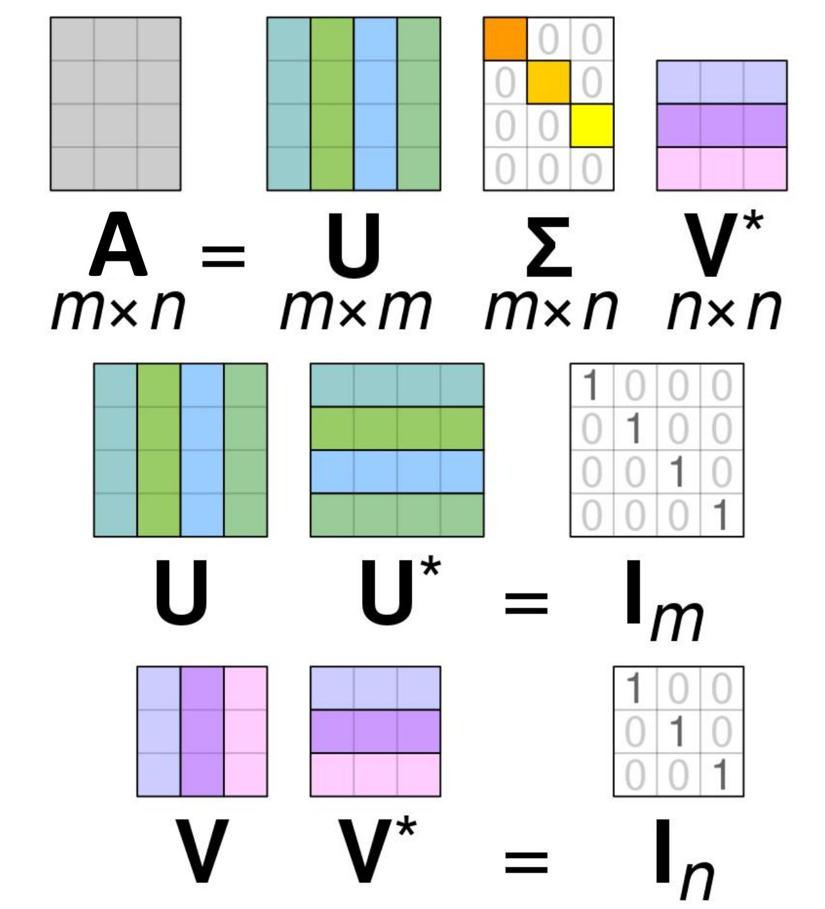

• U and V are orthogonal matrices. The columns of U and V are basis vectors in  $\mathbb{R}^m$  and  $\mathbb{R}^n$ , respectively.

The linear transformation A can be interpreted as a composition of three geometrical transformations: a rotation or reflection  $(V^T)$ , followed by a coordinate-by-coordinate scaling  $(\Sigma)$ , followed by another rotation or reflection (U).

Illustration of the SVD of a real  $2 \times 2$  matrix  $A = U\Sigma V^T$ .

- **Top**: The action of **A**.
- **Left**: The action of  $V^T$ , a rotation.
- **Bottom**: The action of  $\Sigma$ , a scaling by the singular values  $\sigma_1$  horizontally and  $\sigma_2$  vertically.
- **Right**: The action of U, another rotation.

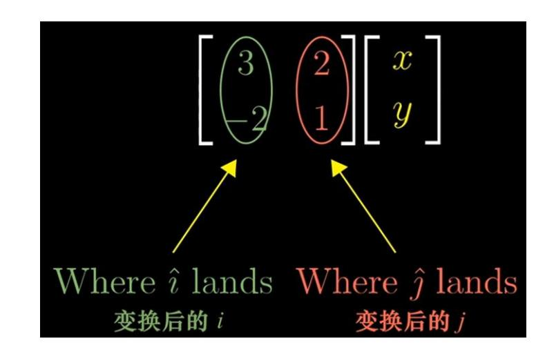

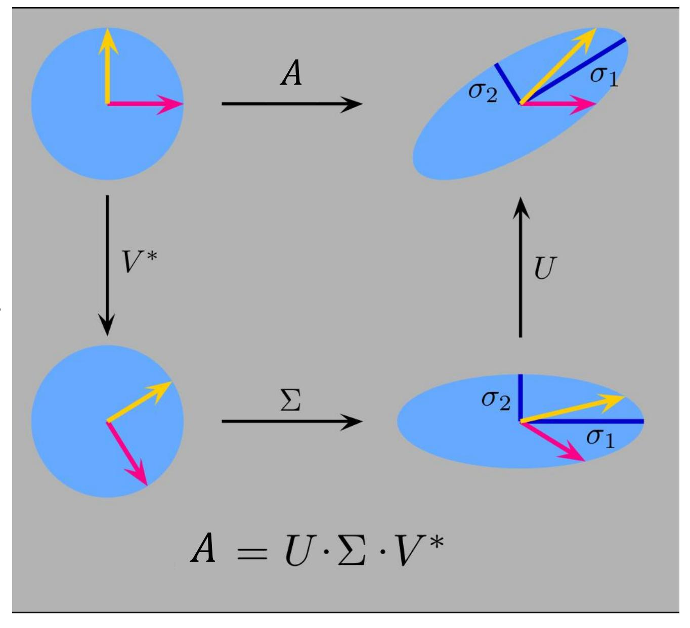

Given the matrix 
$$A = \begin{bmatrix} 3 & 1 \\ 2 & 1 \end{bmatrix}$$

$$U = \begin{bmatrix} 0.8174 & -0.5760 \\ 0.5760 & 0.8174 \end{bmatrix}$$

$$\mathbf{\Sigma} = \begin{bmatrix} 3.8643 & 0\\ 0 & 0.2588 \end{bmatrix}$$

$$\boldsymbol{U} = \begin{bmatrix} 0.8174 & -0.5760 \\ 0.5760 & 0.8174 \end{bmatrix} \qquad \boldsymbol{\Sigma} = \begin{bmatrix} 3.8643 & 0 \\ 0 & 0.2588 \end{bmatrix} \qquad \boldsymbol{V}^T = \begin{bmatrix} 0.9327 & 0.3606 \\ -0.3606 & 0.9327 \end{bmatrix}$$

Let us focus on the transformation of the original basis vectors by  $\boldsymbol{A}$ 

$$\boldsymbol{e_1} = \begin{bmatrix} 1 \\ 0 \end{bmatrix} \qquad \qquad \boldsymbol{e_2} = \begin{bmatrix} 0 \\ 1 \end{bmatrix}$$

$$e_2 = \begin{bmatrix} 0 \\ 1 \end{bmatrix}$$

First, by rotation  $V^T$ , we have

$$V^T e_1 = \begin{bmatrix} 0.9327 \\ -0.3606 \end{bmatrix}$$
  $V^T e_2 = \begin{bmatrix} 0.3606 \\ 0.9327 \end{bmatrix}$ 

$$V^T e_2 = \begin{bmatrix} 0.3606 \\ 0.9327 \end{bmatrix}$$

Given the matrix 
$$A = \begin{bmatrix} 3 & 1 \\ 2 & 1 \end{bmatrix}$$

$$U = \begin{bmatrix} 0.8174 & -0.5760 \\ 0.5760 & 0.8174 \end{bmatrix}$$

$$\mathbf{\Sigma} = \begin{bmatrix} 3.8643 & 0\\ 0 & 0.2588 \end{bmatrix}$$

$$\boldsymbol{U} = \begin{bmatrix} 0.8174 & -0.5760 \\ 0.5760 & 0.8174 \end{bmatrix} \qquad \boldsymbol{\Sigma} = \begin{bmatrix} 3.8643 & 0 \\ 0 & 0.2588 \end{bmatrix} \qquad \boldsymbol{V}^T = \begin{bmatrix} 0.9327 & 0.3606 \\ -0.3606 & 0.9327 \end{bmatrix}$$

Second, by  $\Sigma$ , we scale  $V^T e_1$  and  $V^T e_2$  along with the original coordinate system  $(e_1, e_2)$ 

$$\Sigma V^T e_1 = \begin{bmatrix} 3.6042 \\ -0.0933 \end{bmatrix}$$
  $\Sigma V^T e_2 = \begin{bmatrix} 1.3935 \\ 0.2414 \end{bmatrix}$ 

Last, by rotation U, we have

$$\mathbf{U}\boldsymbol{\Sigma}\boldsymbol{V}^{T}\boldsymbol{e}_{1} = \begin{bmatrix} 3 \\ 2 \end{bmatrix} \qquad \qquad \mathbf{U}\boldsymbol{\Sigma}\boldsymbol{V}^{T}\boldsymbol{e}_{2} = \begin{bmatrix} 1 \\ 1 \end{bmatrix}$$

Any  $m \times n$  matrix A of rank r can be decomposed into:  $A = U \Sigma V^T$ 

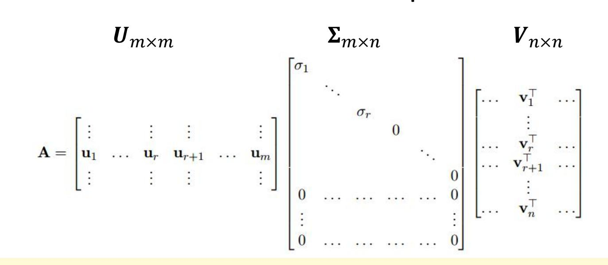

#### **■** Special Properties:

 $\triangleright$  For m > n

- $\blacksquare$  The columns of U (i.e., left singular vectors) are eigenvectors of  $AA^T$ .
- $\blacksquare$  The columns of V (i.e., right singular vectors) are eigenvectors of  $A^TA$ .
- $\blacksquare$  Eigenvalues  $\lambda_1, ..., \lambda_r$  of  $AA^T$  are the eigenvalues of  $A^TA$ .
- Singular value  $\sigma_i = \sqrt{\lambda_i}$ .

■ Prove that the columns of V (i.e., right singular vectors) are eigenvectors of  $A^TA$ .

 $A^TA = (U\Sigma V^T)^TU\Sigma V^T = V\Sigma^T\Sigma V^T$  This is the eigen-decomposition of  $A^TA$ .

V is the eigenvector matrix of  $A^TA$ , and  $\Sigma^T\Sigma$  is the eigenvalue matrix of  $A^TA$ , i.e., singular values are positive square roots of eigenvalues.

**Theorem1:** Every symmetric matrix M is orthogonally diagonalizable, i.e., there exists an orthogonal matrix Q (i.e.,  $Q^T = Q^{-1}$ ) such that  $Q^T M Q = D$  (i.e.,  $M = QDQ^T$ ) is a diagonal matrix. (<a href="https://en.wikipedia.org/wiki/Diagonalizable\_matrix">https://en.wikipedia.org/wiki/Diagonalizable\_matrix</a>)

#### **Compact SVD**

Only the r = rank(A) column vectors of U and r row vectors of  $V^T$  corresponding to the non-zero singular values  $\Sigma_r$  are calculated.

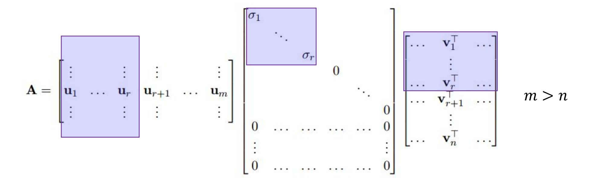

• Economy version 
$$\mathbf{A} = \mathbf{U}_r \mathbf{\Sigma}_r \mathbf{V}_r^T$$
  $\mathbf{\Sigma}_r = \text{diag}(\sigma_1, ..., \sigma_r)$ 

#### **Any information loss?**

#### **Truncated SVD**

 $\blacksquare$  Only k column vectors of  $\bm{U}$  and k row vectors of  $\bm{V}^T$  corresponding to the non-zero singular values  $\bm{\Sigma}_k$  are calculated,  $0 < k < r, r = rank(\bm{A})$ .

$$\mathbf{A} = \begin{bmatrix} \vdots & & \vdots & & \vdots \\ \mathbf{u}_1 & \dots & \mathbf{u}_r & \mathbf{u}_{r+1} & \dots & \mathbf{u}_m \\ \vdots & \vdots & \vdots & & \vdots \end{bmatrix} \begin{bmatrix} \sigma_1 & & & & & \\ & \ddots & & & & \\ & & \sigma_r & & & \\ & & & \ddots & & \\ & & & \ddots & & \\ 0 & \dots & \dots & \dots & 0 \\ \vdots & & & & \vdots \\ 0 & \dots & \dots & \dots & 0 \end{bmatrix} \begin{bmatrix} \dots & \mathbf{v}_1^\top & \dots & \\ & \ddots & & \\ \dots & \mathbf{v}_r^\top & \dots & \\ \vdots & & \ddots & \\ \dots & \mathbf{v}_n^\top & \dots \end{bmatrix} \qquad m > n$$

• More Economical 
$$A = U_k \Sigma_k V_k^T$$
  $\Sigma_k = \text{diag}(\sigma_1, ..., \sigma_k)$ 

Truncated SVD is no longer an exact decomposition of the original matrix.

# **SVD Application1‐Latent Semantic Indexing (LSI)**

- LSI was proposed to address two problems with the vector space model
  - **synonymy**: many ways to refer to the same object, e.g. *car* and *automobile*
    - leads to poor recall (*recall*: portion of the target items that the system selected)
  - **polysemy**: most words have more than one distinct meaning, e.g. *model*, *python*, *chip*
    - leads to poor precision (*precision*: portion of selected items that the system got

| right) |  |  |  |  |  |  |  |  |  |  |  |  |  |  |
|--------|--|--|--|--|--|--|--|--|--|--|--|--|--|--|
|        |  |  |  |  |  |  |  |  |  |  |  |  |  |  |
|        |  |  |  |  |  |  |  |  |  |  |  |  |  |  |
|        |  |  |  |  |  |  |  |  |  |  |  |  |  |  |
|        |  |  |  |  |  |  |  |  |  |  |  |  |  |  |
|        |  |  |  |  |  |  |  |  |  |  |  |  |  |  |
|        |  |  |  |  |  |  |  |  |  |  |  |  |  |  |
|        |  |  |  |  |  |  |  |  |  |  |  |  |  |  |
|        |  |  |  |  |  |  |  |  |  |  |  |  |  |  |
|        |  |  |  |  |  |  |  |  |  |  |  |  |  |  |
|        |  |  |  |  |  |  |  |  |  |  |  |  |  |  |
|        |  |  |  |  |  |  |  |  |  |  |  |  |  |  |
|        |  |  |  |  |  |  |  |  |  |  |  |  |  |  |

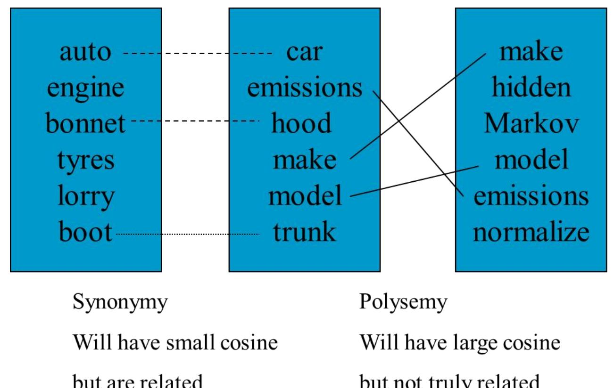

# **SVD Application1‐Latent Semantic Indexing (LSI)**

- LSI is a technique that projects queries and documents into a space with "latent" semantic dimensions.
- In the latent semantic space, a query and a document can have high cosine similarity even if they don't share any terms, as long as their terms are semantically similar in a sense.

|  |  |  |  |  |  |  |  |        |  | � = | 3 |  |   |   |  |  |
|--|--|--|--|--|--|--|--|--------|--|--------|---|--|---|---|--|--|
|  |  |  |  |  |  |  |  |        |  |        |   |  |   |   |  |  |
|  |  |  |  |  |  |  |  |        |  |        |   |  |   |   |  |  |
|  |  |  |  |  |  |  |  |        |  |        |   |  |   |   |  |  |
|  |  |  |  |  |  |  |  |        |  |        |   |  |   |   |  |  |
|  |  |  |  |  |  |  |  |        |  |        |   |  |   |   |  |  |
|  |  |  |  |  |  |  |  |        |  |        |   |  |   |   |  |  |
|  |  |  |  |  |  |  |  |        |  |        |   |  |   |   |  |  |
|  |  |  |  |  |  |  |  |        |  |        |   |  |   |   |  |  |
|  |  |  |  |  |  |  |  |        |  |        |   |  |   |   |  |  |
|  |  |  |  |  |  |  |  |        |  |        |   |  |   |   |  |  |
|  |  |  |  |  |  |  |  |        |  |        |   |  |   |   |  |  |
|  |  |  |  |  |  |  |  |        |  |        |   |  |   | � |  |  |
|  |  |  |  |  |  |  |  | � � |  | � � |   |  | � | � |  |  |

### **SVD** Application2-Pseudoinverse

SVD can be used for computing the pseudoinverse of a matrix.

$$\mathbf{A} = \mathbf{U} \mathbf{\Sigma} \mathbf{V}^{\mathbf{T}}$$

$$\mathbf{A} = \begin{bmatrix} \vdots & \vdots & \vdots & \vdots & \vdots \\ \mathbf{u}_{1} & \dots & \mathbf{u}_{r} & \mathbf{u}_{r+1} & \dots & \mathbf{u}_{m} \\ \vdots & \vdots & \vdots & \vdots & \vdots \end{bmatrix} \begin{bmatrix} \sigma_{1} & & & & & \\ & \ddots & & & & \\ & & \sigma_{r} & & & \\ & & & \ddots & & \\ & & & & \ddots & \\ & & & &$$

$$A^{\dagger} = V \Sigma^{\dagger} U^{T}$$

 $\Sigma^{\dagger}$ : pseudoinverse of  $\Sigma$  by replacing every non-zero diagonal entry by its reciprocal and transposing the matrix.  $\overline{\sigma_1}$   $0\cdots 0$   $\overline{\sigma_1}$   $0\cdots 0$   $\overline{\sigma_1}$   $\overline{\sigma_1}$   $\overline{\sigma_1}$   $\overline{\sigma_2}$   $\overline{\sigma_2}$   $\overline{\sigma_3}$   $\overline{\sigma_4}$   $\overline{\sigma_5}$   $\overline{\sigma_7}$   $\overline{\sigma_7}$   $\overline{\sigma_7}$   $\overline{\sigma_7}$   $\overline{\sigma_7}$   $\overline{\sigma_7}$   $\overline{\sigma_7}$   $\overline{\sigma_7}$   $\overline{\sigma_7}$   $\overline{\sigma_7}$   $\overline{\sigma_7}$   $\overline{\sigma_7}$   $\overline{\sigma_7}$   $\overline{\sigma_7}$   $\overline{\sigma_7}$   $\overline{\sigma_7}$   $\overline{\sigma_7}$   $\overline{\sigma_7}$   $\overline{\sigma_7}$   $\overline{\sigma_7}$   $\overline{\sigma_7}$   $\overline{\sigma_7}$   $\overline{\sigma_7}$   $\overline{\sigma_7}$   $\overline{\sigma_7}$   $\overline{\sigma_7}$   $\overline{\sigma_7}$   $\overline{\sigma_7}$   $\overline{\sigma_7}$   $\overline{\sigma_7}$   $\overline{\sigma_7}$   $\overline{\sigma_7}$   $\overline{\sigma_7}$   $\overline{\sigma_7}$   $\overline{\sigma_7}$   $\overline{\sigma_7}$   $\overline{\sigma_7}$   $\overline{\sigma_7}$   $\overline{\sigma_7}$   $\overline{\sigma_7}$   $\overline{\sigma_7}$   $\overline{\sigma_7}$   $\overline{\sigma_7}$   $\overline{\sigma_7}$   $\overline{\sigma_7}$   $\overline{\sigma_7}$   $\overline{\sigma_7}$   $\overline{\sigma_7}$   $\overline{\sigma_7}$   $\overline{\sigma_7}$   $\overline{\sigma_7}$   $\overline{\sigma_7}$   $\overline{\sigma_7}$   $\overline{\sigma_7}$   $\overline{\sigma_7}$   $\overline{\sigma_7}$   $\overline{\sigma_7}$   $\overline{\sigma_7}$   $\overline{\sigma_7}$   $\overline{\sigma_7}$   $\overline{\sigma_7}$   $\overline{\sigma_7}$   $\overline{\sigma_7}$   $\overline{\sigma_7}$   $\overline{\sigma_7}$   $\overline{\sigma_7}$   $\overline{\sigma_7}$   $\overline{\sigma_7}$   $\overline{\sigma_7}$   $\overline{\sigma_7}$   $\overline{\sigma_7}$   $\overline{\sigma_7}$   $\overline{\sigma_7}$   $\overline{\sigma_7}$   $\overline{\sigma_7}$   $\overline{\sigma_7}$   $\overline{\sigma_7}$   $\overline{\sigma_7}$   $\overline{\sigma_7}$   $\overline{\sigma_7}$   $\overline{\sigma_7}$   $\overline{\sigma_7}$   $\overline{\sigma_7}$   $\overline{\sigma_7}$   $\overline{\sigma_7}$   $\overline{\sigma_7}$   $\overline{\sigma_7}$   $\overline{\sigma_7}$   $\overline{\sigma_7}$   $\overline{\sigma_7}$   $\overline{\sigma_7}$   $\overline{\sigma_7}$   $\overline{\sigma_7}$   $\overline{\sigma_7}$   $\overline{\sigma_7}$   $\overline{\sigma_7}$   $\overline{\sigma_7}$   $\overline{\sigma_7}$   $\overline{\sigma_7}$   $\overline{\sigma_7}$   $\overline{\sigma_7}$   $\overline{\sigma_7}$   $\overline{\sigma_7}$   $\overline{\sigma_7}$   $\overline{\sigma_7}$   $\overline{\sigma_7}$   $\overline{\sigma_7}$   $\overline{\sigma_7}$   $\overline{\sigma_7}$   $\overline{\sigma_7}$   $\overline{\sigma_7}$   $\overline{\sigma_7}$   $\overline{\sigma_7}$   $\overline{\sigma_7}$   $\overline{\sigma_7}$   $\overline{\sigma_7}$   $\overline{\sigma_7}$   $\overline{\sigma_7}$   $\overline{\sigma_7}$   $\overline{\sigma_7}$   $\overline{\sigma_7}$   $\overline{\sigma_7}$   $\overline{\sigma_7}$   $\overline{\sigma_7}$   $\overline{\sigma_7}$   $\overline{\sigma_7}$   $\overline{\sigma_7}$   $\overline{\sigma_7}$   $\overline{\sigma_7}$   $\overline{\sigma_7}$   $\overline{\sigma_7}$   $\overline{\sigma_7}$   $\overline{\sigma_7}$   $\overline{\sigma_7}$   $\overline{\sigma_7}$   $\overline{\sigma_7}$   $\overline{\sigma_7}$   $\overline{\sigma_7}$   $\overline{\sigma_7}$   $\overline{\sigma_7}$   $\overline{\sigma_7}$   $\overline{\sigma_7}$   $\overline{\sigma_7}$   $\overline{\sigma_7}$   $\overline{\sigma_7}$   $\overline{\sigma_7}$   $\overline{\sigma_7}$   $\overline{\sigma_7}$   $\overline{\sigma_7}$   $\overline{\sigma_7}$   $\overline{\sigma_7}$   $\overline{\sigma_7}$   $\overline{\sigma_7}$   $\overline{\sigma_7}$   $\overline{\sigma_7}$   $\overline{\sigma_7}$   $\overline{\sigma_7}$   $\overline{\sigma_7}$   $\overline{\sigma_7}$   $\overline{\sigma_7}$   $\overline{\sigma_7}$   $\overline{\sigma_7}$   $\overline{\sigma_7}$   $\overline{\sigma_7}$   $\overline{\sigma_7}$   $\overline{\sigma_7}$   $\overline{\sigma_7}$   $\overline{\sigma_7}$   $\overline{\sigma_7}$   $\overline{\sigma_7}$   $\overline{\sigma_7}$   $\overline{\sigma_7}$   $\overline{\sigma_7}$   $\overline{\sigma_7}$   $\overline{\sigma_7}$   $\overline{\sigma_7}$   $\overline{\sigma_7}$   $\overline{\sigma_7}$   $\overline{\sigma_7}$   $\overline{\sigma_7}$   $\overline{\sigma_7}$   $\overline{\sigma_7}$   $\overline{\sigma_7}$   $\overline{\sigma_7}$   $\overline{\sigma_7}$   $\overline{\sigma_7}$   $\overline{\sigma_7}$   $\overline{\sigma_7}$   $\overline{\sigma_7}$   $\overline{\sigma_7}$   $\overline{\sigma_7}$   $\overline{\sigma_7}$   $\overline{\sigma_7}$   $\overline{\sigma_7}$   $\overline{\sigma_7}$   $\overline{\sigma_7}$   $\overline{\sigma_7}$   $\overline{\sigma_7}$   $\overline{\sigma_7}$   $\overline{\sigma_7}$   $\overline{\sigma_7}$   $\overline{\sigma_7}$   $\overline{\sigma$ 

$$\begin{bmatrix} \frac{1}{\sigma_1} & 0 \cdots 0 \\ \vdots & \vdots & \vdots \\ \frac{1}{\sigma_r} & \vdots & \vdots \\ 0 & \vdots & \vdots \\ \vdots & \vdots & \vdots \\ 0 & 0 \cdots 0 \end{bmatrix}$$

$$AA^{\dagger}A = U\Sigma V^{T}V\Sigma^{\dagger}U^{T}U\Sigma V^{T} = U\Sigma\Sigma^{\dagger}\Sigma V^{T} = U\Sigma V^{T} = A$$

## **SVD Application3-PCA**

- In practice, we compute the PCs via singular value decomposition (SVD) on the centered data matrix.
- Form the centered data matrix:

$$X = [(x_1 - \overline{x}); ...; (x_m - \overline{x})] \in \mathbb{R}^{d \times m}$$

Compute its SVD:

$$X = \boldsymbol{U}_{d \times d} \boldsymbol{D}_{d \times m} (\boldsymbol{V}_{m \times m})^T$$

where U and V are orthogonal matrices, D is a diagonal matrix.

## **SVD Application3-PCA**

Note that the scatter/covariance matrix can be written as

$$S = XX^{T} = UD^{2}U^{T} \qquad X = U_{d \times d}D_{d \times m}(V_{m \times m})^{T}$$

- The eigenvectors of S are the columns of U and the eigenvalues are the diagonal elements of  $D^2$ .
- Take only a few significant eigenvalue-eigenvector pairs  $p \ll d$ . The new reconstructed sample from low-dim space is:

$$\widehat{x}_i = \overline{x} + U_{d \times p} (U_{d \times p})^T (x_i - \overline{x})$$

## **SVD Application4-Reconstruction**

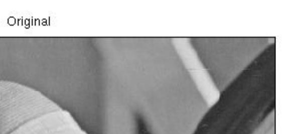

Reconstruction using 50 PCs

$$\widehat{x}_i = \overline{x} + U_{d \times p} (U_{d \times p})^T (x_i - \overline{x})$$

## **Advantages of Using SVD for PCA**

- No need to compute the covariance matrix  $S = XX^T$
- Numerically more accurate, since the formation of  $XX^T$  can cause loss of precision.
  - For example, the Läuchli matrix:

$$\begin{pmatrix} 1 & 1 & 1 \\ \epsilon & 0 & 0 \\ 0 & \epsilon & 0 \\ 0 & 0 & \epsilon \end{pmatrix}^T$$

where  $\epsilon$  is a tiny number.

#### **Visualize PCs**

The columns of U are eigenvectors of  $S = AA^T U^T x$ 

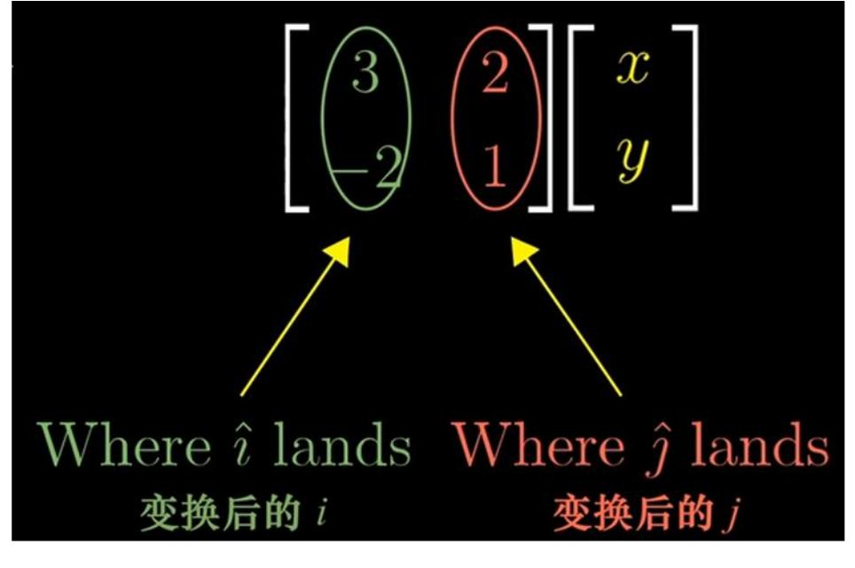

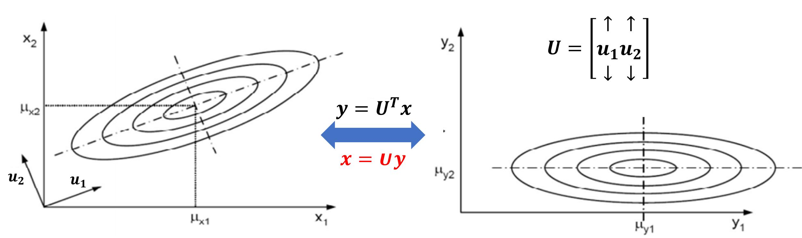

#### **Visualize PCs**

The columns of U are eigenvectors of  $S = AA^T$ .

$$y = U^T x$$

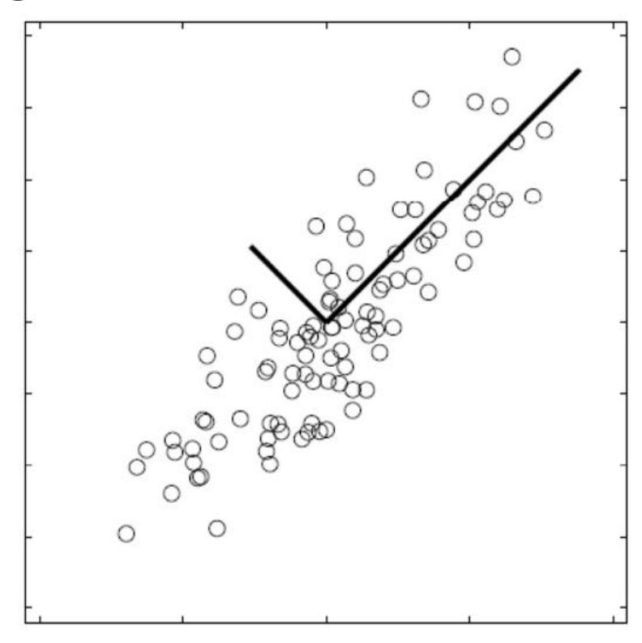

Data points are represented in a rotated orthogonal coordinate system: the origin is the mean of the data points and the axes are provided by the eigenvectors.

# **The Necessity of Centralization**

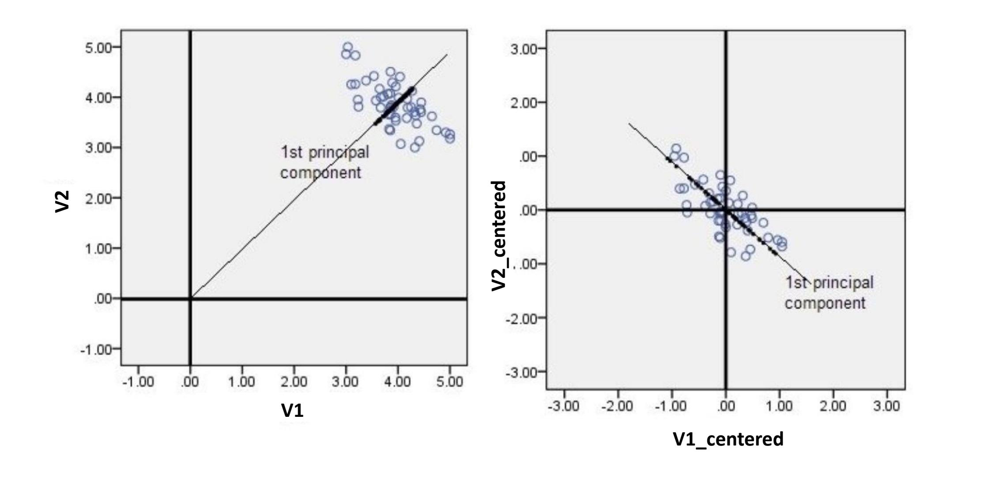

### **How Many PCs to Keep?**

To choose p based on percentage of energy to retain, we can use the following criterion (smallest p):

$$\frac{\sum_{i=1}^{p} \lambda_i}{\sum_{i=1}^{d} \lambda_i} \geq Threshold \quad (e.g., 0.95)$$

# **PCA‐Applications**

#### **Data Compression**

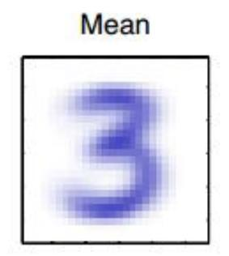

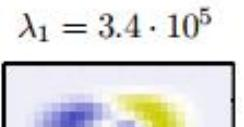

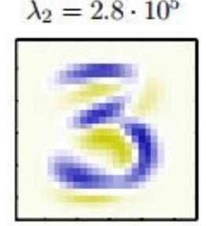

$$\lambda_3 = 2.4 \cdot 10^5$$

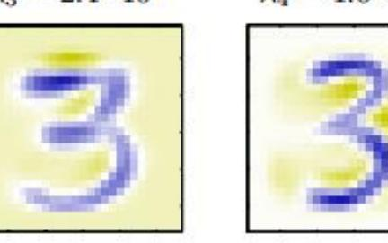

$$\lambda_4 = 1.6 \cdot 10^5$$

We represent the eigenvectors as images of the same size as the data points.

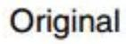

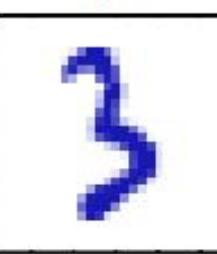

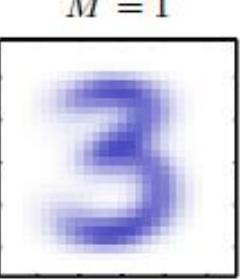

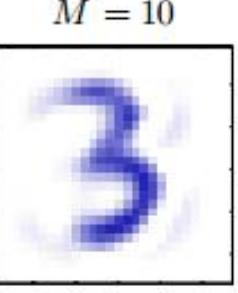

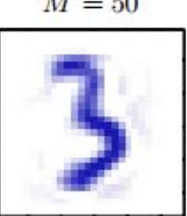

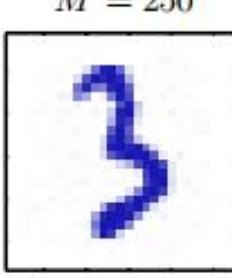

# **PCA‐Applications**

#### **Data Preprocessing**

- The goal is **not** dimensionality reduction but rather the transformation of a data set in order to **standardizing** the data.
- Important in allowing subsequent pattern recognition algorithms to be applied successfully to the data set.
- Typically, it is done when the original variables are measured in different order of magnitudes or have significantly different variability.

## **PCA-Applications**

#### **Data Preprocessing**

 The goal is not dimensionality reduction but rather the transformation of a data set in order to standardizing the data.

Traditionally, we can made a linear re-scaling of the individual variables such that each variable had zero mean and unit variance.

$$\frac{x_{ni} - \overline{x}_i}{\sigma_i}$$

However, using PCA we can make a more substantial normalization of the data to give it zero mean and unit covariance, so that variables become decorrelated.

## **PCA-Applications**

#### **Data Preprocessing**

• The goal is **not** dimensionality reduction but rather the transformation of a data set in order to **standardizing** the data.

We first write the eigenvalue decomposition  $SU = U\Lambda$ 

Then for each data point, we define  $y_n = \Lambda^{-\frac{1}{2}} U^T (x_n - \overline{x})$ 

Clearly,  $\{y_n\}$  have zero mean, and we thus have the covariance matrix

$$\frac{1}{m} \sum_{n=1}^{m} y_n y_n^T = \frac{1}{m} \sum_{n=1}^{m} \Lambda^{-\frac{1}{2}} U^T (x_n - \overline{x}) (x_n - \overline{x})^T U \Lambda^{-\frac{1}{2}} = \Lambda^{-\frac{1}{2}} U^T S U \Lambda^{-\frac{1}{2}} = \Lambda^{-\frac{1}{2}} \Lambda \Lambda^{-\frac{1}{2}} = I$$

This operation is known as whitening or sphereing the data

## **PCA-Applications**

#### **Data Preprocessing**

 The goal is not dimensionality reduction but rather the transform order to standardizing the data.

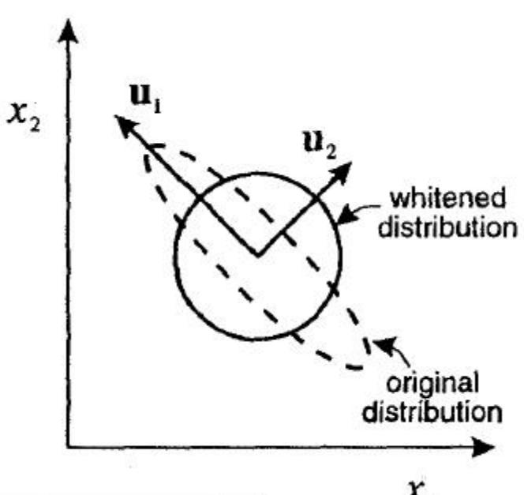

Principal axes of this normalized data set.

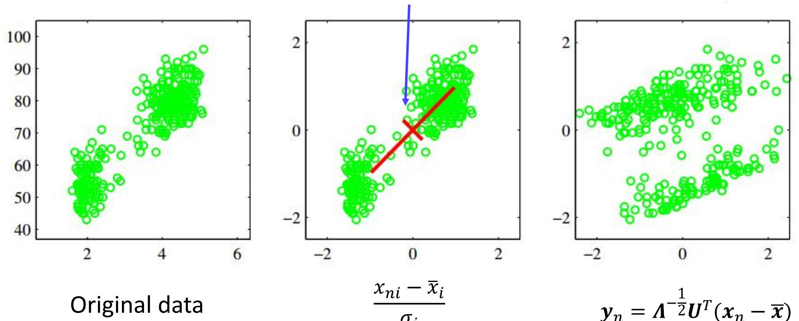

# **PCA‐Applications**

#### **Data Visualization**

• Each data point is projected onto a two‐dimensional principal subspace.

# **PCA and Classification**

- Classification with PCA
  - Project both training and testing data into the PCs space
  - For each testing sample, use Nearest Neighbor for classification
  - Issue: accuracy is sensitive to the number of PCs
- PCA may not be always an optimal feature extraction technique for classification.
  - Suppose there are classes in the training data
  - PCA is based on the sample covariance which characterizes the scatter of the entire data set, irrespective of class‐membership.
  - The projection axes chosen by PCA might not provide good discrimination power.

# **PCA and Classification**

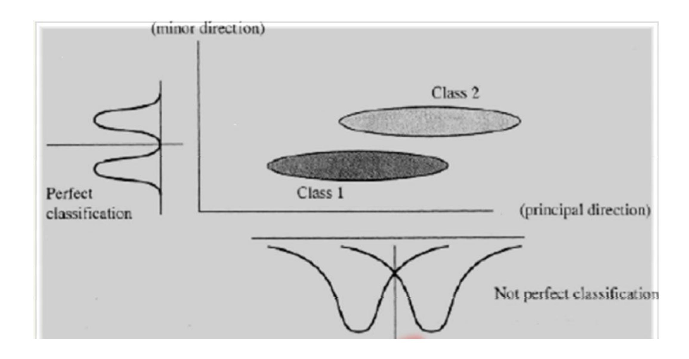

# **Summary**

- Two commonly used definitions of PCA
  - Maximum variance formulation
  - Minimum‐error formulation
- Covariance Matrix
  - Symmetric, Positive semi‐definite
- Lagrange Multiplier
  - Constrained system Unconstrained system
  - Critical points
- Data Point Reconstruction
- SVD
  - U, V orthogonal matrix
- PCA Applications

## **SVD** Application-Pseudoinverse

SVD can be used for computing the pseudoinverse of a matrix.

For  $A \in \mathbb{K}^{m*n}$ , a pseudoinverse of A is defined as a matrix  $A^{\dagger} \in \mathbb{K}^{n*m}$  satisfying all of the following four criteria, known as the Moore-Penrose conditions.

- $AA^{\dagger}A = A$
- $A^{\dagger}AA^{\dagger}=A^{\dagger}$
- $(AA^{\dagger})^* = AA^{\dagger}$  自共轭矩阵  $M_{ij} = \overline{M_{ji}}$
- $\bullet \quad (A^{\dagger}A)^* = A^{\dagger}A$