# **Machine Learning & Pattern Recognition**

## **Supervised Feature Extraction**

Ø **Linear Discriminant Analysis (LDA)**

## **Feature Extraction**

- Feature extraction (dimensionality reduction/feature reduction) refers to the mapping of the original **high‐dimensional** data into a **low‐dimensional** space.
- Criterion for feature reduction can be different based on different problem setting
  - ü Unsupervised setting: minimize the information loss
  - ü Supervisedsetting: maximize the class discrimination

## Linear Discriminant Analysis

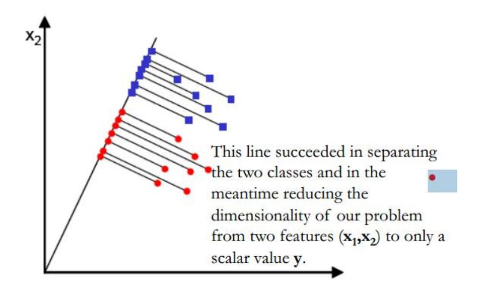

Linear Discriminant Analysis, a method to find a linearcombination of features that separates two or more classes of objects.

## Latent Dirichlet Allocation

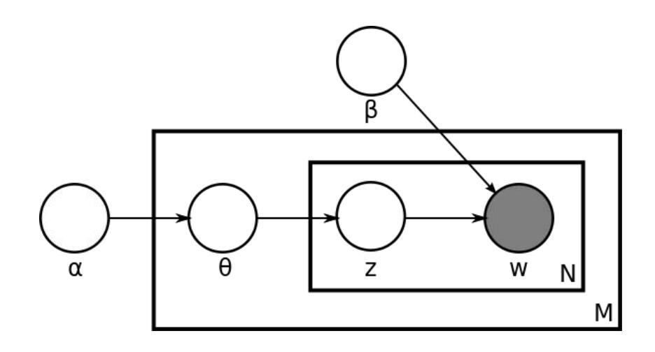

In natural language processing, latent Dirichlet allocation (LDA) is an example of a topic model. [https://en.wikipedia.org/wiki/Latent\\_Dirichlet\\_allocation](https://en.wikipedia.org/wiki/Latent_Dirichlet_allocation)

## Linear Discriminant Analysis

- Linear Discriminant Analysis—2 Classes
- Linear Discriminant Analysis— Classes

## **What is a Good Projection?**

• Given a set of points (2-d) from two classes, we want to project them to a line that can well separate them.

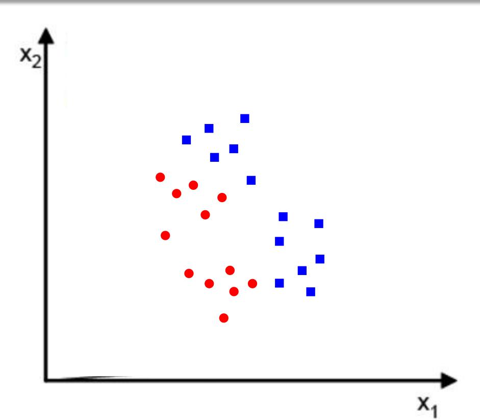

## **What is a Good Projection?**

- What is a good criterion?
  - Maximize the between-class distance (means) Is it enough?

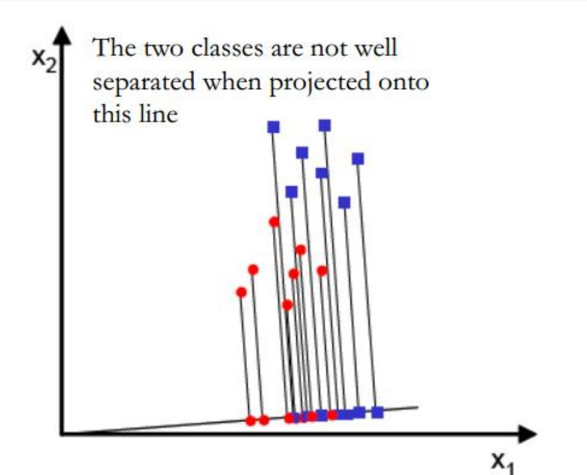

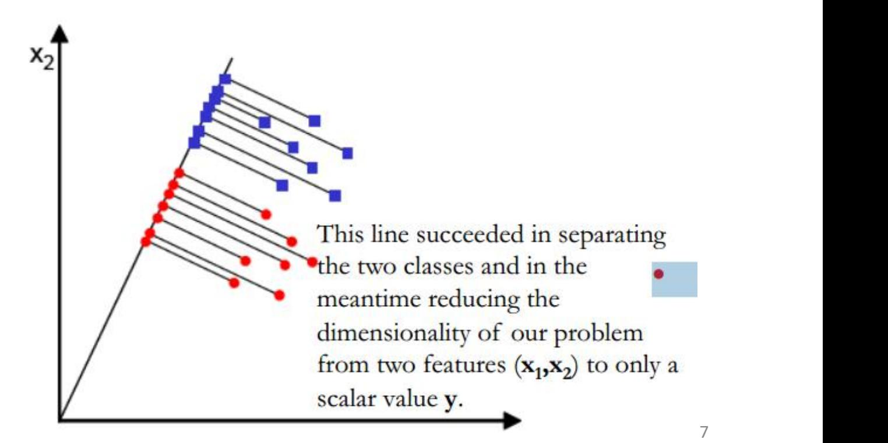

## **What is a Good Projection?**

- What is a good criterion?
  - Maximize the between-class distance (means)
  - Minimize the within-class variability (scatter)

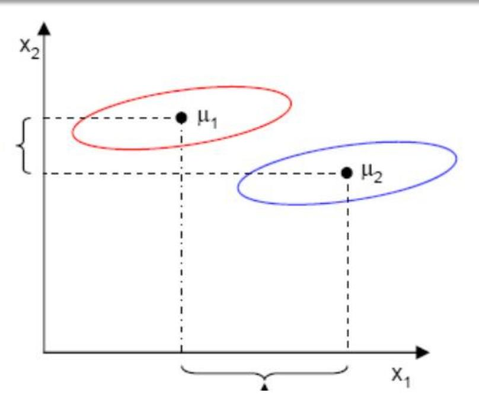

- Assume we have d-dimensional samples  $\{x_1, x_2, ..., x_N\}$ ,  $n_1$  of which belong to  $C_1$  and  $n_2$  belong to  $C_2$ .
- We seek to obtain a transformation  $\theta \in \mathbb{R}^{d \times 1}$  that projects the samples x onto a line (p = 1).

• 
$$y_i = \boldsymbol{\theta}^T \boldsymbol{x}_i$$
, where  $\boldsymbol{x}_i = \begin{bmatrix} x_{i1} \\ \vdots \\ x_{id} \end{bmatrix}$  and  $\boldsymbol{\theta} = \begin{bmatrix} \theta_1 \\ \vdots \\ \theta_d \end{bmatrix}$ 

where  $\theta$  is the projection vector used to project x to y.

• The mean vector of each class in x and y feature space is:

$$\mu_i = \frac{1}{n_i} \sum_{x \in C_i} x \qquad \qquad \tilde{\mu}_i = \frac{1}{n_i} \sum_{y \in C_i} y = \frac{1}{n_i} \sum_{x \in C_i} \theta^T x = \theta^T \mu_i$$

- Projecting x to y will lead to projecting the mean of x to the mean of y.
- Choose  $\theta$  to maximize the distance between the projected means:

$$J_1(\theta) = (\tilde{\mu}_1 - \tilde{\mu}_2)^2 = (\theta^T \mu_1 - \theta^T \mu_2)^2 = \theta^T (\mu_1 - \mu_2) (\mu_1 - \mu_2)^T \theta = \theta^T S_b \theta$$

Between-class scatter (类间散度矩阵):  $S_b = (\mu_1 - \mu_2)(\mu_1 - \mu_2)^T$   $S_b \in \mathbb{R}^{d \times d}$ 

- Meanwhile, to achieve a small variance within each class, i.e., minimizing the class overlap,
- We define the total within-class variance as  $s_1^2 + s_2^2$ .  $s_k^2 = \sum_{y \in C_k} (y \tilde{\mu}_k)^2$
- We want to choose  $\theta$  to minimize

$$J_2(\boldsymbol{\theta}) = \sum_{y \in C_1} (y - \tilde{\mu}_1)^2 + \sum_{y \in C_2} (y - \tilde{\mu}_2)^2 = \boldsymbol{\theta}^T S_w \boldsymbol{\theta}$$

Within-class scatter (类内散度矩阵):

$$S_w = \sum_{x \in C_1} (x - \mu_1)(x - \mu_1)^T + \sum_{x \in C_2} (x - \mu_2)(x - \mu_2)^T$$
  $S_w \in \mathbb{R}^{d \times d}$ 

• We can finally express the Fisher criterion in terms of  $S_w$  and  $S_b$ :

If  $\theta$  is one solution, then  $\alpha\theta$  would also be a solution.


$$\max_{\boldsymbol{\theta}} J(\boldsymbol{\theta}) = \frac{J_1(\boldsymbol{\theta})}{J_2(\boldsymbol{\theta})} = \frac{\boldsymbol{\theta}^T \boldsymbol{S}_b \boldsymbol{\theta}}{\boldsymbol{\theta}^T \boldsymbol{S}_w \boldsymbol{\theta}}$$

$$\min_{\boldsymbol{\theta}} - \boldsymbol{\theta}^T \boldsymbol{S}_b \boldsymbol{\theta}$$

s.t. 
$$\boldsymbol{\theta}^T \boldsymbol{S}_w \boldsymbol{\theta} = 1$$

• Let  $\lambda$  be a Lagrange multiplier

$$\min_{\boldsymbol{\theta}} J(\boldsymbol{\theta}) = -\boldsymbol{\theta}^T \boldsymbol{S}_b \boldsymbol{\theta} + \lambda (\boldsymbol{\theta}^T \boldsymbol{S}_w \boldsymbol{\theta} - 1)$$

• Let  $\lambda$  be a Lagrange multiplier

$$\min_{\boldsymbol{\theta}} J(\boldsymbol{\theta}) = -\boldsymbol{\theta}^T \boldsymbol{S}_b \boldsymbol{\theta} + \lambda (\boldsymbol{\theta}^T \boldsymbol{S}_w \boldsymbol{\theta} - 1)$$

$$\frac{\partial J(\boldsymbol{\theta})}{\partial \boldsymbol{\theta}} = -2\boldsymbol{S}_b \boldsymbol{\theta} + 2\lambda \boldsymbol{S}_w \boldsymbol{\theta} = 0 \qquad \Longrightarrow \qquad \boldsymbol{S}_b \boldsymbol{\theta} = \lambda \boldsymbol{S}_w \boldsymbol{\theta}$$

- $\theta$ : the eigenvectors of  $S_w^{-1}S_b$ , and  $\lambda$  is the corresponding eigenvalue.
- How to choose  $\theta$ ?

• Let  $\lambda$  be a Lagrange multiplier

$$\min_{\boldsymbol{\theta}} J(\boldsymbol{\theta}) = -\boldsymbol{\theta}^T \boldsymbol{S}_b \boldsymbol{\theta} + \lambda (\boldsymbol{\theta}^T \boldsymbol{S}_w \boldsymbol{\theta} - 1)$$

$$\frac{\partial J(\boldsymbol{\theta})}{\partial \boldsymbol{\theta}} = -2\boldsymbol{S}_b \boldsymbol{\theta} + 2\lambda \boldsymbol{S}_w \boldsymbol{\theta} = 0 \qquad \Longrightarrow \qquad \boldsymbol{S}_b \boldsymbol{\theta} = \lambda \boldsymbol{S}_w \boldsymbol{\theta}$$

Remember the objective function

$$\begin{cases} \min_{\boldsymbol{\theta}} - \boldsymbol{\theta}^T \boldsymbol{S}_b \boldsymbol{\theta} & \boldsymbol{S}_b \boldsymbol{\theta}^* = \lambda \boldsymbol{S}_w \boldsymbol{\theta}^* \\ \text{s.t. } \boldsymbol{\theta}^T \boldsymbol{S}_w \boldsymbol{\theta} = 1 \end{cases} \Longrightarrow -\boldsymbol{\theta}^{*T} \boldsymbol{S}_b \boldsymbol{\theta}^* = -\lambda \boldsymbol{\theta}^{*T} \boldsymbol{S}_w \boldsymbol{\theta}^* = -\lambda$$

How to choose? The eigenvector corresponds to the largest eigenvalue.

• Let  $\lambda$  be a Lagrange multiplier

$$\min_{\boldsymbol{\theta}} J(\boldsymbol{\theta}) = -\boldsymbol{\theta}^T \boldsymbol{S}_b \boldsymbol{\theta} + \lambda (\boldsymbol{\theta}^T \boldsymbol{S}_w \boldsymbol{\theta} - 1)$$

$$\frac{\partial J(\boldsymbol{\theta})}{\partial \boldsymbol{\theta}} = -2\boldsymbol{S}_b \boldsymbol{\theta} + 2\lambda \boldsymbol{S}_w \boldsymbol{\theta} = 0 \qquad \Longrightarrow \qquad \boldsymbol{S}_b \boldsymbol{\theta} = \lambda \boldsymbol{S}_w \boldsymbol{\theta}$$

- Alternatively, as  $S_b = (\mu_1 \mu_2)(\mu_1 \mu_2)^T$ ,  $S_b\theta = (\mu_1 \mu_2)(\mu_1 \mu_2)^T\theta$
- Let  $S_b\theta = \lambda_{\theta}(\mu_1 \mu_2)$  then  $\lambda_{\theta}(\mu_1 \mu_2) = \lambda S_w\theta$
- The scale of  $\theta^*$  does not matter, only direction matters.

$$\theta^* = S_w^{-1} (\mu_1 - \mu_2)$$

#### Workflow of LDA for the binary classification

- 1. Build  $X_1$  and  $X_2$  from the training set
- 2. Compute  $\mu_1$  and  $\mu_2$
- 3. Compute  $S_w$
- 4. Compute  $S_w^{-1}$
- 5. Compute  $\theta^* = S_w^{-1} (\mu_1 \mu_2)$
- 6. Given a testing sample,  $y = \theta^{*T}x$
- 7. Set the threshold  $\gamma = \frac{n_1 \theta^{*T} \mu_1 + n_2 \theta^{*T} \mu_2}{n_1 + n_2}$ .
- 8. Compare y with  $\gamma$  to determine the class.

Compute the Linear Discriminant projection for the following two dimensional dataset.

- Samples for class 1: <sup>1</sup> <sup>=</sup> (1, 2) = (4,2), (2,4), (2,3), (3,6), (4,4) Sample for class 2: <sup>2</sup> <sup>=</sup> (1, 2) = (9,10), (6,8), (9,5), (8,7), (10,8)

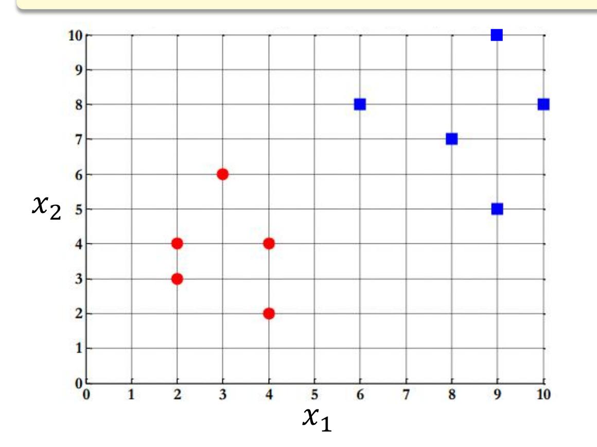

Compute the Linear Discriminant projection for the following two dimensional dataset.

- Samples for class 1: <sup>1</sup> <sup>=</sup> (1, 2) = (4,2), (2,4), (2,3), (3,6), (4,4) Sample for class 2: <sup>2</sup> <sup>=</sup> (1, 2) = (9,10), (6,8), (9,5), (8,7), (10,8)

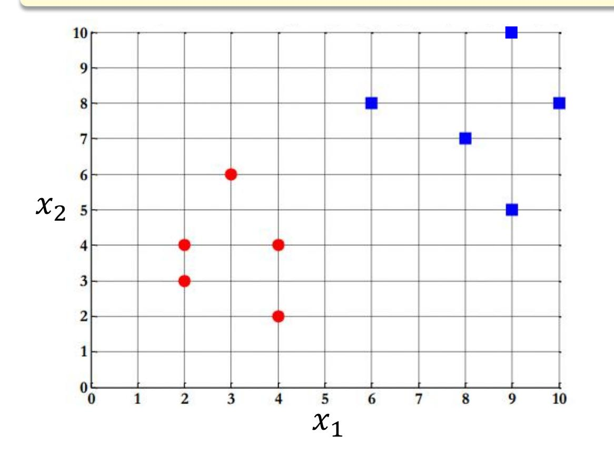

• Mean of each class:

$$\mu_{1} = \frac{1}{N_{1}} \sum_{x \in \omega_{1}} x = \frac{1}{5} \left[ \binom{4}{2} + \binom{2}{4} + \binom{2}{3} + \binom{3}{6} + \binom{4}{4} \right] = \binom{3}{3.8}$$

$$\mu_{2} = \frac{1}{N_{2}} \sum_{x \in \omega_{2}} x = \frac{1}{5} \left[ \binom{9}{10} + \binom{6}{8} + \binom{9}{5} + \binom{8}{7} + \binom{10}{8} \right] = \binom{8.4}{7.6}$$

Compute the Linear Discriminant projection for the following two dimensional dataset.

- Samples for class 1: <sup>1</sup> <sup>=</sup> (1, 2) = (4,2), (2,4), (2,3), (3,6), (4,4) Sample for class 2: <sup>2</sup> <sup>=</sup> (1, 2) = (9,10), (6,8), (9,5), (8,7), (10,8)

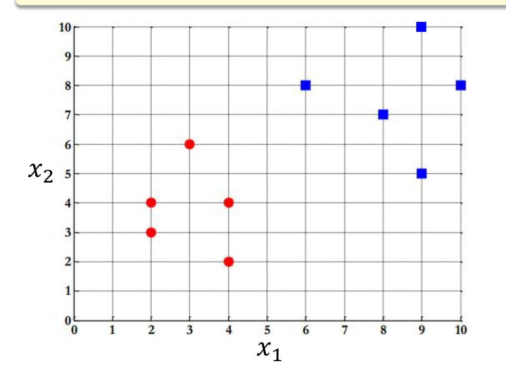

• Covariance matrix of the first class:

$$S_1 = \sum_{x \in \omega_1} (x - \mu_1)(x - \mu_1)^T = \begin{pmatrix} 1 & -0.25 \\ -0.25 & 2.2 \end{pmatrix}$$

Compute the Linear Discriminant projection for the following two dimensional dataset.

- Samples for class 1: <sup>1</sup> <sup>=</sup> (1, 2) = (4,2), (2,4), (2,3), (3,6), (4,4) Sample for class 2: <sup>2</sup> <sup>=</sup> (1, 2) = (9,10), (6,8), (9,5), (8,7), (10,8)

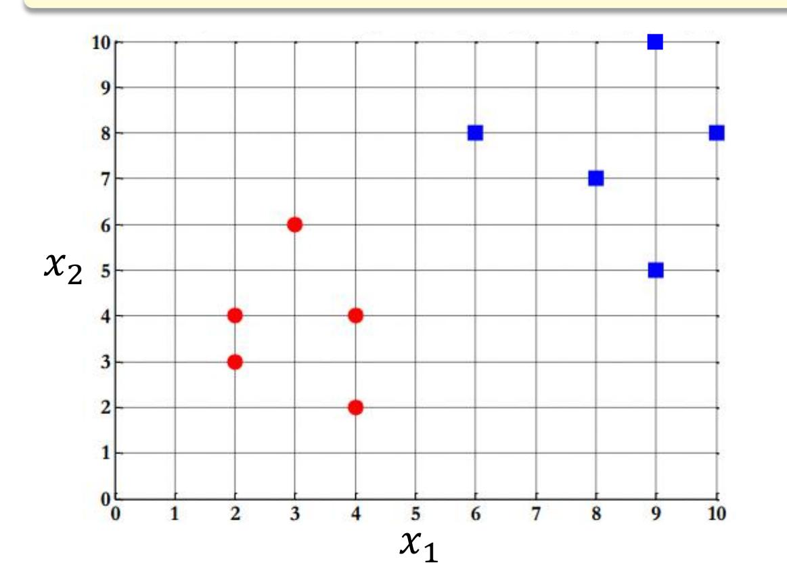

• Covariance matrix of the second class:

$$S_2 = \sum_{x \in \omega_2} (x - \mu_2)(x - \mu_2)^T = \begin{pmatrix} 2.3 & -0.05 \\ -0.05 & 3.3 \end{pmatrix}$$

Compute the Linear Discriminant projection for the following two dimensional dataset.

- Samples for class 1: <sup>1</sup> <sup>=</sup> (1, 2) = (4,2), (2,4), (2,3), (3,6), (4,4) Sample for class 2: <sup>2</sup> <sup>=</sup> (1, 2) = (9,10), (6,8), (9,5), (8,7), (10,8)

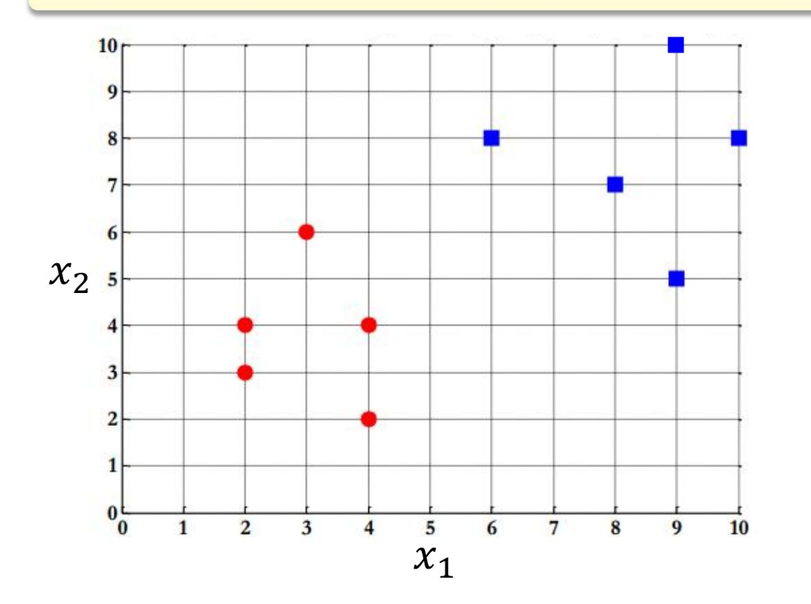

• Within-class scatter matrix:

$$S_{w} = S_{1} + S_{2} = \begin{pmatrix} 1 & -0.25 \\ -0.25 & 2.2 \end{pmatrix} + \begin{pmatrix} 2.3 & -0.05 \\ -0.05 & 3.3 \end{pmatrix}$$
$$= \begin{pmatrix} 3.3 & -0.3 \\ -0.3 & 5.5 \end{pmatrix}$$

Compute the Linear Discriminant projection for the following two dimensional dataset.

- Samples for class 1: <sup>1</sup> <sup>=</sup> (1, 2) = (4,2), (2,4), (2,3), (3,6), (4,4) Sample for class 2: <sup>2</sup> <sup>=</sup> (1, 2) = (9,10), (6,8), (9,5), (8,7), (10,8)


• Between-class scatter matrix:

$$S_{B} = (\mu_{1} - \mu_{2})(\mu_{1} - \mu_{2})^{T}$$

$$= \begin{bmatrix} 3 \\ 3.8 \end{bmatrix} - \begin{pmatrix} 8.4 \\ 7.6 \end{bmatrix} \begin{bmatrix} 3 \\ 3.8 \end{bmatrix} - \begin{pmatrix} 8.4 \\ 7.6 \end{bmatrix}^{T}$$

$$= \begin{pmatrix} -5.4 \\ -3.8 \end{pmatrix} (-5.4 - 3.8)$$

$$= \begin{pmatrix} 29.16 & 20.52 \\ 20.52 & 14.44 \end{pmatrix}$$

Compute the Linear Discriminant projection for the following two dimensional dataset.

- Samples for class 1: <sup>1</sup> <sup>=</sup> (1, 2) = (4,2), (2,4), (2,3), (3,6), (4,4) Sample for class 2: <sup>2</sup> <sup>=</sup> (1, 2) = (9,10), (6,8), (9,5), (8,7), (10,8)


$$\begin{split} S_W^{-1} S_B w &= \lambda w \\ \Rightarrow \left| S_W^{-1} S_B - \lambda I \right| = 0 \\ \Rightarrow \left| \begin{pmatrix} 3.3 & -0.3 \\ -0.3 & 5.5 \end{pmatrix}^{-1} \begin{pmatrix} 29.16 & 20.52 \\ 20.52 & 14.44 \end{pmatrix} - \lambda \begin{pmatrix} 1 & 0 \\ 0 & 1 \end{pmatrix} \right| = 0 \\ \Rightarrow \left| \begin{pmatrix} 0.3045 & 0.0166 \\ 0.0166 & 0.1827 \end{pmatrix} \begin{pmatrix} 29.16 & 20.52 \\ 20.52 & 14.44 \end{pmatrix} - \lambda \begin{pmatrix} 1 & 0 \\ 0 & 1 \end{pmatrix} \right| = 0 \\ \Rightarrow \left| \begin{pmatrix} 9.2213 - \lambda & 6.489 \\ 4.2339 & 2.9794 - \lambda \end{pmatrix} \right| \\ &= (9.2213 - \lambda)(2.9794 - \lambda) - 6.489 \times 4.2339 = 0 \\ \Rightarrow \lambda^2 - 12.2007\lambda = 0 \Rightarrow \lambda(\lambda - 12.2007) = 0 \\ \Rightarrow \lambda_1 = 0, \lambda_2 = 12.2007 \end{split}$$

Compute the Linear Discriminant projection for the following two dimensional dataset.

- Samples for class 1: <sup>1</sup> <sup>=</sup> (1, 2) = (4,2), (2,4), (2,3), (3,6), (4,4) Sample for class 2: <sup>2</sup> <sup>=</sup> (1, 2) = (9,10), (6,8), (9,5), (8,7), (10,8)

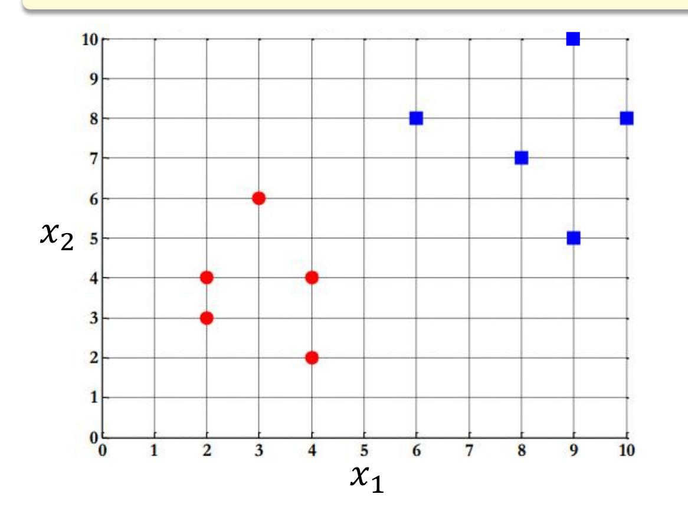

$$\begin{split} S_W^{-1} S_B w &= \lambda w \\ \Rightarrow \left| S_W^{-1} S_B - \lambda I \right| = 0 \\ \Rightarrow \left| \begin{pmatrix} 3.3 & -0.3 \\ -0.3 & 5.5 \end{pmatrix}^{-1} \begin{pmatrix} 29.16 & 20.52 \\ 20.52 & 14.44 \end{pmatrix} - \lambda \begin{pmatrix} 1 & 0 \\ 0 & 1 \end{pmatrix} \right| = 0 \\ \Rightarrow \left| \begin{pmatrix} 0.3045 & 0.0166 \\ 0.0166 & 0.1827 \end{pmatrix} \begin{pmatrix} 29.16 & 20.52 \\ 20.52 & 14.44 \end{pmatrix} - \lambda \begin{pmatrix} 1 & 0 \\ 0 & 1 \end{pmatrix} \right| = 0 \\ \Rightarrow \left| \begin{pmatrix} 9.2213 - \lambda & 6.489 \\ 4.2339 & 2.9794 - \lambda \end{pmatrix} \right| \\ &= (9.2213 - \lambda)(2.9794 - \lambda) - 6.489 \times 4.2339 = 0 \\ \Rightarrow \lambda^2 - 12.2007\lambda = 0 \Rightarrow \lambda(\lambda - 12.2007) = 0 \\ \Rightarrow \lambda_1 = 0, \lambda_2 = 12.2007 \end{split}$$

Compute the Linear Discriminant projection for the following two dimensional dataset.

- Samples for class 1: <sup>1</sup> <sup>=</sup> (1, 2) = (4,2), (2,4), (2,3), (3,6), (4,4) Sample for class 2: <sup>2</sup> <sup>=</sup> (1, 2) = (9,10), (6,8), (9,5), (8,7), (10,8)

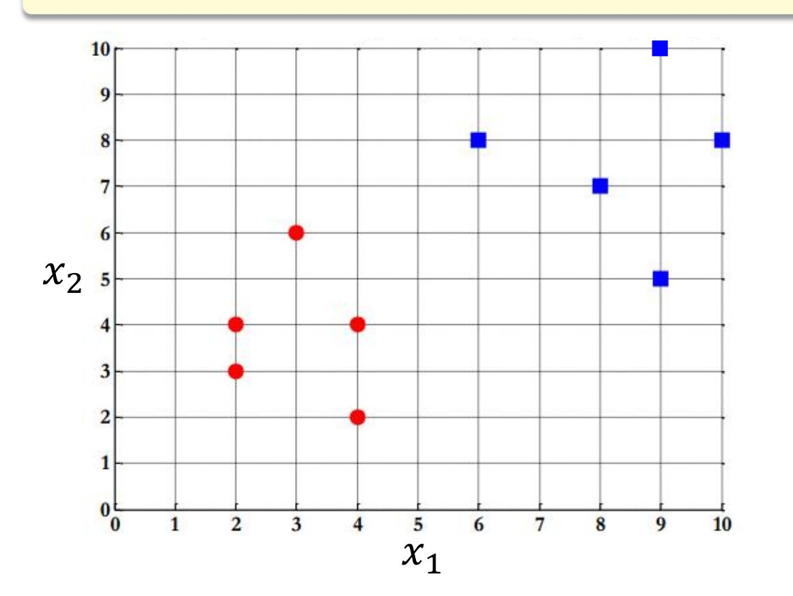

• The optimal projection is the one that minimizes =− =−

$$\begin{pmatrix} 9.2213 & 6.489 \\ 4.2339 & 2.9794 \end{pmatrix} w_1 = \underbrace{0}_{\lambda_1} \begin{pmatrix} w_1 \\ w_2 \end{pmatrix}$$
and
$$\begin{pmatrix} 9.2213 & 6.489 \\ 4.2339 & 2.9794 \end{pmatrix} w_2 = \underbrace{12.2007}_{\lambda_2} \begin{pmatrix} w_1 \\ w_2 \end{pmatrix}$$

$$w_1 = \begin{pmatrix} -0.5755 \\ 0.8178 \end{pmatrix}$$
 and

$$w_2 = \begin{pmatrix} 0.9088 \\ 0.4173 \end{pmatrix} = w^*$$

Compute the Linear Discriminant projection for the following two dimensional dataset.

- Samples for class 1: <sup>1</sup> <sup>=</sup> (1, 2) = (4,2), (2,4), (2,3), (3,6), (4,4) Sample for class 2: <sup>2</sup> <sup>=</sup> (1, 2) = (9,10), (6,8), (9,5), (8,7), (10,8)

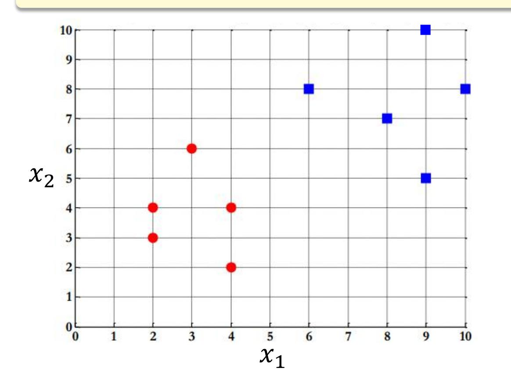

• Or directly,

$$v^* = S_W^{-1}(\mu_1 - \mu_2) = \begin{pmatrix} 3.3 & -0.3 \\ -0.3 & 5.5 \end{pmatrix}^{-1} \begin{bmatrix} 3 \\ 3.8 \end{pmatrix} - \begin{pmatrix} 8.4 \\ 7.6 \end{pmatrix} \end{bmatrix}$$
$$= \begin{pmatrix} 0.3045 & 0.0166 \\ 0.0166 & 0.1827 \end{pmatrix} \begin{pmatrix} -5.4 \\ -3.8 \end{pmatrix}$$
$$\propto \begin{pmatrix} 0.9088 \\ 0.4173 \end{pmatrix}$$

Example **LDA‐‐Projection** <sup>2</sup> 概率密度函数

<sup>1</sup>

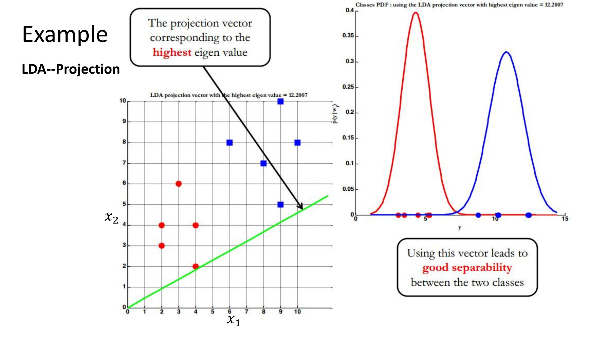

#### Workflow of LDA for the binary classification

- 1. Build  $X_1$  and  $X_2$  from the training set
- 2. Compute  $\mu_1$  and  $\mu_2$
- 3. Compute  $S_w$
- 4. Compute  $S_w^{-1}$
- 5. Compute  $\theta^* = S_w^{-1} (\mu_1 \mu_2)$
- 6. Given a testing sample,  $y = \theta^{*T}x$
- 7. Set the threshold  $\gamma = \frac{n_1 \theta^{*T} \mu_1 + n_2 \theta^{*T} \mu_2}{n_1 + n_2}$ .
- 8. Compare y with  $\gamma$  to determine the class.

- Assume we have  $\it C$  classes, each class has  $\it n_i d$ -dimensional samples, where  $\it i=1,2,...,\it C$
- A transformation  $\Theta \in \mathbb{R}^{d \times p}$ : project the samples in X onto Y ( $p \ll d$ ). In fact,  $p \leq C-1$ , we will see later.

$$\mathbf{y}_i = \mathbf{\Theta}^T \mathbf{x}_i$$

$$\mathbf{x}_i = \begin{bmatrix} x_{i1} \\ x_{i2} \\ \vdots \\ x_{id} \end{bmatrix} \qquad \mathbf{y}_i = \begin{bmatrix} y_{i1} \\ y_{i2} \\ \vdots \\ y_{ip} \end{bmatrix} \qquad \mathbf{\Theta} = \begin{bmatrix} \boldsymbol{\theta}_1, \boldsymbol{\theta}_2, ..., \boldsymbol{\theta}_p \end{bmatrix} \in \mathbb{R}^{d \times p}$$

- We have N d-dimensional samples from C classes, e.g., seabass, tuna, ...
- Each class has  $n_i$  samples, where i = 1, 2, ..., C
- Stacking these samples from different classes into one big fat matrix  $X \in \mathbb{R}^{d \times N}$  such that each column represents one sample  $x \in \mathbb{R}^{d \times 1}$ .
- We aim to obtain a transformation  $\Theta \in \mathbb{R}^{d \times p}$  to project the d-dimensional samples in X onto a p-dimensional subspace (p < d), such that after the projection we have: In fact,  $p \le C -1$ , we will see later.

| class means to be as far apart from each other as possible                  | <b>→</b> | the <b>between-class</b> scatter to be <b>large</b> |
|-----------------------------------------------------------------------------|----------|-----------------------------------------------------|
| samples from the same class to be as <b>close</b> to their mean as possible | <b>→</b> | the <b>within-class</b> scatter to be <b>small</b>  |

The generalization of the within-class covariance matrix to the case of C classes.

Within-class scatter:

$$S_w = \sum_{i=1}^{C} S_{wi}$$
  $S_{wi} = \sum_{x \in C_i} (x - \mu_i)(x - \mu_i)^T$   $S_w \in \mathbb{R}^{d \times d}$ 

Class mean vector (sample):  $\mu_i = \frac{1}{n_i} \sum_{x \in C_i} x, \, \mu_i \in \mathbb{R}^{d \times 1}$ 

In order to find a generalization of the between-class covariance matrix, we follow Duda and Hart (1973) and consider the total covariance matrix first.

$$S_t = \sum_{i=1}^{N} (x_i - \mu)(x_i - \mu)^T$$
  $\mu = \frac{1}{N} \sum_{i=1}^{N} x_i$ 

The total covariance matrix can be decomposed into

$$S_t = S_w + S_b$$

Between-class scatter:

$$S_b = \sum_{i=1}^{C} n_i (\mu_i - \mu) (\mu_i - \mu)^T = \frac{1}{2N} \sum_{i,j=1}^{C} n_i n_j (\mu_i - \mu_j) (\mu_i - \mu_j)^T$$
  $S_b \in \mathbb{R}^{d \times d}$ 

$$S_t = \sum_{x} (x - \mu)(x - \mu)^T = S_w + S_b$$

$$S_w = \sum_{i=1}^{C} \sum_{x \in C_i} (x - \mu_i)(x - \mu_i)^T$$

$$S_b = \sum_{i=1}^{C} n_i(\mu_i - \mu)(\mu_i - \mu)^T$$

$$S_{t} = \sum_{x} (x - \mu)(x - \mu)^{T} = \sum_{i=1}^{C} \sum_{j=1}^{n_{i}} (x_{ij} - \mu)(x_{ij} - \mu)^{T} \qquad x_{ij} \in C_{i}$$

$$= \sum_{i=1}^{C} \sum_{j=1}^{n_{i}} [(x_{ij} - \mu_{i}) + (\mu_{i} - \mu)][(x_{ij} - \mu_{i}) + (\mu_{i} - \mu)]^{T}$$

$$= \sum_{i=1}^{C} \sum_{j=1}^{n_{i}} [(x_{ij} - \mu_{i})(x_{ij} - \mu_{i})^{T} + (\mu_{i} - \mu)(x_{ij} - \mu_{i})^{T} + (x_{ij} - \mu_{i})(\mu_{i} - \mu)^{T} + (\mu_{i} - \mu)(\mu_{i} - \mu)^{T}]$$

$$= \sum_{i=1}^{C} \sum_{j=1}^{n_{i}} [(x_{ij} - \mu_{i})(x_{ij} - \mu_{i})^{T} + (\mu_{i} - \mu)(\mu_{i} - \mu)^{T}] = S_{w} + S_{b}$$

$$\sum_{i=1}^{C} \sum_{j=1}^{n_i} (\mu_i - \mu) (x_{ij} - \mu_i)^T = \sum_{i=1}^{C} (\mu_i - \mu) (\sum_{j=1}^{n_i} x_{ij} - \sum_{j=1}^{n_i} \mu_i)^T = 0$$

- Assume we have  $\it C$  classes, each class has  $\it n_i d$ -dimensional samples, where  $\it i=1,2,...,\it C$
- A transformation  $\Theta \in \mathbb{R}^{d \times p}$ : project the samples in X onto Y ( $p \ll d$ ). In fact,  $p \leq C-1$ , we will see later.

$$\begin{aligned} \boldsymbol{y}_i &= \boldsymbol{\Theta}^T \boldsymbol{x}_i \ \boldsymbol{x}_i &= \begin{bmatrix} x_{i1} \ x_{i2} \ \vdots \ y_{in} \ \end{bmatrix} & \boldsymbol{y}_i &= \begin{bmatrix} y_{i1} \ y_{i2} \ \vdots \ y_{in} \ \end{bmatrix} & \boldsymbol{\Theta} &= \begin{bmatrix} \boldsymbol{\theta}_1, \boldsymbol{\theta}_2, ..., \boldsymbol{\theta}_p \end{bmatrix} \in \mathbb{R}^{d \times p} \end{aligned}$$

$$\tilde{S}_{w} = \boldsymbol{\Theta}^{T} S_{w} \boldsymbol{\Theta}$$
  $\tilde{S}_{b} = \boldsymbol{\Theta}^{T} S_{b} \boldsymbol{\Theta}$   $\tilde{\boldsymbol{\mu}}_{i} = \boldsymbol{\Theta}^{T} \boldsymbol{\mu}_{i}$   $\tilde{\boldsymbol{\mu}} = \boldsymbol{\Theta}^{T} \boldsymbol{\mu}_{i}$ 

Popular objective function:

$$J_1(\mathbf{\Theta}) = \max_{\mathbf{\Theta}} \frac{tr(\tilde{\mathbf{S}}_b)}{tr(\tilde{\mathbf{S}}_w)} = \max_{\mathbf{\Theta}} \frac{tr(\mathbf{\Theta}^T \mathbf{S}_b \mathbf{\Theta})}{tr(\mathbf{\Theta}^T \mathbf{S}_w \mathbf{\Theta})}$$

$$J_2(\mathbf{\Theta}) = \max_{\mathbf{\Theta}} tr(\tilde{\mathbf{S}}_w^{-1} \tilde{\mathbf{S}}_b) = \max_{\mathbf{\Theta}} tr((\mathbf{\Theta}^T \mathbf{S}_w \mathbf{\Theta})^{-1} \mathbf{\Theta}^T \mathbf{S}_b \mathbf{\Theta})$$

$$J_3(\mathbf{\Theta}) = \frac{|\tilde{\mathbf{S}}_b|}{|\tilde{\mathbf{S}}_w|}$$

This technique was developed by R. A. Fisher (1936) for **the two-class case** and extended by C. R. Rao (1948) to handle **the multiclass case**.

In  $J_1(\Theta)$ , what is the meaning of "trace"?

$$J_1(\mathbf{\Theta}) = \max_{\mathbf{\Theta}} \frac{tr(\tilde{\mathbf{S}}_b)}{tr(\tilde{\mathbf{S}}_w)} = \max_{\mathbf{\Theta}} \frac{tr(\mathbf{\Theta}^T \mathbf{S}_b \mathbf{\Theta})}{tr(\mathbf{\Theta}^T \mathbf{S}_w \mathbf{\Theta})}$$

$$\mathbf{\Theta}^{T} \mathbf{S}_{b} \mathbf{\Theta} = \begin{bmatrix} \boldsymbol{\theta}_{1}^{T} \\ \vdots \\ \boldsymbol{\theta}_{p}^{T} \end{bmatrix} \mathbf{S}_{b} [\boldsymbol{\theta}_{1}, \boldsymbol{\theta}_{2}, ..., \boldsymbol{\theta}_{p}] = \begin{bmatrix} \boldsymbol{\theta}_{1}^{T} \\ \vdots \\ \boldsymbol{\theta}_{p}^{T} \end{bmatrix} [\mathbf{S}_{b} \boldsymbol{\theta}_{1}, \mathbf{S}_{b} \boldsymbol{\theta}_{2}, ..., \mathbf{S}_{b} \boldsymbol{\theta}_{p}]$$

$$tr(\mathbf{\Theta}^T \mathbf{S}_b \mathbf{\Theta}) = \sum_{i=1}^p \boldsymbol{\theta}_i^T \mathbf{S}_b \boldsymbol{\theta}_i$$
  $tr(\mathbf{\Theta}^T \mathbf{S}_w \mathbf{\Theta}) = \sum_{i=1}^p \boldsymbol{\theta}_i^T \mathbf{S}_w \boldsymbol{\theta}_i$ 

#### Optimization $J_1(\mathbf{\Theta})$ :

Recall in two-classes case, we solved the eigenvalue problem.

$$\min_{\boldsymbol{\theta}} - \boldsymbol{\theta}^T \boldsymbol{S}_b \boldsymbol{\theta}$$
s.t.  $\boldsymbol{\theta}^T \boldsymbol{S}_w \boldsymbol{\theta} = 1$ 

$$\Rightarrow \boldsymbol{S}_b \boldsymbol{\theta} = \lambda \boldsymbol{S}_w \boldsymbol{\theta}$$

For C-classes case, we have p projection vectors,

$$S_w^{-1}S_b\theta_i = \lambda\theta_i, i = 1,2,...,p$$

Columns of  $\Theta^*$  are eigenvectors corresponding to the largest eigenvalues:

$$S_w^{-1}S_b\mathbf{\Theta}^* = \lambda\mathbf{\Theta}^*$$
  $\mathbf{\Theta}^* = [\boldsymbol{\theta}_1^*, \boldsymbol{\theta}_2^*, ..., \boldsymbol{\theta}_p^*]$   $p \leq C - 1$ , why?

- $S_b$  has a maximum rank of C-1.
  - $S_b$  is the sum of  $C \ rank = 1$  matrices, and because only C-1 of these are independent,

$$S_b = \sum_{i=1}^C \frac{n_i}{N} (\boldsymbol{\mu}_i - \boldsymbol{\mu}) (\boldsymbol{\mu}_i - \boldsymbol{\mu})^T$$

Given a matrix  $A_{m \times n}$  and  $B_{n \times k}$ ,

- $\rArr rank(A + B) \le rank(A) + rank(B)$

$$rank((\boldsymbol{\mu}_i - \boldsymbol{\mu})(\boldsymbol{\mu}_i - \boldsymbol{\mu})^T) = rank(\boldsymbol{\mu}_i - \boldsymbol{\mu}) \le 1 \qquad rank(\boldsymbol{S}_w^{-1}\boldsymbol{S}_b) \le rank(\boldsymbol{S}_b) \le C - 1$$

 $S_w^{-1}S_b$  has at most C-1 nonzero eigenvalues.

Zero eigenvalue does not alter the value of  $J_1(\mathbf{\Theta})$ .

#### Workflow of LDA for the C-classification

- 1. Compute  $\mu_i$
- 2. Compute  $S_b$
- 3. Compute  $S_w^{-1}$
- 4. Compute the largest p eigenvalues of  $S_w^{-1}S_b$  and the corresponding eigenvectors  $\{\theta_1, \theta_2, ..., \theta_p\}$ .
- 5. Let  $\mathbf{\Theta} = [\boldsymbol{\theta}_1, \boldsymbol{\theta}_2, ..., \boldsymbol{\theta}_p]$ , then  $\boldsymbol{y}_i = \mathbf{\Theta}^T \boldsymbol{x}_i$

## Illustration-3 Classes

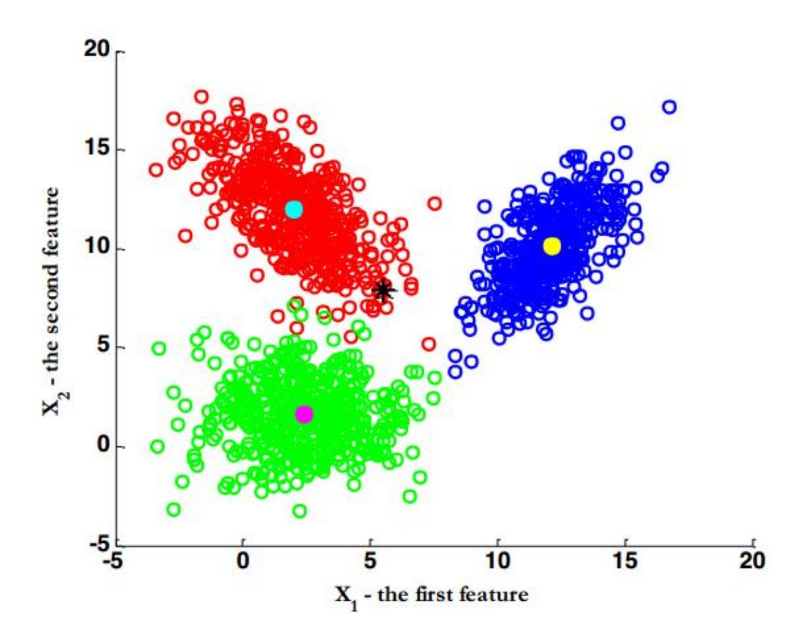

```
%% computing the LDA
% class means
Mu1 = mean(X1')';
Mu2 = mean(X2')';
Mu3 = mean(X3')';
% overall mean
Mu = (Mu1 + Mu2 + Mu3)./3;
% class covariance matrices
S1 = cov(X1');
S2 = cov(X2');
s3 = cov(X3);
% within-class scatter matrix
SW = S1 + S2 + S3;
% number of samples of each class
N1 = size(X1,2);
N2 = size(X2,2);
N3 = size(X3, 2);
% between-class scatter matrix
SB1 = N1 .* (Mu1-Mu) * (Mu1-Mu) ';
SB2 = N2 .* (Mu2-Mu) * (Mu2-Mu) ';
SB3 = N3 .* (Mu3-Mu) * (Mu3-Mu) ';
SB = SB1 + SB2 + SB3;
% computing the LDA projection
invSw = inv(Sw);
invSw by SB = invSw * SB;
% getting the projection vectors
%[V,D] = EIG(X) produces a diagonal matrix D of eigenvalues and a
%full matrix V whose columns are the corresponding eigenvectors
[V,D] = eig(invSw by SB);
% the projection vectors - we will have at most C-1 projection vectors,
% from which we can choose the most important ones ranked by their
* corresponding eigen values ... lets investigate the two projection
% vectors
W1 = V(:,1);
W2 = V(:,2);
```

#### Recall ...

$$S_{W} = \sum_{i=1}^{C} S_{i}$$
where  $S_{i} = \sum_{x \in \omega_{i}} (x - \mu_{i})(x - \mu_{i})^{T}$ 
and  $\mu_{i} = \frac{1}{N_{i}} \sum_{x \in \omega_{i}} x$ 

$$S_B = \sum_{i=1}^{C} N_i (\mu_i - \mu) (\mu_i - \mu)^T$$

$$S_B = \sum_{i=1}^C N_i (\mu_i - \mu)(\mu_i - \mu)^T$$

$$where \qquad \mu = \frac{1}{N} \sum_{\forall x} x = \frac{1}{N} \sum_{\forall x} N_i \mu_i$$

and 
$$\mu_i = \frac{1}{N_i} \sum_{x \in \omega_i} x$$

```
43 2
```

#### Along <u>first</u> projection vector $y = w_1^T x$

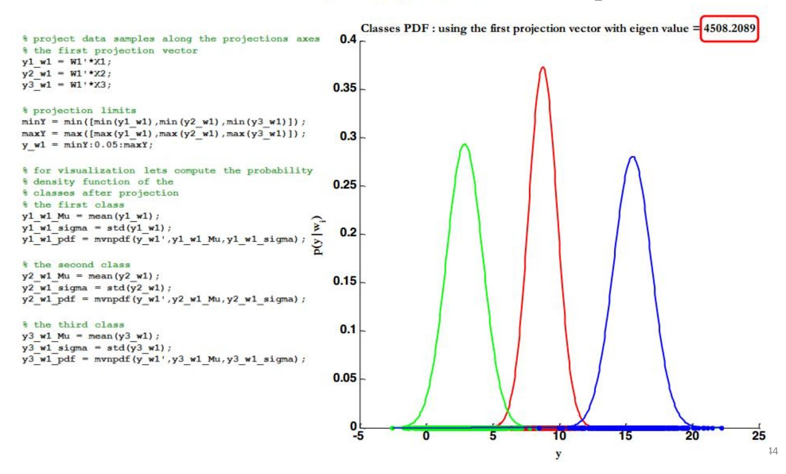

#### Along second projection vector $y = w_2^T x$

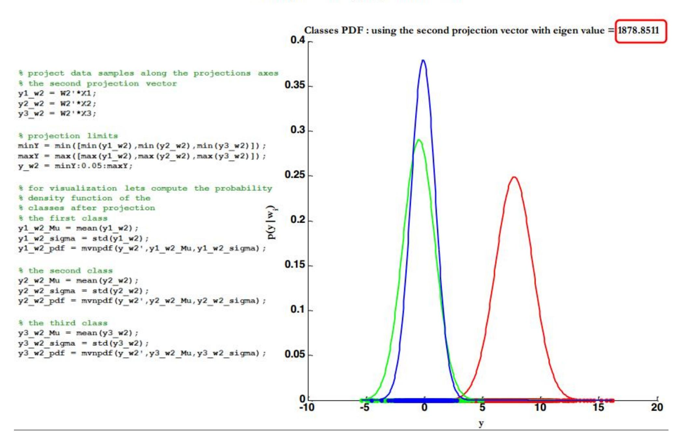

Apparently, the projection vector that has the highest eigenvalue provides higher discrimination power between classes.

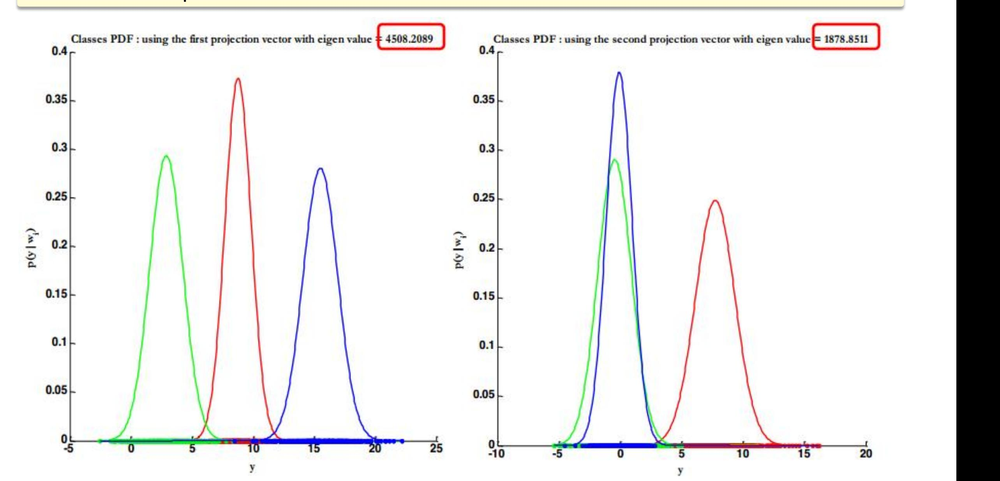

#### Summary

- Linear Discriminant Analysis—Two Classes
  - Minimize within-class scatter
  - Maximize between-class scatter
  - The eigenvector of the largest eigenvalue of  $S_w^{-1}S_b$  (as  $-\theta^*^TS_b\theta^* = -\lambda\theta^*^TS_w\theta^* = -\lambda$ )
  - Or  $\theta^* = S_w^{-1} (\mu_1 \mu_2)$
- Linear Discriminant Analysis—C Classes
  - Dimension reduction.  $\mathbf{\Theta} \in \mathbb{R}^{d \times p} : \mathbf{X} \to \mathbf{Y} \ (p \ll d)$ . In fact,  $p \leq C 1$ .
  - Columns of  $\mathbf{\Theta}^*$  are eigenvectors of  $\mathbf{S}_w^{-1}\mathbf{S}_b$  corresponding to the p largest eigenvalues.

## Backup Slides

#### **Statistical Facts**

Between-class scatter:

$$S_b = \sum_{i=1}^{C} n_i (\mu_i - \mu) (\mu_i - \mu)^T = \frac{1}{2N} \sum_{i,j=1}^{C} n_i n_j (\mu_i - \mu_j) (\mu_i - \mu_j)^T$$

$$\frac{1}{2N} \sum_{i,j=1}^{C} n_i n_j (\mu_i - \mu_j) (\mu_i - \mu_j)^T = \frac{1}{2N} \sum_{i,j=1}^{C} n_i n_j [(\mu_i - \mu) + (\mu - \mu_j)] [(\mu_i - \mu) + (\mu - \mu_j)]^T$$

$$= \frac{1}{2N} \sum_{i,j=1}^{C} n_i n_j [(\mu_i - \mu) (\mu_i - \mu)^T + (\mu - \mu_j) (\mu_i - \mu)^T + (\mu_i - \mu) (\mu - \mu_j)^T + (\mu - \mu_j) (\mu - \mu_j)^T]$$

$$= \frac{1}{2N} \sum_{i,j=1}^{C} n_i n_j [(\mu_i - \mu) (\mu_i - \mu)^T + (\mu - \mu_j) (\mu - \mu_j)^T]$$

$$= \frac{1}{2N} \sum_{i=1}^{C} n_i (\mu_i - \mu) (\mu_i - \mu)^T + \frac{1}{2N} \sum_{i=1}^{C} n_i (\mu - \mu_i) (\mu - \mu_i)^T$$

$$= \sum_{i=1}^{C} n_i (\mu_i - \mu) (\mu_i - \mu)^T = \mathbf{S}_b$$

- The least-squares approach: based on the goal of making the model predictions as close as possible to a set of target values.
- By contrast, the LDA (Fisher criterion) was derived by requiring maximum class separation in the output space.

It is interesting to see the relationship between these two approaches.

- We adopt a slightly different target coding scheme instead of {1,-1}.
  - Then the least-squares solution becomes equivalent to the Fisher solution (Duda and Hart, 1973).
- In particular, we shall take the targets  $(y_i)$  for class  $C_1$  to be  $\frac{N}{n_1}$ .
- For class  $C_2$ , we shall take the targets  $(y_i)$  to be  $-\frac{N}{n_2}$ .
  - $(n_1 + n_2 = N)$

$$J = \frac{1}{2} \sum_{n=1}^{N} (\mathbf{w}^{T} \mathbf{x}_{n} + b - y_{n})^{2}$$

$$E = \frac{1}{2} \sum_{n=1}^{N} (\mathbf{w}^{T} \mathbf{x}_{n} + b - y_{n})^{2}$$

$$\frac{\partial E}{\partial b} = 0 \implies \sum_{n=1}^{N} (\mathbf{w}^T \mathbf{x}_n + b - y_n) = 0$$

$$\frac{\partial E}{\partial \mathbf{w}} = 0 \implies \sum_{n=1}^{N} (\mathbf{w}^T \mathbf{x}_n + b - y_n) \mathbf{x}_n = 0$$

$$\sum_{n=1}^{N} y_n = n_1 \frac{N}{n_1} - n_2 \frac{N}{n_2} = 0 \qquad \Longrightarrow \qquad \mathbf{m} = \frac{1}{N} \sum_{n=1}^{N} \mathbf{x_n}$$
$$= \frac{1}{N} (n_1 \mathbf{m_1} + n_2 \mathbf{m_2})$$

$$\frac{\partial E}{\partial \boldsymbol{w}} = 0 \qquad \qquad \sum_{n=1}^{N} (\boldsymbol{w}^T \boldsymbol{x}_n + b - y_n) \boldsymbol{x}_n = 0$$

$$\boldsymbol{b} = -\boldsymbol{w}^T \boldsymbol{m} \qquad \bigcup \quad \boldsymbol{m} = \frac{1}{N} (n_1 \boldsymbol{m}_1 + n_2 \boldsymbol{m}_2)$$

$$\left( \boldsymbol{S}_w + \frac{n_1 n_2}{N} \boldsymbol{S}_b \right) \boldsymbol{w} = N(\boldsymbol{m}_1 - \boldsymbol{m}_2) \qquad \text{Leave for your homework}$$

$${\it S}_b w$$
 is always in the direction of  $(m_2-m_1)$ 

$$w \propto S_w^{-1}(m_2 - m_1)$$

This tells us that a new vector should be classified as belonging to class <sup>1</sup> if () = ( − ) > 0 and class <sup>2</sup> otherwise.

**For the two‐class problem, LDA can be obtained as a special case of least squares.**