# **Machine Learning & Pattern Recognition**

# **Feature Selection**

# **Supervised Learning**

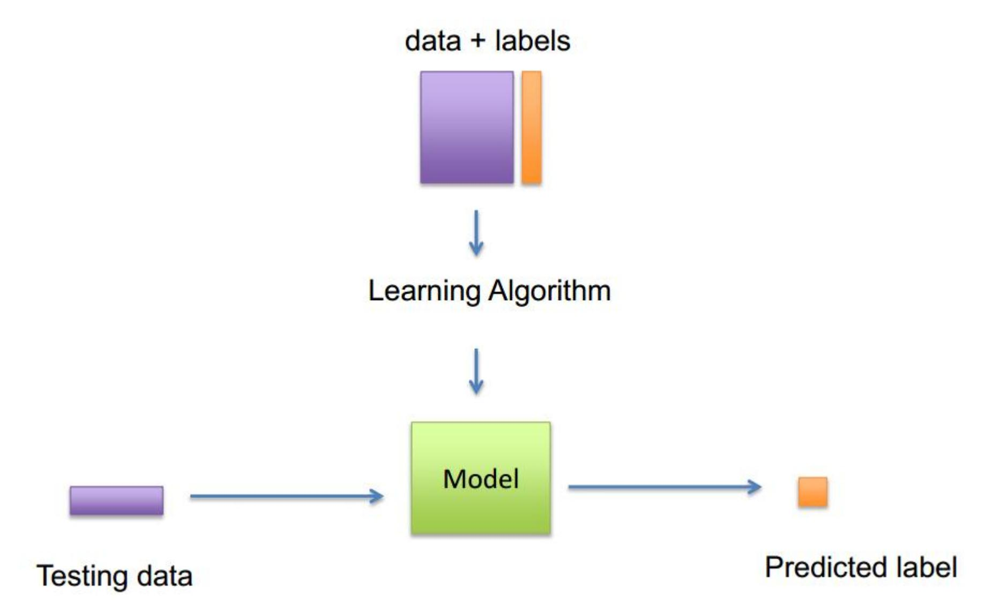

#### **Text Classification**

#### Is the story "interesting"?

It was a bright cold day in April, and the clocks were striking thirteen. Winston Smith, his chin nuzzled into his breast in an effort to escape the vile wind, slipped quickly through the glass doors of Victory Mansions, though not quickly enough to prevent a swirl of gritty dust from entering along with him.

#### **Bag-of-words representation:**

$$x = \{0,2,0,0,1,...,4,0,0,0,1\}$$

One entry per word!

#### Easily 50,000 words! With big data...

- > Time complexity
- Computational cost
- Overfitting

**Feature selection** 

# **Some Things Matter, Some Do Not**

- *Relevant* features
  - Those that we **need** to perform well
- *Irrelevant* features
  - Those that are simply **unnecessary**
- *Redundant* features
  - Those that **become** irrelevant in the presence of others

# **Feature Selection**

**Given: <sup>a</sup> set of features** <sup>=</sup> {1, 2, …} **and <sup>a</sup> target variable** . **Find: minimum set that achieves maximum classification performance of (for a given set of classifiers and classification performance metrics)**

# **Feature Selection Techniques**

• **Wrappers methods**

• **Filters methods**

• **Embedded methods**

# Feature Section (1): Wrapper Methods

Principle: We want to predict Y given the smallest possible subset of  $X = \{X_1, X_2, ... X_D\}$  while achieving maximal performance (e.g., accuracy).

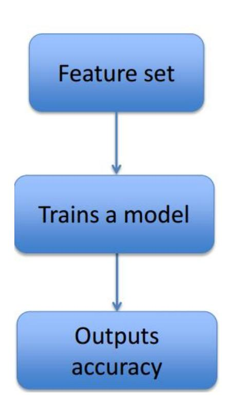

#### Pros:

- Model-oriented
- Usually gets good performance for the model you choose

#### Cons:

Hugely computationally expensive

## Feature Section (1): Wrapper Methods

#### With an exhaustive search

• With M features,  $2^M$  possible feature subsets.

#### 101110000001000100001000000000100101010

- 20 features... 1 million feature sets
- 25 features... 33.5 million sets
- 30 features...1.1 billion sets

#### Need for a heuristic search strategy

#### 1. Sequential forward selection

Keep adding features one at a time until no further improvement can be achieved

#### 2. Recursive backward elimination

Start with the full set of predictors and keep removing features one at a time until no further improvement can be achieved

When finding an optimal solution is impossible/impractical, heuristic methods can be used to speed up the process of finding a satisfactory solution.

### **Wrappers: Sequential Forward Selection**

```
Start with the empty set S=\emptyset

While stopping criteria not met

For each feature X_f not in S

• Define S'=S\cup\{X_f\}

• Train model using the features in S'

• Compute the testing accuracy

End

S=S' where S' is the feature set with the greatest accuracy
```

# **Search Complexity for Sequential Forward Selection**

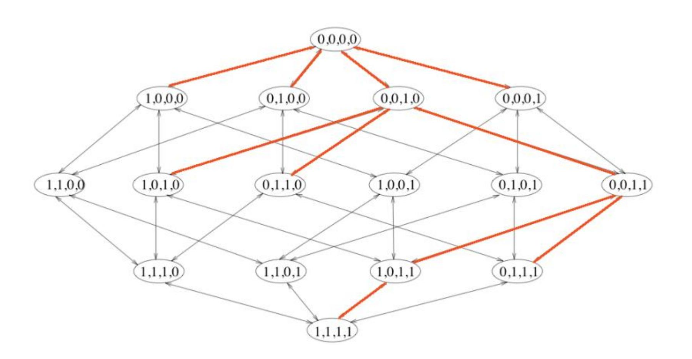

Evaluates M+(M-1)+...+1= 
$$\frac{M(M+1)}{2}$$
 feature sets instead of  $2^M$ !

Principle: replace evaluation of model with quick to compute statistics  $J(X_f)$ 

| k   | $J(X_k)$       |  |  |  |
|-----|----------------|--|--|--|
| 35  | 0.846          |  |  |  |
| 42  | 0.811          |  |  |  |
| 10  | 0.810          |  |  |  |
| 654 | 0.611<br>0.443 |  |  |  |
| 22  |                |  |  |  |
| 59  | 0.388          |  |  |  |
|     |                |  |  |  |
| 212 | 0.09           |  |  |  |
| 39  | 0.05           |  |  |  |

1. Score each feature  $X_f$  individually based on the f-th column of the data matrix and label vector Y.

For each feature  $X_f$ Compute  $J(X_f)$ 

#### **End**

- 2. Rank features according to  $J(X_f)$ .
- 3. Choose the top k features with the highest scores.

Principle: replace evaluation of model with quick to compute statistics  $J(X_f)$ 

| k   | $J(X_k)$ |
|-----|----------|
| 35  | 0.846    |
| 42  | 0.811    |
| 10  | 0.810    |
| 654 | 0.611    |
| 22  | 0.443    |
| 59  | 0.388    |
|     |          |
| 212 | 0.09     |
| 39  | 0.05     |

### Examples of filtering criterion $J(X_f)$

- The mutual information
- Pearson r
- $\chi^2$ -statistic

Principle: replace evaluation of model with quick to compute statistics X<sup>f</sup>

| k   | $J(X_k)$ |  |  |  |
|-----|----------|--|--|--|
| 35  | 0.846    |  |  |  |
| 42  | 0.811    |  |  |  |
| 10  | 0.810    |  |  |  |
| 654 | 0.611    |  |  |  |
| 22  | 0.443    |  |  |  |
| 59  | 0.388    |  |  |  |
|     |          |  |  |  |
| 212 | 0.09     |  |  |  |
| 39  | 0.05     |  |  |  |

# **Examples of filtering criterion** X<sup>f</sup>

• The mutual information (MI,互信息)

A measure of the mutual dependence between the two variables.

It quantifies the amount of information obtained about one random variable through observing the other random variable.

$$I(X;Y) = D_{KL}(P_{XY}||P_XP_Y) = \sum_{x,y} P_{XY}(x,y) \log \frac{P_{XY}(x,y)}{P_X(x)P_Y(y)}$$

相对熵,也叫**Kullback-Leibler**散度(**Kullback-Leibler divergence**),是两个 概率分布间差异的非对称性度量。

Principle: replace evaluation of model with quick to compute statistics  $J(X_f)$ 

#### $J(X_k)$ k35 0.846 42 0.811 10 0.810 654 0.611 22 0.443 59 0.388212 0.09 39 0.05

### Examples of filtering criterion $J(X_f)$

• The mutual information (MI,互信息)

$$I(X;Y) = D_{KL}(P_{XY}||P_XP_Y) = \sum_{x,y} P_{XY}(x,y) \log \frac{P_{XY}(x,y)}{P_X(x)P_Y(y)}$$

互信息是联合分布与边缘分布乘积的相对熵

MI determines how different the joint distribution of the pair (X, Y) is to the product of the marginal distributions of X and Y.

If X and Y are independent, MI=?.

Principle: replace evaluation of model with quick to compute statistics X<sup>f</sup>

# **Examples of filtering criterion** X<sup>f</sup>

• The mutual information (MI ,互信息)

$$I(X;Y) = D_{KL}(P_{XY}||P_XP_Y) = \sum_{x,y} P_{XY}(x,y) \log \frac{P_{XY}(x,y)}{P_X(x)P_Y(y)}$$

Score X<sup>f</sup> based on the MI with . Xf = Xf;

$$\begin{array}{c|cccc} k & J(X_k) \\ \hline 35 & 0.846 \\ 42 & 0.811 \\ 10 & 0.810 \\ 654 & 0.611 \\ 22 & 0.443 \\ \hline 59 & 0.388 \\ ... & ... \\ 212 & 0.09 \\ 39 & 0.05 \\ \hline \end{array}$$

Principle: replace evaluation of model with quick to compute statistics X<sup>f</sup>

| k   | $J(X_k)$ |  |  |
|-----|----------|--|--|
| 35  | 0.846    |  |  |
| 42  | 0.811    |  |  |
| 10  | 0.810    |  |  |
| 654 | 0.611    |  |  |
| 22  | 0.443    |  |  |
| 59  | 0.388    |  |  |
|     |          |  |  |
| 212 | 0.09     |  |  |
| 39  | 0.05     |  |  |

# **Examples of filtering criterion** X<sup>f</sup>

• Pearson r (皮尔逊相关系数)

A measure of the linear correlation between two variables and .

$$J(X_k) = \frac{cov(X_k, Y)}{\sqrt{var(X_k)}\sqrt{var(Y)}} \approx \frac{\sum_{i=1}^{N} \left(x_k^{(i)} - \overline{x_k}\right) \left(y^{(i)} - \overline{y}\right)}{\sqrt{\sum_{i=1}^{N} \left(x_k^{(i)} - \overline{x_k}\right)^2 \sum_{i=1}^{N} (y^{(i)} - \overline{y})^2}}$$

Principle: replace evaluation of model with quick to compute statistics X<sup>f</sup>

| k   | $J(X_k)$ |  |  |  |  |
|-----|----------|--|--|--|--|
| 35  | 0.846    |  |  |  |  |
| 42  | 0.811    |  |  |  |  |
| 10  | 0.810    |  |  |  |  |
| 654 | 0.611    |  |  |  |  |
| 22  | 0.443    |  |  |  |  |
| 59  | 0.388    |  |  |  |  |
|     |          |  |  |  |  |
| 212 | 0.09     |  |  |  |  |
| 39  | 0.05     |  |  |  |  |

# **Examples of filtering criterion** X<sup>f</sup>

• Pearson r(皮尔逊相关系数)

$$J(X_k) = \frac{cov(X_k, Y)}{\sqrt{var(X_k)}\sqrt{var(Y)}} \approx \frac{\sum_{i=1}^{N} \left(x_k^{(i)} - \overline{x_k}\right) \left(y^{(i)} - \overline{y}\right)}{\sqrt{\sum_{i=1}^{N} \left(x_k^{(i)} - \overline{x_k}\right)^2 \sum_{i=1}^{N} (y^{(i)} - \overline{y})^2}}$$

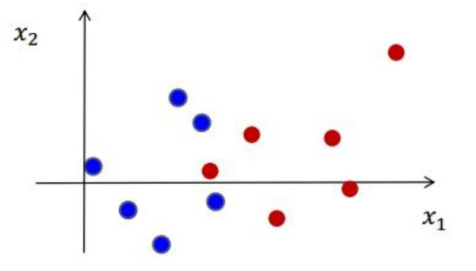

$$J(x_1)$$
 ?  $J(x_2)$ 

Principle: replace evaluation of model with quick to compute statistics X<sup>f</sup>

# **Examples of filtering criterion** X<sup>f</sup>

• Pearson r (皮尔逊相关系数)

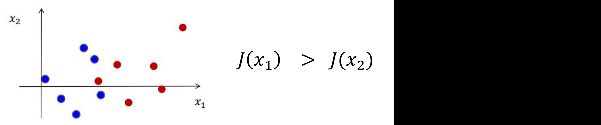

# **Pros**:

• A lot less expensive!

# **Cons**:

• Not model-oriented.

# Feature Section (3): Embedded methods

**Principle**: the classifier performs feature selection as part of the learning procedure.

**Example**: add the **regularization** term in the objective function

$$E_D(w) + \lambda E_W(w)$$

$$\min_{\mathbf{w}} \sum_{i=1}^{m} (\mathbf{w}^{T} \mathbf{x}_{i} - y_{i})^{2} + \lambda \|\mathbf{w}\|_{1}$$

- The central challenge in machine learning is that we must perform well on new, previously unseen inputs—not just those on which our model was trained.
- The ability to perform well on previously unobserved inputs is called generalization.
- We typically estimate the generalization error (also called test error) of a model by measuring its performance on a test set which is collected separately from the training set.

#### • **Typically,**

- 1. We sample the training set
- 2. Then use it to choose the parameters to reduce training set error
- 3. Then evaluate the model with the test set.
- **Under this process,**
  - the expected test error ≥ the training error.

- The factors determining how well a model will perform are its ability to:
  - Ø Make the training error small.
  - Ø Make the gap between training and test error small.

- The factors determining how well a model will perform are its ability to:
  - Make the training error small.
  - Make the gap between training and test error small.

- Underfitting occurs when the model is not able to obtain a sufficiently low error value on the training set.
- Overfitting occurs when the gap between the training error and test error is too large.

- We can control whether a model is more likely to overfit or underfit by altering its *capacity*. (容量)
- Informally, a model's capacity is its ability to fit a wide variety of functions.
- Models with low capacity may struggle to fit the training set.
- Models with high capacity can overfit by memorizing properties of the training set that do not serve them well on the test set.

 One way to control the capacity of a learning algorithm is by choosing its hypothesis space, the set of functions that the learning algorithm is allowed to select as being the solution.

| Linear regression                  | y = b + wx                       |
|------------------------------------|----------------------------------|
| Introduce $x^2$ (quadratic model)  | $y = b + w_1 x + w_2 x^2$        |
| Continue to add more powers of $x$ | $y = b + \sum_{i=1}^{9} w_i x^i$ |

Machine learning algorithms will generally perform best when their capacity is appropriate in regard to

- The true complexity of the task they need to perform
- The amount of training data they are provided with.
- Models with insufficient capacity are unable to solve complex tasks.
- Models with high capacity can solve complex tasks, but when their capacity is higher than needed to solve the present task they may overfit.

We compare a linear, quadratic and degree-9 predictor attempting to fit a problem where the true underlying function is quadratic.

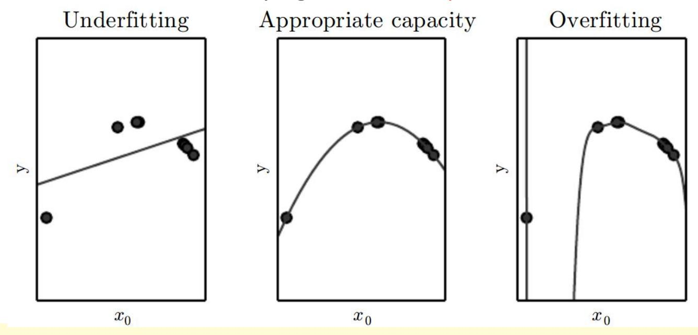

- The linear function is unable to capture the curvature in the true underlying problem, so it underfits.
- 28 • The degree-9 predictor is capable of representing the correct function, but it is also capable of representing infinitely many other functions that pass exactly through the training points, because we have more parameters than training examples. We have little chance of choosing a solution that generalizes well when so many wildly different solutions exist.

# **Occam's Razor**

奥卡姆剃刀[定律](https://baike.baidu.com/item/%E5%AE%9A%E5%BE%8B/2076576)又称"奥康的剃刀" ,它是由14世纪英格兰的 逻辑学家、圣方济各会修士奥卡姆的威廉(William of Occam, 约1285年至1349年)提出。该定律又称为简单有效原理。

在对于同一理论或者同一命题的论证过 程中,多种解释和证明过程中,步骤最 少最为简洁的证明是最有效的。


# **Occam's Razor**

- Given two models of similar generalization errors, one should prefer the simpler model over the more complex model.
- For complex models, there is a greater chance that it was fitted accidentally by errors in data.
- Therefore, one should include model complexity when evaluating a model.

- Although simpler functions are more likely to generalize.
- Still need to choose a sufficiently complex hypothesis to achieve low training error.
- Training error decreases until it asymptotes to the minimum possible error value as model capacity increases.
- Generalization error has a U-shaped curve as a function of model capacity.

Typical relationship between capacity and error.

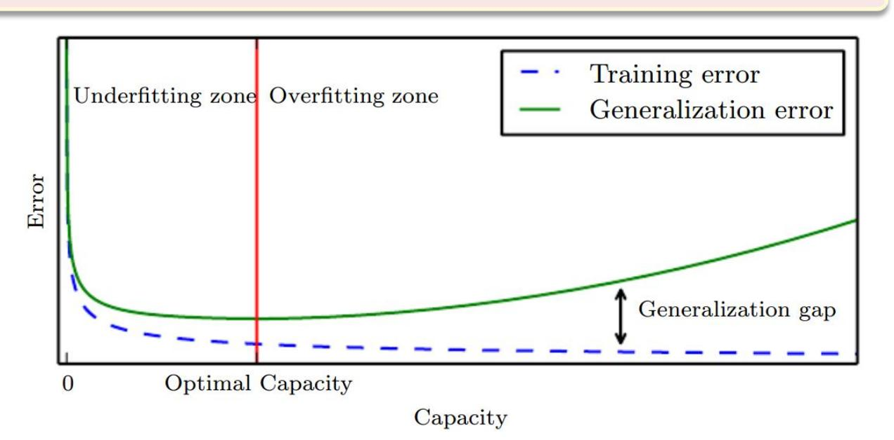

- Increasing the size of dataset reduces the over-fitting problem.
- The larger the data set, the more complex the model that we can afford to fit to the data.

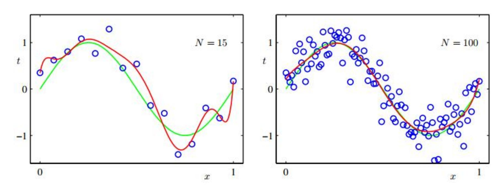

Plots of the solutions obtained by minimizing the sum-of-squares error function using the M = 9 polynomial for N = 15 data points (left plot) and N = 100 data points (right plot).

# **Avoid Overfitting**

**Regularization: any modification we make to a learning algorithm that is intended to reduce its generalization error but not its training error.**

# **Avoid Overfitting**

#### **Adding a regularization term**

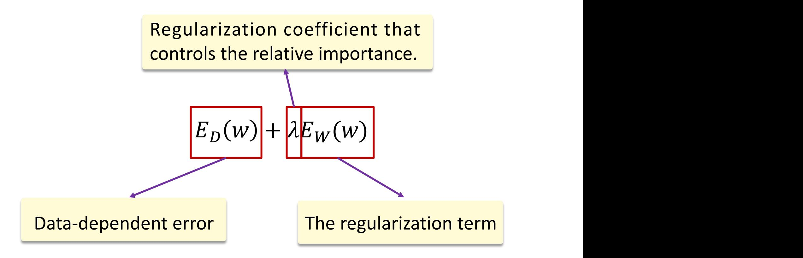

$$E_D(\mathbf{w}) = \sum_{i=1}^m \left( \mathbf{w}^T \mathbf{x}_i - y_i \right)^2$$

# **Avoid Overfitting**

One simple form of regularizer (L2 norm)

$$E_W(w) = \frac{1}{2} w^T w$$
 
$$E_T(w) = \sum_{i=1}^m (w^T x_i - y_i)^2 + \frac{\lambda}{2} w^T w$$
 Ridge regression

#### 权重衰减

weight decay: encourages weight values to decay towards zero. parameter shrinkage: shrinks parameter values towards zero.

Advantage: Remains a quadratic function of w, so its exact minimizer can be found in closed form.

# L2 norm is widely used to avoid the overfitting...

#### Intuition

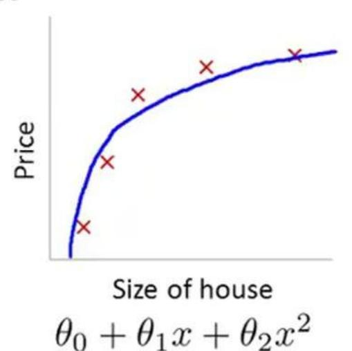


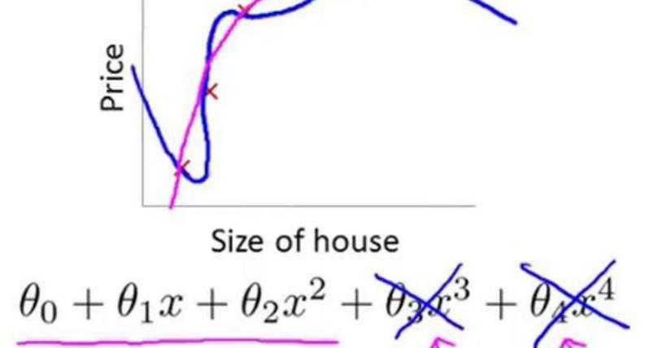

Suppose we penalize and make  $\theta_3$ ,  $\theta_4$  really small.

## **L2 norm is widely used to avoid the overfitting…**

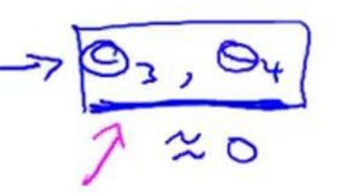

$$J(\theta) = \frac{1}{2m} \left[ \sum_{i=1}^{m} (h_{\theta}(x^{(i)}) - y^{(i)})^2 + \lambda \right]$$

# **More General Regularizer**

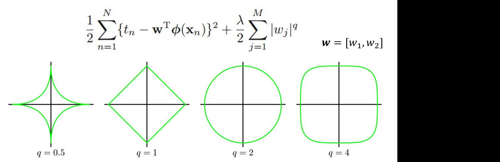

Contours of the regularization term for various values of the *q.*

# **More General Regularizer**

$$\frac{1}{2} \sum_{n=1}^{N} \{t_n - \mathbf{w}^{\mathrm{T}} \boldsymbol{\phi}(\mathbf{x}_n)\}^2 + \frac{\lambda}{2} \sum_{j=1}^{M} |w_j|^q$$

$$\boldsymbol{w} = [w_1, w_2]$$

Contours of the regularization term for various values of the *q.*

- *q* = 1 corresponds to the *lasso (least absolute shrinkage and selection operator), Tibshirani(1996)*.
  - If *λ* is sufficiently large, some of the coefficients are driven to zero, leading to a *sparse* model.

# **More General Regularizer**

$$\frac{1}{2} \sum_{n=1}^{N} \{t_n - \mathbf{w}^{\mathrm{T}} \boldsymbol{\phi}(\mathbf{x}_n)\}^2 + \frac{\lambda}{2} \sum_{j=1}^{M} |w_j|^q$$

$$E_D(w)$$

Note that minimizing the above function is equivalent to minimizing the unregularized sum-of-squares error subject to the constraint

$$\sum_{j=1}^{M} |w_j|^q \leqslant \eta$$

for an appropriate value of the parameter *η*, where the two approaches can be related using Lagrange multipliers.

# L1 VS L2 Regularization

$$\frac{1}{2} \sum_{n=1}^{N} \{t_n - \mathbf{w}^{\mathrm{T}} \boldsymbol{\phi}(\mathbf{x}_n)\}^2 + \frac{\lambda}{2} \sum_{j=1}^{M} |w_j|^q$$

 $w^*$  is the optimum value for w.

The lasso gives a sparse solution ( $w_1^* = 0$ ).

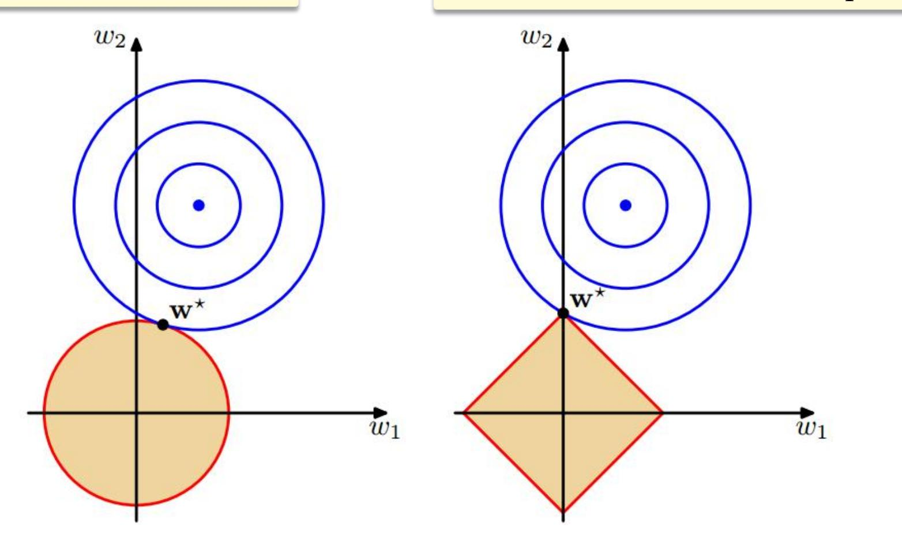

The contours of the unregularized error function (blue) along with the constraint region for the weight decay q = 2 (left) and the lasso q = 1 (right).

### L1 Regularization

- L1 regularization → sparse solution.
- It can be considered analogous to performing embedded feature selection, where the trained model implicitly performs feature selection.
- Specifically, the entries of the weight vector  $w_i$ 's which are non-zero (or practically outside a low threshold  $|w_i| > \epsilon$ , where  $\epsilon > 0$ ) represent features that are important for the classification task.

$$\min_{\mathbf{w}} \sum_{i=1}^{m} (\mathbf{w}^{T} \mathbf{x}_{i} - y_{i})^{2} + \lambda ||\mathbf{w}||_{1}$$

## **Optimization for L1 norm**

- ISTA (Iterative Shrinkage-Thresholding Algorithms)
- Fast ISTA (Fast Iterative Shrinkage-Thresholding Algorithms)
  - Amir Beck, Marc Teboulle: A Fast Iterative Shrinkage-Thresholding Algorithm for Linear Inverse Problems. SIAM J. Imaging Sciences 2(1): 183-202 (2009)

The objective function of ISTA has the form of

$$arg \min F(\boldsymbol{\alpha}) = \frac{1}{2} \|\boldsymbol{X}\boldsymbol{\alpha} - \boldsymbol{y}\|_{2}^{2} + \lambda \|\boldsymbol{\alpha}\|_{1} = f(\boldsymbol{\alpha}) + g(\boldsymbol{\alpha})$$

# **Conclusions**

#### • **Wrappers methods**

- Use machine learning algorithm as black box to find best subset of features.
- Generally infeasible on the model 'big data' problem.

#### • **Filters methods**

• Features selected before machine learning algorithm is run.

#### • **Embedded methods**

- Feature selection occurs naturally aspart of the machine learning algorithm.
- **Overfitting and Underfitting**
- **L1-norm and L2-norm**

# **Backup Slides**

Principle: replace evaluation of model with quick to compute statistics  $J(X_f)$ 

## Examples of filtering criterion $J(X_f)$

•  $\chi^2$ -statistic

卡方检验就是统计样本的**实际观测值**与**理论推断值**之间的偏离程度,实际观测值与理论推断值之间的偏离程度就决定卡方值的大小。如果卡方值越大,二者偏差程度越大;反之,二者偏差越小;若两个值完全相等时,卡方值就为**0**,表明理论值完全符合。

Principle: replace evaluation of model with quick to compute statistics  $J(X_f)$ 

## Examples of filtering criterion $J(X_f)$

•  $\chi^2$ -statistic

Now we want to check **whether** "a news contains the word '吴亦 凡'" and "the news belongs to the category of 'Entertainment'" are **independent**. We have the following ground truth.

| 组别      | 属于娱乐 | 不属于娱乐 | 合计 |
|---------|------|-------|----|
| 不包含 吴亦凡 | 19   | 24    | 43 |
| 包含吴亦凡   | 34   | 10    | 44 |
| 合计      | 53   | 34    | 87 |

#### **Practical Distribution.**

Principle: replace evaluation of model with quick to compute statistics  $J(X_f)$ 

### Examples of filtering criterion $J(X_f)$

•  $\chi^2$ -statistic

Assume that they are independent (null hypothesis), then we have that given a random sampled news, the probability that it belongs to Entertainment is (19+34)/(19+34+24+10)= 60.9%.

| 组别      | 属于娱乐 | 不属于娱乐 | 合计 |
|---------|------|-------|----|
| 不包含 吴亦凡 | 19   | 24    | 43 |
| 包含吴亦凡   | 34   | 10    | 44 |
| 合计      | 53   | 34    | 87 |

#### **Practical Distribution.**

Principle: replace evaluation of model with quick to compute statistics  $J(X_f)$ 

### Examples of filtering criterion $J(X_f)$

•  $\chi^2$ -statistic

Assume that they are independent (null hypothesis), then we have that given a random sampled news, the probability that it belongs to Entertainment is (19+34)/(19+34+24+10)= 60.9%.

| 组别      | 属于娱乐              | 不属于娱乐             | 合计 |
|---------|-------------------|-------------------|----|
| 不包含 吴亦凡 | 43 * 0.609 = 26.2 | 43 * 0.391 = 16.8 | 43 |
| 包含 吴亦凡  | 44 * 0.609 = 26.8 | 44 * 0.391 = 17.2 | 44 |

#### **Expected Distribution.**

Principle: replace evaluation of model with quick to compute statistics  $I(X_f)$ 

## Examples of filtering criterion $I(X_f)$

•  $\chi^2$ -statistic

$$X^2 = \sum \left( A - T \right)^2 / T$$

Practical value Expected value

| degrees of freedom=( | num of rows - 1)* | (num of columns -1) |
|----------------------|-------------------|---------------------|
|----------------------|-------------------|---------------------|

| _24.  | 布临界值表 | 5 (卡东)    | (本名    |      |      |       |      |       |       |       | P-value |       |       |
|-------|-------|-----------|--------|------|------|-------|------|-------|-------|-------|---------|-------|-------|
|       | P     | K - F.JJ. | 0.46.2 |      |      |       |      |       |       |       |         |       | 75    |
| n o ▼ | 0.995 | 0. 99     | 0.975  | 0.95 | 0.9  | 0. 75 | 0.5  | 0. 25 | 0.1   | 0.05  | 0.025   | 0.01  | 0.005 |
| 1     | 12.   | 22        | 1111   | 1    | 0.02 | 0.1   | 0.45 | 1.32  | 2, 71 | 3, 84 | 5.02    | 6. 63 | 7.88  |

Principle: replace evaluation of model with quick to compute statistics  $J(X_f)$ 

## Examples of filtering criterion $J(X_f)$

•  $\chi^2$ -statistic

p-value  $\leq 0.05$ 

In statistical hypothesis testing, p-value is the probability of obtaining test results at least as extreme as the results actually observed during the test, assuming that the null hypothesis is correct.

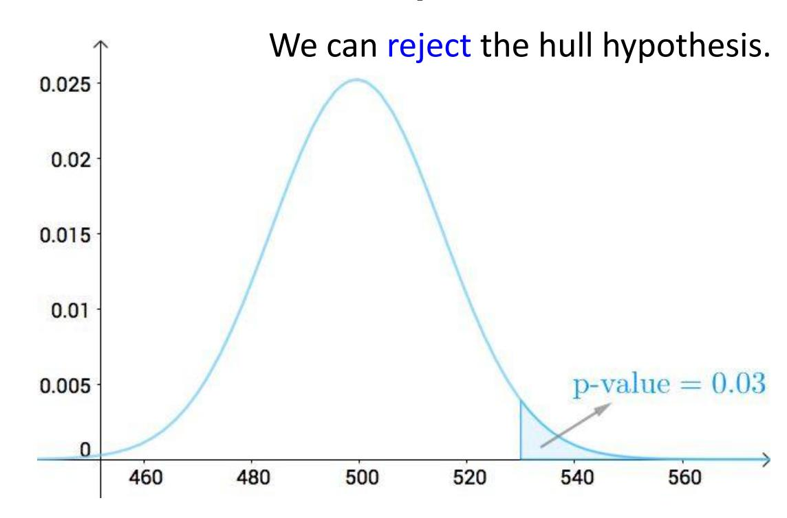

Principle: replace evaluation of model with quick to compute statistics  $I(X_f)$ 

| k   | $J(X_k)$ |
|-----|----------|
| 35  | 0.846    |
| 42  | 0.811    |
| 10  | 0.810    |
| 654 | 0.611    |
| 22  | 0.443    |
| 59  | 0.388    |
|     |          |
| 212 | 0.09     |
| 39  | 0.05     |

#### Examples of filtering criterion $I(X_f)$

•  $\chi^2$ -statistic

$$X^2 = \sum (A - T)^2 / T$$

Practical value Expected value

The larger the  $\chi^2$ -statistic, the larger the difference between the practical and expected values.  $\rightarrow$  The higher the correlation between  $X_f$  and Y.