# **Machine Learning & Pattern Recognition**

# **Support Vector Machines**

# **A Brief History of SVM**

- SVM is related to statistical learning theory [3].
- SVM is first introduced in 1992 [1].
- Success in handwritten digit recognition
  - 1.1% test error rate for SVM. The same as that of a carefully constructed neural network, LeNet 4 [2].

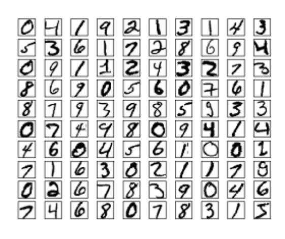

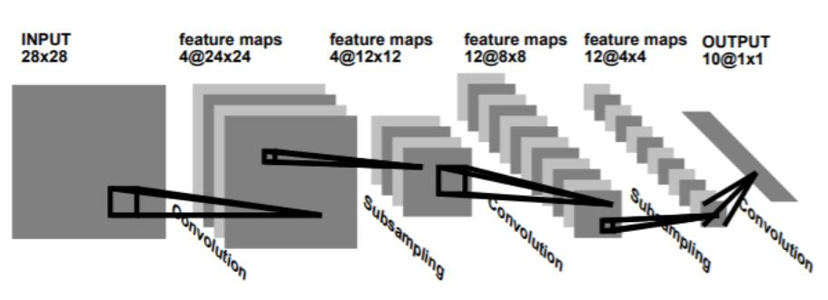

Architecture of LeNet1. LeNet 4 is an expanded version of LeNet 1, consisting of about 260,000 connections, and about 17,000 free parameters.

[1] B.E. Boser et al. A Training Algorithm for Optimal Margin Classifiers. Proceedings of the Fifth Annual Workshop on Computational Learning Theory 5 144-152, Pittsburgh, 1992. [2] L. Bottou et al. Comparison of classifier methods: a case study in handwritten digit recognition. Proceedings of the 12th IAPR International Conference on Pattern Recognition, vol. 2, pp. 77-82, 1994. [3] V. Vapnik. The Nature of Statistical Learning Theory. 2nd edition, Springer, 1999

# **A Brief History of SVM**

- SVM is related to statistical learning theory [3].
- SVM is first introduced in 1992 [1].
- Success in handwritten digit recognition
  - 1.1% test error rate for SVM. The same as that of a carefully constructed neural network, LeNet 4 [2].

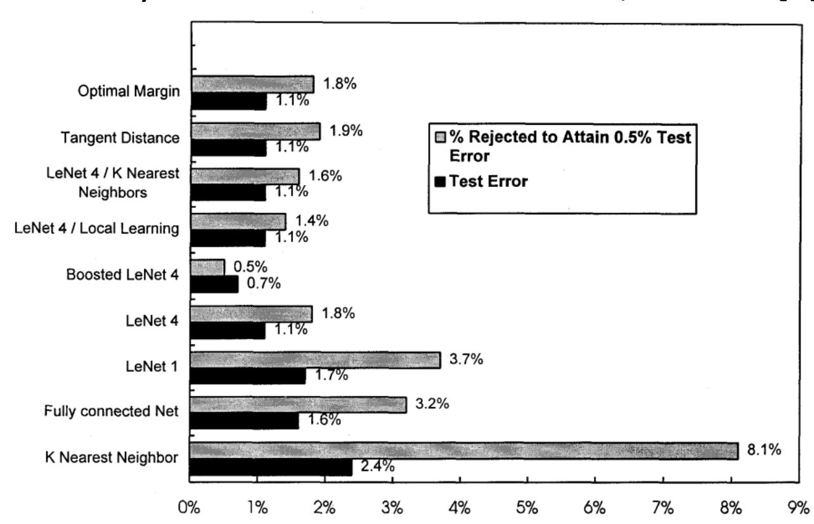

# **SVM:** Brief History


1963 Margin (Vapnik & Lerner)

1964 Margin (Vapnik and Chervonenkis, 1964)

1964 RBF Kernels (Aizerman)

1965 Optimization formulation (Mangasarian)

1971 Kernels (Kimeldorf annd Wahba)

1992-1994 SVMs (Vapnik et al)

1996 - present Rapid growth, numerous apps

1996 – present Extensions to other problems

# **A Brief History of SVM**

- Vapnik born in the Soviet Union (1936)
- Master: mathematics, the Uzbek State University (1958)
- Ph.D: statistics at the Institute of Control Sciences, Moscow (1964)
- Worked at the Institute of Control Sciences (until 1990)
- Then joined AT&T Bell Labs (1991)
- While at AT&T, Vapnik and colleagues developed the SVM (1995)
- Inducted into U.S. National Academy of Engineering (2006)
- Joined Facebook AI Research (2014)


# **Vapnik**


| TITLE                                                                                  | CITED BY       | /EAR |
|----------------------------------------------------------------------------------------|----------------|------|
| The Nature of Statistical Learning Theory V Vapnik Data mining and knowledge discovery | 78149 <b>*</b> | 1995 |
| Support-vector networks C Cortes, V Vapnik Machine learning 20 (3), 273-297            | 32437          | 1995 |

### A Brief History of SVM


#### Chih-Jen Lin


Professor of Computer Science, <u>National Taiwan University</u>

Verified email at csie.ntu.edu.tw - <u>Homepage</u>

Machine learning Data Mining Optimization Artificial Intelligence

TITLE CITED BY YEAR

2017

#### LIBSVM: A library for support vector machines

37804

4 2011

CC Chang, CJ Lin

ACM Transactions on Intelligent Systems and Technology (TIST) 2 (3), 27


#### Chih-Jen Lin


Professor of Computer Science, <u>National Taiwan University</u> Verified email at csie.ntu.edu.tw - <u>Homepage</u>

Machine learning Data Mining Optimization Artificial Intelligence

TITLE CITED BY YEAR

2019

LIBSVM: A library for support vector machines

CC Chang, CJ Lin

ACM Transactions on Intelligent Systems and Technology (TIST) 2 (3), 27

44063

2011

- Consider a binary, linearly separable classification problem.
- {1, … , }: our data set and ∈ {1, −1}: the class label of .
- Many decision boundaries!
- Are all decision boundaries equally good?

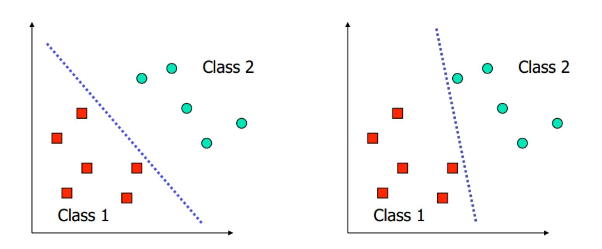

**Examples of Bad Decision Boundaries**

- Consider a binary, linearly separable classification problem.
- {1, … , }: our data set and ∈ {1, −1}: the class label of .
- Many decision boundaries!
- Are all decision boundaries equally good?

Given a training set, we aim to find a decision boundary that allows us to make all correct and confident (meaning far from the decision boundary) predictions on the training examples.

### **Preliminary**

### • Consider a line $l_1$ :

$$y = ax + b \quad \stackrel{x \to x_1}{\underset{y \to x_2}{\Longrightarrow}} ax_1 + (-1)x_2 + b = 0 \Longrightarrow [a, -1] \begin{bmatrix} x_1 \\ x_2 \end{bmatrix} + b = 0$$

### Vector representation:

$$\mathbf{w}^{T}\mathbf{x} + b = 0 \qquad \mathbf{w} = [w_{1} \ w_{2}]^{T} \quad \mathbf{x} = [x_{1} \ x_{2}]^{T}$$

$$y = ax + b \qquad \mathbf{w} = [a, -1]^{T}$$

$$\downarrow \qquad \qquad \downarrow$$

$$g(x, y) = ax - y + b = 0 \qquad \mathbf{w} = [\nabla_{x} g, \nabla_{y} g]^{T}$$

What is the meaning of w?

# **Preliminary**

• **Consider a line** 1**:**

$$y = ax + b \qquad \qquad \mathbf{w} = [a, -1]$$

• Consider = 1, , should be parallel to the line 1.

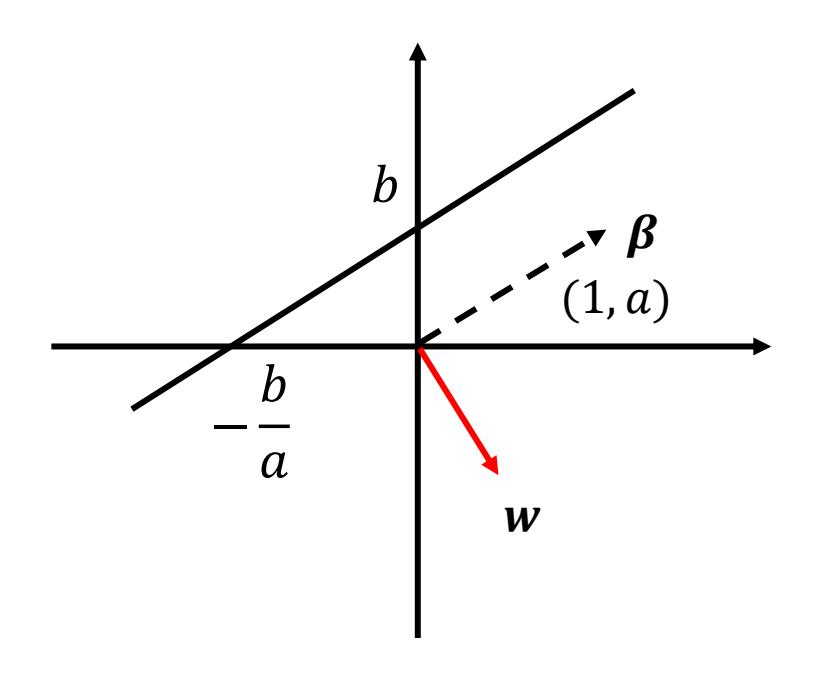

• We found that  = 0 → ⊥ *.*

• Vector is perpendicular to the line 1.

# **Preliminary**

• Given a point (0, 0), the distance from the point to the line + + = 0 :

$$distance = \frac{|Ax_0 + By_0 + C|}{\sqrt{A^2 + B^2}}$$

• Given a point , the distance from the point to the hyperplane + = 0 *:*

$$distance = \frac{\left| \mathbf{w}^{T} \mathbf{x} + b \right|}{\left\| \mathbf{w} \right\|}$$

- We aim to find the hyperplane (i.e., decision boundary) linearly separating our classes.
- Our boundary will have equation: + = 0

### Decision boundary

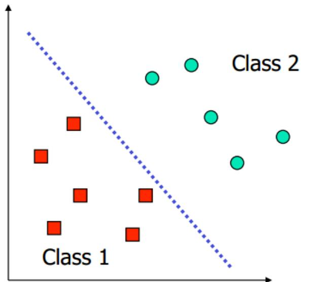

• Above the decision boundary should have label 1, i.e., for any s.t. + > 0 , then = 1.

• Below the decision boundary should have label -1, i.e., for any s.t. + < 0 , then = − 1.

$$f(x) = sign(\mathbf{w}^T \mathbf{x} + b)$$

• Moreover, we hope the hyperplane lies in the middle

$$\begin{cases} (\mathbf{w}^{T} \mathbf{x}_{i} + b) / \|\mathbf{w}\| \ge \frac{m}{2} & \forall \ y_{i} = 1 \\ (\mathbf{w}^{T} \mathbf{x}_{i} + b) / \|\mathbf{w}\| \le -\frac{m}{2} & \forall \ y_{i} = -1 \end{cases}$$

 = + is the margin

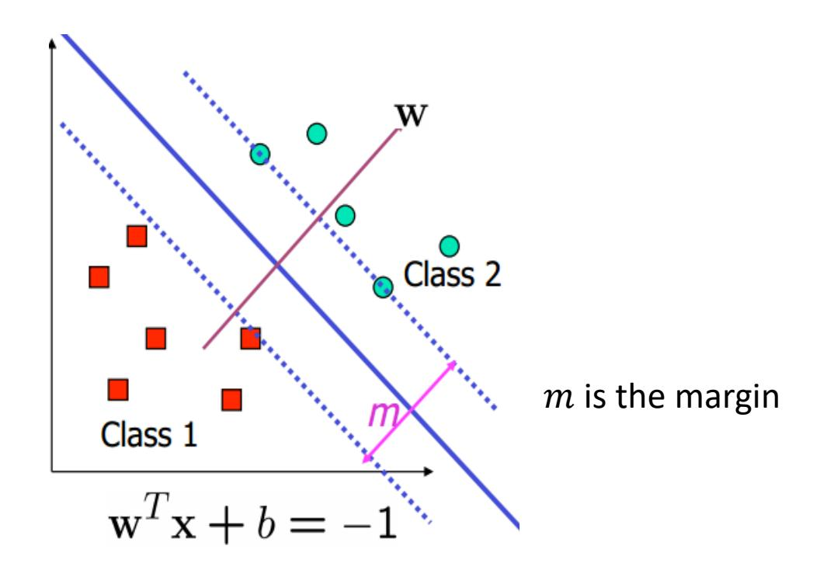

• Moreover, we hope the hyperplane lies in the middle

$$\begin{cases} (\mathbf{w}^{T} \mathbf{x}_{i} + b) / \|\mathbf{w}\| \ge \frac{m}{2} & \forall \ y_{i} = 1 \\ (\mathbf{w}^{T} \mathbf{x}_{i} + b) / \|\mathbf{w}\| \le -\frac{m}{2} & \forall \ y_{i} = -1 \end{cases}$$

 = + is the margin

• Can be re-written as

$$\begin{cases} \mathbf{w}_p^T \mathbf{x}_i + b_p \ge 1 & \forall y_i = 1 \\ \mathbf{w}_p^T \mathbf{x}_i + b_p \le -1 & \forall y_i = -1 \end{cases}$$

$$\boldsymbol{w}_p = \frac{2\boldsymbol{w}}{\|\boldsymbol{w}\|m} \qquad b_p = \frac{2b}{\|\boldsymbol{w}\|m}$$

• Interestingly, we found that

$$\mathbf{w}_p^T \mathbf{x} + b_p = 0$$
 and  $\mathbf{w}^T \mathbf{x} + b = 0$  is the same hyperplane.

• Therefore,

$$\begin{cases} \mathbf{w}^T \mathbf{x}_i + b \ge 1 & \forall y_i = 1 \\ \mathbf{w}^T \mathbf{x}_i + b \le -1 & \forall y_i = -1 \end{cases} \quad y_i(\mathbf{w}^T \mathbf{x}_i + b) \ge 1$$


# **Large-margin Decision Boundary**

- The decision boundary should be as far away from the data of both classes as possible
  - We should maximize the margin,

• For the **support vectors** (data points nearest to the hyperplane)

Distance = 
$$|\mathbf{w}^T \mathbf{x_i} + b|/||\mathbf{w}||$$
  
=  $1/||\mathbf{w}||$   
 $m = 2/||\mathbf{w}||$ 

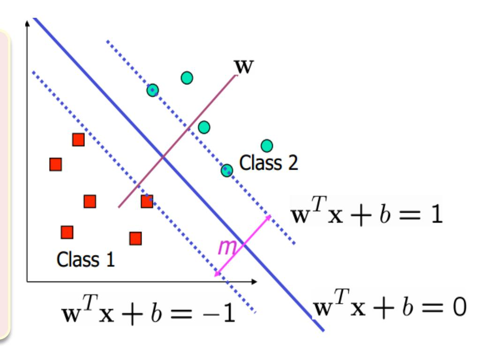

# **Optimization Problem**

• The decision boundary can be found by solving the following constraint optimization problem

$$\max_{\mathbf{w}} 2/\|\mathbf{w}\|$$
  
s.t.  $y_i(\mathbf{w}^T \mathbf{x}_i + b) \ge 1, i = 1, 2, ..., n$ 

• To solve the problem efficiently, we transformed it into a form:

$$\min_{\mathbf{w}} \frac{1}{2} \|\mathbf{w}\|^2 = \frac{1}{2} \mathbf{w}^T \mathbf{w}$$
  
s.t.  $y_i(\mathbf{w}^T \mathbf{x}_i + b) \ge 1, i = 1, 2, ..., n$ 

• The above is an optimization problem with a convex quadratic objective and only linear constraints.

### **Exercise**

$$\min_{\mathbf{w}} \frac{1}{2} \|\mathbf{w}\|^2 = \frac{1}{2} \mathbf{w}^T \mathbf{w}$$
  
s.t.  $y_i(\mathbf{w}^T \mathbf{x}_i + b) \ge 1, i = 1, 2, ..., n$ 

• Given the dataset consist of two positive samples  $x_1 = (3,3)^T$ ,  $x_2 = (4,3)^T$ , and one negative sample  $x_3 = (1,1)^T$ . Please write the objective function with SVM.

### **Answer**

$$\min_{\mathbf{w}, b} \frac{1}{2} \|\mathbf{w}\|^2 = \frac{1}{2} w_1^2 + \frac{1}{2} w_2^2$$

s.t. 
$$3w_1 + 3w_2 + b \ge 1$$
,  
 $4w_1 + 3w_2 + b \ge 1$ ,  
 $-w_1 - w_2 - b \ge 1$ .

# **Large-margin Decision Boundary**

- The optimization problem can be solved using commercial quadratic programming (QP 二次规划) code.
- However, here we will turn to the **Lagrange duality**.
  - The dual form will allow us to derive an efficient algorithm to solve the optimization problem.
    - Typically do much better than generic QP software.
  - The dual form will allow us to use kernels to get optimal margin classifiers to work efficiently in very high dimensional spaces.

Let's temporarily put aside SVM, and talk about solving constrained optimization problems.

# **Constrained Optimization**

Consider a problem of the following form:

$$\min_{\boldsymbol{w}} f(\boldsymbol{w})$$

s.t. 
$$h_i(\mathbf{w}) = 0, i = 1, ..., l$$
.

Lagrange multiplier method:

$$\mathcal{L}(\boldsymbol{w}, \boldsymbol{\beta}) = f(\boldsymbol{w}) + \sum_{i=1}^{l} \beta_i h_i(\boldsymbol{w})$$

 's are the Lagrange multipliers.

No constraint now.

Set the partial derivatives to zero:

$$\frac{\partial \mathcal{L}(\boldsymbol{w}, \boldsymbol{\beta})}{\partial \boldsymbol{w}_{j}} = 0 \qquad \frac{\partial \mathcal{L}(\boldsymbol{w}, \boldsymbol{\beta})}{\partial \boldsymbol{\beta}_{i}} = 0$$

Generalize this to constrained optimization problems in which we may have inequality as well as equality constraints.

Consider the following primal optimization problem:

$$\min_{\mathbf{w}} f(\mathbf{w})$$
  
s.t.  $g_i(\mathbf{w}) \le 0, i = 1, ..., k$   
 $h_i(\mathbf{w}) = 0, i = 1, ..., l.$ 

Generalized Lagrangian

 's and 's are the Lagrange multipliers.

$$\mathcal{L}(\boldsymbol{w}, \boldsymbol{\alpha}, \boldsymbol{\beta}) = f(\boldsymbol{w}) + \sum_{i=1}^{k} \alpha_{i} g_{i}(\boldsymbol{w}) + \sum_{i=1}^{l} \beta_{i} h_{i}(\boldsymbol{w})$$

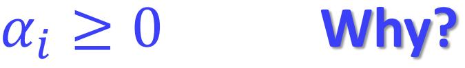

Consider the following primal optimization problem:

$$\min_{\mathbf{x}\in\mathbb{R}^2} f(\mathbf{x})$$

s.t. 
$$g(x) \leq 0$$

### Example1:

$$f(\mathbf{x}) = x_1^2 + x_2^2$$
 and  $g(\mathbf{x}) = x_1^2 + x_2^2 - 1$ 

$$f(\mathbf{x}) = x_1^2 + x_2^2$$
 and  $g(\mathbf{x}) = x_1^2 + x_2^2 - 1$ 

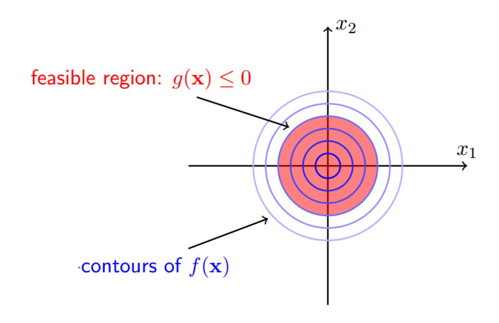

$$g(\mathbf{x}) = x_1^2 + x_2^2 - 1$$

$$f(\mathbf{x}) = x_1^2 + x_2^2 \text{ and } g(\mathbf{x}) = x_1^2 + x_2^2 - 1$$

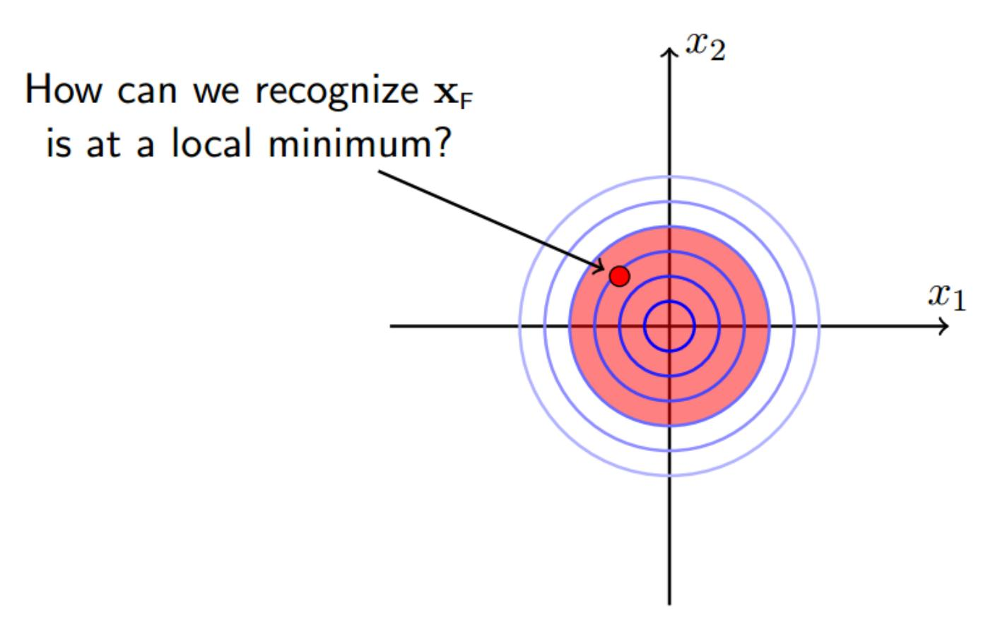

$$f(\mathbf{x}) = x_1^2 + x_2^2$$
 and  $g(\mathbf{x}) = x_1^2 + x_2^2 - 1$ 

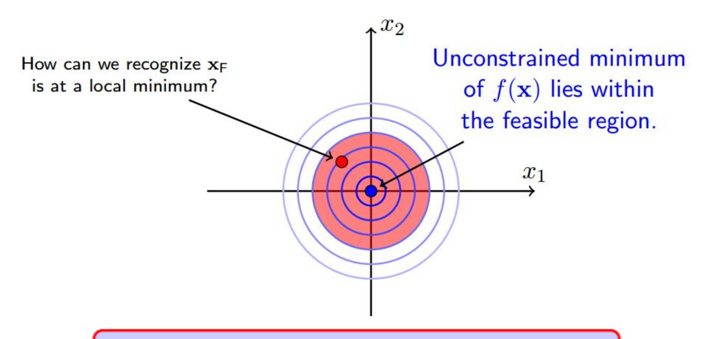

### **Problem:**

Our constrained optimization problem

$$\min_{\mathbf{x} \in \mathbb{R}^2} f(\mathbf{x}) \ \ \text{subject to} \ \ g(\mathbf{x}) \leq 0$$

where

$$f(\mathbf{x}) = x_1^2 + x_2^2 \text{ and } g(\mathbf{x}) = x_1^2 + x_2^2 - 1$$

### Constraint is not active at the local minimum ( $g(\mathbf{x}^*) < 0$ ):

Therefore the local minimum is identified by the same conditions as in the unconstrained case.

Consider the following primal optimization problem:

$$\min_{\mathbf{x}\in\mathbb{R}^2} f(\mathbf{x})$$

s.t. 
$$g(x) \le 0$$

### **Example2:**

$$f(\mathbf{x}) = (x_1 - 1.1)^2 + (x_2 + 1.1)^2$$
 and  $g(\mathbf{x}) = x_1^2 + x_2^2 - 1$ 

$$f(\mathbf{x}) = (x_1 - 1.1)^2 + (x_2 + 1.1)^2$$
 and  $g(\mathbf{x}) = x_1^2 + x_2^2 - 1$ 

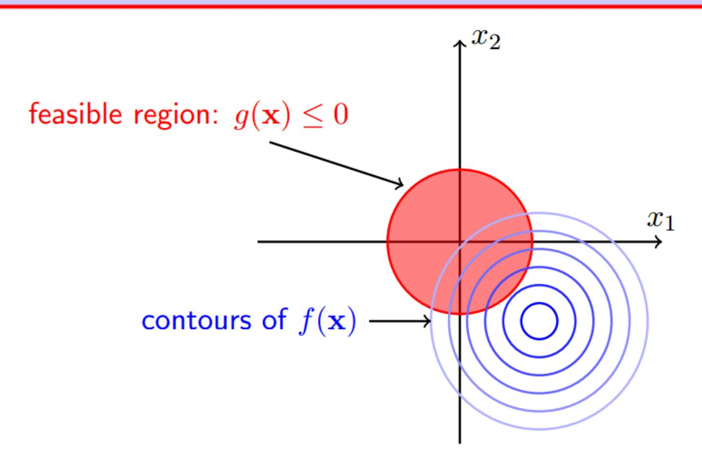

$$g(\mathbf{x}) = x_1^2 + x_2^2 - 1$$

$$f(\mathbf{x}) = (x_1 - 1.1)^2 + (x_2 + 1.1)^2$$
 and  $g(\mathbf{x}) = x_1^2 + x_2^2 - 1$ 

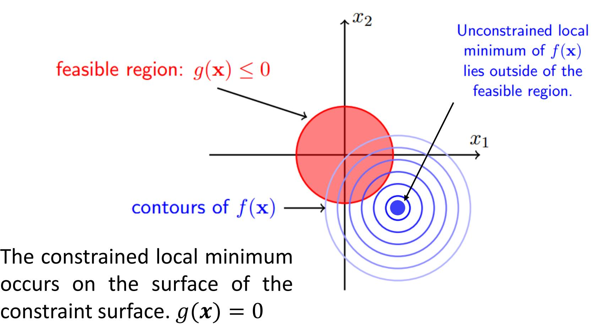

$$g(\mathbf{x}) = x_1^2 + x_2^2 - 1$$

$$f(\mathbf{x}) = (x_1 - 1.1)^2 + (x_2 + 1.1)^2$$
 and  $g(\mathbf{x}) = x_1^2 + x_2^2 - 1$ 

**Red**: ∇()

**Blue**: −∇()

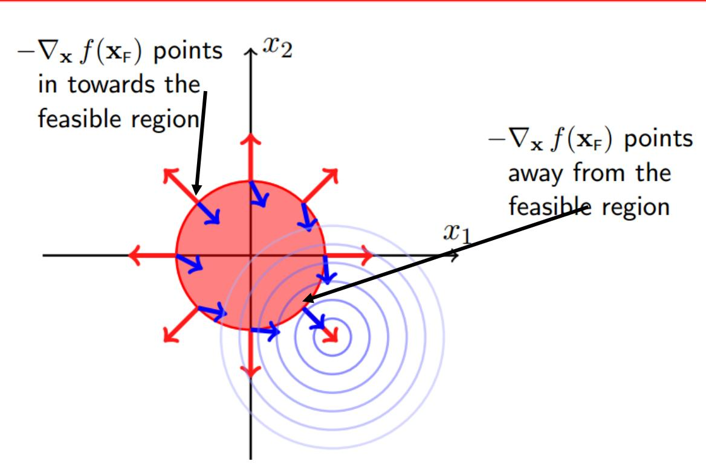

$$-\nabla_{\mathbf{x}} f(\mathbf{x}) = \lambda \nabla_{\mathbf{x}} g(\mathbf{x}) \quad \text{and} \quad \lambda > 0$$

Given

$$\min_{\mathbf{x} \in \mathbb{R}^2} f(\mathbf{x})$$
 subject to  $g(\mathbf{x}) \leq 0$ 

If  $x^*$  corresponds to a constrained local minimum then

### Case 1:

Unconstrained local minimum occurs **in** the feasible region.

- **1**  $g(\mathbf{x}^*) < 0$
- $\nabla_{\mathbf{x}} f(\mathbf{x}^*) = \mathbf{0}$

### Case 2:

Unconstrained local minimum lies **outside** the feasible region.

- $\begin{array}{cc} \mathbf{2} & -\nabla_{\mathbf{x}} \, f(\mathbf{x}^*) = \lambda \nabla_{\mathbf{x}} \, g(\mathbf{x}^*) \\ \text{with } \lambda > 0 \end{array}$

Given the optimization problem

$$\min_{\mathbf{x} \in \mathbb{R}^2} f(\mathbf{x})$$
 subject to  $g(\mathbf{x}) \leq 0$ 

Define the Lagrangian as

$$\mathcal{L}(\mathbf{x}, \lambda) = f(\mathbf{x}) + \lambda g(\mathbf{x})$$

Then  $\mathbf{x}^*$  a local minimum  $\iff$  there exists a unique  $\lambda^*$  s.t.

- $\lambda^* \geq 0$
- **4**  $g(\mathbf{x}^*) \leq 0$

#### Case 1:

Unconstrained local minimum occurs **in** the feasible region.

- $\mathbf{0} \ g(\mathbf{x}^*) < 0$
- $\nabla_{\mathbf{x}} f(\mathbf{x}^*) = \mathbf{0}$

#### Case 2:

Unconstrained local minimum lies **outside** the feasible region.

- $\begin{array}{ccc} \mathbf{2} & -\nabla_{\mathbf{x}} \, f(\mathbf{x}^*) = \lambda \nabla_{\mathbf{x}} \, g(\mathbf{x}^*) \\ & \text{with } \lambda > 0 \end{array}$

- $\lambda^* \geq 0$
- $3 \lambda^* g(\mathbf{x}^*) = 0$
- **4**  $g(\mathbf{x}^*) \le 0$

### Case 1 - Inactive constraint:

- When  $\lambda^* = 0$  then have  $\mathcal{L}(\mathbf{x}^*, \lambda^*) = f(\mathbf{x}^*)$ .
- Condition KKT 1  $\Longrightarrow \nabla_{\mathbf{x}} f(\mathbf{x}^*) = \mathbf{0}$ .
- Condition KKT 4  $\Longrightarrow$   $\mathbf{x}^*$  is a feasible point.

### Case 2 - Active constraint:

- When  $\lambda^* > 0$  then have  $\mathcal{L}(\mathbf{x}^*, \lambda^*) = f(\mathbf{x}^*) + \lambda^* g(\mathbf{x}^*)$ .
- Condition KKT 1  $\Longrightarrow \nabla_{\mathbf{x}} f(\mathbf{x}^*) = -\lambda^* \nabla_{\mathbf{x}} g(\mathbf{x}^*).$
- Condition KKT 3  $\Longrightarrow g(\mathbf{x}^*) = 0$ .
- Condition KKT 3 also  $\Longrightarrow \mathcal{L}(\mathbf{x}^*, \lambda^*) = f(\mathbf{x}^*)$ .

Consider the following primal optimization problem:

$$\min_{\mathbf{w}} f(\mathbf{w})$$
  
s.t.  $g_i(\mathbf{w}) \le 0, i = 1, ..., k$   
 $h_i(\mathbf{w}) = 0, i = 1, ..., l.$ 

Generalized Lagrangian

 's and 's are the Lagrange multipliers.

$$\mathcal{L}(\boldsymbol{w}, \boldsymbol{\alpha}, \boldsymbol{\beta}) = f(\boldsymbol{w}) + \sum_{i=1}^{k} \alpha_i g_i(\boldsymbol{w}) + \sum_{i=1}^{l} \beta_i h_i(\boldsymbol{w})$$

$$\alpha_i \ge 0$$

Consider the quantity:

$$\theta_{\mathcal{P}}(\mathbf{w}) = \max_{\alpha, \beta, \alpha_i \geq 0} \mathcal{L}(\mathbf{w}, \alpha, \beta)$$

If is given and violates any primal constraint (i.e., > 0 or ℎ ≠ 0 for some ), then what happens? =?

If w is given and violates ay primal constraint (i.e.,  $g_i(w) > 0$  or  $h_i(w) \neq 0$  for some i),

$$\mathcal{L}(\boldsymbol{w}, \boldsymbol{\alpha}, \boldsymbol{\beta}) = f(\boldsymbol{w}) + \sum_{i=1}^{k} \alpha_i g_i(\boldsymbol{w}) + \sum_{i=1}^{l} \beta_i h_i(\boldsymbol{w})$$

$$\theta_{\mathcal{P}}(\mathbf{w}) = \max_{\alpha, \beta, \alpha_i \geq 0} \mathcal{L}(\mathbf{w}, \alpha, \beta) = \infty$$

Therefore, if the constraints are indeed satisfied for a given w, then  $\theta_{\mathcal{P}}(w) = f(w)$ 

Consequently...

$$\theta_{\mathcal{P}}(\mathbf{w}) = \begin{cases} f(\mathbf{w}) & \text{if } \mathbf{w} \text{ satisfies primal constraints} \\ \infty & \text{otherwise.} \end{cases}$$

### Consequently…

The primal problem which is the same problem as our original optimization problem.

$$\min_{\mathbf{w}} f(\mathbf{w})$$
  
s.t.  $g_i(\mathbf{w}) \le 0, i = 1, ..., k$   
 $h_i(\mathbf{w}) = 0, i = 1, ..., l.$ 

$$\min_{\boldsymbol{w}} \theta_{\mathcal{P}}(\boldsymbol{w}) = \min_{\boldsymbol{w}} \max_{\boldsymbol{\alpha}, \boldsymbol{\beta}, \alpha_i \geq 0} \mathcal{L}(\boldsymbol{w}, \boldsymbol{\alpha}, \boldsymbol{\beta})$$

### How to optimize it? **DIFFICULT!**

- It is hard to explicitly express the objective function .
- Thus it is hard to calculate the derivative with respect with .

Primal optimization problem

$$\min_{\mathbf{w}} \theta_{\mathcal{P}}(\mathbf{w}) = \min_{\mathbf{w}} \max_{\alpha, \beta, \alpha_i \geq 0} \mathcal{L}(\mathbf{w}, \alpha, \beta)$$

Let us look at a slightly different problem. We define:

$$\theta_{\mathcal{D}}(\boldsymbol{\alpha},\boldsymbol{\beta}) = \min_{\boldsymbol{w}} \mathcal{L}(\boldsymbol{w},\boldsymbol{\alpha},\boldsymbol{\beta})$$
  $\mathcal{D}$  refers to "dual".

We can now pose the dual optimization problem:

$$\max_{\boldsymbol{\alpha},\boldsymbol{\beta},\alpha_i\geq 0}\theta_{\mathcal{D}}(\boldsymbol{\alpha},\boldsymbol{\beta}) = \max_{\boldsymbol{\alpha},\boldsymbol{\beta},\alpha_i\geq 0}\min_{\boldsymbol{w}}\mathcal{L}(\boldsymbol{w},\boldsymbol{\alpha},\boldsymbol{\beta})$$

How are the primal and the dual problems related?

How are the primal and the dual problems related?

$$d^* = \max_{\alpha, \beta, \alpha_i \ge 0} \min_{\mathbf{w}} \mathcal{L}(\mathbf{w}, \alpha, \beta) \le \min_{\mathbf{w}} \max_{\alpha, \beta, \alpha_i \ge 0} \mathcal{L}(\mathbf{w}, \alpha, \beta) = p^*$$

"max min" is always less than or equal to the "min max"

For any ,,, we have

$$\theta_{\mathcal{D}}(\boldsymbol{\alpha},\boldsymbol{\beta}) = \min_{\boldsymbol{w}} \mathcal{L}(\boldsymbol{w},\boldsymbol{\alpha},\boldsymbol{\beta}) \leq \mathcal{L}(\boldsymbol{w},\boldsymbol{\alpha},\boldsymbol{\beta}) \leq \max_{\boldsymbol{\alpha},\boldsymbol{\beta},\alpha_i \geq 0} \mathcal{L}(\boldsymbol{w},\boldsymbol{\alpha},\boldsymbol{\beta}) = \theta_{\mathcal{P}}(\boldsymbol{w})$$

Then we have

$$\max_{\alpha,\beta,\alpha_i\geq 0} \min_{\mathbf{w}} \mathcal{L}(\mathbf{w},\alpha,\beta) \leq \min_{\mathbf{w}} \max_{\alpha,\beta,\alpha_i\geq 0} \mathcal{L}(\mathbf{w},\alpha,\beta)$$

41 Under certain conditions (Karush-Kuhn-Tucker or KKT), we will have ∗ = ∗ (strong duality).

When strong duality ( ∗ = ∗ ), we can solve the primal problem by solving the dual problem!

Sufficient conditions for strong duality:

The Hessian matrix of / is positive semi-definite; ℎ = +

**Condition**: Suppose and the 's are convex, and the ℎ 's are affine. Suppose further that there exists some so that < 0 for all (strictly feasible).

**These conditions are all satisfied by the SVM optimization problem!**

42 • Then, there must exist <sup>∗</sup> **,** ∗ **,** ∗ , so that <sup>∗</sup> is the solution to the primal problem, ∗ **,** ∗ are the solution to the dual problem, and ∗ = ∗ = ℒ <sup>∗</sup> **,** ∗ **,** ∗ **.** <sup>∗</sup> **,** ∗ **,** ∗ satisfy the Karush-Kuhn-Tucker (KKT) condition.

# **KKT Conditions**

$$\frac{\partial \mathcal{L}(\mathbf{w}^*, \boldsymbol{\alpha}^*, \boldsymbol{\beta}^*)}{\partial w_i} = 0 \qquad i = 1, ..., n$$

$$\frac{\partial \mathcal{L}(\mathbf{w}^*, \boldsymbol{\alpha}^*, \boldsymbol{\beta}^*)}{\partial \beta_i} = 0 \qquad i = 1, ..., l$$

$$\alpha_i^* g_i(\mathbf{w}^*) = 0 \qquad i = 1, ..., k$$

$$\alpha_i^* \geq 0 \qquad i = 1, ..., k$$

$$\alpha_i^* \geq 0 \qquad i = 1, ..., k$$

**Note:** If some <sup>∗</sup> **,** ∗ **,** ∗ satisfy the KKT conditions, then it is also a solution to the primal and dual problems.

# **Large-margin Decision Boundary**

$$\min_{\mathbf{w}} \frac{1}{2} \|\mathbf{w}\|^2 = \frac{1}{2} \mathbf{w}^T \mathbf{w}$$

$$\text{s.t. } y_i(\mathbf{w}^T \mathbf{x}_i + b) \ge 1, i = 1, 2, ..., n$$

$$\min_{\mathbf{w}} \theta_{\mathcal{P}}(\mathbf{w}) = \min_{\mathbf{w}} \max_{\alpha, \alpha_i \ge 0} \mathcal{L}(\mathbf{w}, \alpha)$$

- The Lagrangian ℒ , , = () + =1 (1 − ( + ))
- Consider the dual optimization problem,
- We first take the derivative

$$\frac{\partial \mathcal{L}(\boldsymbol{w}, \boldsymbol{b}, \boldsymbol{\alpha})}{\partial \boldsymbol{w}} = \boldsymbol{w} + \sum_{i=1}^{n} -\alpha_{i} y_{i} \boldsymbol{x}_{i} = 0 \quad \Rightarrow \quad \boldsymbol{w}^{*} = \sum_{i=1}^{n} \alpha_{i} y_{i} \boldsymbol{x}_{i}$$

=

ℒ ,

$$\frac{\partial \mathbf{w}}{\partial b} = \sum_{i=1}^{n} \alpha_{i} y_{i}$$

$$\frac{\partial \mathcal{L}(\mathbf{w}, b, \alpha)}{\partial b} = \sum_{i=1}^{n} -\alpha_{i} y_{i} = 0 \qquad \Rightarrow \qquad 0 = \sum_{i=1}^{n} \alpha_{i} y_{i}$$

### **Large-margin Decision Boundary**

**Dual** optimization problem

$$\max_{\boldsymbol{\alpha},\alpha_i\geq 0}\theta_{\mathcal{D}}(\boldsymbol{\alpha}) = \max_{\boldsymbol{\alpha},\alpha_i\geq 0}\min_{\boldsymbol{w}}\mathcal{L}(\boldsymbol{w},\boldsymbol{\alpha})$$

$$\mathcal{L}(\boldsymbol{w}, b, \boldsymbol{\alpha}) = f(\boldsymbol{w}) + \sum_{i=1}^{n} \alpha_i (1 - y_i(\boldsymbol{w}^T \boldsymbol{x}_i + b))$$

$$\mathcal{L}(\boldsymbol{w}^*, b, \boldsymbol{\alpha}) = \frac{1}{2} \left( \sum_{i=1}^n \alpha_i y_i \boldsymbol{x}_i \right)^T \left( \sum_{i=1}^n \alpha_i y_i \boldsymbol{x}_i \right) + \sum_{i=1}^n \alpha_i \left( 1 - y_i \left( \sum_{i=1}^n \alpha_i y_i \boldsymbol{x}_i \right)^T \boldsymbol{x}_i \right) - b \sum_{i=1}^n \alpha_i y_i \boldsymbol{x}_i \right)$$

$$\mathcal{L}(\boldsymbol{w}^*, \boldsymbol{\alpha}) = \sum_{i=1}^n \alpha_i - \frac{1}{2} \sum_{i=1}^n \sum_{j=1}^n \alpha_i \alpha_j y_i y_j \boldsymbol{x}_i^T \boldsymbol{x}_j \qquad \boldsymbol{w}^* = \sum_{i=1}^n \alpha_i y_i \boldsymbol{x}_i \qquad 0 = \sum_{i=1}^n \alpha_i y_i$$

$$\mathbf{w}^* = \sum_{i=1}^n \alpha_i y_i \mathbf{x}_i \qquad 0 = \sum_{i=1}^n \alpha_i y_i$$

Dual optimization problem

$$\max_{\alpha} \sum_{i=1}^{n} \alpha_i - \frac{1}{2} \sum_{i=1}^{n} \sum_{j=1}^{n} \alpha_i \alpha_j y_i y_j x_i^T x_j$$

s.t. 
$$\alpha_i \geq 0$$
,  $i = 1, ..., n$ 

$$\sum_{i=1}^{n} \alpha_i y_i = 0$$

### **Exercise**

• Given the dataset consist of two positive samples  $x_1 = (3,3)^T$ ,  $x_2 = (4,3)^T$ , and one negative sample  $x_3 = (1,1)^T$ . Please write the objective function of the dual optimization problem of SVM.

# $\max_{\alpha} \sum_{i=1}^{3} \alpha_i - \frac{1}{2} \sum_{i=1}^{3} \sum_{j=1}^{3} \alpha_i \alpha_j y_i y_j x_i^T x_j$ **Answer** s.t. $\alpha_i \ge 0$ , i = 1, ..., 3 $\sum_{i=1}^{3} \alpha_i y_i = 0$ $\max_{\alpha} \alpha_1 + \alpha_2 + \alpha_3 - \frac{1}{2} (18\alpha_1^2 + 25\alpha_2^2 + 2\alpha_3^2 + 42\alpha_1\alpha_2 - 12\alpha_1\alpha_3 - 14\alpha_2\alpha_3)$ s.t. $\alpha_i \geq 0$ , i = 1, ..., 3 $\alpha_1 + \alpha_2 - \alpha_3 = 0$

### **Dual optimization problem**

$$\max_{\alpha} \sum_{i=1}^{n} \alpha_{i} - \frac{1}{2} \sum_{i=1}^{n} \sum_{j=1}^{n} \alpha_{i} \alpha_{j} y_{i} y_{j} \boldsymbol{x}_{i}^{T} \boldsymbol{x}_{j}$$
s.t.  $\alpha_{i} \geq 0$ ,  $i = 1, ..., n$ 

$$\sum_{i=1}^{n} \alpha_{i} y_{i} = 0$$

How to optimize?

#### **Coordinate Ascent** 坐标上升法

• Consider trying to solve the unconstrained optimization problem

$$\max_{\alpha} L(\alpha_1, \alpha_2, ..., \alpha_l)$$

• Coordinate Ascent

```
Loop until convergence:{
 For  = 1, … {
        ≔ 
                ෝ
                   (1, … , −1, 
                               ො
                                , +1, … )
 }
}
```

In the innermost loop of this algorithm, we will hold all the variables except for some fixed, and re-optimize with respect to just the parameter .

# **Coordinate Ascent**

- The ellipses are the contours of the objective function.
- Coordinate ascent was initialized at (2, -2).
- The path that it took on its way to the global maximum is plotted.
- **Note**: Coordinate ascent takes a step that's parallel to one of the axes, since only one variable is being optimized at a time.

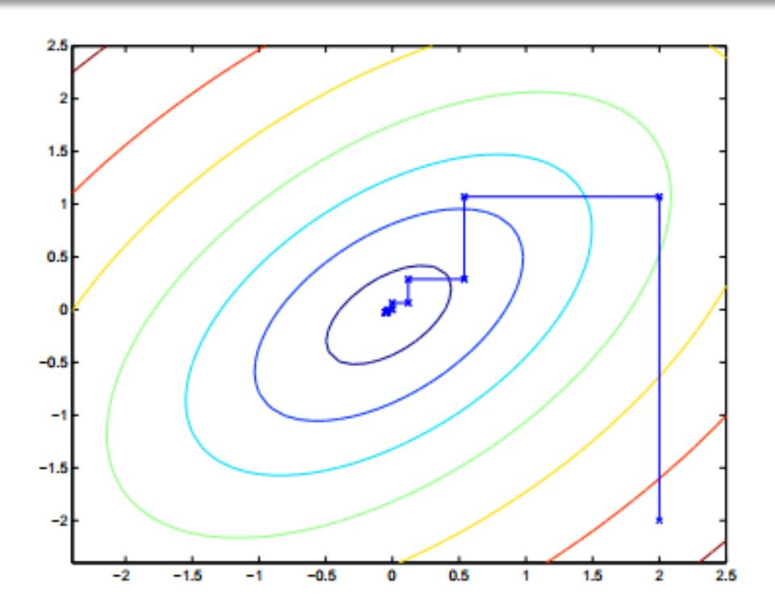

### Sequential Minimal Optimization 序列最小最优化

• Dual optimization problem:

$$\max_{\alpha} \sum_{i=1}^{n} \alpha_{i} - \frac{1}{2} \sum_{i=1}^{n} \sum_{j=1}^{n} \alpha_{i} \alpha_{j} y_{i} y_{j} \boldsymbol{x}_{i}^{T} \boldsymbol{x}_{j}$$

$$s.t. \ \alpha_{i} \geq 0, \ i = 1, ..., n$$

$$\sum_{i=1}^{n} \alpha_{i} y_{i} = 0$$

- Let's say we have a set of  $\alpha_i$ 's that satisfy the constraints.
- Suppose we hold  $\alpha_2, \dots, \alpha_n$  fixed, can we take a coordinate ascent step and optimize the function with respect to  $\alpha_1$ ?

• NO!!! 
$$\sum_{i=1}^{n} \alpha_i y_i = 0$$
  $\alpha_1 = -y_1 \sum_{i=2}^{n} \alpha_i y_i$ 

#### **Sequential Minimal Optimization** 序列最小最优化

- We must update at least two of 's simultaneously.
- SMO

}

Repeat until convergence:{

- 1. Select some pair and to update next (using a heuristic manner that tries to pick the two that will allow us to make the biggest progress towards the global maximum).
- 2. Re-optimize () with respect to and , while holding all the other 's ( ≠ ,) fixed.

• SMO is efficient as that the update to and can be computed very efficiently.

# **Deriving The Efficient Update**

- Suppose we have a set of 's that satisfy the constraints.
- And we decided to hold 3, … , fixed, and optimize the objective function with respect to <sup>1</sup> and 2.
- Based on the constraint, we have

$$\alpha_1 y_1 + \alpha_2 y_2 = -\sum_{i=3}^n \alpha_i y_i = \zeta$$
 Constant

$$L(\alpha_1, \alpha_2, ..., \alpha_n) = \sum_{i=1}^{n} \alpha_i - \frac{1}{2} \sum_{i=1}^{n} \sum_{j=1}^{n} \alpha_i \alpha_j y_i y_j x_i^T x_j$$

$$L(\alpha_1, \alpha_2, \dots, \alpha_n) = L(y_1(\zeta - \alpha_2 y_2), \alpha_2, \dots, \alpha_n)$$

- This is some quadratic function with α2.
- Once we have <sup>2</sup> , we can obtain <sup>1</sup> with 1<sup>1</sup> + 2<sup>2</sup> =

### **How To Get** <sup>∗</sup> **?**

KKT: 
$$\frac{\partial \mathcal{L}(\mathbf{w}^*, \boldsymbol{\alpha}^*, \boldsymbol{\beta}^*)}{\partial w_i} = 0$$

• Remember that <sup>ℒ</sup> , , <sup>=</sup> 1 2 + =1 (1 − ( + ))

$$\frac{\partial \mathcal{L}(\boldsymbol{w}, \boldsymbol{b}, \boldsymbol{\alpha})}{\partial \boldsymbol{w}} = \boldsymbol{w} + \sum_{i=1}^{n} -\alpha_{i} y_{i} \boldsymbol{x}_{i} = 0$$

$$\frac{\partial \mathcal{L}(\boldsymbol{w}, b, \boldsymbol{\alpha})}{\partial b} = \sum_{i=1}^{n} -\alpha_i y_i = 0$$

$$\mathbf{w} = \sum_{i=1}^{n} \alpha_i y_i \mathbf{x}_i$$
$$0 = \sum_{i=1}^{n} \alpha_i y_i$$

$$\mathbf{w}^* = \sum_{i=1}^n \alpha_i^* y_i \mathbf{x}_i = \sum_{i \in \mathcal{S}} \alpha_i^* y_i \mathbf{x}_i$$
  $\mathcal{S} = \{i | \alpha_i > 0, i = 1, 2, ..., n\}$  is the set of index of support vectors.

### How To Get $b^*$ ?

• In practice, we can derive  $b^*$  as follows,

Option1: Note that given  $w^*$ 

$$b^* = -\frac{\max_{i:y_i=-1} \mathbf{w^*}^T \mathbf{x}_i + \min_{i:y_i=1} \mathbf{w^*}^T \mathbf{x}_i}{2}$$

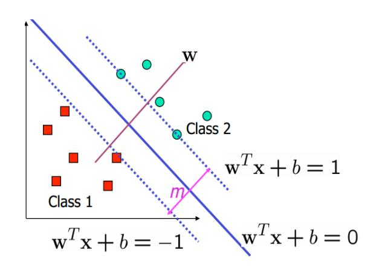

Option2: Note that given any support vector, we have  $y_s f(x_s) = 1$ 

$$y_{S}\left(\left(\sum_{i\in\mathcal{S}}\alpha_{i}y_{i}\boldsymbol{x}_{i}^{T}\right)\boldsymbol{x}_{S}+b\right)=1 \implies b=\frac{1}{y_{S}}-\sum_{i\in\mathcal{S}}\alpha_{i}y_{i}\boldsymbol{x}_{i}^{T}\boldsymbol{x}_{S}$$

In reality, we use the following more robust method

$$b^* = \frac{1}{|\mathcal{S}|} \sum_{s \in \mathcal{S}} \left( \frac{1}{y_s} - \sum_{i \in \mathcal{S}} \alpha_i y_i x_i^T x_s \right)$$

#### **How To Get** ∗ **?**

• Question: can we have no support vector?

$$\alpha^* = 0$$

- Answer: No.
- If ∗ = **,** then <sup>∗</sup> = . (This is not the optimal solution for the primal optimization problem)

$$\min_{\mathbf{w}} \frac{1}{2} \|\mathbf{w}\|^2 = \frac{1}{2} \mathbf{w}^T \mathbf{w}$$

s.t. 
$$y_i(\mathbf{w}^T \mathbf{x}_i + b) \ge 1$$
,  $i = 1, 2, ..., n$ 

# **Characteristics of The Solution**

- Many of the 's are zero (why?)
  - is a linear combination of a small number of data points.

$$\mathbf{w}^* = \sum_{i=1}^n \alpha_i y_i \mathbf{x}_i = \sum_{i \in \mathcal{S}} \alpha_i y_i \mathbf{x}_i$$

- Support vectors (SV):
  - with a non-zero
- The decision boundary is determined only by the SV.

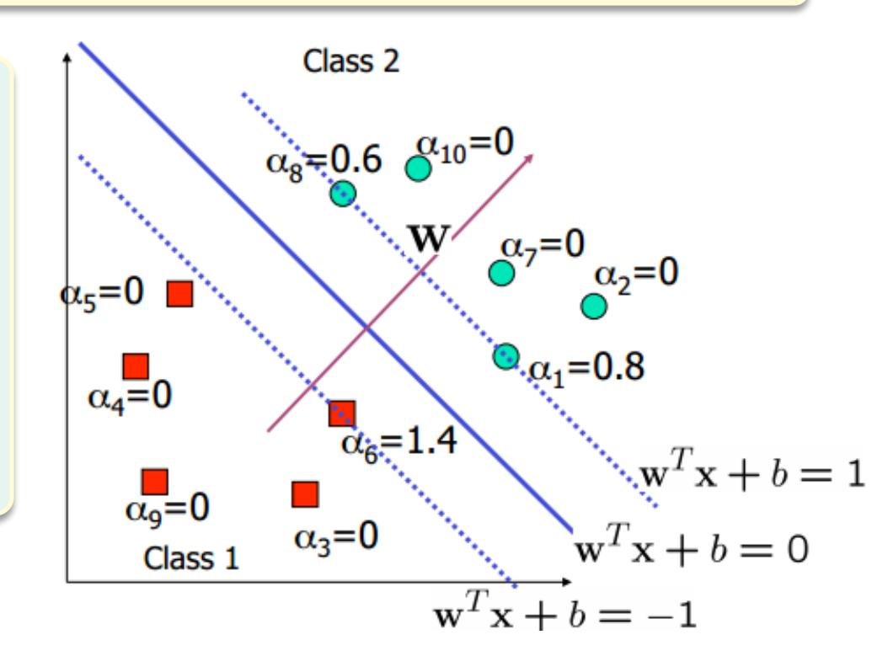

# **Test Phase**

Once we have trained a Support Vector Machine, how can we use it?

# **Test Phase**

• We simply determine on which side of the decision boundary a given test sample lies and assign the corresponding class label. i.e. we take the class of to be ( + )

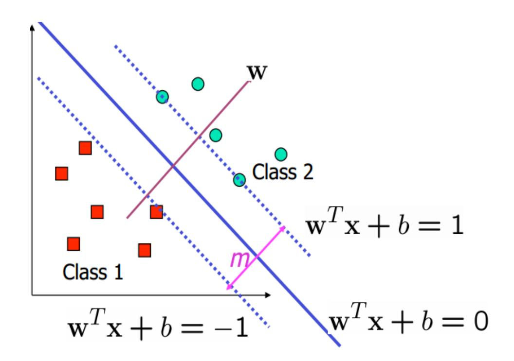

### **SVM Algorithm**

#### 算法 7.2 (线性可分支持向量机学习算法)

输入: 线性可分训练集  $T = \{(x_1, y_1), (x_2, y_2), \cdots, (x_N, y_N)\}$ , 其中  $x_i \in \mathcal{X} = \mathbb{R}^n$ ,  $y_i \in \mathcal{Y} = \{-1, +1\}$ ,  $i = 1, 2, \cdots, N$ ;

输出: 分离超平面和分类决策函数.

(1) 构造并求解约束最优化问题

$$\min_{\alpha} \quad \frac{1}{2} \sum_{i=1}^{N} \sum_{j=1}^{N} \alpha_i \alpha_j y_i y_j (x_i \cdot x_j) - \sum_{i=1}^{N} \alpha_i$$

s.t. 
$$\sum_{i=1}^{N} \alpha_i y_i = 0$$

$$\alpha_i \ge 0$$
,  $i = 1, 2, \dots, N$ 

求得最优解 $\alpha^* = (\alpha_1^*, \alpha_2^*, \dots, \alpha_N^*)^T$ .

(2) 计算

$$w^* = \sum_{i=1}^N \alpha_i^* y_i x_i$$

并选择 $\alpha^*$ 的一个正分量 $\alpha_{j}^* > 0$ ,计算

(3) 求得分离超平面

分类决策函数:

$$w^{\bullet} \cdot x + b^{\bullet} = 0$$

$$f(x) = \operatorname{sign}(w^* \cdot x + b^*)$$

$$b_i^* = y_j - \sum_{i=1}^N \alpha_i^* y_i (x_i \cdot x_j)$$

- In some cases (due to the outliers), it is not clear that finding a separating hyperplane is exactly what we'd want to do.
- Figure (a) shows an optimal margin classifier, and when a single outlier is added in the upper-left region (Figure b), it causes the decision boundary to make a dramatic swing, and the resulting classifier has a much smaller margin (sensitive to outliers).

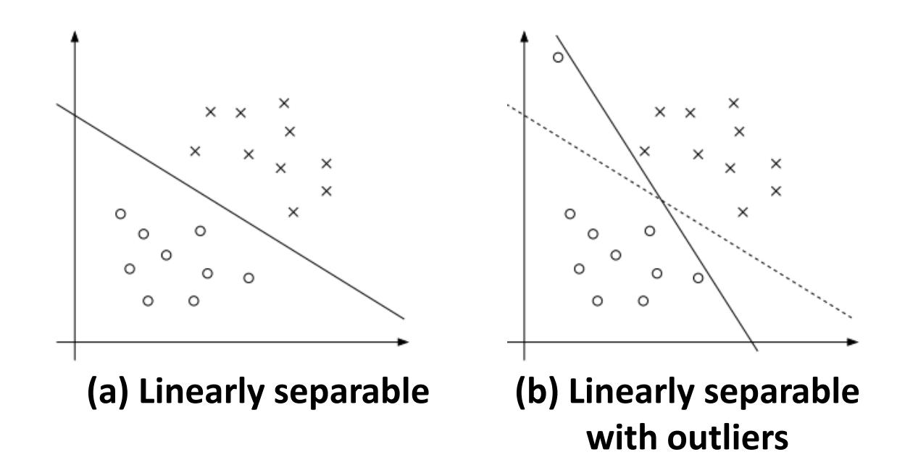

- In some cases (due to the outliers), it is not clear that finding a separating hyperplane is exactly what we'd want to do.
- In some cases (Figure c), the data cannot be perfectly linearly separable.

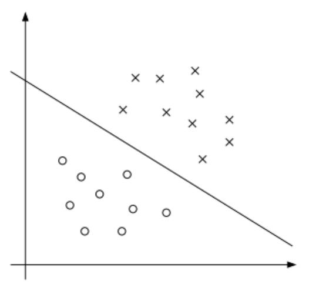

**(a) Linearly separable (b) Linearly separable** 

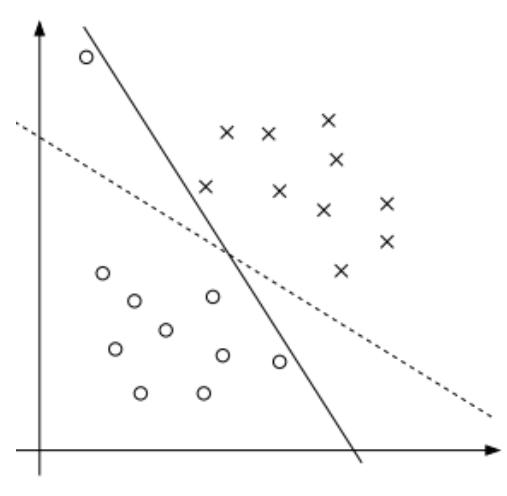

**with outliers**

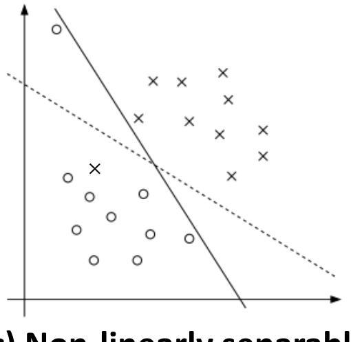

**(c) Non-linearly separable**

To make the algorithm work for non-linearly separable datasets as well as be less sensitive to outliers, we introduce the *positive slack variables* in constraints (hard margin → soft margin):

$$\begin{cases} \mathbf{w}^T \mathbf{x}_i + b \ge 1 - \xi_i & y_i = 1 \\ \mathbf{w}^T \mathbf{x}_i + b \le -1 + \xi_i, & y_i = -1 \\ \xi_i \ge 0 & \forall i \end{cases}$$

- = 0: no error for .
- For an error to occur, the corresponding must exceed 1, so σ is an upper bound on the number of training errors.

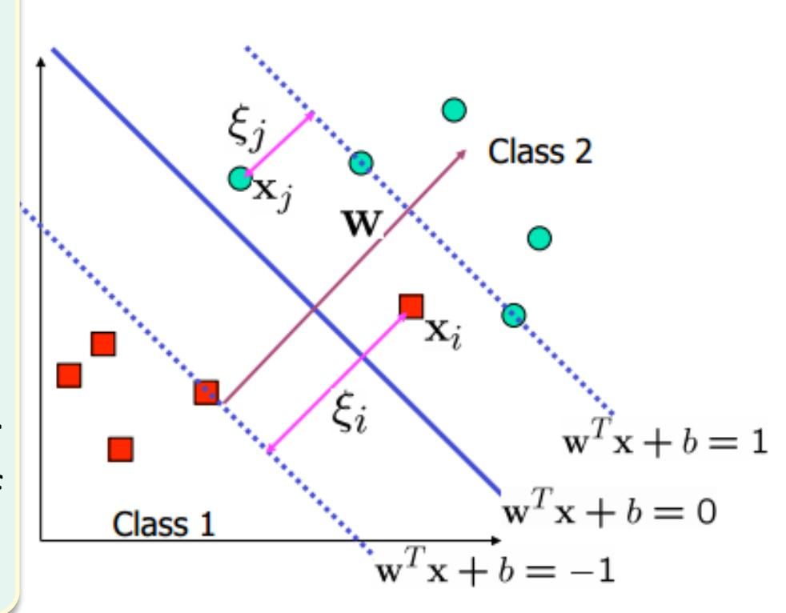

A natural way to assign an extra cost for errors as follow,

$$\min_{\mathbf{w}} \frac{1}{2} \|\mathbf{w}\|^2 + C \left(\sum_{i} \xi_i\right)^k$$

- is a parameter to be chosen by the user, a larger refers to assigning a higher penalty to errors.
- For simplicity, we set = 1.
- We reformulate our optimization (<sup>1</sup> regularization) as follows,

$$\begin{aligned} \min_{\mathbf{w}} \frac{1}{2} \|\mathbf{w}\|^2 + C \sum_{i=1}^{n} \xi_i \\ \text{s.t. } y_i(\mathbf{w}^T \mathbf{x}_i + b) &\geq 1 - \xi_i, i = 1, 2, ..., n \\ \xi_i &\geq 0, i = 1, 2, ..., n \end{aligned}$$

$$\min_{\mathbf{w}} \frac{1}{2} \|\mathbf{w}\|^2 + C \sum_{i=1}^{n} \xi_i$$
s.t.  $y_i(\mathbf{w}^T \mathbf{x}_i + b) \ge 1 - \xi_i, i = 1, 2, ..., n$ 

$$\xi_i \ge 0, i = 1, 2, ..., n$$

- Examples are permitted to have margin less than 1
  - If an example has margin 1 − (with > 0), we pay a cost of the objective function being increased by .
- controls the relative weighting between the two goals
  - Making the <sup>2</sup> small (makes the margin large);
  - Ensuring that most examples have margin at least 1.

• As before, we can form the Lagrangian,

$$\mathcal{L}(\mathbf{w}, b, \xi, \alpha, \mathbf{r}) = \frac{1}{2} \|\mathbf{w}\|^2 + C \sum_{i=1}^n \xi_i - \sum_{i=1}^n \alpha_i [y_i(\mathbf{w}^T \mathbf{x}_i + b) - 1 + \xi_i] - \sum_{i=1}^n r_i \xi_i$$

 $\alpha_i$ 's and  $r_i$ 's are our Lagrange multipliers (constrained to be  $\geq 0$ )

• Setting the derivatives with respect to w, b, and  $\xi_i$  to zero;

$$\mathbf{w} = \sum_{i=1}^{n} \alpha_i y_i \mathbf{x}_i = \sum_{i \in \mathcal{S}} \alpha_i y_i \mathbf{x}_i \qquad 0 = \sum_{i=1}^{n} \alpha_i y_i \qquad 0 = C - \alpha_i - r_i$$

Then the dual problem,

$$\max_{\alpha} \sum_{i=1}^{n} \alpha_{i} - \frac{1}{2} \sum_{i=1}^{n} \sum_{j=1}^{n} \alpha_{i} \alpha_{j} y_{i} y_{j} x_{i}^{T} x_{j}$$

$$s.t. \ 0 \leq \alpha_{i} \leq C, \ i = 1, ..., n$$

$$\sum_{i=1}^{n} \alpha_{i} y_{i} = 0$$
Similar to case, excupper boundary

Similar to the linear separable case, except that there is an upper bound  $\mathcal{C}$  on  $\alpha_i$ .

#### **Sequential Minimal Optimization** 序列最小最优化

Now, we know that <sup>1</sup> and <sup>2</sup> must lie within the box [0, ] × [0, ] shown. Also plotted is the line 1<sup>1</sup> + 2<sup>2</sup> = , on which we know <sup>1</sup> and 2 must lie.

Note, from these constraints, we know ≤ <sup>2</sup> ≤ ; otherwise, (1, 2) can't simultaneously satisfy both the box and the straight line constraint. In this example, = 0.

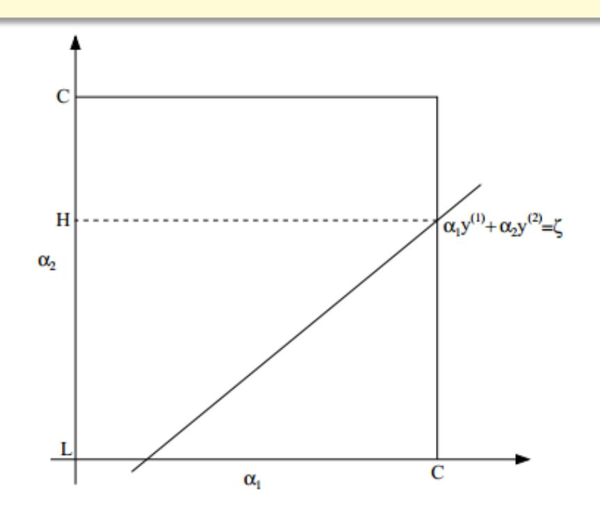

### **Deriving The Efficient Update**

• If we ignore the box constraint  $(L \le \alpha_2 \le H)$ , then we can easily maximize the quadratic function. Let  $\alpha_2^{\text{new,unclipped}}$  denote the resulting value of  $\alpha_2$ .

Then we have  $\alpha_2^{new} = \begin{cases} H & \text{if } \alpha_2^{new,unclipped} > H \\ \alpha_2^{new,unclipped} & \text{if } L \leq \alpha_2^{new,unclipped} \leq H \\ L & \text{if } \alpha_2^{new,unclipped} < L \end{cases}$ 

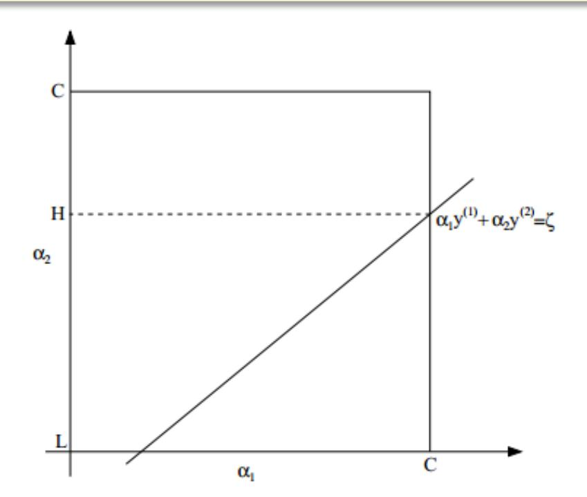

# **Soft-margin SVM**

$$\min_{\mathbf{w}} \frac{1}{2} \|\mathbf{w}\|^2 + C \sum_{i=1}^{n} \xi_i$$

s.t. 
$$y_i(\mathbf{w}^T \mathbf{x}_i + b) \ge 1 - \xi_i, i = 1, 2, ..., n$$
  
 $\xi_i \ge 0, i = 1, 2, ..., n$ 

$$\frac{\partial \mathcal{L}(\boldsymbol{w}^*, \boldsymbol{\alpha}^*, \boldsymbol{\beta}^*)}{\partial w_i} = 0 \qquad i = 1, ..., n$$

$$\frac{\partial \mathcal{L}(\boldsymbol{w}^*, \boldsymbol{\alpha}^*, \boldsymbol{\beta}^*)}{\partial \beta_i} = 0 \qquad i = 1, ..., l$$

$$\alpha_i^* g_i(\boldsymbol{w}^*) = 0 \qquad i = 1, ..., k$$

$$g_i(\boldsymbol{w}^*) \leq 0 \qquad i = 1, ..., k$$

$$\alpha_i^* \geq 0 \qquad i = 1, ..., k$$

• The KKT conditions are

$$\alpha_{i} \geq 0, r_{i} \geq 0;$$
  
 $\xi_{i} \geq 0, y_{i}(\mathbf{w}^{T}\mathbf{x}_{i} + b) - 1 + \xi_{i} \geq 0$   
 $\alpha_{i}(y_{i}(\mathbf{w}^{T}\mathbf{x}_{i} + b) - 1 + \xi_{i}) = 0$   
 $r_{i}\xi_{i} = 0$ 

- Support vectors ( > 0) are examples for which + ≤ 1
  - If < , 0 = − − *,* then = 0. These are called **unbound SV**  + = 1.
  - If = (**bound SV**), then can be greater the zero, in which case the SV are margin errors.

# **Soft-margin SVM**

If = (**bound SV**), then + = 1 − .

- If 0 ≤ < 1, is correctly classified
- If > 1, is misclassified.
- If = 1, is on the decision boundary.

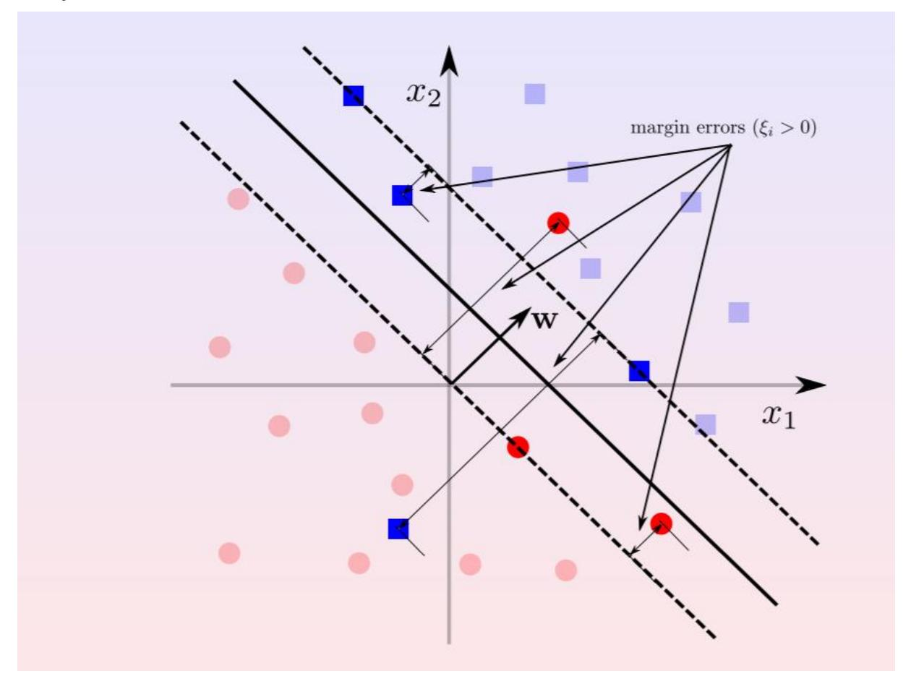

### **Alternative Objective with Hinge loss**

In a sense, we can formulate the soft-margin SVM with hinge loss,

$$\min_{\mathbf{w}} \sum_{i=1}^{n} [1 - y_i (\mathbf{w}^T \mathbf{x}_i + b)]_{+} + \lambda \|\mathbf{w}\|^{2}$$

Hinge loss

$$L(y(\mathbf{w}^T x + b)) = [1 - y(\mathbf{w}^T x + b)]_+$$

$$[z]_{+} = \begin{cases} z, & z > 0 \\ 0, & z \le 0 \end{cases}$$

$$\min_{\mathbf{w}} \frac{1}{2} \|\mathbf{w}\|^{2} + C \sum_{i=1}^{n} \xi_{i}$$
s.t.  $y_{i}(\mathbf{w}^{T}x_{i} + b) \ge 1 - \xi_{i}$ ,
$$\ni = 1, 2, ..., n$$

$$\xi_{i} \ge 0, i = 1, 2, ..., n$$

$$\sum_{i=1}^{n} [1 - y_{i} (\mathbf{w}^{T}x_{i} + b)]_{+} + \lambda \|\mathbf{w}\|^{2}$$

### **Hinge loss**

$$\min_{\mathbf{w}} \frac{1}{2} \|\mathbf{w}\|^{2} + C \sum_{i=1}^{n} \xi_{i}$$
s.t.  $y_{i}(\mathbf{w}^{T} \mathbf{x}_{i} + b) \ge 1 - \xi_{i}$ ,
$$\ni = 1, 2, ..., n$$

$$\xi_{i} \ge 0, i = 1, 2, ..., n$$

$$\sum_{i=1}^{n} [1 - y_{i} (\mathbf{w}^{T} \mathbf{x}_{i} + b)]_{+} + \lambda \|\mathbf{w}\|^{2}$$

Let 
$$[1 - y_i (\mathbf{w}^T \mathbf{x}_i + b)]_+ = \xi_i \ge 0$$
,

- When  $1 y_i (\mathbf{w}^T \mathbf{x}_i + b) > 0$ , then  $y_i (\mathbf{w}^T \mathbf{x}_i + b) = 1 \xi_i$
- When  $1 y_i (w^T x_i + b) \le 0$ ,  $\xi_i = 0$ , then  $y_i (w^T x_i + b) \ge 1 \xi_i$

$$\min_{\mathbf{w}} \sum_{i=1}^{n} \xi_i + \lambda \|\mathbf{w}\|^2 \qquad \text{Let } \lambda = \frac{1}{2C} \qquad \min_{\mathbf{w}} \frac{1}{C} \left( \frac{1}{2} \|\mathbf{w}\|^2 + C \sum_{i=1}^{n} \xi_i \right)$$

# **Hinge loss**

Hinge loss is the upper bound of the 0-1 loss (misclassification).

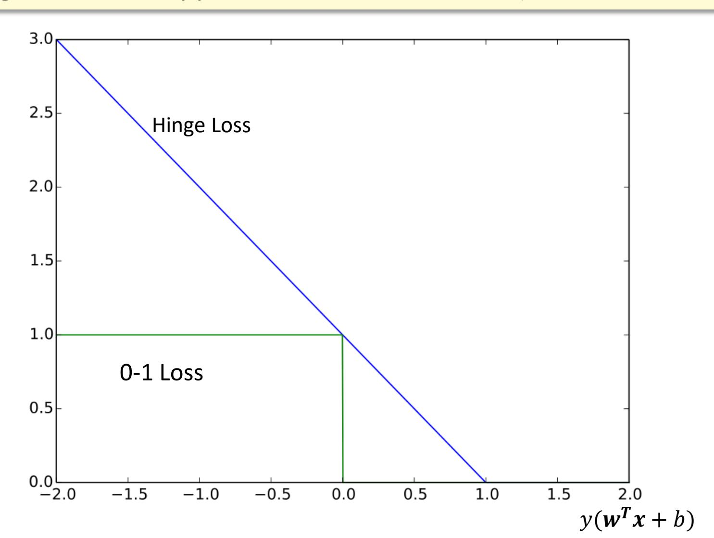

# **Mini-Summary**

- **Support Vector Machine**
- **Lagrange Duality**
- **Constrained Optimization: Inequality Constraint**
- **Karush-Kuhn-Tucker (KKT) condition**
- **Coordinate Ascent**
- **Sequential Minimal Optimization**
- **Regularization for SVM**
  - **,**